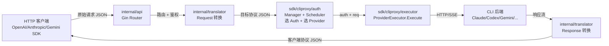

## 1. 它解决了什么问题,凭什么跑了出来

2026 年 4 月 23 日,OpenAI 在发布 GPT-5.5 时夹带了一条争议条款:**新模型只对 ChatGPT 订阅开放,API key 不提供**。同样的策略 Anthropic 早在 Claude 4.6 时就用过——Claude Code 的 OAuth 授权能用上 sonnet/opus 的最新版,但单纯持 API key 拿不到。Google Gemini 3.1 Pro 的免费额度更是只对 `gemini-cli` 工具开放,API 走付费 quota。

结果就是:**工程师手里多了一堆 OAuth 凭证,但没有一个能直接喂给自己的脚本**。Cursor / Cline / Continue / 评测脚本 / Chatbox / 自建小 agent,这些工具都假定后端是一个 OpenAI 兼容的 HTTP endpoint,而厂商把最新最强的模型藏在了 CLI 工具后面。

GPT-5.5 发布几小时内,Simon Willison 用 `llm-openai-via-codex` PoC 证明了**反编译 CLI 的 auth flow,把订阅当 API 用**这条路是通的。一周内 GitHub 上冒出十几个类似项目。半年后回头看,跑出来的是这一个:[router-for-me/CLIProxyAPI](https://github.com/router-for-me/CLIProxyAPI),35.5K stars,637 个 release,Go 实现,本文写作时(2026-05-31)它当天还在发新版。

凭什么是它?读完源码我的判断是三件事:

1. **协议矩阵的覆盖度**——6 种入站协议(Claude / Codex / Gemini Native / Gemini CLI / OpenAI / Antigravity)互翻成 4 种主流出站格式(OpenAI / Anthropic / Gemini / Codex Responses),27 个翻译对子全部独立实现;在此之上通过 executor 接入 xai(Grok Build)和 kimi 这类讲 OpenAI 兼容协议的后端。这是其他单 CLI 项目做不到的体量
2. **认证与调度的抽象层**——多账号轮询、自动 refresh、配额冷却、跨进程 token 持久化,这套东西在 `sdk/cliproxy/auth/` 下被抽成了一个干净的 `ProviderExecutor` 接口 + `Manager` 控制平面,可被独立嵌入使用
3. **配置热更新的工程严谨度**——fsnotify + SHA256 内容哈希 + 防抖窗口 + 原子替换检测,做成了一套可以零停机重载凭证和配置的真实生产模式,而不是"重启大法"

本文基于 **v7.1.32** 这个 tag(commit `3a54fb7`,2026-05-30 发布)写就。所有源码引用锁定到这个版本,你可以 `git clone --depth 1 --branch v7.1.32 https://github.com/router-for-me/CLIProxyAPI.git` 拉到本地对照看。下文路径都从仓库根算起。

## 2. 全景架构

这个项目的代码量分布大致是:

- `internal/translator/`:协议翻译,26 个翻译对子,每个对子 200-800 行,合计约 1.5 万行
- `sdk/cliproxy/auth/`:认证与调度核心,`conductor.go` 单文件 4455 行,加上 scheduler/selector/auto_refresh 等支持文件合计约 1.4 万行
- `sdk/cliproxy/executor/`:执行器抽象层
- `internal/watcher/`:热更新,约 1100 行
- `internal/api/`:HTTP server,基于 Gin
- `auths/`:每个 CLI 后端一个目录(claude/codex/gemini/antigravity/kimi/vertex/xai),装具体的 OAuth flow 实现
- `cmd/server/main.go`:入口,654 行
- `sdk/`:对外暴露的可嵌入 SDK
- `internal/managementasset/`:管理面板前端资源(打包进 binary)

按数据流看,一次请求穿过五个层:



三个核心抽象统治整个项目:

| 抽象 | 位置 | 作用 |
|---|---|---|
| `translator.Registry` | `sdk/translator/` | 全局协议翻译注册表,`Register(from, to, reqFn, respFn)` 自注册模式 |
| `auth.Manager`(代码里叫 `Conductor`) | `sdk/cliproxy/auth/conductor.go` | 管理所有 Auth 生命周期:选 / 执行 / 冷却 / refresh / 持久化 |
| `Watcher` | `internal/watcher/watcher.go` | 监听 config 和 auth 目录,触发热重载 |

加上一个连接它们的执行接口:

| 接口 | 位置 | 关键方法 |
|---|---|---|
| `ProviderExecutor` | `sdk/cliproxy/auth/conductor.go:32` | `Execute / ExecuteStream / Refresh / CountTokens / HttpRequest` |

整个项目可以理解为这四个抽象的协奏。后面三节我把它们逐个拆开。

## 3. 核心模块拆解

### 3.1 协议翻译:用 init() 自注册堆出一个矩阵

OpenAI 的 `tool_calls`、Anthropic 的 `tool_use`、Gemini 的 `function_call`、Codex Responses 的 `output_item` 之间两两不兼容。粗暴的写法是写一个 `translate(from, to, json)` 大 switch,里面 26 个 case;**CLIProxyAPI 选了 registry + init() 自注册**,代码组织成下面这样。

入口在 `internal/translator/translator/translator.go:39`:

```go
func Request(from, to, modelName string, rawJSON []byte, stream bool) []byte {
    return registry.TranslateRequest(
        sdktranslator.FromString(from),
        sdktranslator.FromString(to),
        modelName, rawJSON, stream,
    )
}
```

这个 `registry` 在文件第 15 行声明为 `sdktranslator.Default()`,是个全局单例。各方向的翻译器靠 Go 的 `init()` 函数往这个 registry 里塞自己。`internal/translator/init.go` 用 27 个空白 import 把所有翻译器目录拉进来:

```go
package translator

import (
    _ "github.com/router-for-me/CLIProxyAPI/v7/internal/translator/claude/gemini"
    _ "github.com/router-for-me/CLIProxyAPI/v7/internal/translator/claude/openai/chat-completions"
    _ "github.com/router-for-me/CLIProxyAPI/v7/internal/translator/claude/openai/responses"
    _ "github.com/router-for-me/CLIProxyAPI/v7/internal/translator/codex/openai/chat-completions"
    _ "github.com/router-for-me/CLIProxyAPI/v7/internal/translator/codex/openai/responses"
    _ "github.com/router-for-me/CLIProxyAPI/v7/internal/translator/openai/claude"
    // ... 共 27 个
)
```

每个翻译器目录下都有自己的 `init.go`,典型如 `internal/translator/openai/claude/init.go`:

```go
func init() {
    translator.Register(
        Claude,        // from: 入站协议
        OpenAI,        // to:   出站协议(后端 CLI 所讲的协议)
        ConvertClaudeRequestToOpenAI,
        interfaces.TranslateResponse{
            Stream:     ConvertOpenAIResponseToClaude,
            NonStream:  ConvertOpenAIResponseToClaudeNonStream,
            TokenCount: ClaudeTokenCount,
        },
    )
}
```

这个设计的好处是**新增一个协议对子,只需要新建一个目录写翻译函数,不动任何已有文件**。坏处是 `init()` 副作用导致依赖图变成隐式的,Go 工具链没法静态分析"哪个翻译器被哪个调用方用到",死代码也很难裁剪。对一个长期维护的项目这是个隐患,但作者用空白 import 集中在 `init.go` 显式列出,把这个隐患压到了可见的程度。

注册表设计解决了"新增不改旧"的问题;接下来看翻译函数本身是怎么写的——这里有另一个值得展开的选择。

#### gjson/sjson:不构造中间结构体的协议翻译

真正有趣的是翻译函数的实现风格。看 `internal/translator/openai/claude/openai_claude_request.go:23` 这个 Claude → OpenAI 的 request 转换器开头:

```go
func ConvertClaudeRequestToOpenAI(modelName string, inputRawJSON []byte, stream bool) []byte {
    rawJSON := inputRawJSON
    out := []byte(`{"model":"","messages":[]}`)

    root := gjson.ParseBytes(rawJSON)
    out, _ = sjson.SetBytes(out, "model", modelName)

    if maxTokens := root.Get("max_tokens"); maxTokens.Exists() {
        out, _ = sjson.SetBytes(out, "max_tokens", maxTokens.Int())
    }
    if temp := root.Get("temperature"); temp.Exists() {
        out, _ = sjson.SetBytes(out, "temperature", temp.Float())
    }
    // ...
}
```

这里没有定义 `ClaudeRequest struct` 和 `OpenAIRequest struct`,而是直接用 [tidwall/gjson](https://github.com/tidwall/gjson) 在源 JSON 上按 path 读、用 [tidwall/sjson](https://github.com/tidwall/sjson) 在目标 JSON 上按 path 写。**整段翻译是一系列"取-改-塞"操作,没有完整的中间反序列化/序列化往返**。

为什么这么做?三个原因:

1. **性能**:Claude 的 messages 数组可能很长,完整反序列化成 Go struct 再序列化回去意味着两次全量 JSON 解析。gjson/sjson 是惰性的,只解析你 query 的路径
2. **字段透传友好**:OpenAI / Anthropic / Gemini 每隔几个月就加新字段(`reasoning_effort`、`thinking`、`cache_control`),用 struct 翻译要每个字段都建模、对应版本兼容很麻烦;用 gjson 路径方式,只要旧字段名不变,新字段未知字段自动不被破坏
3. **多模态 / 嵌套内容透传**:Claude 的 `content` block 可以是 text / image / tool_use / tool_result 多种类型,struct 化要么用 union,要么牺牲严格性。gjson 风格直接转发原始嵌套

代价是失去类型安全。看下面这段从 `openai_claude_request.go:65` 起的 thinking 字段映射:

```go
if thinkingConfig := root.Get("thinking"); thinkingConfig.Exists() && thinkingConfig.IsObject() {
    if thinkingType := thinkingConfig.Get("type"); thinkingType.Exists() {
        switch thinkingType.String() {
        case "enabled":
            if budgetTokens := thinkingConfig.Get("budget_tokens"); budgetTokens.Exists() {
                budget := int(budgetTokens.Int())
                if effort, ok := thinking.ConvertBudgetToLevel(budget); ok && effort != "" {
                    out, _ = sjson.SetBytes(out, "reasoning_effort", effort)
                }
            }
        case "adaptive", "auto":
            effort := ""
            if v := root.Get("output_config.effort"); v.Exists() && v.Type == gjson.String {
                effort = strings.ToLower(strings.TrimSpace(v.String()))
            }
            // ...
        }
    }
}
```

这段在做一件具体的事:**Claude 的 "thinking budget"(数字 token 数)映射到 OpenAI 的 "reasoning effort"(字符串等级 low/medium/high)**。这是协议层最有意思的一种 edge case——两个厂商对"思考预算"建模的颗粒度完全不一样,翻译器必须做有损映射,而且 Claude 4.6 还引入了 `adaptive` 的新值要兜底成 `xhigh`。

这种映射是协议翻译的真正难点,**不是 README 里能写明的,只有读到这里才能看到作者怎么处理**。

#### 26 个翻译对子的真实拓扑

`init.go` 里列出 26 个翻译器目录,但并不是 7 个协议两两全连接(那应该是 7×6=42 个)。真实拓扑是星型:openai 作为入站协议地位特殊,绝大多数 CLI 后端都需要把自己讲的协议翻译成 openai/chat-completions 或 openai/responses,因为这两个是社区客户端 SDK 最广泛支持的入站。反向(openai → claude/gemini/gemini-cli)也存在,但条数少一些,因为"用 OpenAI SDK 调 Claude 后端"是更常见的需求,反过来罕见。

这个拓扑选择背后有产品判断:**作者把工程量重点放在"用 OpenAI SDK 调任意后端"这一组路径上,其他路径作为补丁完成**。这是合理的——客户端生态里 OpenAI SDK 几乎是默认选择,Claude SDK / Gemini SDK 是次选。

### 3.2 Auth Conductor:把"凭证管理"做成一个独立控制平面

OAuth 工具的认证逻辑碎得吓人。Claude Code 用 PKCE,token 存 `~/.claude/.credentials.json`;Codex CLI 用账号 token,存 `~/.codex/auth.json`,里面有 `access_token + account_id`;Gemini CLI 用 device code;Antigravity 又是另一套。光是"读出来"就要 5 个不同的解析器,加上自动 refresh、过期检测、多账号轮询、配额冷却、错误退避——单 CLI 单账号都已经够复杂,5 CLI 多账号是组合爆炸。

CLIProxyAPI 把这堆东西塞到了 `sdk/cliproxy/auth/conductor.go`(4455 行,代码库最大文件)。核心抽象在文件头 `sdk/cliproxy/auth/conductor.go:32`:

```go
type ProviderExecutor interface {
    Identifier() string
    Execute(ctx context.Context, auth *Auth, req cliproxyexecutor.Request,
        opts cliproxyexecutor.Options) (cliproxyexecutor.Response, error)
    ExecuteStream(ctx context.Context, auth *Auth, req cliproxyexecutor.Request,
        opts cliproxyexecutor.Options) (*cliproxyexecutor.StreamResult, error)
    Refresh(ctx context.Context, auth *Auth) (*Auth, error)
    CountTokens(ctx context.Context, auth *Auth, req cliproxyexecutor.Request,
        opts cliproxyexecutor.Options) (cliproxyexecutor.Response, error)
    HttpRequest(ctx context.Context, auth *Auth, req *http.Request) (*http.Response, error)
}
```

每个 CLI 后端实现这个 5 方法接口,丢给 Manager 注册。Manager 不关心"Claude OAuth 怎么 refresh"、"Codex token 长什么样",只关心"我能不能从这个 Executor 拿到响应,如果失败我能不能调 `Refresh` 让它恢复"。

`Auth` 这个结构体(`sdk/cliproxy/auth/types.go:47`)是 Manager 和 Executor 之间的搬运契约。摘抄关键字段:

```go
type Auth struct {
    ID               string
    Provider         string                 // "claude" / "codex" / "gemini" / ...
    FileName         string                 // 凭证文件路径
    Status           Status                 // ready/cooldown/disabled/...
    Disabled         bool                   // 操作员显式禁用
    Unavailable      bool                   // 配额耗尽等临时不可用
    Attributes       map[string]string      // 不变配置(如 account_id)
    Metadata         map[string]any         // 可变状态(token / cookie / expiry)
    Quota            QuotaState             // 配额信息,给调度器参考
    LastError        *Error
    LastRefreshedAt  time.Time
    NextRefreshAfter time.Time
    NextRetryAfter   time.Time
    ModelStates      map[string]*ModelState // 按模型粒度的状态
    // ...
}
```

这个结构有几处设计细节值得拆开讲:

- `Attributes` 和 `Metadata` 分开存:不变配置 vs 可变运行时状态。前者改了要写回磁盘,后者改了不一定。
- `Status`(全局)、`Disabled`(操作员意图)、`Unavailable`(临时配额问题)、`ModelStates`(按模型)四套独立状态。**这是被实战逼出来的精细度**:一个 Claude 账号可能 sonnet 用满了但 haiku 还能用,你不能直接 disable 整个账号;另一个账号可能因为 quota 临时 down 但 token 还有效,不需要 refresh 只需要等
- `NextRefreshAfter` 和 `NextRetryAfter` 分开:refresh 失败的退避 vs 执行失败的退避是两个独立的时间锚点,不能混用

整个 `conductor.go` 4455 行围绕这套结构展开:`Update()`(增量更新)、`Execute()`(选 + 调 + 错误处理)、`RefreshAuth()`(触发自动刷新)、`List()` 与 `GetByID()`(`conductor.go:2894 / :2906`,给 management API 提供状态查询)。

#### 自动刷新:min-heap + worker pool

凭证过期是异步事件,CLIProxyAPI 用 `sdk/cliproxy/auth/auto_refresh_loop.go` 单独跑了一个后台循环。结构是经典的**最小堆 + worker pool**:

```go
type authAutoRefreshLoop struct {
    manager     *Manager
    interval    time.Duration   // 默认 5s 扫一次
    concurrency int             // 默认 16 个并发刷新

    queue refreshMinHeap        // 按 NextRefreshAfter 排序
    index map[string]*refreshHeapItem
    dirty map[string]struct{}   // 待重排序的 authID

    wakeCh chan struct{}        // 立即唤醒主循环
    jobs   chan string          // 派发给 worker 的 authID
}
```

定义在 `sdk/cliproxy/auth/auto_refresh_loop.go:13`。运行时一个主循环按 `NextRefreshAfter` 时间出堆,把到期的 authID 推进 `jobs` channel;16 个 worker goroutine 从 channel 取出来调 `manager.RefreshAuth()`。`dirty` 集合用于"Manager 那边的 Auth 状态改了,我需要重新算时间"的场景,主循环每次唤醒先处理 dirty。

这个组合的好处是**时间复杂度可控**——堆操作 O(log n),worker 数量上限固定,即使有 1000 个账号也不会失控。坏处是**调试难度高**——当一个 token 没按预期刷新时,你要同时检查"在不在堆里"、"NextRefreshAfter 是不是被错误地推到未来"、"dirty 标记有没有触发"、"worker 是不是被某个慢请求卡住"。

### 3.3 Scheduler 与 Selector:多账号怎么轮、怎么冷却

5 个 CLI 后端、每个后端可能有多个账号(团队订阅、多人共用)、每个账号可能对不同模型有不同状态——调度问题不简单。CLIProxyAPI 把它拆成两层:

- **Scheduler**(`sdk/cliproxy/auth/scheduler.go`,共 1056 行):维护"哪个 auth 当前对哪个 model 处于 ready/cooldown/blocked/disabled"
- **Selector**(`sdk/cliproxy/auth/selector.go`,共 900 行):接到一个请求时,从 Scheduler 提供的 ready 集合里挑一个

`sdk/cliproxy/auth/scheduler.go:15` 列出两种内置策略:

```go
type schedulerStrategy int

const (
    schedulerStrategyCustom schedulerStrategy = iota
    schedulerStrategyRoundRobin
    schedulerStrategyFillFirst
)
```

Round-robin 大家熟悉:游标轮转,每个账号雨露均沾。**Fill-first 是这个项目的重要选择**——`sdk/cliproxy/auth/selector.go:32-36` 的注释把理由讲得很清楚:

```go
// FillFirstSelector selects the first available credential (deterministic ordering).
// This "burns" one account before moving to the next, which can help stagger
// rolling-window subscription caps (e.g. chat message limits).
type FillFirstSelector struct{}
```

意思是:Claude / ChatGPT 的订阅配额是"5 小时滚动窗口内最多 X 条消息"这种 sliding window,如果你 round-robin 把 5 个账号都打到 80%,会出现某一刻五个账号同时触顶的灾难;**fill-first 让你把一个账号烧到接近上限,触发它进入冷却,然后切下一个**,这样冷却时间错开,任何时刻都有账号可用。

这是一个**只有真实运营过多账号订阅才能想到的设计取舍**,典型的"血泪经验固化进代码"。

冷却本身定义在 `sdk/cliproxy/auth/selector.go:54`:

```go
type modelCooldownError struct {
    model    string
    resetIn  time.Duration
    provider string
}

func (e *modelCooldownError) Error() string {
    // "All credentials for model gpt-5.5 are cooling down via provider codex"
}
```

注意它是**模型级**冷却,不是 auth 级。一个 auth 可能对 gpt-5.5 冷却但 gpt-4o-mini 还能用。这种精细度对应回上一节 `Auth.ModelStates` 的设计——分层状态机一以贯之。

### 3.4 Watcher:不停机改配置和换 token

`internal/watcher/watcher.go` 短短 159 行,但它和 `clients.go`(478 行)、`config_reload.go`(136 行)、`dispatcher.go`(279 行)、`events.go`(194 行)一起构成了完整的热更新链路。

核心结构在 `internal/watcher/watcher.go:32`:

```go
type Watcher struct {
    configPath        string
    authDir           string
    configReloadMu    sync.Mutex
    configReloadTimer *time.Timer       // 防抖定时器
    watcher           *fsnotify.Watcher
    lastAuthHashes    map[string]string // 每个 auth 文件的最后内容哈希
    lastAuthContents  map[string]*coreauth.Auth
    fileAuthsByPath   map[string]map[string]*coreauth.Auth
    lastRemoveTimes   map[string]time.Time // 最近删除事件时间
    lastConfigHash    string
    authQueue         chan<- AuthUpdate   // 增量更新输出队列
    pendingUpdates    map[string]AuthUpdate
    pendingOrder      []string
    // ...
}
```

注意里面四个常量(`watcher.go:80`):

```go
const (
    replaceCheckDelay        = 50 * time.Millisecond
    configReloadDebounce     = 150 * time.Millisecond
    authRemoveDebounceWindow = 1 * time.Second
    serverUpdateDebounce     = 1 * time.Second
)
```

**这四个数字是这个 watcher 的灵魂**。每一个都对应一个具体的踩坑场景:

1. `replaceCheckDelay = 50ms`:很多编辑器和工具("vim :w" / VSCode 保存 / `sed -i`)用 atomic rename 来保存——先写新文件再 rename 覆盖旧文件。fsnotify 看到的是先 Remove 再 Create。如果你立刻响应 Remove,会误以为文件被删除。50ms 的延迟足够让 Create 事件追上来,从而识别出"这其实是一次替换"
2. `configReloadDebounce = 150ms`:配置文件保存动作可能触发多个 Write 事件(编辑器边写边 flush),150ms 防抖窗口把它们合并成一次 reload
3. `authRemoveDebounceWindow = 1s`:auth 文件可能被工具临时 unlink+rename(`mv`),1 秒窗口给"真的删除"和"原子替换"留出区分时间
4. `serverUpdateDebounce = 1s`:当一批 auth 同时变化(比如 `rsync` 批量更新),1 秒内合并成一次 server 重配

防抖之上还有内容哈希作为第二道关。`internal/watcher/config_reload.go:42` 的 `reloadConfigIfChanged()`:

```go
func (w *Watcher) reloadConfigIfChanged() {
    data, err := os.ReadFile(w.configPath)
    if err != nil { /* ... */ }
    sum := sha256.Sum256(data)
    newHash := hex.EncodeToString(sum[:])

    w.clientsMutex.RLock()
    currentHash := w.lastConfigHash
    w.clientsMutex.RUnlock()

    if currentHash != "" && currentHash == newHash {
        log.Debugf("config file content unchanged (hash match), skipping reload")
        return
    }
    log.Infof("config file changed, reloading: %s", w.configPath)
    if w.reloadConfig() {
        // 取最新内容再算一次哈希,避免 reload 过程中文件又被改写
        finalHash := newHash
        if updatedData, errRead := os.ReadFile(w.configPath); errRead == nil && len(updatedData) > 0 {
            sumUpdated := sha256.Sum256(updatedData)
            finalHash = hex.EncodeToString(sumUpdated[:])
        }
        w.clientsMutex.Lock()
        w.lastConfigHash = finalHash
        w.clientsMutex.Unlock()
        w.persistConfigAsync()
    }
}
```

防抖只解决"事件太密集",哈希解决"事件触发但内容没变"——很多 IDE 保存即使内容不变也会 touch 文件,把 mtime 写一遍。**两道关合起来才能拿到"只在真正有内容变化时 reload"的语义**,这是和"只用防抖"或"只用哈希"都不一样的等级。

## 4. 关键设计取舍

读完源码,我挑了 4 个最值得讲的设计决策。

### 4.1 不引入中间统一协议,直接做 N×M 翻译

如果让任何一个工程师从白板设计这个系统,大概率会先想到"定义一个内部统一协议 IR,所有协议先翻成 IR 再翻回去,这样新增协议只需要 IR-X 两个翻译器,不是 N×M"。这套架构在编译器里叫 LLVM-IR 模型,理论上新增一个协议只需要写 2 个翻译器而不是 2N 个。

CLIProxyAPI 没这么做。它选择直接写 N×M(实际 26 个)翻译对子。原因在源码里没明说,但读完应该能反推:

- **协议是别人定义的,语义不可控**。OpenAI 加一个 `reasoning_effort`,Anthropic 加一个 `thinking.budget_tokens`,Codex 加一个 `output_item`——你定义的 IR 永远跟不上,任何一个新字段都要先扩 IR 再翻 IR→X
- **流式响应的 chunk 边界对不齐**。OpenAI SSE 的 `delta.content` vs Anthropic 的 `content_block_delta` vs Gemini 的 `candidates[0].content.parts`,不是字段名不同的问题,是**chunk 切分粒度不同**。Anthropic 一个 `content_block_start` + 多个 `content_block_delta` + 一个 `content_block_stop`,OpenAI 是单一 delta 流——做 IR 的话,IR 必须既能表达 Anthropic 的粗粒度块结构又能表达 OpenAI 的细粒度增量,本质上 IR 会塌缩成两个协议的并集而不是抽象
- **错误处理语义对不齐**。Claude 的 `error.type` 枚举、OpenAI 的 `error.code`、Gemini 的 HTTP 状态码 + 错误对象——做 IR 还得抽象出"统一错误模型",而每个客户端期望的具体 error shape 还是要单独翻译回去

**直接 N×M 反而是务实的选择**。代价是 N×M 真的扩展不下去——按当前版本计,再加一个新协议至少要写 12 个翻译对子(对每个已有协议双向各加一对)。但作者用 `init()` 自注册 + 每个对子独立目录,让"加一个新协议"的工作集中在新增目录里,旧代码不动,从工程拓扑上拦住了扩散污染。

### 4.2 把 `conductor.go` 写成 4455 行单文件

读到这里很多人会皱眉:一个文件 4455 行明显违反"单一职责"。我也皱眉了,然后试着把它拆开看看会怎么样。

结论是:**它本来就是一件事——管理 Auth 的完整生命周期**。如果硬拆成 `select.go` / `execute.go` / `refresh.go` / `update.go` 等,你会发现这些函数之间互相调用频繁,每一个都需要持有同一个 `Manager` 的锁,真正的耦合度并没有降低,只是把代码挪到了不同文件里。

更重要的是,这种"控制器单文件"模式在 Kubernetes 这种成熟项目里也常见。`kubernetes/pkg/controller/replicaset/replica_set.go` 单文件 800+ 行,加上紧密耦合的 `replica_set_utils.go` 接近 1500 行,共同维护 ReplicaSet 的状态机,出自一个 `ReplicaSetController` 接收者。原因是**控制平面逻辑的耦合本质上是状态机的耦合**,而状态机最难读的恰恰是"状态分散在多个文件里"。

但 4455 行确实有代价——新人入门曲线陡,代码审查工具会爆 cyclomatic complexity 警告,IDE 加载慢。这个取舍我个人不会做,但理解作者为什么这么做。

### 4.3 Fill-first 默认而不是 Round-robin 默认

前面提过,`fill-first` 是为了避开订阅 sliding window 配额同时触顶的灾难。这是一个**反直觉但正确**的决策——大多数负载均衡器默认 round-robin,是因为后端是 stateless 的;但 OAuth 订阅后端是 stateful 的(配额状态在远端),你的均衡策略必须考虑远端状态机。

这种设计取舍只有真正运营过多账号订阅才能想出来。新手做这个系统第一版必然默认 round-robin,然后某天凌晨 3 点被一通"所有账号同时挂了"的告警叫醒,第二天去把默认改成 fill-first。

### 4.4 把 SDK 抽出来,允许独立嵌入

`sdk/cliproxy/service.go:36` 的 `Service` 结构体设计是这样:

```go
type Service struct {
    cfg            *config.Config
    configPath     string
    tokenProvider  TokenClientProvider
    apiKeyProvider APIKeyClientProvider
    watcherFactory WatcherFactory
    hooks          Hooks
    serverOptions  []api.ServerOption
    // ...
}
```

注意 `tokenProvider / apiKeyProvider / watcherFactory / hooks` 都是接口/工厂函数。这意味着用 Go 写自己服务的开发者可以**只引用这个 SDK,不需要起一个独立 binary**,而是把 CLIProxyAPI 的能力嵌入到自己的服务里——比如某个企业内部 LLM 网关想接入"用员工的 Claude OAuth 认证",可以直接 import 这个 SDK,实现 `Hooks` 接口注入鉴权和审计。

从产品角度看,这是个**很聪明的护城河选择**。CLI proxy 这个赛道竞品多、护城河浅,但**可嵌入的 SDK 形态把开发者社区拉了进来**——一旦企业把它嵌入了内部服务,迁移成本陡升。后来者除非提供同样可嵌入的 SDK 否则替代不了。

## 5. 工程细节闲谈

几个我觉得有意思的小品味。

**Gin + Gorilla WebSocket 而不是 net/http + nhooyr/websocket**。Gin 在 Go 社区有点过气,新项目更多人选 `chi` / `echo`。CLIProxyAPI 选 Gin 我猜是因为它的路由和中间件 API 跟 Express 几乎一样,作者大概是从 Node.js 背景过来的,Gin 是最低摩擦的选择。Gorilla WebSocket 同理——成熟、文档全、坑都被踩过。这种选型背后是"上线优先于流行"的取舍。

**Logrus 而不是 zap**。`log "github.com/sirupsen/logrus"` 在每个文件头出现。Logrus 性能比 zap 差,但 API 友好、levels 体系清晰,而且日志在这个项目里不是热路径(请求体和响应体本身的 JSON 解析消耗远大于 log)。这又是"优化 API 友好度而不是 benchmark 数字"的选择。

**用 `tidwall/gjson` 和 `tidwall/sjson` 全程**。这俩库是同一个人写的,API 风格完全一致(`gjson.Get(json, path)` 读,`sjson.Set(json, path, value)` 写)。选这俩库等于把 JSON 操作的"心智模型"统一到了"按路径读写",所有翻译器实现起来都是同一套语法。这个选择从代码统一性上看非常聪明。

**配置文件用 YAML 而不是 TOML / JSON**。`config.example.yaml` 在仓库根。原因猜测:配置项大量是嵌套的(provider × auth × overrides),YAML 嵌套友好;且配置文件是给运营人员编辑的,人类可读性优先级最高。

**没有 OpenTelemetry / Prometheus 标准化埋点**。这是个让我有点意外的发现——一个 35K stars 项目居然没默认带 metric 埋点。management API 提供了 `/api/auths/{id}/recent-requests` 这种自有端点查近期请求统计,但没有 prometheus exporter。对企业级使用是一个明显短板。我猜作者把这块留给了下游嵌入方做(因为不同公司想要的 metric 维度差异巨大)。

**没有显式的 trace ID 透传**。`Auth.recentRequests recentRequestRing` 这种**内部循环缓冲区**统计被用得很多(字段定义在 `sdk/cliproxy/auth/types.go:99`,类型在 `:114`),用 20 个 10 分钟桶滚动统计成功失败数。这种自实现统计在 Prometheus 时代显得有点"古典",但对于"不依赖外部监控系统也能跑起来"的本地工具场景很合理。

## 6. 诚实评价 + 局限

写到这里必须切换视角,把它的问题摆出来。这不是吹毛求疵——一个 35K stars 的项目本身就证明了好的地方,讲不出问题的精读是没价值的。

**(1) 上游 CLI 协议一变它就 broken**。这是这类项目无法回避的命门。Claude Code 每两周左右改一次 token format / scope / refresh 协议,Codex CLI 同理。637 个 release 里大部分是追上游 CLI 协议变化,作者必须比上游早半步反编译。一旦作者状态不在线,几周内整个项目就失效了。**这不是技术问题,是商业模式问题**——它依赖一个永远在动的下游,任何一个上游主动加防护(比如证书绑定 / 客户端签名)就能让整个项目废掉。OpenAI 已经半官方背书("We want people to use Codex wherever they like"),但 Anthropic 没有,长期看 Anthropic 主动 break 这条链路的概率不低。

**(2) ToS 灰色,不可商用**。Anthropic Max plan ToS 明文禁止"账号共享/转售/对外提供 API 服务",2025 Q4 起开始通过几类信号检测异常调用——主要是 sliding window 内 token 消耗陡增、明显的非交互式请求节律(机器人式的均匀间隔)、单账号 token 被多个 IP 短时间内并发使用,以及"工作时段以外仍以工作时段密度持续调用"等。这意味着 CLIProxyAPI 在"自用、本地、单人"场景是灰色,在"多人共用、对外服务、企业网关"场景直接踩 ToS 红线——fill-first 策略反而会让单账号触顶模式看起来"更像机器人"。OpenAI 这边态度宽松一些(对 Codex 是半官方背书),但 Anthropic 主动 break 这条链路的概率不低。作者在 README 里没明确警告这一点,但读者必须知道。

**(3) 4455 行的 conductor.go 是技术债**。前面说过我能理解为什么这么写,但理解归理解,后期维护时这就是个明确的技术债。新人上手要花一周才能搞清楚 `Manager.Execute` 这条主链路上的 30+ 个分支。任何一处状态机改动都需要全文件搜索受影响代码。一个合理的演进方向是把它按"状态机 verb"拆开:`select / execute / refresh / update`,每个文件保留对 Manager 的方法接收者,这样既不破坏状态封装又能降低单文件复杂度。

**(4) 没有标准化可观测性**。前面提过没有 Prometheus / OpenTelemetry 埋点。这意味着:用它做企业网关时,你的 SRE 团队拿不到统一的 metric / trace,只能用自有的 `/api/auths/*/recent-requests` 端点轮询。对一个被 35K 人用的项目这是显著短板。

**(5) Go 单语言生态壁垒**。100% Go 实现意味着用 TS / Python / Rust 的团队想嵌入只能起独立 binary 走 HTTP,不能直接 import SDK。和 LiteLLM(Python)、Portkey Gateway(TS) 形成了清晰的语言生态分割——不是问题,但是边界。

**(6) 缺乏 trace ID 透传**。一个请求穿过 5 层,如果在执行层失败,日志里很难关联到入站请求。`Auth.recentRequests` 统计的是成功/失败计数,不是单请求轨迹。debug 多账号 + 配额冷却问题时这个短板会被放大。

**(7) Management API 安全设计的 trade-off 偏激进**。文档说默认 localhost-only,远程管理要显式开 `allow-remote`——这点设计正确。但启用 `allow-remote` 后认证只有一个 bearer token,没有细粒度权限模型(读 vs 写 vs delete)。对企业场景偏弱。

**(8) 协议翻译的测试覆盖率严重不均**。`openai/claude/openai_claude_request_test.go` 785 行测试,但有些方向的翻译器(比如 `antigravity/openai/responses`)我快速看了下测试覆盖明显薄。给重新选择翻译方向时的回归留下了风险。

## 7. 如果是我来做会怎么改

挑 4 件我会改的,前 3 件是渐进式重构,第 4 件是架构层换思路。

**第一,把 conductor.go 按状态机 verb 拆开,但保留单一接收者**。保持 `Manager` 作为唯一 struct,所有方法仍然挂在 `(*Manager)` 上,把代码按动作分到 5 个文件:`manager_select.go`(Selector 调用 + 模型路由)、`manager_execute.go`(主请求路径)、`manager_refresh.go`(refresh + 自动循环)、`manager_update.go`(增量更新 + 持久化)、`manager_query.go`(List/GetByID/snapshot)。每个文件 800-1200 行,Manager 的字段和锁不动,Go 编译器层面这种拆分是零成本的。第一刀切在 `Refresh` 系列方法和 `Execute` 系列方法之间——这两组耦合最弱,几乎不互相调用,只共享 Auth 状态读写。锁的拓扑不会变(还是 `Manager.mu` 一把),但代码审查的认知负担降下来。新人上手第一周只需要读 `manager_execute.go` 就能跑通一遍主链路。

**第二,加 OpenTelemetry 接入点**。不内置 exporter(避免依赖膨胀),但暴露 `Hooks.OnRequest / OnResponse / OnRefresh / OnCooldown / OnAuthSwitch` 等回调,让嵌入方挂自己的 tracer / counter。每个回调带 `(ctx, auth, request, response, err)` 五元组,嵌入方可以从 ctx 拿 trace ID,从 auth 拿 provider/account,从 err 判断分类。这是把"可观测性的实现选择权"留给下游的正确做法——既不强制依赖外部库,也不让 SRE 团队两眼一抹黑。

**第三,把翻译器测试做成 golden file 模式**。每个翻译方向准备 10-20 个 `input.json + expected_output.json` 对子,放在 `testdata/<from>-to-<to>/`,跑测试时做 JSON diff(用 `gjson` 比较结构性等价,忽略字段顺序)。这样新加方向时回归覆盖率天然均匀,而且 golden file 对外部贡献者非常友好——他们只要提供"用 Claude SDK 调时收到的真实请求样本 + 期望被翻译成的 OpenAI 格式"就能加测试,不需要懂内部实现。**作为副产品,这套 golden file 还能直接当文档**,新协议适配者看一眼就知道这个项目对协议的理解。

**第四,把 `sdk/cliproxy/auth/` 独立成开源包,核心暴露一个 30 行的 API 面**。`ProviderExecutor + Manager + Scheduler` 这套抽象其实和"CLI proxy"没有任何耦合,任何"管理一组带 quota 的远端凭证"的场景都能用——比如多 GitHub Token 轮转、多 Stripe sub-account 路由、企业内多 Kubernetes context 调度。独立的最小 API 面应该是:`NewManager(opts)` / `manager.Register(executor ProviderExecutor)` / `manager.Execute(ctx, model, req)` / `manager.Refresh(ctx, authID)` / `manager.Subscribe(ch chan AuthEvent)`。剩下的 scheduler 策略、auto-refresh、golden file 测试都作为可选模块。这会让维护成本翻倍(因为要支持非 CLI 场景的边界 case),但也会带来真正的"赛道护城河"——把生态的范围扩大到 CLI 之外。如果我是作者我会考虑这一步,但需要专门规划一次大版本。

更激进的反向思考:**如果重新设计,我会不会用 actor 模型替代 Manager 的中心化锁**?Go 里用 channel-driven FSM 让每个 Auth 自己持有自己的状态机 goroutine,Manager 退化成 routing 表 + 转发器。优点是状态机本地化,代码可读性强;缺点是 goroutine 数随账号数线性涨,有 1000+ 账号时调度开销不可忽略。在这个项目 50-200 账号的典型量级下,actor 模型反而更优雅。但要承担一次完整的架构重写,代价高。

## 8. 延伸阅读

同领域里我觉得值得对照看的:

- [musistudio/claude-code-router](https://github.com/musistudio/claude-code-router)(33K stars)——和 CLIProxyAPI 思路相反,它是给 Claude Code 客户端做的路由层,让 Claude Code 去调任意 OpenAI 兼容后端。读它和读 CLIProxyAPI 形成"客户端 vs 服务端"的对照
- [BerriAI/litellm](https://github.com/BerriAI/litellm)——Python 实现的 LLM 网关,协议翻译做得比 CLIProxyAPI 更全,但没有 CLI OAuth 嵌入,在"统一 API 抽象"这个维度可以对照看
- [songquanpeng/one-api](https://github.com/songquanpeng/one-api) 和 [Calcium-Ion/new-api](https://github.com/Calcium-Ion/new-api)——中国社区主导的 LLM 网关,核心是计费 + 渠道管理,补 CLIProxyAPI 缺失的"商业化运营"那一面

如果你想从"读 CLI proxy"延伸到"自己造一个企业级 LLM 网关",可以看作者的另一本书《AI Token 中转站实战》——那本书正面讲了网关层的鉴权、计费、限流、渠道管理这套商业化网关的工程实践。

---

读完这一章你应该能:用 1500 行 TS 或 Python 写一个自己的迷你 CLIProxyAPI,只支持 OpenAI ↔ Claude 双向 + 单账号 round-robin + fsnotify 配置热更新——别贪多,先把这个最小切片跑通,再看哪一块对你的场景最值钱。
