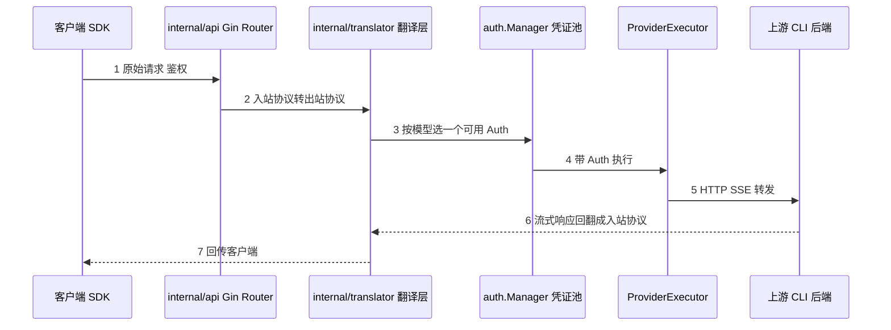
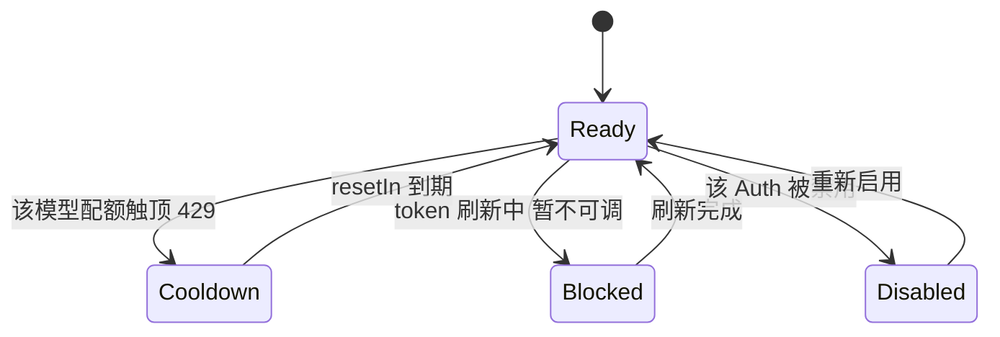
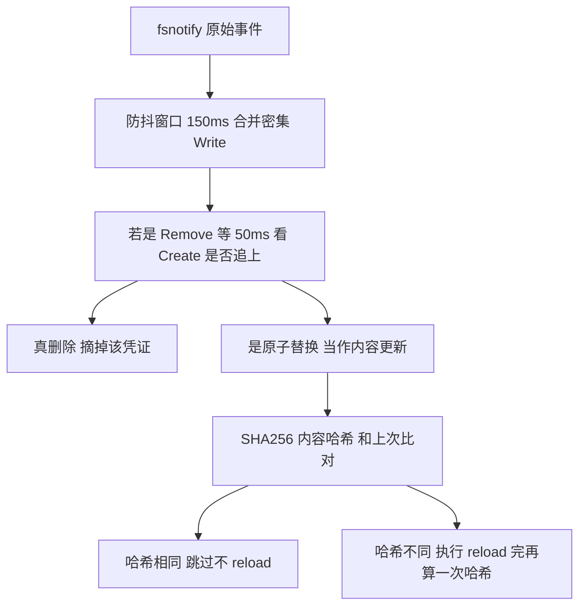

## 1. CLIProxyAPI

[CLIProxyAPI](https://github.com/router-for-me/CLIProxyAPI) 是一个本地代理服务：你用 Claude Code、Codex、Gemini CLI 这些工具登录拿到的 OAuth 凭证，经它一包装，就变成一个标准的、OpenAI / Anthropic / Gemini 兼容的 HTTP endpoint，能直接喂给 Cursor、Cline、评测脚本或者你自己写的小 agent。

### 1.1 痛点：凭证在手，却没有一个能喂给脚本

厂商正在把最强的模型藏在自家 CLI 工具后面。Claude Code 的 OAuth 授权能用上 sonnet / opus 的最新版，单纯持 API key 拿不到；Gemini 的免费额度只对 `gemini-cli` 开放，API 走付费 quota；Codex 的订阅同理。

结果是工程师手里多了一堆 OAuth 凭证，但没有一个能直接接进自己的工具链。你想做的事很简单：

- 让 Cursor / Cline 用上你订阅里的 opus，而它们只认 OpenAI 兼容的 base URL
- 写个评测脚本批量调模型，而脚本里是 `openai.OpenAI(base_url=...)`
- 几个人凑一份团队订阅轮着用，而不是各买各的 API quota

挡在中间的是两道墙：**凭证格式各家不同**（Claude 用 PKCE（OAuth 防重放扩展，客户端本地生成随机 verifier 自证身份）存 `~/.claude/.credentials.json`，Codex 存 `access_token + account_id`，Gemini 走浏览器回调 OAuth，和 Claude / Codex 同类型），**协议格式也各家不同**（你的客户端讲 OpenAI，后端 CLI 讲 Anthropic 或 Gemini）。CLIProxyAPI 把这两道墙都拆了：进来的请求可以是 6 种协议里的任意一种，出去对接的后端凭证也可以是任意一种，中间自动翻译、自动选账号、自动续期。

### 1.2 三个可迁移工程模式

这一章要拆的不是"CLIProxyAPI 有多全"，而是它解决三类通用问题的工程手法。这三个模式都能脱离本项目独立成立：

1. **N×M 协议翻译矩阵**。只要你的系统要在多种外部协议之间互转（支付网关对接多家渠道、IM 机器人对接多个平台、BI 工具读多种数据源），就会撞到"翻译对子数量爆炸 + 上游字段天天变"这道题。CLIProxyAPI 的答案是 registry 自注册 + 在原始 JSON 上路径读写，不构造中间结构体。

2. **带配额的远端凭证池控制平面**。任何"管理一组会过期、有配额、需要轮转的远端凭证"的场景（多 GitHub token 轮转、多云子账号路由、多账号订阅复用）都是同一个问题。CLIProxyAPI 把它抽成一个统一 executor 接口 + 中心 Manager，调度策略专门为"滚动窗口配额"挑了 fill-first。

3. **零停机配置 / 凭证热更新**。任何长驻服务都不想"改个配置就重启、重启就杀掉所有在途请求"。CLIProxyAPI 用 fsnotify + 内容哈希 + 防抖 + 原子替换检测四道关，做出了一套真能上生产的热重载。

本地对照源码看：

```bash
git clone --depth 1 --branch v7.1.32 https://github.com/router-for-me/CLIProxyAPI.git
cd CLIProxyAPI
```

路径都从仓库根算起。项目当前 35.5K stars、Go 实现、约 4 万行代码，发版极勤（大部分版本是追上游 CLI 的协议变化）。本文基于 tag `v7.1.32`（commit `3a54fb7`，2026-05-30 发布）。

## 2. 5 分钟跑起来

最快的路径是 Docker，配置和凭证都挂在宿主机目录里：

```bash
mkdir -p ~/cli-proxy/auth
cp config.example.yaml ~/cli-proxy/config.yaml   # 仓库里有这个模板
```

先把一个 OAuth 凭证拿进来。CLIProxyAPI 的登录是一组 `--xxx-login` 子命令，会拉起浏览器走标准 OAuth，回调把凭证写进 `auth-dir`：

```bash
# 用二进制（go build 后）或 docker run 都行，这里以本地二进制为例
./cli-proxy-api --claude-login        # 走 Claude OAuth，凭证落到 ~/.cli-proxy-api/
./cli-proxy-api --codex-login         # Codex
./cli-proxy-api --login               # Gemini / Google
```

`cmd/server/main.go:82-90` 列了全部登录开关：`--login`（Gemini）、`--codex-login`、`--claude-login`、`--antigravity-login`、`--kimi-login`、`--xai-login`。每个对应 `auths/` 下一个目录里的具体 OAuth flow。

`config.yaml` 关键就几行：

```yaml
port: 8317
auth-dir: "~/.cli-proxy-api"     # 上一步登录的凭证存这里
api-keys:                         # 客户端调用本代理时用的 key（你自己定）
  - "sk-local-whatever"
remote-management:
  secret-key: ""                  # 管理 API 的 key，留空则关闭管理面
```

直接起服务（默认读当前目录 `config.yaml`，监听 8317）：

```bash
./cli-proxy-api --config ~/cli-proxy/config.yaml
# 或 docker run -p 8317:8317 -v ~/cli-proxy:/app eceasy/cli-proxy-api:latest
```

然后就能用任意 OpenAI SDK 调它，后端实际走的是你的 Claude 订阅：

```python
from openai import OpenAI
client = OpenAI(base_url="http://localhost:8317/v1", api_key="sk-local-whatever")
resp = client.chat.completions.create(
    model="claude-opus-4-7",          # 模型名路由到对应后端
    messages=[{"role": "user", "content": "ping"}],
)
print(resp.choices[0].message.content)
```

入站协议由路径决定，`internal/api/server.go:386-416` 注册了四组：`/v1/chat/completions`（OpenAI）、`/v1/messages`（Anthropic）、`/v1/responses`（Codex Responses）、`/v1beta/models/*`（Gemini）。同一份后端凭证，四种客户端 SDK 都能调——协议翻译在中间自动完成，这就是第 4.1 节的主角。

## 3. 全景架构

一次请求从客户端到上游再回来，穿过五层。先看这张数据流图，带着它读后面三节：



代码量的分布也呼应这五层（数字为该区块约略规模）：

| 区块 | 位置 | 规模 | 职责 |
|---|---|---|---|
| 协议翻译 | `internal/translator/` | ~1.5 万行，27 个翻译对子 | 入站 6 协议 ↔ 出站 4 格式互翻 |
| 凭证池核心 | `sdk/cliproxy/auth/` | `conductor.go` 单文件 4455 行 + scheduler/selector/refresh | 选 / 执行 / 冷却 / refresh / 持久化 |
| 执行器 | `sdk/cliproxy/executor/` | — | 把"调某个后端"抽象成统一接口 |
| 热更新 | `internal/watcher/` | ~1100 行 | 监听 config 和 auth 目录，零停机重载 |
| HTTP server | `internal/api/` | 基于 Gin | 路由 + 鉴权 + handler |
| OAuth flows | `auths/` | 每个后端一个目录 | claude / codex / gemini / antigravity / kimi / xai 各自的登录实现 |

整个项目由四个抽象贯穿，认得它们就认得全局：

| 抽象 | 位置 | 一句话定位 |
|---|---|---|
| `translator.Registry` | `sdk/translator/registry.go:128` | 全局翻译注册表，`Register(from, to, reqFn, respFn)` 自注册 |
| `auth.Manager`（代码里类型叫 Manager，文件叫 conductor） | `sdk/cliproxy/auth/conductor.go` | 凭证池控制平面：选 / 执行 / 冷却 / refresh / 持久化 |
| `ProviderExecutor` | `sdk/cliproxy/auth/conductor.go:32` | 一个后端要实现的 5 方法接口，Manager 只认它 |
| `Watcher` | `internal/watcher/watcher.go:32` | 监听文件变化，触发热重载 |

`translator.Registry` 是协议层，`Manager + ProviderExecutor` 是凭证 / 调度层，`Watcher` 是运维层。这三层正好对应 1.2 节的三个模式，下面逐个拆开。

## 4. 核心模块

### 4.1 协议翻译矩阵：registry 自注册 + 不构造中间结构体

**一句话总结**：要在 N 种协议间互转，与其定义一个"万能中间格式"，不如直接写 N×M 个翻译对子，用注册表把它们各自登记进来——新增一种协议只新建一个目录，旧代码一行不改。

#### 4.1.1 问题：协议两两不兼容，而且天天在变

OpenAI 的 `tool_calls`、Anthropic 的 `tool_use`、Gemini 的 `function_call`、Codex Responses 的 `output_item`，表达的是同一件事（模型要调工具），但字段名、嵌套结构、流式切分全不一样。把一种翻成另一种，单看不难；难的是三件事叠在一起：

- **数量爆炸**：6 种入站、4 种出站，两两组合是几十个翻译对子。
- **上游天天加字段**：OpenAI 加 `reasoning_effort`、Anthropic 加 `thinking.budget_tokens`、Codex 加新的 `output_item` 类型，每隔几周就来一次。
- **流式 chunk 边界对不齐**：Anthropic 是 `content_block_start` + 多个 `content_block_delta` + `content_block_stop` 的块结构，OpenAI 是一条扁平的 `delta` 流。这不是字段名不同，是**切分粒度不同**。

#### 4.1.2 中间 IR vs 大 switch vs N×M 直接翻译

| 方案 | 怎么做 | 优点 | 代价 |
|---|---|---|---|
| 中间 IR（hub-and-spoke，以一个统一格式为中心、各协议像辐条接上来） | 定义一个统一内部格式，所有协议先翻成 IR 再翻回去，只需 2N 个翻译器。LiteLLM 就是这条路，用 OpenAI 的 `ModelResponse` 当 IR | 翻译器数量从 N×M 降到 2N | IR 永远追不上最新字段；流式块结构被迫塌缩成"所有协议的并集"，IR 不再是抽象而是大杂烩 |
| 一个大 switch | `translate(from, to, json)` 里几十个 case | 一眼看全 | 单文件无限膨胀，新增协议改公共文件，冲突频繁 |
| N×M 直接翻译 + 注册表 | 每个方向写一个独立翻译函数，用 registry + `init()` 各自登记 | 新增方向不动旧代码；每个对子可独立处理自己的 edge case | 翻译对子总数多；`init()` 副作用让依赖图变隐式 |

LiteLLM 的 hub-and-spoke 看起来更省代码，实测痛点在于：每个 provider 的 `transformation.py`（如 `litellm/llms/anthropic/chat/transformation.py`）都要把自己映射到 OpenAI 的 `ModelResponse`，而 OpenAI 格式表达不了的东西（Anthropic 的块级流式、cache_control 的精确语义）只能塞进扩展字段，IR 慢慢变成"打满补丁的 OpenAI"。

#### 4.1.3 CLIProxyAPI 的选择：registry + init() 自注册

它选了 N×M 直接翻译。注册入口在 `sdk/translator/registry.go:128`：

```go
func Register(from, to Format, request RequestTransform, response ResponseTransform) { /* 塞进全局 map */ }
```

每个翻译方向一个目录，目录里的 `init()` 把自己登记进去。`internal/translator/openai/claude/init.go`：

```go
func init() {
    translator.Register(
        Claude,        // from：入站协议
        OpenAI,        // to：  出站协议（后端 CLI 讲的协议）
        ConvertClaudeRequestToOpenAI,
        interfaces.TranslateResponse{
            Stream:    ConvertOpenAIResponseToClaude,
            NonStream: ConvertOpenAIResponseToClaudeNonStream,
            TokenCount: ClaudeTokenCount,
        },
    )
}
```

一次请求往返要查两次注册表——进来翻请求、回去翻响应，如下图：


`internal/translator/init.go` 用 27 个空白 import 把所有翻译器目录拉进编译单元，触发它们的 `init()`：

```go
import (
    _ "github.com/router-for-me/CLIProxyAPI/v7/internal/translator/openai/claude"
    _ "github.com/router-for-me/CLIProxyAPI/v7/internal/translator/codex/openai/responses"
    // ... 共 27 个
)
```

这一步是关键工程动作：`init()` 的依赖是隐式的，Go 工具链没法静态分析"谁注册了谁"。作者把所有 import 集中在一个文件里显式列出，等于把隐患压到一眼可见的程度——你想知道支持哪些方向，看这一个文件就够。

#### 4.1.4 关键代码：在原始 JSON 上"取-改-塞"

翻译函数本身才是精华。看 Claude → OpenAI 的请求转换，`internal/translator/openai/claude/openai_claude_request.go:23`：

```go
func ConvertClaudeRequestToOpenAI(modelName string, inputRawJSON []byte, stream bool) []byte {
    out := []byte(`{"model":"","messages":[]}`)
    root := gjson.ParseBytes(inputRawJSON)
    out, _ = sjson.SetBytes(out, "model", modelName)
    if maxTokens := root.Get("max_tokens"); maxTokens.Exists() {
        out, _ = sjson.SetBytes(out, "max_tokens", maxTokens.Int())
    }
    // ... 一连串 Get / SetBytes
}
```

这里没有 `ClaudeRequest struct` 和 `OpenAIRequest struct`。它用 [gjson](https://github.com/tidwall/gjson)（按 path 读 JSON，惰性解析）在源串上取，用 [sjson](https://github.com/tidwall/sjson)（按 path 写 JSON）往目标串上塞。整段翻译是一串"取-改-塞"，没有完整的反序列化 / 序列化往返。

为什么不构造结构体？三个理由，每个都对应上面的痛点：

- **省一次全量解析**：messages 数组可能很长，struct 翻译要解析两遍（进来一遍、出去一遍），gjson 只解析你 query 到的路径。
- **字段透传天然兼容**：上游加了未知字段，struct 翻译要先建模才能不丢；路径读写只动你关心的字段，其余原样带过，新字段不破坏旧逻辑。
- **多模态嵌套不强行建模**：Claude 的 `content` block 有 text / image / tool_use / tool_result 多种，struct 化要么 union 要么牺牲严格性，路径方式直接转发原始嵌套。

代价是丢了类型安全。真正难的活藏在有损映射里，`openai_claude_request.go:65` 起这段把 Claude 的"思考预算"翻成 OpenAI 的"思考等级"：

```go
case "enabled":
    if budgetTokens := thinkingConfig.Get("budget_tokens"); budgetTokens.Exists() {
        budget := int(budgetTokens.Int())
        if effort, ok := thinking.ConvertBudgetToLevel(budget); ok && effort != "" {
            out, _ = sjson.SetBytes(out, "reasoning_effort", effort)  // 数字预算 → low/medium/high
        }
    }
```

Claude 给的是 token 数（`budget_tokens`），OpenAI 要的是等级字符串（`low/medium/high`），两个厂商对"思考预算"的建模颗粒度根本不一样，翻译器只能做**有损映射**。这种 edge case README 里不会写，只有读到这一行才知道作者怎么兜的——也正是中间 IR 方案最难处理的地方（IR 该存数字还是等级？存哪个都丢信息）。

#### 4.1.5 取舍：N×M 真的扩展不下去，但被注册表拦住了扩散

直接写 N×M 的代价是诚实的：按当前协议数，再加一种新协议至少要补十几个翻译对子。这看起来比 LiteLLM 的 2N 差。

但两个力量把它拉回务实区间：一是**协议是别人定义的、语义不可控**，IR 方案省下的翻译器数量会被"IR 永远在追新字段"吃回去；二是**注册表 + 独立目录把扩散挡住了**——新增一种协议的工作量虽大，但全部集中在新目录里，旧代码零改动，不会污染。换句话说，它没有消除 N×M 的复杂度，而是把复杂度**关进了局部**。对一个要长期追上游、协议天天变的项目，"改动局部化"比"代码总量少"更值钱。

#### 4.1.6 自己写一个最小翻译矩阵

核心就两样：一个注册表，一组在原始 JSON 上读写的翻译函数。Python 版 40 行能跑通骨架：

```python
import json
from typing import Callable

# 注册表：(from, to) -> 翻译函数
_REGISTRY: dict[tuple[str, str], Callable[[dict], dict]] = {}

def register(src: str, dst: str):
    def deco(fn):
        _REGISTRY[(src, dst)] = fn
        return fn
    return deco

def translate(src: str, dst: str, raw: dict) -> dict:
    if src == dst:
        return raw
    return _REGISTRY[(src, dst)](raw)

# 一个方向：Claude 请求 → OpenAI 请求（只动关心的字段，其余透传思路同 gjson）
@register("claude", "openai")
def claude_to_openai(req: dict) -> dict:
    out = {"model": req["model"], "messages": req["messages"]}
    if "max_tokens" in req:
        out["max_tokens"] = req["max_tokens"]
    # 有损映射：thinking budget(数字) → reasoning effort(等级)
    budget = req.get("thinking", {}).get("budget_tokens")
    if budget is not None:
        out["reasoning_effort"] = "high" if budget > 8000 else "medium" if budget > 2000 else "low"
    return out

# 新增一个方向只要再写一个 @register 函数，translate() 不用改
```

要逼近 CLIProxyAPI 的性能，把 `dict` 换成 gjson/sjson 那种路径读写库（JS 用 `jsonpath` 系，Go 直接用 tidwall 那两个），就不必整体反序列化。流式响应要再单独写一组 SSE 累积器，把 chunk 化的响应攒成完整快照，那是另一类活，这里不展开。

### 4.2 凭证池控制平面：统一 executor 接口 + fill-first 调度

**一句话总结**：把"管理一堆会过期、有配额、要轮转的凭证"做成一个中心控制平面——所有后端实现同一个接口，Manager 只管选谁、调谁、谁该冷却、谁该续期；调度策略专门为"滚动窗口配额"挑了反直觉的 fill-first。

#### 4.2.1 问题：凭证管理是组合爆炸

单个 OAuth 凭证就够烦：会过期要 refresh、有配额会触顶。再叠上"5 种后端 × 每种多账号 × 每个账号对不同模型状态不同"，复杂度直接爆炸。一个 Claude 账号可能 sonnet 打满了但 haiku 还能用；另一个账号可能配额临时 down 但 token 还有效，不需要 refresh 只需要等。把这些状态全摊在请求路径上写 if/else，几周后没人敢动。

#### 4.2.2 各后端各写一套 vs channel 模型 vs 统一 executor

| 方案 | 怎么做 | 优点 | 代价 |
|---|---|---|---|
| 每个后端各写一套 | claude 一个模块、codex 一个模块，各自管自己的 refresh / 轮询 | 改一个不影响别的 | 轮询、冷却、退避逻辑重复 N 遍，行为不一致 |
| channel 模型（one-api / new-api） | 每个上游凭证是一条 channel，带 weight，按加权轮询；失败禁用 channel | 成熟、面向计费、有后台管理 | 调度是 stateless 的加权轮询，不感知"远端滚动窗口配额"这种有状态约束 |
| 统一 executor 接口 + 中心 Manager（CLIProxyAPI） | 所有后端实现同一个 5 方法接口，Manager 统一选 / 调 / 冷却 / refresh | 调度逻辑只写一遍；能做模型级、配额感知的精细调度 | Manager 成为单点，状态机复杂（conductor.go 4455 行） |

#### 4.2.3 CLIProxyAPI 的选择：一个接口 + 一个搬运契约

后端要做的，是实现 `sdk/cliproxy/auth/conductor.go:32` 的接口：

```go
type ProviderExecutor interface {
    Identifier() string
    Execute(ctx, auth *Auth, req, opts) (Response, error)
    ExecuteStream(ctx, auth *Auth, req, opts) (*StreamResult, error)
    Refresh(ctx, auth *Auth) (*Auth, error)        // token 过期了让它自己续
    CountTokens(ctx, auth *Auth, req, opts) (Response, error)
    HttpRequest(ctx, auth *Auth, req) (*http.Response, error)
}
```

Manager 完全不关心"Claude 的 OAuth 怎么 refresh""Codex token 长什么样"，只关心"能不能从这个 executor 拿到响应，失败了能不能调 `Refresh` 救活"。后端的脏活全封在各自的实现里。

Manager 和 executor 之间搬运的是 `Auth` 结构（`sdk/cliproxy/auth/types.go:47`），它的字段设计是这个模块最值得抄的地方：

```go
type Auth struct {
    Provider         string                 // "claude" / "codex" / ...
    Status           Status                 // active / pending / refreshing / error / disabled（status.go:8-18）
    Disabled         bool                   // 操作员显式禁用（意图）
    Unavailable      bool                   // 配额耗尽等临时不可用（状态）
    Attributes       map[string]string      // 不变配置，如 account_id（改了要写盘）
    Metadata         map[string]any         // 可变运行时，如 token / expiry（改了不一定写盘）
    NextRefreshAfter time.Time              // refresh 退避锚点
    NextRetryAfter   time.Time              // 执行失败退避锚点（和上面分开）
    ModelStates      map[string]*ModelState // 按模型粒度的状态
}
```

这里要分清两层状态，源码里也是分开的：`Status` 是**整个 Auth 的生命周期状态**（`status.go:8-18`，取值 `unknown / active / pending / refreshing / error / disabled`，其中 `unknown` 是零值兜底、正常运行只会见到后五种）；而"某个模型现在能不能用、是不是在冷却"是**调度器层的按模型状态**，由 `scheduler.go:27-30` 的 `scheduledState` 枚举（`Ready / Cooldown / Blocked / Disabled`）管理。下面这张图画的是后者——一个 Auth 对某个具体模型的调度状态怎么流转：



注意 Cooldown 是挂在某个模型上的，不是整个 Auth——同一时刻同一个 Auth 对 sonnet 可能在 Cooldown、对 haiku 还是 Ready，正因如此调度状态才要按模型存。回到 `Auth` 结构本身，三处字段分离是这个模块最值得抄的精度，每处都被实战逼出来：

- **`Attributes` vs `Metadata`**：不变配置和可变状态分开，前者改动才需要落盘。
- **`Disabled`（意图）vs `Unavailable`（状态）**：操作员关掉的账号和临时配额触顶的账号，恢复逻辑完全不同，不能用一个 bool 表达。
- **`ModelStates`（按模型）**：账号不是非黑即白，sonnet 冷却时 haiku 仍可用。

#### 4.2.4 关键代码：fill-first 选择器与模型级冷却

调度拆成两层：Scheduler（`scheduler.go`，维护"哪个 auth 对哪个 model 处于 ready/cooldown"）和 Selector（`selector.go`，从 ready 集合里挑一个）。内置两种策略，`scheduler.go:18-20`：

```go
schedulerStrategyCustom schedulerStrategy = iota
schedulerStrategyRoundRobin
schedulerStrategyFillFirst
```

精华在 fill-first 的注释里，`selector.go:33-36`：

```go
// FillFirstSelector selects the first available credential (deterministic ordering).
// This "burns" one account before moving to the next, which can help stagger
// rolling-window subscription caps (e.g. chat message limits).
type FillFirstSelector struct{}
```

这是一个**反直觉但正确**的选择。负载均衡器默认 round-robin（雨露均沾），是因为后端通常 stateless。但订阅配额是"5 小时滚动窗口内最多 X 条消息"这种 sliding window（滑动窗口限流），是 stateful 的。如果 round-robin 把 5 个账号都打到 80%，会出现某一刻五个账号同时触顶、全线瘫痪。**fill-first 故意把一个账号烧到接近上限、让它进冷却，再切下一个**，这样各账号的冷却窗口错开，任何时刻都有账号可用。这是只有真运营过多账号订阅才会想到的取舍。

冷却是**模型级**的，`selector.go:47`：

```go
type modelCooldownError struct {
    model    string
    resetIn  time.Duration
    provider string
}
// "All credentials for model gpt-5.5 are cooling down via provider codex"
```

一个 auth 可以对 `gpt-5.5` 冷却但 `gpt-4o-mini` 还能用——和上面 `Auth.ModelStates` 的设计一以贯之，分层状态机贯穿始终。

至于"凭证过期"这种异步事件，单独有个后台循环兜（`auto_refresh_loop.go:13`）：一个**最小堆 + worker pool**，主循环按 `NextRefreshAfter` 时间出堆，把到期的 authID 推进 channel，16 个 worker 取出来调 `Refresh`。堆操作 O(log n)、worker 数固定，1000 个账号也不会失控。

#### 4.2.5 取舍：fill-first vs 加权轮询，谁对要看后端是否有状态

one-api / new-api 这类计费导向的网关默认加权轮询，因为它们面对的是"按量付费的 API key"——后端基本 stateless，把流量按 weight 摊开最公平。CLIProxyAPI 默认 fill-first，因为它面对的是"订阅滚动窗口"——后端是 stateful 的，必须错开触顶时间。

**没有哪个绝对正确，判据是后端有没有状态**。你做调度时第一个该问的问题不是"轮询还是随机"，而是"后端的限流是 per-request 的还是 per-window 的"。前者用 round-robin，后者得用 fill-first 这类"逐个烧"的策略。这个判断本身比代码更值得带走。

#### 4.2.6 自己写一个最小凭证池

抓住三件事：统一接口、按模型选可用凭证、fill-first 顺序。Python 骨架约 60 行：

```python
import time
from dataclasses import dataclass, field

@dataclass
class Cred:
    name: str
    refresh: callable                       # 续期函数，凭证自己提供
    cooldown_until: dict[str, float] = field(default_factory=dict)  # model -> 解冻时间
    disabled: bool = False

class CredPool:
    def __init__(self, creds: list[Cred]):
        self.creds = creds                  # 顺序固定 = fill-first 的基础

    def pick(self, model: str) -> Cred:
        now = time.time()
        for c in self.creds:                # 从头扫，先用前面的，烧完再下一个
            if c.disabled:
                continue
            if c.cooldown_until.get(model, 0) > now:
                continue
            return c
        raise RuntimeError(f"all creds cooling down for {model}")

    def execute(self, model: str, call: callable):
        c = self.pick(model)
        try:
            return call(c)                  # call 里若 401 就触发 refresh，若 429 就冷却
        except QuotaError as e:
            c.cooldown_until[model] = time.time() + e.reset_in   # 模型级冷却
            return self.execute(model, call)                     # 换下一个
        except AuthExpired:
            c.refresh()                                          # 续期后重试
            return call(c)
```

要做到生产级，再补两件：后台 refresh 循环（最小堆按到期时间出队），以及 `Attributes`（落盘的不变配置）和运行时状态分开存。核心调度逻辑就是上面这个 `pick` + `execute`。

### 4.3 配置 / 凭证热更新：四道关层层兜底

**一句话总结**：让一个长驻服务"改配置不重启、换 token 不断流"，光监听文件变化远远不够——真正能上生产的版本要叠四道关：防抖合并密集事件、内容哈希过滤无效触发、原子替换检测识破"假删除"、批量变更再防抖一次。

#### 4.3.1 问题：重启大法会杀掉在途请求

代理在跑，你想加一个账号、改一个限流值。最省事的做法是改完重启进程。但重启会**杀掉所有在途请求**（流式响应直接断），还会丢掉内存里的轮询游标、冷却状态。对一个被一堆客户端连着的代理，这是不可接受的。

#### 4.3.2 重启进程 vs SIGHUP 重读 vs fsnotify 自动重载

| 方案 | 怎么做 | 优点 | 代价 |
|---|---|---|---|
| 重启进程 | 改完 `kill` 再起 | 实现成本零 | 杀在途请求、丢内存状态 |
| SIGHUP 重读 | 进程收到信号后重读配置（nginx 经典做法） | 不重启进程 | 要手动发信号，没法对"凭证文件被工具改写"自动响应 |
| fsnotify 自动重载 | 监听目录，文件一变自动 reload（CLIProxyAPI） | 全自动，连 token 文件被外部改写都能跟 | 文件系统事件嘈杂，要处理一堆假信号 |

fsnotify 的麻烦在于文件系统事件特别脏：一次保存可能触发多个 Write，编辑器用"先写新文件再 rename 覆盖"会让你先看到 Remove 再看到 Create，很多工具即使内容没变也 touch 一下 mtime。直接响应这些事件，会频繁误重载甚至误判文件被删。

#### 4.3.3 CLIProxyAPI 的选择：防抖 + 哈希 + 原子替换检测

一个原始文件事件要穿过四道关，才可能真正触发一次 reload，挡掉的都是噪声：



灵魂是 `internal/watcher/watcher.go:83-86` 这四个常量，每个都对应一个具体踩过的坑：

```go
replaceCheckDelay        = 50 * time.Millisecond   // 等原子替换的 Create 追上来
configReloadDebounce     = 150 * time.Millisecond  // 合并一次保存的多个 Write
authRemoveDebounceWindow = 1 * time.Second         // 给"真删除"vs"替换"留区分时间
serverUpdateDebounce     = 1 * time.Second          // 批量变更（rsync）合并成一次重配
```

- `replaceCheckDelay = 50ms`：vim `:w`、VSCode 保存、`sed -i` 都用 atomic rename（先写新文件再 rename 覆盖），fsnotify 看到的是先 Remove 后 Create。立刻响应 Remove 就会误判删除；延迟 50ms 等 Create 追上来，就能识破"这其实是一次替换"。
- `configReloadDebounce = 150ms`：编辑器边写边 flush 会触发多个 Write，150ms 窗口合并成一次 reload。
- 后两个 1s 窗口分别给"删除 vs 替换"和"批量更新"留缓冲。

#### 4.3.4 关键代码：内容哈希作为第二道关

防抖只解决"事件太密"，解决不了"事件来了但内容没变"。第二道关是 SHA256 内容哈希，`internal/watcher/config_reload.go:43`（下面省略了一些日志与内部 helper，但保留了真实代码里的错误处理和 `clientsMutex` 锁——`lastConfigHash` 在并发下被多个 goroutine 读写，不能裸操作）：

```go
func (w *Watcher) reloadConfigIfChanged() {
    data, err := os.ReadFile(w.configPath)
    if err != nil { return }                    // 原子替换瞬间可能读不到，直接返回等下次
    if len(data) == 0 { return }                // 空文件守护：替换中途可能读到 0 字节
    newHash := hex.EncodeToString(sha256.Sum256(data)[:])

    w.clientsMutex.RLock()                       // lastConfigHash 的读写都在锁内
    same := w.lastConfigHash != "" && w.lastConfigHash == newHash
    w.clientsMutex.RUnlock()
    if same { return }                           // 内容没变，事件再多也不 reload

    if w.reloadConfig() {
        // 取最新内容再算一次哈希，避免 reload 期间文件又被改写
        if updated, e := os.ReadFile(w.configPath); e == nil && len(updated) > 0 {
            newHash = hex.EncodeToString(sha256.Sum256(updated)[:])
        }
        w.clientsMutex.Lock()
        w.lastConfigHash = newHash
        w.clientsMutex.Unlock()
    }
}
```

注意结尾"reload 完再算一次哈希"——它在防一个时间窗：reload 过程中文件可能又被改了，用旧哈希记录会导致下次真变化被漏掉。**防抖 + 哈希两道关合起来，才拿到"只在真有内容变化时 reload"的语义**，这比"只防抖"或"只哈希"都高一个等级。

#### 4.3.5 自己写一个最小热重载器

防抖 + 哈希两道关，Python `watchdog` 版约 40 行：

```python
import hashlib, threading
from watchdog.observers import Observer
from watchdog.events import FileSystemEventHandler

class ReloadHandler(FileSystemEventHandler):
    def __init__(self, path, on_reload, debounce=0.15):
        self.path, self.on_reload, self.debounce = path, on_reload, debounce
        self.last_hash = None
        self.timer = None

    def on_any_event(self, event):
        if self.timer:
            self.timer.cancel()                 # 防抖：取消上一个待执行的 reload
        self.timer = threading.Timer(self.debounce, self._maybe_reload)
        self.timer.start()

    def _maybe_reload(self):
        try:
            data = open(self.path, "rb").read()
        except FileNotFoundError:
            return                              # 原子替换的瞬间可能读不到，忽略等下一次
        h = hashlib.sha256(data).hexdigest()
        if h == self.last_hash:                 # 内容哈希：没变就不 reload
            return
        self.last_hash = h
        self.on_reload(data)
```

原子替换检测（先 Remove 后 Create 那套）要更细致地按平台处理，先跑通防抖 + 哈希这两道，已经能挡掉绝大多数误重载。

## 5. 几个工程细节

读源码时顺手记下的几个工程细节，单拎不够一节，合成一张表：

| 习惯 | 项目怎么做 | 可迁移到哪 |
|---|---|---|
| JSON 操作统一心智 | 全程 `tidwall/gjson` 读 + `tidwall/sjson` 写，同一作者、同一套"按路径读写"语法 | 任何重 JSON 改写的项目，统一一套 JSON 库能让所有人读代码不切换心智 |
| 自带 ring buffer 统计 | `Auth.recentRequests` 用 20 个 10 分钟桶滚动统计成功 / 失败（`types.go:99`），不依赖 Prometheus | 想"不接外部监控也能自查"的本地工具 |
| 把可观测性留给下游 | 不内置 exporter，靠 `Hooks` 接口让嵌入方挂自己的 tracer | SDK 形态的库，别强塞监控依赖 |
| 可嵌入 SDK | `sdk/cliproxy/service.go:36` 的 `Service` 把 tokenProvider / hooks / watcherFactory 全做成接口 | 想让别人 import 你而不是起独立进程的库 |
| 选型重 API 友好度 | Gin（路由像 Express）+ Logrus（API 比 zap 友好），不追 benchmark 数字 | 日志、路由不在热路径时，可读性优先于性能 |

其中"可嵌入 SDK"值得多看一眼：`Service` 把外部依赖全做成接口 / 工厂，意味着企业想做"用员工 Claude OAuth 认证的内部网关"，可以直接 import 这个 SDK、实现 `Hooks` 注入鉴权和审计，而不是起一个独立 binary 走 HTTP。接入路径从"部署并维护一个独立进程"缩短到"import 一个包 + 实现 Hooks 接口"——这是把同一套能力既做成可独立运行的服务、又做成可嵌入的库的典型手法。

## 6. 适用边界与不该照搬的部分

### 6.1 什么场景该用 / 不该用

| 场景 | 建议 | 原因 |
|---|---|---|
| 本地自用、单人多账号复用自己的订阅 | 适合 | 正是它的设计目标 |
| Go 服务想内嵌"带配额的凭证池" | 适合（用 SDK） | `sdk/cliproxy/auth/` 抽象干净，可独立嵌入 |
| 对外多租户、把订阅当 API 卖 | 不要 | 踩 Anthropic / OpenAI 的账号共享 ToS 红线；且 fill-first 的"逐个烧"节律更像机器人，更易被风控 |
| 需要标准 metric / trace 的企业网关 | 谨慎 | 没有 Prometheus / OpenTelemetry 内置埋点，SRE 拿不到统一可观测性 |

还有一条是这类项目的命门：**它依赖上游 CLI 协议保持稳定**。上游每改一次 token format / refresh 协议，它就要追一次（发版极勤正是这个原因）。一旦上游主动加防护（客户端签名、证书绑定），整条链路可能直接失效。把它当生产基础设施前，要接受这个脆弱性。

### 6.2 哪些模式可以照搬、哪些不要

**可以照搬**：

- 注册表 + 自注册的翻译矩阵——任何多协议互转都能用。
- 凭证池的统一 executor 接口 + `Attributes`/`Metadata` 分离 + 模型级状态——任何带配额的远端凭证管理都能用。
- 热更新的"防抖 + 哈希"双关——任何长驻服务的配置重载都该这么做。
- fill-first 的判断思路——后端 stateful 就别 round-robin。

**不要照搬**：

- 4455 行的 `conductor.go` 单文件。作者的理由（控制平面逻辑本质是状态机的耦合，拆开锁的拓扑不变）成立，但新人上手陡、审查工具报警、IDE 慢。自己写时建议按 verb 拆成 `select / execute / refresh / update` 几个文件，方法仍挂在同一个 `Manager` 接收者上，Go 层面零成本。
- "不内置任何可观测性"。它把这块留给下游是 SDK 形态的合理选择，但你做最终服务时该补上 trace ID 透传和标准 metric。

## 7. 自己写一个 mini 版的路线图

把三个模式串起来，1-2 周能落地一个"单后端、单账号"的迷你版，再逐步加宽：

- **阶段一（2-3 天）：翻译矩阵**。先做 OpenAI ↔ Claude 双向，registry + 两个翻译函数（4.1.6 的骨架），用 gjson/sjson 类库在原始 JSON 上读写。跑通"OpenAI SDK 调 Claude 后端"这一条路。
- **阶段二（3-4 天）：凭证池**。加 `ProviderExecutor` 接口和一个 `Manager`，先支持单后端多账号 round-robin + 401 自动 refresh（4.2.6 的骨架）。等多账号跑顺了，再把 round-robin 换成 fill-first，体会 sliding window 配额下的差别。
- **阶段三（2 天）：热更新**。给配置和凭证目录加 fsnotify + 防抖 + 内容哈希（4.3.5 的骨架），做到改账号不重启。
- **阶段四（按需）**：扩协议（每加一种写若干翻译对子）、加模型级冷却、加 management API。

别一上来就追 6 协议 4 格式的全矩阵。先把"一条路径端到端跑通"，再决定哪个模式对你的场景最值钱。

## 8. 延伸阅读

- [musistudio/claude-code-router](https://github.com/musistudio/claude-code-router)——和本项目方向相反：它是给 Claude Code 客户端做的路由层，让 Claude Code 去调任意 OpenAI 兼容后端。读它和读 CLIProxyAPI 形成"客户端侧 vs 服务端侧"的对照。
- [BerriAI/litellm](https://github.com/BerriAI/litellm)——Python 实现的 LLM 网关，协议翻译走 hub-and-spoke（OpenAI 当 IR）。对照它的 `litellm/llms/*/transformation.py` 和本项目的 N×M，能直观看到两种翻译架构的取舍。
- [songquanpeng/one-api](https://github.com/songquanpeng/one-api) 与 [Calcium-Ion/new-api](https://github.com/Calcium-Ion/new-api)——计费 + 渠道管理导向的网关，看它们的 channel 模型如何处理多上游调度，补上 CLIProxyAPI 缺失的"商业化运营"那一面。
- 《AI Token 中转站实战》——正面讲企业级 LLM 网关的鉴权、计费、限流、渠道管理，是 CLIProxyAPI 缺的"商业化运营"那一面的系统展开。
