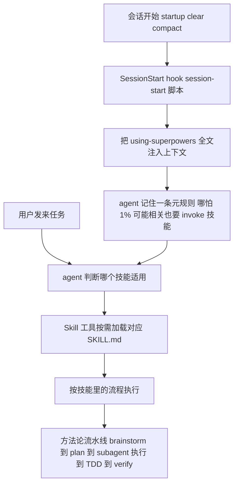
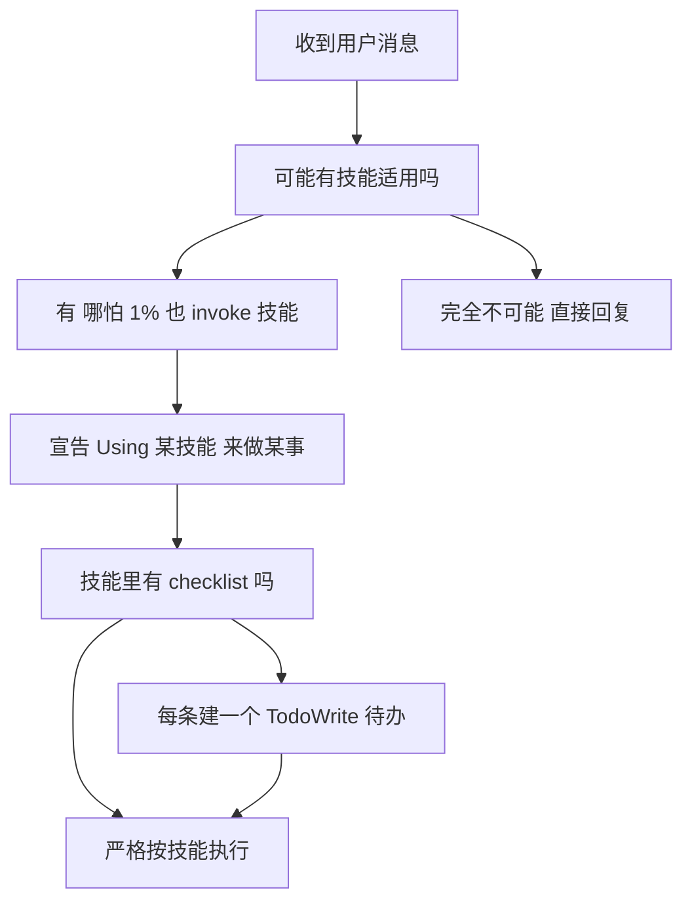
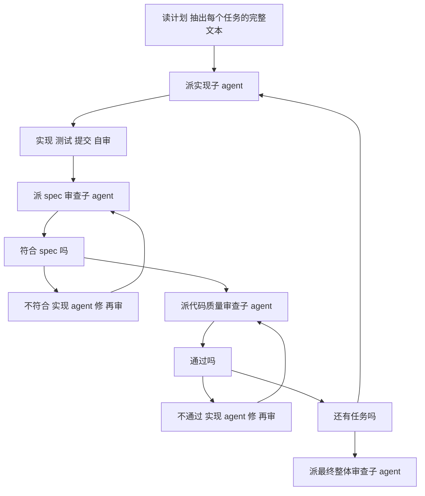
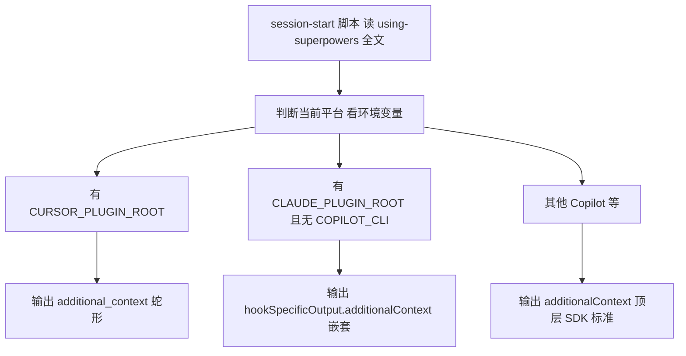

## 1. Superpowers

[Superpowers](https://github.com/obra/superpowers) 是一套装进 coding agent 的软件开发方法论。它不是一个库、不是一个 MCP server，而是一组 Markdown 写的技能（skill）加一段开机引导，让你的 Claude Code / Codex / Gemini CLI 从"上来就闷头写代码"变成"先逼你把需求聊清楚、先写测试、完成前先自己跑一遍验证"。

### 1.1 痛点：agent 知道该怎么做，但就是不做

任何用过 coding agent 的人都熟悉这几个场景：

- 你说"加个登录功能"，它直接开始写代码，不问你要什么、不写测试。
- 你让它用 TDD，它先把实现写完，再补几个必过的测试糊弄你。
- 它跑完活说"已完成、测试通过"，你一跑全红。

问题不在于模型不懂 TDD、不懂 spec-first——这些它都"知道"。问题在于**它会为偷懒找借口**："这个太简单不用写测试""我先探索一下代码库""我记得这个怎么做"。模型的默认行为是讨好你、快速给出看起来完成的东西，而不是守纪律。

把规则写进一个长长的 system prompt 不解决问题：prompt 越长，模型越容易"忘记"或"绕过"中间那几条。Superpowers 的作者 Jesse（obra）换了个思路——**把每条纪律写成一个独立的、会在恰当时机自动触发的技能，并且像写测试一样反复测它能不能堵住 agent 的借口**。

### 1.2 三个可迁移工程模式

它背后有三个能用到任何 LLM agent 系统的 prompt 工程手法：

1. **Progressive disclosure：把能力拆成 description 触发的技能文件**（progressive disclosure，渐进式披露：上下文里平时只放每个能力的触发条件摘要，真用到时才载入完整正文）。与其把所有规则塞进一个巨型 system prompt（越长越失效），不如拆成一组小文件，每个带一句"什么时候用我"，让 agent 按需加载。任何要给 agent 装"可插拔行为库"的系统都用得上。

2. **把 prompt 当对抗性测试来写**。普通人写 prompt 是"陈述规则"，Superpowers 写 prompt 是"先看 agent 怎么绕，再逐个堵 loophole"。Iron Law、反合理化表、subagent 两段 review 都是这套思路的产物。任何"模型不照做"的 prompt 调试场景都能照搬。

3. **SessionStart hook 注入 bootstrap + 跨平台适配**（bootstrap，开机引导：系统冷启动时先注入的那段初始化上下文）。agent 怎么知道有这些技能？一个开机 hook 把引导内容注进上下文；同一套技能用不同的 hook 输出格式适配 Claude Code、Cursor、Codex、Gemini。任何要给 agent 注入持久规范的场景都是同一个问题。

本地对照源码看：

```bash
git clone --depth 1 --branch v5.1.0 https://github.com/obra/superpowers.git
cd superpowers
```

路径都从仓库根算起。项目核心是 `skills/` 下 14 个 `SKILL.md`、`hooks/` 下一个 SessionStart 脚本，几乎没有传统意义的"代码"——它的工程量在 prompt 里。本文基于 tag `v5.1.0`（commit `f2cbfbe`）。

## 2. 5 分钟跑起来

Superpowers 是 Claude Code 插件，一行装好（其他平台见 README 的对应小节）：

```
/plugin install superpowers@claude-plugins-official
```

装完**重启一个会话**——这一步关键，因为它的能力靠 SessionStart hook 注入（第 4.4 节展开）。然后随便开个空目录，说一句要做东西：

```
> 帮我做一个命令行待办工具
```

装之前，agent 会直接开始写 `todo.py`。装之后，它的第一反应变成先触发 brainstorming 技能、反过来问你：

```
Using superpowers:brainstorming to clarify requirements.

在写任何代码之前，我想先把需求聊清楚。几个问题：
1. 待办存哪里？纯内存、本地文件，还是要持久化到数据库？
2. 需要哪些操作？增删改查之外，要不要优先级、截止日期、标签？
3. 多人用还是单人？要不要同步？
...
```

聊清楚后它会产出一份 spec、分段给你确认，再写一份实现计划，然后进入 subagent 驱动的执行：每个任务派一个全新的子 agent 实现，做完先过 spec 审查、再过代码质量审查，才进下一个任务。整个过程你基本不用插手。

你不需要记任何命令。技能靠 description 自动触发——你描述任务，相关技能自己跳出来。想看有哪些技能，问一句"列出你的 superpowers 技能"即可。

## 3. 全景架构

Superpowers 的运行链路是一条"注入 → 引导 → 按需加载 → 执行方法论"的流水线：



它的 14 个技能分三类（这张表就是这套方法论的目录）：

| 类别 | 技能 | 管什么 |
|---|---|---|
| 入口 / 元 | using-superpowers、writing-skills | 怎么用技能、怎么写技能 |
| 流程（rigid，必须照做） | brainstorming、writing-plans、subagent-driven-development、executing-plans、test-driven-development、systematic-debugging、verification-before-completion | 一个需求从澄清到交付的纪律 |
| 协作 / 收尾（flexible，按情境调整） | dispatching-parallel-agents、requesting-code-review、receiving-code-review、using-git-worktrees、finishing-a-development-branch | 多 agent 协作、code review、分支收尾 |

每个技能是一个 `SKILL.md`，开头一段 YAML frontmatter：

```yaml
---
name: test-driven-development
description: Use when implementing any feature or bugfix, before writing implementation code
---
```

`description` 是整套机制的枢纽：它不是给人看的简介，是给 agent 看的**触发条件**——"什么情况下该加载我"。agent 不需要预读 14 个文件的正文，只看 description 就能判断该不该 invoke。这就是第 4.1 节要讲的 progressive disclosure。

核心抽象只有三个，认得它们就认得全局：

| 抽象 | 位置 | 一句话定位 |
|---|---|---|
| SKILL.md + description | `skills/*/SKILL.md` | 一条可独立加载、按需触发的能力 / 纪律 |
| SessionStart hook | `hooks/session-start` | 开机把引导技能注入上下文，跨平台适配输出格式 |
| 反合理化 prompt | 散布在各 SKILL.md | 用 Iron Law、Red Flags 表堵住 agent 绕过规则的借口 |


## 4. 核心模块

### 4.1 Progressive disclosure：description 触发的可插拔技能库

**一句话总结**：别把所有规则塞进一个巨型 system prompt（越长越被忽略），把每条能力拆成一个小文件，开头写一句"什么时候用我"，让 agent 自己按需加载——上下文里永远只有当前相关的那几条。

#### 4.1.1 问题：system prompt 越长越失效

给 agent 装方法论，最直觉的做法是把所有规则写进 system prompt。但规则一多就出问题：上下文被几千行规范占满，模型对中间部分的注意力衰减（业界叫 "lost in the middle"，长上下文里中段信息最易被忽略），真正该触发的规则反而被漏掉。而且不同任务需要的规则不同——写代码用 TDD、调 bug 用 systematic-debugging，全堆在一起既浪费 token 又互相干扰。

#### 4.1.2 巨型 system prompt vs RAG 检索 vs description 触发

| 方案 | 怎么做 | 优点 | 代价 |
|---|---|---|---|
| 巨型 system prompt | 把所有规则一次性塞进系统提示词 | 实现简单，一定在上下文里 | 越长越被忽略；token 浪费；规则互相干扰 |
| RAG / 向量检索 | 把规则存向量库，按相似度召回 | 上下文精简 | 要建检索基建；召回不稳；"什么时候该用"靠语义相似度猜，不可控 |
| description 触发的技能（Superpowers） | 每个能力一个文件 + 一句触发条件，agent 读 description 自己判断 | 按需加载、触发条件显式可读、新增能力零改动 | 依赖平台支持 Skill 加载机制；触发判断交给模型 |

RAG 和技能都做"按需加载"，区别在**触发判断谁来做**：RAG 靠向量相似度（一个黑盒分数），技能靠一句人类可读的 `description: Use when...`（一个显式条件）。后者更可控、可调试——触发错了，改那句话就行。

#### 4.1.3 Superpowers 的选择：description + Skill 工具 + 一条元规则

机制有三层。第一层，每个技能用 `description` 声明触发条件：

```yaml
description: Use when implementing any feature or bugfix, before writing implementation code
description: Use when about to claim work is complete, fixed, or passing, before committing or creating PRs
description: Use when creating new skills, editing existing skills, or verifying skills work before deployment
```

第二层，agent 通过平台的 `Skill` 工具加载技能正文。`using-superpowers` 里特意强调：

> **In Claude Code:** Use the `Skill` tool. When you invoke a skill, its content is loaded and presented to you—follow it directly. Never use the Read tool on skill files.

为什么强调"别用 Read"？因为 Skill 工具加载是受控的（平台知道你在用哪个技能、能做版本管理），用 Read 直接读文件会绕过这套机制。

第三层是兜底的元规则——光有 description 不够，模型可能偷懒不去 invoke。`using-superpowers` 用一段近乎严厉的话堵住：

```
If you think there is even a 1% chance a skill might apply to what you are doing,
you ABSOLUTELY MUST invoke the skill.
IF A SKILL APPLIES TO YOUR TASK, YOU DO NOT HAVE A CHOICE. YOU MUST USE IT.
```

#### 4.1.4 关键代码：触发的判定流程

`using-superpowers` 里画了一张决策流程图（源文件用 graphviz `dot` 写，这里转成等价的 mermaid）：



如上图，两个工程细节最关键：第一，判定发生在**任何动作之前**——包括"先问个澄清问题""先看一眼代码库"都不行，因为"技能会告诉你该怎么探索、怎么提问"。第二，触发后要**先宣告**（"Using brainstorming to ..."），把隐式的加载变成显式的、用户可见的动作，方便发现走错技能。两点合起来，把"按需加载"从一个模糊期望变成了可观察、可纠正的流程。

还有一个容易忽略的接口：`using-superpowers` 开头有个 `<SUBAGENT-STOP>` 块，写明"如果你是被派来执行某个具体任务的子 agent，就跳过这个技能"。没有它，4.3 节那些"全新子 agent"也会被这条元规则要求去跑 brainstorm → spec → TDD 全流程，显然不对。一句话就划清了"主 agent 走方法论、子 agent 只干被交代的活"的边界。

#### 4.1.5 取舍：触发判断交给模型，靠元规则和宣告兜底

把"什么时候加载哪个技能"交给模型判断，天然不如硬编码路由可靠——模型可能漏判、误判。Superpowers 接受这个代价，用两根拐杖兜底：一根是"哪怕 1% 也要 invoke"的元规则（把漏判的成本调到极高），一根是"先宣告再执行"（把误判暴露出来）。

对比 Anthropic 官方的 skill 写法，Superpowers 的 description 写得更"行为化"——官方倾向写"这个技能是关于什么的"，Superpowers 一律写成 "Use when 某个具体时刻"。前者帮人理解，后者帮模型触发。你给 agent 写技能时，description 该照后者写：**主语是触发时机，不是内容简介**。

#### 4.1.6 自己写一个最小技能库

不依赖任何平台，30 行 Python 能演示这套机制的内核——按 description 选技能、注入正文：

```python
import glob, frontmatter   # pip install python-frontmatter

def load_skills(skill_dir: str) -> list[dict]:
    skills = []
    for path in glob.glob(f"{skill_dir}/*/SKILL.md"):
        post = frontmatter.load(path)
        skills.append({
            "name": post["name"],
            "description": post["description"],   # 触发条件
            "body": post.content,                 # 正文，按需才注入
        })
    return skills

def build_system_prompt(skills: list[dict]) -> str:
    # 只把 name + description 放进系统提示词，正文不放
    catalog = "\n".join(f"- {s['name']}: {s['description']}" for s in skills)
    return (
        "你有以下技能。哪怕只有 1% 可能相关，也要先取用对应技能再行动。\n"
        "取用方式：回复 USE_SKILL: <name>，我会把正文给你。\n\n"
        f"{catalog}"
    )

# agent 回 "USE_SKILL: test-driven-development" 时，再把对应 body 注入下一轮对话
```

关键不是这几行代码，是两个设计决定：**系统提示词里只放 description 目录、不放正文**（progressive disclosure 的本质），以及**用一条强约束逼模型先查再做**。把这套接到任意 LLM API 上，就有了一个最小的可插拔技能系统。

### 4.2 把 prompt 当对抗性测试来写

**一句话总结**：模型不照做规则，不是因为没写清楚，是因为它会找借口绕过。所以写 prompt 要像写测试——先跑一遍看它怎么绕、把它的原话记下来，再写规则专门堵这些借口，然后验证堵没堵住。

#### 4.2.1 问题：声明式规则堵不住"合理化"

你写"务必用 TDD"，模型照样先写实现再补测试，还会给自己一个理由："这个改动太小，先写实现更快。"声明一条规则，和模型真正遵守它，中间隔着一整套**合理化（rationalization，模型给自己开特例的借口）**。声明式 prompt（"你应该 X"）对此无能为力，因为它没有预判借口。

#### 4.2.2 声明式 vs 加重语气 vs 对抗式

| 写法 | 长什么样 | 效果 |
|---|---|---|
| 声明式 | "请遵守 TDD，先写测试" | 模型遇到借口就破例 |
| 加重语气 | "务必、一定、非常重要：先写测试" | 短暂有效，长对话里衰减 |
| 对抗式（Superpowers） | 一条不可商量的铁律 + 一张"这些念头=你在找借口"的反合理化表 | 把模型最可能用的借口逐条点名堵死 |

#### 4.2.3 Superpowers 的选择：Iron Law + 反合理化表

每条 rigid 技能都有一条 **Iron Law**——一句话、全大写、不留解释空间。TDD 技能（`skills/test-driven-development/SKILL.md`）的是：

```
NO PRODUCTION CODE WITHOUT A FAILING TEST FIRST
```

verification-before-completion 技能的是：

```
NO COMPLETION CLAIMS WITHOUT FRESH VERIFICATION EVIDENCE
```

铁律之外，关键武器是**反合理化表**。`using-superpowers` 列了一张"这些念头意味着你在找借口"的对照表，把模型最常用的借口和它的真相并排放：

| 模型的念头 | 真相 |
|---|---|
| "这只是个简单问题" | 问题也是任务，查技能 |
| "我得先了解上下文" | 查技能在澄清提问之前 |
| "我先探索一下代码库" | 技能会告诉你怎么探索，先查 |
| "这个技能小题大做了" | 简单的事会变复杂，用它 |
| "我记得这个技能" | 技能会更新，读当前版本 |

这张表的精妙在于：它不是再讲一遍规则，而是**预判模型会用哪些话给自己开脱，然后把这些话本身标记成危险信号**。模型一旦冒出"这只是个简单问题"的念头，表里就有一行在等着它。TDD 技能里还有一句把"打擦边球"也堵死：

```
Violating the letter of the rules is violating the spirit of the rules.
```

#### 4.2.4 关键机制：skill 本身用 TDD 写出来

借口表不是作者凭空想的，是测出来的。`writing-skills` 技能把写 prompt 直接定义成 TDD：

> **Writing skills IS Test-Driven Development applied to process documentation.**
> 你写测试用例（给 subagent 施压的场景），看它失败（不带技能时的 baseline 行为），写技能（文档），看测试通过（agent 守规矩了），再重构（堵掉新出现的 loophole）。
> **Core principle:** If you didn't watch an agent fail without the skill, you don't know if the skill teaches the right thing.

映射关系它列得很清楚：

| TDD 概念 | 写技能时对应 |
|---|---|
| 测试用例 | 给 subagent 施压的场景 |
| 测试失败（RED） | 不带技能时 agent 违规（baseline） |
| 写最小实现 | 针对那些具体违规写技能 |
| 测试通过（GREEN） | agent 现在守规矩了 |
| 重构 | 找到新借口 → 堵掉 → 再验证 |


如上图，这套 RED-GREEN 循环递归地用在了 prompt 自己身上——连写技能这件事都有一条同构的 Iron Law：`NO SKILL WITHOUT A FAILING TEST FIRST`（writing-skills/SKILL.md:377）。所以反合理化表里每一行，背后都是一次"看着 agent 用这句话破例"的真实观察。这是这套 prompt 工程方法最值得带走的内核：**写约束性 prompt 之前，先无约束跑一遍，把失败录下来。** 没看过它怎么失败，你写的规则就是在猜。

这套方法还测出一个反直觉的结论：`description` 千万别去概括技能的流程。`writing-skills` 记了一次真实观察——某个 description 写成 "code review between tasks"，结果 Claude 直接照 description 只做了一次 review，跳过了技能正文里明明画着的两次（先 spec 再质量）。description 一旦概括流程，就成了模型抄近路的入口。这反过来印证了 4.1.5 的结论：description 的主语只能是触发时机，不能是内容概要。

#### 4.2.5 取舍：对抗式 prompt 啰嗦、且要持续维护

对抗式写法的代价很实在：prompt 变长、变啰嗦（一堆大写和"不可商量"），而且要持续维护——模型一升级，旧借口可能消失、新借口冒出来，反合理化表得跟着更新。声明式 prompt 写完就不用管，对抗式 prompt 像测试套件一样要养。

值不值得，看场景：一次性的、容错高的任务，声明式够了；要 agent 长时间自主、且质量不能崩的流程（正是 coding agent 的处境），对抗式的维护成本换来的是可靠性。判断依据是**这条规则被违反的代价有多高**——代价高就值得为它写一套"测试"。

#### 4.2.6 自己写：给你的 prompt 做一次 RED-GREEN

不用任何框架，照着做一轮就懂：

1. **挑一条 agent 老不遵守的规则**（比如"返回 JSON 前必须校验 schema"）。
2. **RED**：不给任何约束，让 agent 跑 10 个相关任务，**逐字记下它违规时给的理由**（"这个响应很简单，应该没问题"）。
3. **GREEN**：写一条 Iron Law（`NO RESPONSE WITHOUT SCHEMA VALIDATION`）+ 一张反合理化表，把上一步记下的每个理由列进去、标成危险信号。
4. **REFACTOR**：再跑 10 个任务，记下它用的**新**借口，补进表里，重跑。两三轮后借口就枯竭了。

产出的不是一段漂亮文案，是一份"这个 agent 在这个任务上会怎么偷懒"的实测档案——比任何凭空写的规则都管用。

### 4.3 subagent 驱动开发：把工程纪律工业化

**一句话总结**：让一个 agent 从头到尾做完一个计划，它的上下文会越堆越乱、越往后越将就。Superpowers 的办法是每个任务派一个全新的子 agent，做完立刻过两道独立审查（先查符不符合 spec，再查代码质量），再进下一个任务。

#### 4.3.1 问题：长任务里 agent 会"上下文腐烂"

一个 agent 连做十个任务，前面任务的探索、试错、半成品都堆在它的上下文里。越往后，它越容易被早期的错误假设带偏、越倾向于"差不多就行"。而且它**自己审自己的代码**——刚写完就让它评价好不好，它几乎总说"挺好"。

#### 4.3.2 单 agent 跑全程 vs 每任务 fresh subagent + 两段 review

| 方案 | 怎么做 | 优点 | 代价 |
|---|---|---|---|
| 单 agent 跑全程 | 一个 agent 顺着计划做完所有任务 | 简单，无协调开销 | 上下文腐烂；自审无效；一处跑偏污染后续 |
| 每任务 fresh subagent + 两段 review | 每个任务派全新子 agent，做完过 spec 审查 + 质量审查 | 上下文隔离干净；审查独立；主 agent 只做协调 | 协调开销；要精心构造每个子 agent 的输入 |

#### 4.3.3 Superpowers 的选择：fresh subagent + 两段独立 review

`subagent-driven-development` 的核心原则：

> **Fresh subagent per task + two-stage review (spec then quality) = high quality, fast iteration**
> **Why subagents:** 你把任务委派给隔离上下文的专用 agent……它们**绝不继承你这轮会话的上下文和历史**——你精确构造它们需要的一切。这也保住了你自己的上下文用于协调。

执行流程是一条带回环的流水线：



如上图，三个工程决定撑起这条流水线：

- **每个任务一个全新 subagent**：上下文从零开始，不带前面任务的包袱，杜绝腐烂。
- **两段 review 分开**：spec 合规（做对了吗）和代码质量（做好了吗）是两件事，混在一起会互相妥协，所以拆成两个独立审查 agent，先过前者再过后者。
- **审查 agent 独立于实现 agent**：不让"作者"审自己，换一个没写过这段代码的新 agent 来挑刺。

#### 4.3.4 关键机制：喂"完整任务文本"，且不信子 agent 的报告

两个反直觉但关键的细节。其一，主 agent 派活时，要把任务的**完整文本**塞给子 agent，而不是让它"去读计划文件的第 3 个任务"。因为子 agent 上下文是空的，它不知道"第 3 个任务"在哪、上下文是什么。`subagent-driven-development` 第一步就写明：

> Read plan, extract all tasks **with full text**, note context, create TodoWrite

其二，子 agent 报告"完成了"时，主 agent **不能直接信**。它会自夸、会漏跑验证。这正好接上 4.2 节的 `verification-before-completion`——主 agent 要拿到新鲜的验证证据（重新跑测试的真实输出）才认可完成，而不是听子 agent 一句"测试通过"。两者咬合：subagent 驱动负责"谁来做、谁来审"，verification 负责"凭什么信完成了"。

#### 4.3.5 取舍：协调开销换隔离质量

每任务派新 agent，代价是协调开销和"构造输入"的成本——主 agent 得为每个子 agent 准备完整上下文，多审查几道。换来的是上下文隔离和独立审查。

这和单体 vs 微服务同构：单 agent 跑全程像单体，简单但状态会脏；fresh subagent 像无状态函数，每次干净输入干净输出，代价是要把"上下文"显式传进去。任务之间越独立、单任务质量要求越高，越该用后者；任务紧耦合、要频繁共享中间状态，单 agent 反而顺手。这个判断本身能迁移到任何多 agent 编排。

#### 4.3.6 自己写一个最简协调器

骨架的重点不在派 agent，在**怎么构造每个子 agent 的输入**——它上下文是空的，你给什么它才有什么。约 30 行：

```python
def run_plan(plan):
    tasks = extract_tasks_with_full_text(plan)   # 关键：抽出每个任务的完整文本，不是序号
    for t in tasks:
        ctx = build_context(t)                    # 显式拼好：任务全文 + 相关文件 + 约束
        while True:
            result = dispatch("implementer", ctx + t.full_text)   # 全新子 agent
            spec = dispatch("spec-reviewer", ctx + t.spec + result.diff)
            if not spec.ok:
                ctx += f"\nspec 未过：{spec.issues}"; continue      # 让实现 agent 修，重审
            quality = dispatch("quality-reviewer", result.diff)
            if not quality.ok:
                ctx += f"\n质量未过：{quality.issues}"; continue
            if not verify_fresh(t):               # 不信报告，自己重跑验证拿证据
                ctx += "\n验证未通过，重做"; continue
            break                                 # 两段 review + 验证都过，下一个任务
```

注意 `dispatch` 每次都是全新 agent（不传历史），`ctx + t.full_text` 是你亲手拼的输入——这两点就是"上下文隔离"和"喂完整任务文本"落到代码上的样子。`verify_fresh` 对应不信子 agent 报告、自己取证据。

### 4.4 SessionStart hook：冷启动注入与跨平台适配

**一句话总结**：agent 怎么知道自己"有 superpowers"？靠一个开机 hook，在每次会话开始时把引导技能的全文塞进上下文。同一个脚本按环境变量判断当前是哪个平台，输出对应格式的 JSON。

#### 4.4.1 问题：技能再好，agent 不知道存在也白搭

progressive disclosure 解决了"按需加载"，但有个先有鸡还是先有蛋的问题：agent 一上来根本不知道有这套技能、不知道"哪怕 1% 也要 invoke"这条元规则。总得有人在会话开始时告诉它一次。

#### 4.4.2 写进 CLAUDE.md vs 手动 @ vs SessionStart hook 自动注入

| 方案 | 怎么做 | 优点 | 代价 |
|---|---|---|---|
| 写进项目 CLAUDE.md | 让用户把引导贴进自己的配置文件 | 零额外机制 | 要用户手动维护；换平台各贴一遍 |
| 每次对话手动 @ 引导文件 | 用户每轮自己提醒 | 灵活 | 累，且容易忘 |
| SessionStart hook 自动注入（Superpowers） | 平台在会话开始自动跑脚本，注入引导全文 | 全自动、用户无感、可跨平台 | 依赖平台支持 hook；要处理各平台输出格式差异 |

#### 4.4.3 关键代码：一个脚本喂多个平台

`hooks/session-start` 是个 bash 脚本，干两件事：读出 `using-superpowers` 的全文，包成各平台认的 JSON 注入格式。注入内容的骨架：

```bash
session_context="<EXTREMELY_IMPORTANT>\nYou have superpowers.\n\n
...（这里是 using-superpowers SKILL.md 的全文）...\n</EXTREMELY_IMPORTANT>"
```

难点在跨平台——同一份内容，不同 agent 平台要的 JSON 字段名不一样。一个脚本按环境变量分流成三种输出：



如上图，脚本末尾按环境变量三路分流：

```bash
if [ -n "${CURSOR_PLUGIN_ROOT:-}" ]; then
  # Cursor 认 additional_context（snake_case）
  printf '{\n  "additional_context": "%s"\n}\n' "$session_context"
elif [ -n "${CLAUDE_PLUGIN_ROOT:-}" ] && [ -z "${COPILOT_CLI:-}" ]; then
  # Claude Code 认 hookSpecificOutput.additionalContext（嵌套）
  printf '{\n  "hookSpecificOutput": {\n    "hookEventName": "SessionStart",\n    "additionalContext": "%s"\n  }\n}\n' "$session_context"
else
  # Copilot CLI / 其他认 additionalContext（顶层，SDK 标准）
  printf '{\n  "additionalContext": "%s"\n}\n' "$session_context"
fi
```

注册在 `hooks/hooks.json`，匹配 `startup|clear|compact` 三个时机——开机、清屏、压缩上下文后都重新注入一次，确保引导不会因为上下文被压缩而丢失：

```json
{ "hooks": { "SessionStart": [ {
  "matcher": "startup|clear|compact",
  "hooks": [ { "type": "command", "command": "... session-start" } ]
} ] } }
```

#### 4.4.4 取舍：注入全文 vs 按需 lazy load

注意一个看似矛盾的选择：Superpowers 整体是 progressive disclosure（技能正文按需加载），但**引导技能 `using-superpowers` 是全文注入的**，不走 lazy load。为什么对它破例？因为它是"怎么用技能"的元说明——如果它也要按需加载，agent 就陷入死循环（要先知道怎么加载技能，才能加载"怎么加载技能"的技能）。bootstrap 必须 eager，其余才能 lazy。这是任何"自举式"系统都要做的区分：**引导层 eager，能力层 lazy**。

`matcher` 选 `startup|clear|compact` 也是细节——只在这三个时机注入，而不是每条消息都注入（那会浪费海量 token）；但要覆盖 `compact`，因为上下文压缩可能把早先注入的引导挤掉，得补一次。

#### 4.4.5 自己写一个最小注入 hook

如果你的 agent 平台支持 SessionStart 类 hook，一个最小注入脚本就几行：

```bash
#!/usr/bin/env bash
# 读引导内容
BOOTSTRAP=$(cat "${PLUGIN_ROOT}/skills/using-yourtool/SKILL.md")
# 转义成 JSON 字符串（换行、引号、反斜杠）
escaped=$(printf '%s' "$BOOTSTRAP" | python3 -c 'import json,sys; print(json.dumps(sys.stdin.read())[1:-1])')
# 按你的平台输出对应字段
printf '{ "hookSpecificOutput": { "hookEventName": "SessionStart", "additionalContext": "%s" } }\n' "$escaped"
```

没有 hook 机制的平台，退一步用"把引导贴进 system prompt 的最前面"也行——核心是保证 bootstrap 在每次会话开始时一定在上下文里。

## 5. 几个工程细节

读源码时记下的几个小品味，合成一张表：

| 习惯 | 项目怎么做 | 可迁移到哪 |
|---|---|---|
| 决策用流程图固化 | 技能里嵌 graphviz `dot` 决策图（如 TDD 的 RED-GREEN-REFACTOR、技能触发流程），把"什么情况走哪条"画死，减少模型自由发挥 | 任何想让 agent 决策可复现的 prompt |
| 区分 rigid / flexible | 技能自己声明是"必须照做"还是"按情境调整"，避免 agent 把 TDD 这种铁律也"灵活处理" | 给 agent 的规则要标明刚性等级 |
| 用户指令永远最高优先级 | `using-superpowers` 明确：CLAUDE.md 说不用 TDD，就不用——技能只覆盖默认行为，不覆盖用户 | 任何注入式 agent 规范都该让位于用户显式指令 |
| 注释里留踩坑链接 | `session-start` 里 `# Uses printf instead of heredoc to work around bash 5.3+ heredoc hang. See: issues/571` | 把"为什么这么写"的真实原因留在代码旁 |

"用户指令永远最高优先级"这条尤其值得抄。注入式规范天然有越权风险——它凭什么覆盖用户当下的要求？Superpowers 把优先级写死成"用户显式指令 > 技能 > 默认系统行为"，从机制上保证 agent 不会拿"我有 superpowers"当借口违抗你。

## 6. 适用边界与不该照搬的部分

### 6.1 什么场景该用 / 不该用

| 场景 | 建议 | 原因 |
|---|---|---|
| 用 coding agent 做正经工程、怕它偷懒糊弄 | 适合 | 正是它的设计目标，纪律帮你兜住质量 |
| 想给自己的 agent 产品装一套可插拔方法论 | 适合（学机制，未必照搬内容） | progressive disclosure + 对抗式 prompt 是通用手法 |
| 一次性脚本、玩具 demo、探索性 spike | 不必 | brainstorm → spec → TDD 全流程是重纪律，小任务上是负担 |
| 模型能力很弱的平台 | 谨慎 | 触发判断、长流程执行都依赖模型有足够的指令遵循能力 |

要诚实说一点：这套方法论很重。它默认你愿意为质量牺牲速度——先聊需求、先写测试、每个任务过两道审查。对赶时间的小改动，它会显得碍事。Superpowers 自己也留了口子（`brainstorming` 技能有 "This Is Too Simple To Need A Design" 的反模式讨论，TDD 技能列了 throwaway prototype 等例外），但用之前要清楚它的定位是"长期、高质量、可自主"，不是"快"。

### 6.2 哪些模式可以照搬、哪些不要

**可以照搬**：

- progressive disclosure（description 触发的技能文件）——任何 agent 系统装能力都该这么做。
- 对抗式 prompt（先看 agent 怎么绕、再堵 loophole）——这是本章最通用的一条，任何"模型不照做"的场景都适用。
- bootstrap eager / 能力 lazy 的区分——任何自举式注入系统都要做。
- 用户指令 > 注入规范的优先级——任何注入式 agent 规范都该遵守。

**不要照搬**：

- 具体的方法论内容（一定要 TDD、一定要 brainstorm）。这是 Jesse 的工程偏好，不是普适真理。你该照搬的是**怎么把纪律焊进 agent 的机制**，而不是**他焊进去的那套纪律**。换成你团队的规范（必须先写 RFC、必须过安全扫描），机制完全一样。
- 全大写 Iron Law 的语气强度。它在当前一代模型上有效，但过度依赖"吼"模型不是长久之计，模型升级后要重测有效性。

## 7. 串起来落地时的三个判断

四个模块各自的骨架在 4.1.6 / 4.2.6 / 4.3.6 / 4.4.5，按"技能库（4.1）→ 对抗式打磨（4.2）→ 冷启动注入（4.4）→ 按需加执行编排（4.3）"的顺序拼，一周能跑通一个迷你版。这里只补三个串起来时容易卡住、前面没讲的判断：

- **平台没有 hook 怎么办**：很多 agent 平台没有 SessionStart 这种注入点。退化方案是把引导技能贴进 system prompt 最前面，或包一层自己的入口脚本在每次调用前注入。核心不变：保证 bootstrap 每次会话开始一定在上下文里。
- **技能写几个合适**：别一上来抄 14 个。先用对抗式方法把你最在意的**那 1 个**规则真正焊死（体会"先看它怎么失败"的威力），跑顺了再扩。技能多了，触发判断的负担会涨，每加一个都要回归测一下别的技能有没有被带歪。
- **对抗式打磨是花时间最多、回报最高的一步**：技能库骨架一天能搭好，但一条规则的 RED-GREEN 要反复跑十几个场景才收敛。预算要压在这里，而不是堆技能数量。

## 8. 延伸阅读

- [Anthropic 官方 skill 编写指南](https://docs.anthropic.com/en/docs/claude-code/skills)——和 Superpowers 对照看：官方偏"描述内容"，Superpowers 偏"触发时机 + 对抗借口"，能看出两种 prompt 哲学的差异。
- 《Claude Code Skill 开发指南》《Claude 插件官方指南》（本书作者另两册）——正面讲 skill / 插件机制本身，补上本章只当"标本"看的平台细节。
- [obra 的博客](https://blog.fsck.com/) 与 Superpowers 仓库的 `docs/superpowers/plans/`、`specs/` 目录——作者把每次大改的设计文档都留在仓库里，是观察"对抗式 prompt 怎么迭代"的一手材料。
- 想深入"为什么长 prompt 会失效"，搜 "lost in the middle" 相关论文，理解 progressive disclosure 的动机。
