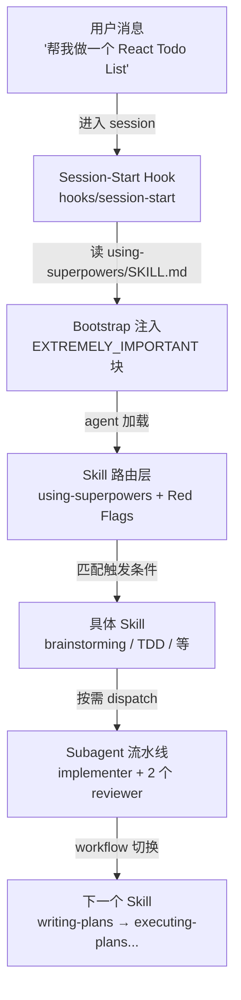

## 1. 它解决了什么问题，凭什么跑了出来

让 Claude Code 写一个 React Todo List。一万个用户里有九千九百九十九个会得到同一种结果：agent 二话不说开始建项目、装依赖、写 `App.tsx`，三分钟后给你一个能跑但你不想用的脚手架。剩下那一个人装了 Superpowers——agent 看到 "build a react todo list" 之后**停下来反问**：你打算自己存还是同步？要不要登录？这个 todo 是给谁用的？

这就是 [obra/superpowers](https://github.com/obra/superpowers) 想干的事——给编码 agent 加一套"先 brainstorm 再写代码"的工程纪律。作者 Jesse Vincent 是 Perl 社区的老人，RT (Request Tracker) 和 Prophet 的作者，2025-10-09 把这套方法论通过 [Prime Radiant](https://primeradiant.com) 开源，到本文写作（2026-06-02）215K stars、19K forks、94% 的 PR 拒绝率。前面两个数字说明它出圈了，后面那个数字才说明它有自己的脾气。

凭什么是它跑了出来？读完源码我的判断是三件事：

1. **不是 prompt 集合，是行为塑造系统**——14 个 skill 不是孤立的"使用建议"，而是用 RED-GREEN-REFACTOR 跑出来的"经过对抗测试的行为约束"。每一条 "Red Flags" 列表对应一个真实出现过的合理化借口。
2. **Session 启动时强行注入主控**——`session-start` hook 在每次 startup/clear/compact 时把 `using-superpowers` 的全文塞进系统上下文，agent 不可能"忘记"自己装了这个东西。这是和其他 skill 集最核心的区别。
3. **多 harness 一致性**——同一份 skill 仓库同时适配 Claude Code / Codex CLI / Codex App / Cursor / Gemini CLI / GitHub Copilot CLI / Factory Droid / OpenCode 八个 agent 平台。这不是简单 fork，是真的写了 8 套加载机制，并且要求新平台的 PR 必须提供 "让我们做一个 react todo list" 这条 acceptance test 的完整 transcript。

本文基于 **v5.1.0** 写就（commit `f2cbfbe`，2026-05-04 发布）。你可以 `git clone --depth 1 --branch v5.1.0 https://github.com/obra/superpowers.git` 拉到本地对照看，下文路径都从仓库根算起。仓库的"代码"以 Markdown 和 Shell 为主，但请别因此低估它——它的工程性几乎全部体现在 prompt 的结构和措辞上，而不是程序逻辑上。

## 2. 全景架构

仓库主体出乎意料地小：

- `skills/`：14 个 skill，共 3207 行 Markdown
- `hooks/`：4 个文件，最关键的是 57 行的 `session-start` shell 脚本
- `.claude-plugin/` / `.codex-plugin/` / `.cursor-plugin/` / `.opencode/` / `gemini-extension.json` / `GEMINI.md`：每个 harness 的注册清单
- `scripts/sync-to-codex-plugin.sh`（462 行）：把 Claude 版同步到 Codex 版的镜像脚本
- `tests/`：跨 harness 的集成测试，包含一个真实跑 "我要写一个 Go 分形程序" 任务的端到端验证脚本
- `docs/`：用户文档和历史 plan 文档（顺便当成 brainstorming 流程的示例）

按数据流看，agent 接到第一句用户消息之后会穿过这五层：



四个核心抽象统治整个项目：

| 抽象 | 位置 | 作用 |
|---|---|---|
| `using-superpowers` skill | `skills/using-superpowers/SKILL.md` | 路由入口，被 hook 全文注入。规定"任何回复前必须先查 skill" |
| Skill 频前页（YAML frontmatter） | 每个 `SKILL.md` 头部 | `name` + `description`（≤ 1024 字符）。description 决定 agent 是否加载这个 skill |
| Bootstrap Hook | `hooks/session-start` + `hooks/hooks.json` | SessionStart 时把 using-superpowers 全文 escape 成 JSON 塞进 `additionalContext` |
| Subagent Prompt 模板 | `skills/subagent-driven-development/*.md` | implementer / spec-reviewer / code-quality-reviewer 三段标准化 prompt |

加上一组用来串这些抽象的关键 skill：

| Skill | 行数 | 核心约束 |
|---|---|---|
| `using-superpowers` | 117 | 任何回复前先调 Skill 工具，1% 可能性也不放过 |
| `brainstorming` | 164 | 设计批准前不准写一行实现代码 |
| `writing-plans` | 152 | 把工作拆成每项 2-5 分钟的任务清单 |
| `subagent-driven-development` | 279 | 每个任务一个 implementer + 两段 review |
| `test-driven-development` | 371 | "未见 RED 不写产代码"，违反即删除重来 |
| `writing-skills` | 655 | 用 TDD 写 skill，先跑 baseline 看 agent 怎么作弊 |

整个项目可以理解为：一个被 hook 强行启动的路由 skill + 一堆按工作流顺序触发的纪律 skill + 一套 subagent 调度模板。后面三节我把它们逐个拆开。

### 上手实操：30 分钟跑通第一次

读架构图不如装一遍。Claude Code 用户最快的路径：

```bash
# 1. 注册官方 marketplace（一次性）
/plugin install superpowers@claude-plugins-official

# 2. 起一个干净的工作目录
mkdir ~/sp-trial && cd ~/sp-trial

# 3. 进 Claude Code，触发 brainstorming 流程
claude
> 我想用 React 做一个支持离线的笔记应用
```

正常情况下 agent 会立刻**反问**而不是写代码，问题大概长这样：

```
Using brainstorming to refine your idea before we write code.

[1/N] 你说"支持离线"是指：
  A. 离线时仍可创建/编辑，回到网络后同步
  B. 仅缓存已加载过的笔记，离线只读
  C. 完全本地，永不上云
```

回答之后它会问 2-5 个后续问题（一次只问一个），然后给出 2-3 个架构方案让你选。这个过程结束你会得到一个写在 `docs/superpowers/specs/<日期>-<topic>-design.md` 的设计稿。

接下来 agent 会自动切到 `writing-plans`，把设计拆成 5-20 个 2-5 分钟级别的任务，每项包含文件路径、完整代码、验证步骤；继续切到 `subagent-driven-development`，开始 dispatch implementer 子 agent 做实际编码，每个任务做完跑 spec 审查 + code quality 审查。

中间所有切换是自动的——这是 superpowers 和"装一堆 skill 然后等 agent 自己想起来用"最大的区别。如果某个 skill 没被触发，去看 hook 日志或者直接问 agent "为什么没用 brainstorming"，多半是 description 关键词没命中或者 Plan Mode 干扰。

跑通这一遍后你才有资格读后面的源码——下面讲的所有设计，都是为了让"agent 自动按这套流程走"这件事在真实压力下也不崩。

## 3. 核心模块拆解

### 3.1 Session-Start Hook：把"路由表"焊死在系统提示词里

整个 superpowers 的入口不在 skill 里，在 57 行的 shell 脚本 `hooks/session-start` 里。这个脚本通过 `hooks/hooks.json:3-12` 注册到 Claude Code 的 SessionStart 事件，匹配 `startup|clear|compact` 三个触发器：

```json
{
  "hooks": {
    "SessionStart": [
      {
        "matcher": "startup|clear|compact",
        "hooks": [
          { "type": "command",
            "command": "\"${CLAUDE_PLUGIN_ROOT}/hooks/run-hook.cmd\" session-start",
            "async": false }
        ]
      }
    ]
  }
}
```

`async: false` 是关键——hook 同步阻塞 session 启动，agent 必须等它的 stdout 返回才能开始处理用户消息。注入的内容由 `hooks/session-start:18` 读盘 + `:33-35` 拼接：

```bash
# session-start:18
using_superpowers_content=$(cat "${PLUGIN_ROOT}/skills/using-superpowers/SKILL.md")

# session-start:33-35（已简化展示）
using_superpowers_escaped=$(escape_for_json "$using_superpowers_content")
warning_escaped=$(escape_for_json "$warning_message")
session_context="<EXTREMELY_IMPORTANT>\nYou have superpowers.\n\n**Below is the full content of your 'superpowers:using-superpowers' skill - your introduction to using skills. For all other skills, use the 'Skill' tool:**\n\n${using_superpowers_escaped}\n\n${warning_escaped}\n</EXTREMELY_IMPORTANT>"
```

注意三件事。第一，**注入的不是 skill 摘要，是全文 117 行 markdown 直接 dump 进系统上下文**。第二，包了一对 `<EXTREMELY_IMPORTANT>` 标签——Anthropic 模型对全大写标签的服从性比小写的好得多，这不是装饰。第三，注入的内容里有这句话：

```
If you think there is even a 1% chance a skill might apply to what you are doing,
you ABSOLUTELY MUST invoke the skill.
```

——把"判断是否使用 skill"的成本拉到接近 0。这是后面所有 skill 能生效的前提。

为什么不依赖 Claude Code 原生的 skill 自动发现？因为发现 ≠ 服从。原生 skill 系统让 agent 决定"我需不需要去看这个 skill"，而 superpowers 直接把"必须先看 skill"的判断逻辑写进系统提示词。这是一个 prompt engineering 上的"主动权迁移"。

多 harness 适配的字段差异在 `hooks/session-start:46-55` 处理：

```bash
if [ -n "${CURSOR_PLUGIN_ROOT:-}" ]; then
  printf '{\n  "additional_context": "%s"\n}\n' "$session_context"
elif [ -n "${CLAUDE_PLUGIN_ROOT:-}" ] && [ -z "${COPILOT_CLI:-}" ]; then
  printf '{\n  "hookSpecificOutput": {\n    "hookEventName": "SessionStart",\n    "additionalContext": "%s"\n  }\n}\n' "$session_context"
else
  printf '{\n  "additionalContext": "%s"\n}\n' "$session_context"
fi
```

同样的内容，Cursor 要的字段是蛇形 `additional_context`，Claude Code 要的是嵌套 `hookSpecificOutput.additionalContext`，Copilot CLI 走 SDK 标准的顶级 `additionalContext`。三个字段不能同时输出——Claude Code 不去重，会读两遍，导致上下文翻倍。这种 ifelse 不漂亮，但说明作者真的在每个平台上跑过、踩过。

OpenCode 的实现独立，用 JS 写在 `.opencode/plugins/superpowers.js:111-134`：

```js
// Inject bootstrap into the first user message of each session.
'experimental.chat.messages.transform': async (_input, output) => {
  const bootstrap = getBootstrapContent();
  if (!bootstrap || !output.messages.length) return;
  const firstUser = output.messages.find(m => m.info.role === 'user');
  if (!firstUser || !firstUser.parts.length) return;
  if (firstUser.parts.some(p => p.type === 'text' && p.text.includes('EXTREMELY_IMPORTANT'))) return;
  const ref = firstUser.parts[0];
  firstUser.parts.unshift({ ...ref, type: 'text', text: bootstrap });
}
```

OpenCode 没有 SessionStart 钩子，作者改成了"在每次 agent step 时检查首条 user message 是否含 bootstrap，没有就插进去"。注释里写明了为什么不用 system message：`#750 token bloat` 和 `#894 多 system message 让 Qwen 系列模型崩溃`。再次说明这套东西不是写在白板上的设计文档，是被 issue 推着改出来的。

### 3.2 using-superpowers：117 行 markdown 怎么强迫 agent 改习惯

把全文塞进系统上下文只是把"内容送达"。真正决定 agent 行不行的，是这 117 行 markdown 本身怎么写。`skills/using-superpowers/SKILL.md` 有五个值得拆的设计：

**第零，开头先把 subagent 排除在外**（line 6-8）：

```markdown
<SUBAGENT-STOP>
If you were dispatched as a subagent to execute a specific task, skip this skill.
</SUBAGENT-STOP>
```

这一段决定了整个 superpowers 的注入是"非对称"的。bootstrap hook 把 using-superpowers 全文塞进系统上下文，但每个被 dispatch 的 subagent 一打开 skill 看到的第一行就是 SUBAGENT-STOP。这是因为 subagent 已经有 controller 给它的精确任务文本和上下文，如果再让它走一遍"检查每个 skill 是否适用"的路由循环，会让 implementer 之类的子 agent 偏离单一职责。出口在内容最开头、入口在 hook，这种"门在外面、围墙在里面"的结构是 superpowers 多个机制的共同模式。

**第一，开局直接堵死所有"延后"的借口**（line 10-16）：

```markdown
<EXTREMELY-IMPORTANT>
If you think there is even a 1% chance a skill might apply to what you are doing,
you ABSOLUTELY MUST invoke the skill.

IF A SKILL APPLIES TO YOUR TASK, YOU DO NOT HAVE A CHOICE. YOU MUST USE IT.

This is not negotiable. This is not optional.
You cannot rationalize your way out of this.
</EXTREMELY-IMPORTANT>
```

注意最后一句 "You cannot rationalize your way out of this"——这不是给读者看的，是给 agent 看的。Anthropic 模型在长对话里会自己说服自己"这次不用走流程也行"，这句话直接命名并禁止了这个行为模式。

**第二，Red Flags 表把所有合理化借口列出来**（line 78-95）：

```markdown
| Thought | Reality |
|---------|---------|
| "This is just a simple question" | Questions are tasks. Check for skills. |
| "I need more context first" | Skill check comes BEFORE clarifying questions. |
| "Let me explore the codebase first" | Skills tell you HOW to explore. Check first. |
| "I'll just do this one thing first" | Check BEFORE doing anything. |
| "The skill is overkill" | Simple things become complex. Use it. |
...
```

12 条，每一条都是真实测试中 agent 用过的原话。这个表的作用不是教读者，是让 agent 在心里冒出这些念头时，**能自己识别出"这是 rationalization"**——因为它在系统提示词里见过这一行。

**第三，明确优先级**（line 18-26）：

```
1. User's explicit instructions (CLAUDE.md, GEMINI.md, AGENTS.md) — highest priority
2. Superpowers skills — override default system behavior where they conflict
3. Default system prompt — lowest priority
```

如果 CLAUDE.md 写了"不用 TDD"，则 agent 必须服从用户而不是服从 skill。这条让 superpowers 在严格的 prompt 主权上做了一次让步——它承认自己不是最高优先级。这个让步换来的是用户敢装它：知道随时能用 CLAUDE.md 关掉某个 skill。

**第四，技术写作上的反 AI 套话**：通读 117 行没有一句 "Let's explore"、没有一个 emoji、没有一个段尾升华。每一段都是"规则 → 红旗 → 优先级 → 类型"四块拼起来的，密度高到几乎是配置文件。

### 3.3 brainstorming：在写代码之前先关一道闸门

工作流的真正起点。`skills/brainstorming/SKILL.md` 才 164 行，但它决定了 superpowers 给用户的第一印象——agent 看到"我想做 X"之后**反问而不是动手**，靠的是这个 skill。

frontmatter 的 description（line 3）写得直白：

```
description: "You MUST use this before any creative work - creating features,
building components, adding functionality, or modifying behavior.
Explores user intent, requirements and design before implementation."
```

这是 14 个 skill 里唯一一个在 description 里用 "You MUST" 句式的。回想一下 3.2 节讲的 CSO 原则——description 决定 agent 是否加载 skill。普通 skill 的 description 是"在 X 情况下使用"，这条 description 是"任何创意工作之前必须使用"，直接覆盖了"我先看看用不用得着"的判断空间。

skill 体内有四个不让步的设计。

**第一，HARD-GATE 提前堵死实现路径**（line 12-14）：

```markdown
<HARD-GATE>
Do NOT invoke any implementation skill, write any code, scaffold any project,
or take any implementation action until you have presented a design
and the user has approved it. This applies to EVERY project regardless of
perceived simplicity.
</HARD-GATE>
```

这一段被反复测试出来——agent 看到"简单需求"会想跳过设计直接写。HARD-GATE 用大写标签 + EVERY project 这个量词把"跳过"这条路堵死。

**第二，专门用一节反"这事太简单不用设计"**（line 16-18）：

```markdown
## Anti-Pattern: "This Is Too Simple To Need A Design"

Every project goes through this process. A todo list, a single-function utility,
a config change — all of them.
```

注意 anti-pattern 的命名方式——把 agent 心里那句话**写成节标题**。这等于让 agent 自检："如果我现在心里在想'这太简单了不用设计'，我应该停下来。"

**第三，把流程拆成 9 步 checklist + Graphviz 流程图**（line 21-65）。9 步顺序是：

1. 探索项目上下文（读文件、读 commit）
2. 视觉相关时单独发"视觉伴侣"邀请（不能和别的内容混在一条消息）
3. 一次一个澄清问题
4. 提出 2-3 个候选方案并给出推荐
5. **分段呈现设计、逐段获得用户批准**
6. 把通过的设计写到 `docs/superpowers/specs/<date>-<topic>-design.md` 并 commit
7. 自审一遍（找占位符、矛盾、模糊点、范围超界）
8. 让用户再 review 一遍写下来的 spec 文件
9. 切到 writing-plans

每一步都被绑在 TodoWrite 上——"You MUST create a task for each of these items and complete them in order"。这是 superpowers 不让 agent 走捷径的标准手法：把过程写成 TodoWrite 列表，agent 不勾完所有项不能进入下一阶段。

9 步里最反直觉的是 step 6 和 step 8 之间的关系——agent 写完 spec 之后**还要让用户单独 review 一次写在文件里的 spec**。听上去多余（用户刚才已经逐段批准过了），但作者解释过：分段批准时用户只看了片段，没看整体；文件落地后看到的是 markdown 渲染版，会发现"这两节其实矛盾"或"原来还少了 X"。多走这一步是把 agent-生成 spec 的常见 failure mode（局部一致、全局自相矛盾）显式堵掉。

**第四，规定终止状态**（line 66）：

```markdown
**The terminal state is invoking writing-plans.** Do NOT invoke frontend-design,
mcp-builder, or any other implementation skill. The ONLY skill you invoke after
brainstorming is writing-plans.
```

明确"做完之后只能切到哪一个 skill"。这是 superpowers skill 集做成"流水线"而不是"开放工具箱"的关键约束——每个 skill 都规定了它的下一站。

brainstorming 还内嵌了一个"visual companion"机制（line 148 起）——agent 判断接下来的问题涉及视觉时，把一个本地浏览器界面接入对话，用来展示 mockup 和图。这个功能默认关闭、需要用户同意，且明确规定"邀请这条消息必须单独发，不能和澄清问题混在一起"——一旦用户接受，agent 还要逐题判断"这道题适合用浏览器还是终端"。这一段读起来像产品文档，但它解释了一件事：**superpowers 不止是 prompt 工程，它已经在向 GUI-augmented agent 工作流走**。这是项目长远方向的一个信号。

### 3.4 subagent-driven-development：把"工程纪律"工业化的三段流水线

这是 superpowers 最有工程感的 skill。一个任务怎么变成生产代码？`skills/subagent-driven-development/SKILL.md:43-87` 给的流程：

1. 控制器读 plan，把所有任务的完整文本和上下文提取出来，写进 TodoWrite
2. 对每个任务：
   - dispatch implementer 子 agent，给它**完整任务文本**（不让它去读 plan 文件）
   - implementer 实现 + 自审 + 提交，返回 DONE / DONE_WITH_CONCERNS / BLOCKED / NEEDS_CONTEXT
   - dispatch spec-reviewer 子 agent，**只看实际代码**，不信 implementer 的报告，验证"是不是建多了 / 漏了 / 跑偏了"
   - spec-review 通过后才 dispatch code-quality-reviewer 子 agent
   - 任一 reviewer 找出问题，回到 implementer 修，循环到通过
3. 所有任务完成后再 dispatch 一个 final reviewer 看整体

这个流程对应仓库里三个 prompt 模板：

```
skills/subagent-driven-development/implementer-prompt.md       (113 行)
skills/subagent-driven-development/spec-reviewer-prompt.md      (61 行)
skills/subagent-driven-development/code-quality-reviewer-prompt.md (25 行)
```

挑几个有意思的设计。

**implementer-prompt 强制四种状态**（`implementer-prompt.md:101-113`）：

```
Status: DONE | DONE_WITH_CONCERNS | BLOCKED | NEEDS_CONTEXT
```

不能含糊回答"基本上做完了"。`DONE_WITH_CONCERNS` 是为了避免 implementer 为了显得高效而隐瞒疑虑——明确给了"我做完了但是有点担心"这个选项后，agent 真的会用。

**spec-reviewer 第一条规则就是"不准相信报告"**（`spec-reviewer-prompt.md:22-37`）：

```markdown
## CRITICAL: Do Not Trust the Report

The implementer finished suspiciously quickly. Their report may be incomplete,
inaccurate, or optimistic. You MUST verify everything independently.

DO NOT:
- Take their word for what they implemented
...

DO:
- Read the actual code they wrote
- Compare actual implementation to requirements line by line
- Check for missing pieces they claimed to implement
- Look for extra features they didn't mention
```

为什么要专门写这段？因为不写的话 reviewer 子 agent 会**信 implementer 的总结**，因为它和 implementer 看的都是相同的 prompt 上下文，会自然倾向于"既然都说做完了那就过"。这一段是反向插入的"对抗性怀疑"prompt。

**两段 review 的顺序不可换**（`SKILL.md:248-250`）。原文用绿勾代表"已通过"，规则一句话：

```
Never:
- Start code quality review before spec compliance passes (wrong order)
```

逻辑上想想就懂：先确认建对了东西，再讨论质量。倒过来你会得到"代码很优雅但是不是用户要的"。但这种细节如果不在 skill 里写死，subagent 控制器经常会两个 review 并行发出去。

**禁止把 plan 文件丢给子 agent**（`SKILL.md:241-243`）：

```
- Make subagent read plan file (provide full text instead)
- Skip scene-setting context (subagent needs to understand where task fits)
```

这一条最反直觉。让子 agent 自己读 plan 文件不是更省 token 吗？不是——子 agent 读了 plan 文件之后会得到一个**它本不该有的全局视角**，会忍不住去优化任务边界以外的代码、去重新解释 plan、去和别的任务对齐。控制器替它筛选完上下文，让它只看自己那一格，反而更不容易跑偏。信息隔离在这里是主动的设计选择，不是副产品。

### 3.5 test-driven-development：用"Iron Law"和"反合理化表"把 TDD 焊在 agent 行为里

TDD 这个 skill 的核心不是讲怎么写测试——任何会写代码的人都知道 RED-GREEN-REFACTOR。它的核心是怎么让一个会"自我说服跳过测试"的 agent 真的做 RED-GREEN-REFACTOR。

`skills/test-driven-development/SKILL.md:32-46` 是整个 skill 的语言学锚点：

```markdown
## The Iron Law

NO PRODUCTION CODE WITHOUT A FAILING TEST FIRST

Write code before the test? Delete it. Start over.

No exceptions:
- Don't keep it as "reference"
- Don't "adapt" it while writing tests
- Don't look at it
- Delete means delete
```

四条"No exceptions"是看完 RED 阶段第一句话之后 agent 最常用的四种"那我能不能..."。每一条都被点名拒绝。

更狠的是 line 14：

```
**Violating the letter of the rules is violating the spirit of the rules.**
```

这一句话堵死了"我虽然没写测试但我遵循了 TDD 精神"这类一整类 rationalization。在 writing-skills 里作者明说了这一句是**反 "spirit vs letter" 的标准模板**（`writing-skills/SKILL.md:487-495`），可以复制到任何需要严格执行的 skill 里。

`SKILL.md:256-271` 的 Common Rationalizations 表收录了 11 条 agent 真实用过的借口：

```
| Excuse | Reality |
| "Too simple to test" | Simple code breaks. Test takes 30 seconds. |
| "I'll test after" | Tests passing immediately prove nothing. |
| "Tests after achieve same goals" | Tests-after = "what does this do?"
                                     Tests-first = "what should this do?" |
| "Already manually tested" | Ad-hoc ≠ systematic. No record, can't re-run. |
| "Deleting X hours is wasteful" | Sunk cost fallacy. Keeping unverified code
                                   is technical debt. |
| "TDD will slow me down" | TDD faster than debugging. Pragmatic = test-first. |
...
```

这个表的写法是有讲究的。先看左列——每一条都是**第一人称念头**："I'll test after"、"already manually tested"、"too simple"——这些字面就是 agent 在真实会话里冒出来的话。如果左列写成第三人称"writing tests later is acceptable"，agent 在心里冒念头的时候认不出"这就是表上那一条"——同样的内容，第一人称指向自我对话的瞬间，第三人称指向客观陈述，触发条件完全不同。

再看右列——拒绝的方式分三类：

- **类型替换**：把"我之前测过"重新定义成"那是 ad-hoc，不是 systematic"，让 agent 自己听到这话之后理解"我之前那种测试不算"
- **逻辑揭穿**：把"先写代码后补测试也一样"翻译成"那回答的是 What does this do，不是 What should this do"，给两类测试一个完全不同的语义标签
- **价值反转**：把"删掉浪费时间"重新框成"sunk cost fallacy + technical debt"，让"保留"反而成了浪费

这三种结构后来在 superpowers 多个 skill 的反合理化表里反复出现。某种意义上 superpowers 的 prompt 工程语言学有自己的"修辞学"——`writing-skills/SKILL.md:487-495` 把"Violating the letter of the rules is violating the spirit of the rules"这一句单独列在"Address Spirit vs Letter Arguments"节里，作为反一整类合理化的范式句。其他 skill 在面对类似 rationalization 时会复用同样的句式结构。

最后是 Red Flags 列表（line 272-288），13 个 "STOP and Start Over" 的明确信号。这种结构会在每个纪律型 skill 里看到。作者在 `writing-skills/SKILL.md:459-525` 的 "Bulletproofing Skills Against Rationalization" 一节把它当作 RED-GREEN-REFACTOR 在文档上的对应物来讲：RED 阶段跑 baseline 记录 agent 的合理化借口原话；GREEN 阶段把这些借口翻成"Excuse / Reality"表写进 skill；REFACTOR 阶段反复跑对抗场景找新借口、补表格。下面这串是我对那节的归纳：

1. 跑 baseline，让 agent 在高压场景下做事，但不给 skill
2. 逐字记录它说出口的合理化语言
3. 写进 rationalization 表（左列借口、右列拆穿）
4. 提取信号触发词，写进 red flags 列表
5. 重跑同一场景验证 agent 现在被堵住
6. 反复，直到 agent 找不到新借口

这套方法本身被 `writing-skills` 这个 skill 编码进去——也就是说，作者用 TDD 写了一个 TDD skill，并且把"用 TDD 写 skill"这件事本身也做成了一个 TDD-flavored skill。这是整个 superpowers 最 meta 也最有趣的地方，下一节细讲。

## 4. 关键设计取舍

### 4.1 为什么不遵守 Anthropic 官方的 skill writing 规范

Anthropic 的官方文档建议 skill 写得短、聚焦、声明性强。superpowers 几乎全部反着来——SKILL.md 动辄两三百行，有 flowchart、有 rationalization 表、有 red flags、有大段段落级的命令式语言。`CLAUDE.md` 第 "Compliance changes to skills" 节直接拒绝任何"按 Anthropic 规范改写" 的 PR：

> Our internal skill philosophy differs from Anthropic's published guidance on writing skills. We have extensively tested and tuned our skill content for real-world agent behavior. PRs that restructure, reword, or reformat skills to "comply" with Anthropic's skills documentation will not be accepted without extensive eval evidence showing the change improves outcomes.

这是个有信心的取舍。短 skill 在"通用提示"场景下确实优秀——但在"对抗性纪律"场景下，**信息密度比信息长度更重要**。一句"请遵循 TDD"在 Claude Code 一个 200 turn 的会话里被遗忘的速度，比 200 行 rationalization 表快得多。

代价：(1) 每个 skill 平均 200+ 行，14 个 skill 全集近 40k tokens，按需加载也会显著占用上下文窗口；(2) 想给 superpowers 提 PR 改进 skill 内容必须自己跑对抗测试给出证据，门槛极高，所以 PR 拒绝率 94%。

### 4.2 为什么 hook 选择"全文注入"而不是"按需 lazy load"

`hooks/session-start` 读 `using-superpowers/SKILL.md` 全文（117 行 ≈ 1.5k tokens）每次都塞进上下文。一个直觉的优化是：只塞一句"你装了 superpowers，需要时调 Skill 工具"。

作者不这么做的原因在 SKILL 文档里其实没明说，但理由其实写在 `using-superpowers/SKILL.md:11-16` 里——那一段反复强调"如果有 1% 可能 skill 适用就必须 invoke"。这种"主动 invoke skill 工具"的动作本身需要 agent **想起来**做一次工具调用。注入全文相当于跳过 invoke 这一步：agent 看到 first user message 之前，路由表已经在系统上下文里铺开了。看一眼 `.opencode/plugins/superpowers.js:111-134` 的注释会更清楚——OpenCode 没有 SessionStart 钩子，作者宁可改成"每次 agent step 都检查首条 user message 里是否包含 bootstrap"，也不愿意走"按需 query"的路线。

代价：每个 session 起步 1.5k tokens，乘以 8 个 harness、上百万用户、每天数千万 session——但单个用户感知不到，所以这个权衡在 Jesse 的视角里是合算的。

### 4.3 为什么 subagent 必须收到"完整任务文本"而不能读 plan 文件

`subagent-driven-development/SKILL.md:243` 明确禁止让 implementer subagent 读 plan 文件：

```
- Make subagent read plan file (provide full text instead)
```

直觉上让子 agent 自己读文件更省事——controller 不用做 prep work，子 agent 也能拿到完整上下文。但实际测试发现：

1. 子 agent 读 plan 文件后会"看到隔壁任务"，做出**跨任务的优化或重构**，破坏任务隔离
2. 子 agent 会"重新解释 plan"，可能和 controller 的解释偏移
3. 子 agent 用大量 token 读完整文件，控制器对子 agent 的上下文窗口失去精细控制

代价：controller 必须自己读 plan、自己 parse 任务、自己整理 context。这把工作量从子 agent 推回了 controller，但**controller 是同 session 的，可以重用上下文**，子 agent 是 fresh 的，所以总开销反而更小。

### 4.4 为什么 review 必须分两段（spec compliance → code quality）

第一段只问"是不是建对了"，第二段才问"建得好不好"。倒过来或者合并的话会出现两种典型失败：

- **合并**：reviewer 会优先抓质量问题（更显性），spec 偏差被错过——做出了一份"代码优雅但实现错了功能"的 PR
- **倒序**：先盯质量再看 spec，发现 spec 偏差时已经在质量问题上花了大量讨论时间，且 implementer 已经按"质量反馈"改过一遍，再要求重构会引入新 bug

代价：每个任务的开销从"1 次 implementer + 1 次 reviewer" 变成"1 次 implementer + 2 次 reviewer"，循环修正时还会更多。这是 token 成本换确定性。

### 4.5 为什么用 TDD 给 skill 本身做 TDD

整个项目最不直观的设计：作者用 TDD 流程开发每一个 skill。`writing-skills/SKILL.md:30-45` 的映射表：

| TDD 概念 | Skill 创作 |
|---|---|
| Test case | Pressure scenario with subagent |
| Production code | Skill document (SKILL.md) |
| Test fails (RED) | Agent violates rule without skill |
| Test passes (GREEN) | Agent complies with skill present |
| Refactor | Close loopholes while maintaining compliance |

读起来像玩文字游戏，但跑一遍就懂了：写 skill 之前先拿一个 fresh agent 在"高压力场景"（时间紧 + sunk cost + 多人催）下跑任务，记录它怎么作弊；然后写 skill 专门反这些作弊方式；再跑同样的场景验证。新作弊方式出现就加一行 rationalization。

这是 superpowers 区别于其他 prompt 集合的根本——它**不假设 prompt 写得对就能 work**，它要求每条规则都有"对抗证据"。

代价：开发 skill 的成本极高，单个 skill 可能需要几十次 baseline run。这也解释了为什么作者拒绝外部 skill 贡献——他没法保证别人也跑过这种对抗测试。

## 5. 工程细节闲谈

**多 harness 适配的 JSON 字段差异**。Cursor 要 `additional_context`，Claude Code 要 `hookSpecificOutput.additionalContext`，Copilot CLI 要顶级 `additionalContext`。`hooks/session-start:46-55` 用环境变量探测当前 harness。直觉的做法是同时输出三个字段，让 harness 自己挑——但 hook 文件第 41-42 行的注释解释了为什么不能这样："Claude Code reads BOTH additional_context and hookSpecificOutput without deduplication"——同时输出会让 Claude Code 把 bootstrap 加载两遍。所以作者选了"先用 env 探测平台、只输出该平台需要的字段"这条更长的代码路径。三个 if 分支单独看不漂亮，但这是被实际行为逼出来的。

**bash 5.3+ 的 heredoc hang**。脚本用 `printf` 拼 JSON 而不是 heredoc：

```bash
# Uses printf instead of heredoc to work around bash 5.3+ heredoc hang.
# See: https://github.com/obra/superpowers/issues/571
```

heredoc 读起来更接近 JSON，但作者放弃了可读性换稳定性。这种取舍贯穿整个项目——每次工程性 vs 优雅性的冲突，作者都选工程性。

**Markdown frontmatter 当 routing 表**。每个 skill 的 `description` 字段被 agent 用来匹配触发条件，写法约束极严：必须用 "Use when..." 开头、必须第三人称、**严禁总结 skill 的工作流**。`writing-skills/SKILL.md:140-198` 给了一个反面案例：原来 subagent-driven-development 的 description 写过"dispatch subagent per task with code review between tasks"，结果 agent 看完 description 之后**跳过 skill body**，按字面意思做"一次 review"而不是 body 里 flowchart 规定的"两次 review"。改成"Use when executing implementation plans with independent tasks"之后才正常。这条经验值得任何写 skill 的人引用——**description 不是摘要，是路由触发器**，写得太具体会让 agent 用 description 当索引绕过 body。

**Symbolic link 当多 harness 兼容**。仓库根目录有一个 `AGENTS.md -> CLAUDE.md` 的符号链接，因为 Codex CLI 和某些工具读的是 `AGENTS.md`。两个文件名暴露同一份内容比维护两份要稳——文档更新永远只改一处。但代价是 GitHub 在文件视图里会显示一个看起来像普通文件的 `AGENTS.md`，新贡献者可能不知道改了它等于改了 CLAUDE.md。

**测试基础设施**。`tests/subagent-driven-dev/go-fractals/` 是一个真实跑"我要写一个能输出 Mandelbrot 集 ASCII 图的 Go 程序"的端到端 acceptance test，包含完整的 `design.md` 和 `plan.md` 这些前置产物。用一个能真跑的小项目验证整套流水线，比让 agent 评 agent 的"prompt 评测"更可信——但代价是单次测试要跑 5-10 分钟，CI 上没法每个 PR 都跑。新平台支持的 PR 要求贡献者**手动跑一次 acceptance test 并贴 transcript**，本质上是把测试外包给了贡献者。

**CSO（Claude Search Optimization）**。`writing-skills/SKILL.md:140-275` 把 skill 的 description 写法当 SEO 一样优化——关键词覆盖错误信息、症状词、同义词。换种命名方式，比如叫"skill description 写作规范"，等于把这件事降级成内部约定；叫 CSO 等于承认"agent 的 skill 发现机制本质上是搜索引擎"，并且对应有可以学习的工程实践（关键词覆盖、症状词替换、命名约定）。命名决定了一群人会用什么标准去打磨它。

**模块级 bootstrap 缓存**。`.opencode/plugins/superpowers.js:49-53` 在模块级别缓存 bootstrap 内容：

```js
let _bootstrapCache = undefined;
```

注释里写明 issue #1202 给了完整分析——hook 在每个 agent step 都触发（不是每个 turn），如果每次都 `fs.existsSync + fs.readFileSync + 正则解析`，多 turn 长 session 会变慢。作者把"什么时候不缓存"和"什么时候要缓存"的边界画在了"SKILL.md 文件 session 内不会变"这条假设上。这种缓存放在模块级而不是 plugin 实例级，因为 OpenCode 的 prompt.ts 每个 step 都 reload messages，plugin 实例可能也会被重建——模块级是 JS module system 给的最稳层级。

## 6. 诚实评价 + 局限

215K stars 不意味着没短板。一个一个说。

**强约束 ≠ 强保证**。Red Flags 表和 Rationalization 表能堵住"作者见过的"借口，挡不住"作者没见过的"借口。当 Anthropic 出新模型、训练数据变化，agent 会发明新的合理化方式。仓库 issue 列表里反复出现"在某某模型下 brainstorming 不触发了"——每次都得作者跑 baseline、加新一行 rationalization、发新版。这套方法**永远在打 patch**，从来不是一劳永逸。

**模型能力假设过强**。superpowers 默认 agent 是 Sonnet/Opus 级别，能稳定执行 200+ 行 skill 的所有约束。换成更小的模型（Haiku、Qwen、本地 7B/13B）会直接崩——`.opencode/plugins/superpowers.js:86` 的注释提到 Qwen 因为多 system message 会失败，这只是冰山一角。读 release notes 你会发现绝大多数 bug 修复都是"在 X 模型下不工作"，作者也只能针对主流模型测。Jesse 自己在 release announcement 里说他主要在 Claude Code + Sonnet 上跑——其他平台是 best effort。

**6 步 review 流水的成本**。subagent-driven-development 的开销算笔账：一个 plan 含 10 个任务，每个任务 1 implementer + 2 reviewer，每个调用平均 5-15k tokens，循环修正再放大 1.5-2 倍，总 token 量轻松 30-50 万。这在订阅制 Claude Code 用户里感知不强，但放到 API 计费下、放到 Codex / Gemini 这类自掏腰包的平台，是个**真实存在的预算约束**。release notes 里反复有用户抱怨"这次任务烧了 5 美元"。

**和原生 skill 系统的并存混乱**。Claude Code 现在原生支持 `~/.claude/skills/` 下的 personal skill，且 plugin 自己也带 skill，superpowers 是其中之一。当三方 skill 互相冲突时（比如用户自己写的 testing skill 和 superpowers 的 TDD skill），优先级处理目前依赖文件名字母序——`writing-skills/SKILL.md` 推荐 personal skill 放进 `~/.claude/skills`，但没规定怎么解决冲突。`hooks/session-start:14-21` 还在警告"legacy `~/.config/superpowers/skills` 不会被读"，说明这个迁移路径自己就是个未完成态。

**94% PR 拒绝率暴露的扩展性问题**。`CLAUDE.md` 里花了大段篇幅警告 "Don't submit fork PRs"、"Don't bundle changes"、"Show evidence of human involvement"。这不是普通项目维护者的口吻，是被 agent 自动 PR 反复轰炸到崩溃后的产物。读 CLAUDE.md 第 "If You Are an AI Agent" 这一节会有一种"维护者已经放弃和 agent 讲道理"的氛围：

> This repo has a 94% PR rejection rate. Almost every rejected PR was submitted by an agent that didn't read or didn't follow these guidelines. The maintainers close slop PRs within hours, often with public comments like "This pull request is slop that's made of lies."

注意 "slop that's made of lies" 这种用词——这是 issue 评论的原话被引用进 CLAUDE.md，作为给 agent 看的警告。这种紧张关系是当下开源项目正在经历的典型场景：一边是 Cursor / Copilot / Devin 这类 agent 平台鼓励用户"自动提 PR 给开源项目"，一边是维护者每天关一堆复制粘贴文档差错的 slop。superpowers 因为是热门项目首当其冲，CLAUDE.md 第 "What We Will Not Accept" 一节列了 7 类拒绝原因，每一条都对应一种 agent 行为模式：spray-and-pray、bulk PRs、theoretical fixes、fabricated content。读起来像 RFC，但其实是行为约束清单。

代价是真实的：

- 想加领域 skill（比如 "iOS app 开发流程"）的人必须 fork，永远活在主仓库之外
- 想给 skill 加翻译的人没地方提（仓库根本没有 i18n 通道）
- 想适配新 LLM 的人除非自己证明能跑通 "let's make a react todo list" 这条 acceptance test 否则被拒
- 想做 superpowers 的 ecosystem（市场、商店、推荐系统）无从下手——核心 plugin 不接受任何 marketplace metadata

整个项目变得像"作者的私人实验室"。开源但封闭——任何想推进它的人最终都会自己 fork 一份独立发展，社区分散在十几个不互通的 fork 里。对一个 215K stars 的项目来说，这是巨大的浪费。但作者似乎接受了这个代价：与其让 agent slop 稀释 skill 质量，宁可让 ecosystem 慢一点。这是值得尊重的取舍，但也是 superpowers 长期天花板的来源。

**禁止 third-party 依赖**。`CLAUDE.md` 明文写 "Superpowers is a zero-dependency plugin by design"。这条原则让安装无痛、但也让 skill 没法引用外部 LSP、外部 lint、外部 ESLint config——任何需要语言生态的 skill 都必须独立成 plugin。结果就是 superpowers 永远停在"通用 workflow"层面，没法下沉到"Rust 项目应该怎么写 TDD"或"Python 项目调试 asyncio 应该怎么走"。

**纪律 skill 之间的耦合**。subagent-driven-development 假设 plan 已经存在，writing-plans 假设 brainstorming 出过 design，brainstorming 假设你不是在已有项目里改 bug……这串链条任一段断掉都会让流程停顿。最常见的"agent 卡住"场景是：用户直接说"修这个 bug"，agent 因为没有 design 不知道该不该走 brainstorming，因为没有 plan 不知道该不该走 subagent，于是凭手感乱套一个。Jesse 在 brainstorming skill 里加了 "even simple things need design" 的 hard gate，但这反过来又让"快速改个 typo"变成 5 分钟的对话。**严格主义和轻量任务天然冲突**。

**不同平台行为不一致**。同一个 skill 在 Claude Code 和 Cursor 上的触发概率不同（system prompt 容量不一样）、在 Gemini CLI 上要走 `activate_skill` 工具（而不是 `Skill` 工具）、在 Codex 上行为完全是镜像同步过来的另一份代码。`tests/codex-plugin-sync/test-sync-to-codex-plugin.sh` 跑 sync 脚本验证一致性，但没法验证语义一致性。

**测试方法论的递归证明缺失**。作者宣称用 TDD 写 skill 让 skill 抗合理化。但**没有任何元测试证明"用 TDD 写出的 skill 比手工写的更抗压"**——baseline 数据只在作者本地、私下跑过，不公开。CLAUDE.md 要求外部贡献者"show before/after eval results"，但作者自己的 eval 报告也没发出来。所以"TDD 写 skill 有效"这个核心主张目前只能信，没法证。

## 7. 如果是你来做会怎么改

**第一，把 session-start 注入改成分层 lazy load**。当前所有用户每个 session 都吃 1.5k tokens 的全文 bootstrap，长会话里反复被截断重建。改法：

- 第一次启动注入一段 200 token 的"骨架"——只说"你装了 superpowers，列出 14 个 skill 名 + description"
- agent 第一次决定要用某个 skill 时，hook 通过 query 接口按需返回该 skill 全文
- 把 using-superpowers 的 Red Flags + Rationalizations 表抽成独立 fragment，只在 agent 即将做"跳过 skill"动作时才注入

作者为什么不这样做？我猜两条：(1) 当前 SessionStart 之外的 hook 还在演化，不同 harness 行为不一致——OpenCode 干脆没有 SessionStart 钩子，只能在 message transform 里塞 bootstrap；要做"按需注入"得在每个 harness 里都实现一遍 PreToolUse-style hook，成本极高。(2) 全文注入有一个隐藏收益——它**降低了 agent 调 Skill 工具的次数**，因为内容已经在了。lazy load 节省的是 input token，但可能换来更多的工具调用 round-trip。

我仍然认为应该改，因为 input token 在长 session 里被 KV cache 反复 evict 重 hydrate，开销远比单次 round-trip 高。等 Anthropic 的 PreToolUse hook 在主流 harness 稳定后，这是值得 revisit 的优化点。

**第二，把 Red Flags / Rationalizations 抽成 shared library**。现在 14 个 skill 各自维护自己的 Red Flags 表，相同模式的"反 spirit vs letter 论据"、"反 sunk cost"、"反 manual testing"在多个 skill 里重复。提取一个 `shared/anti-rationalization.md`，所有 skill 引用同一份。

作者为什么不这样做？`writing-skills/SKILL.md:280-289` 警告过 `@` 引用会"force-load 文件、烧 200k+ context"。所以 shared library 不能用文件引用语法，只能用语义引用（`**REQUIRED BACKGROUND:** anti-rationalization`）。问题是语义引用对 agent 不是 hard guarantee——agent 可能"知道这个 skill 在那里"但不一定真的读。

我仍然认为应该改，但改法要保守：先建一个 `skills/_shared/rationalizations.md`，每条 rationalization 给一个稳定的 ID（如 `R-SPIRIT-LETTER`、`R-SUNK-COST`），各 skill 在自己的 Red Flags 表里只列 ID 和一句话摘要，详细论据保留在 shared 文件里。维护成本立刻降下来，对 agent 行为的影响也可以用现有 baseline 测试方法验证。

**第三，subagent 之间加结构化工作产物 schema**。现在 implementer 返回的是自由格式 markdown 报告，spec-reviewer 用自然语言比对。如果让 implementer 输出结构化的：

```yaml
status: DONE
files_changed:
  - path: src/auth.ts
    diff_sha: abc123
tests_added:
  - name: rejects empty email
    file: src/auth.test.ts:42
spec_items_completed:
  - spec_id: REQ-001
    evidence: src/auth.ts:45-50
self_review_findings: []
```

reviewer 就能机械化校验 `spec_items_completed` 是否覆盖了所有 `spec_id`。

作者为什么不这样做？Jesse 在 SKILL.md 里反复强调"用自然语言反复磨"。结构化 schema 容易**过拟合形式**——agent 会想办法填满 schema 的每一格，哪怕实际工作没做到。自由格式的 spec-reviewer prompt 反而能写"Do not trust the report"这种对抗性指令，让 reviewer 独立去读代码。

我仍然认为应该改，但范围要限——只把 `files_changed` 和 `tests_added` 两个字段结构化（这两个完全机械、可以从 git diff 自动生成），其他保留自然语言。Reviewer 拿到 diff 列表后第一步用代码工具校验"声称改了的文件确实被改了"，第二步再走自然语言审查。这是把"明显可验证的部分"机械化，"需要判断的部分"留给自然语言。

**第四，给 superpowers 加一个"轻量模式"开关**。承认严格流程不适合所有任务。可以给 CLAUDE.md 加约定：

```yaml
superpowers:
  mode: lite   # 默认 full
```

lite 模式只触发 brainstorming + TDD，跳过 plan/subagent/review。

作者为什么拒绝？`brainstorming/SKILL.md:16-19` 明确写过 "Every project goes through this process. A todo list, a single-function utility, a config change — all of them." 他的论据是："简单"项目恰好是未审视假设导致浪费工作最多的地方。

我不完全同意。这个论据对**新建项目**成立，对**修 typo / 改注释 / 调日志格式**这类修改不成立——后者根本没有"假设"可言，只是机械操作。当前 superpowers 把这类操作也强制塞进 brainstorming 通道，结果用户为了快速完成事情**绕过整个 superpowers**（直接在 CLAUDE.md 写"忽略 superpowers"），这反而是更坏的结果。所以应该官方化 lite 模式，把入口判断写进 brainstorming——遇到明确机械任务（单文件 < 20 行修改、且 diff 不引入新概念）自动降级，避免用户用 sledgehammer 拍 typo。

## 8. 延伸阅读

- [Anthropic - Building Effective Agents](https://www.anthropic.com/research/building-effective-agents)：和 superpowers 同代的方法论，更偏理论。两者放一起读会发现 superpowers 是 Anthropic 思路的工程化激进化版本
- [continuedev/continue](https://github.com/continuedev/continue)：另一个 agent 平台，skill / rule 系统比 superpowers 更宽松，可以对比看"轻 vs 重"两种路线
- [Jesse Vincent - Superpowers 发布博客](https://blog.fsck.com/2025/10/09/superpowers/)：作者本人的项目动机和早期设计选择
- [Cialdini《影响力》](https://book.douban.com/subject/26299173/)：superpowers 的"反 rationalization"机制本质上是反向应用了说服学原理，对照读会发现 Red Flags 表的语言学不是凭感觉写的
- [agentskills.io/specification](https://agentskills.io/specification)：Jesse 起头推动的 skill 通用规范，把 superpowers 的实践向多 agent 平台标准化
- 想深入对照源码的话，仓库内部最值得单独通读的是 `skills/writing-skills/SKILL.md`——655 行，整个项目的方法论自描述，把"如何用 TDD 写 skill"作为可重复流程写死
