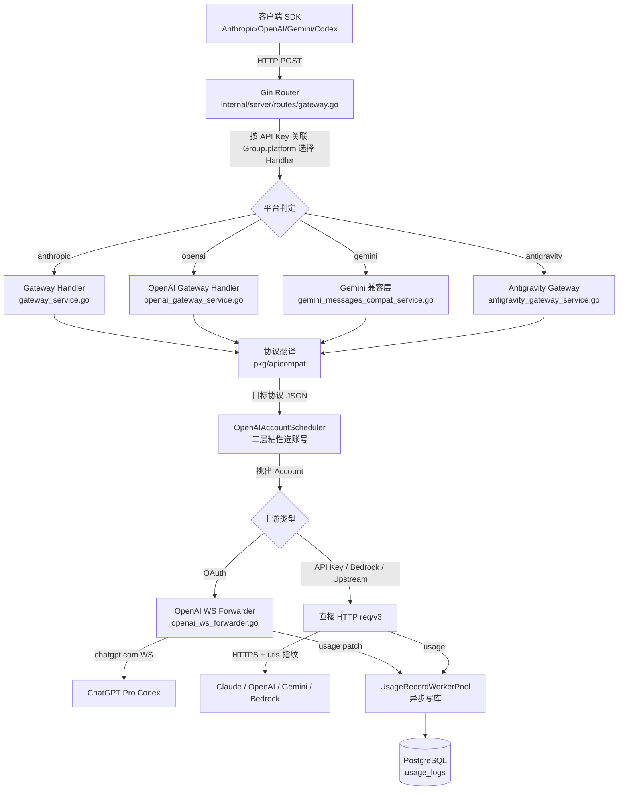

## 1. 它解决了什么问题，凭什么跑了出来

2026 年的 LLM 订阅市场有两个明摆着的事实。

第一，最新最强的模型几乎都先以**订阅**的形式发布，不发 API key。Claude Opus 4.7、GPT-5.5、Gemini 3.1 Pro 这一拨，要么只在订阅版的 Claude Code / Codex / Gemini CLI 里能用，要么在 ChatGPT Pro 这种独占套餐里。买 API token 的开发者拿到的永远是次一档。

第二，订阅卖的是"个人坐席"，但对工程师来说，一个 200 美元的 Pro 订阅一个人用不完。同事四五个人合用，或者一个小团队的脚本和评测台共享一个高级订阅，是非常自然的需求。

第 1 章讲过 CLIProxyAPI 怎么把 CLI 的 OAuth 翻成 API，那个方向解决的是"我一个人，本地用"。但要把订阅资源**做成给一群人用的 SaaS**，要的东西完全不止协议翻译：

- 用户管理、API Key 发放、配额限制
- 多账号池调度、429/529 冷却、failover
- token 级计费、定价表更新、订阅模式 vs 按量模式
- 支付集成（支付宝 / 微信 / Stripe）
- 多协议入站（Anthropic / OpenAI / Gemini / Codex）
- 反爬应对（utls 模拟客户端的 TLS 指纹）

[Wei-Shaw/sub2api](https://github.com/Wei-Shaw/sub2api) 是当下把这件事做得最完整的一个。本文写就时（2026-06-02）24.9K stars、4.8K forks、3700+ 个 commit、121 个 release，最新 tag `v0.1.133` 是 5 天前发的。后端 Go + Ent ORM + PostgreSQL + Redis，前端 Vue3 + Vite，后端代码库整整 65 万行 Go——其中 ent 生成代码约 22 万行、手写业务逻辑约 24 万行、测试约 19 万行。规模上已经远超第 1 章那种"协议翻译路由"型项目，是一个有完整业务模型的开源 SaaS。

凭什么读它？读完源码我的判断是三件事：

1. **三层粘性的账号调度**——`previous_response_id` 续聊优先 / `session_hash` 会话粘性 / `load_balance` 加权随机评分，三档兜底兜得很有意思，调度热点账号问题处理得专业
2. **WS 桥接 ChatGPT Pro**——`openai_ws_forwarder.go` 4327 行一个文件，把 ChatGPT 内部那一套半私有的 WebSocket 协议反编译成对外的 OpenAI Responses HTTP API，对每个 OAuth session 做了多租户隔离
3. **三层并发刷新锁**——`oauth_refresh_api.go` 用进程内锁 + Redis 分布式锁 + DB 重读，三层防御同一 refresh token 被多副本重复消费

下面三件事既是它做得对的地方，也是这个领域真正难的地方，第 1 章那种"单进程 / 单用户"的玩具实现碰都碰不到。

本文基于 **v0.1.133** 这个 tag（commit `68901cb`，2026-05-29 发布的 pricing 元数据更新）写就。所有源码引用锁定到这个版本，可以 `git clone --branch v0.1.133 https://github.com/Wei-Shaw/sub2api.git` 拉到本地对照看。下文路径全部从 `backend/` 这个目录算起（前端不在本文范围内）。

## 2. 全景架构

从代码量分布大致可以看出这个项目的重心在哪（行数都是手写业务逻辑，不含测试）：

- `internal/service/`：业务核心，单文件大户密集。`gateway_service.go` 9916 行、`openai_gateway_service.go` 6880 行、`antigravity_gateway_service.go` 4540 行、`openai_ws_forwarder.go` 4327 行
- `internal/repository/`：Ent ORM 仓储层，`usage_log_repo.go` 4582 行（usage log 是个大表）
- `internal/handler/`：HTTP handler，admin / gateway / auth 三大块
- `internal/pkg/`：可复用工具包，里面藏着几个有意思的子模块——`apicompat`（协议翻译）、`oauth` / `openai/oauth` / `geminicli/oauth` / `antigravity/oauth`（4 套 OAuth client）、`tlsfingerprint`（utls JA3 指纹模拟）
- `internal/server/routes/`：Gin 路由注册
- `internal/middleware/`：API Key 鉴权、限流、CORS
- `internal/payment/`：EasyPay / 支付宝 / 微信 / Stripe 适配
- `ent/schema/`：数据库 schema，30+ 个实体
- `cmd/server/`：入口 + google/wire 依赖注入

按数据流看，一次推理请求穿过下面几层：



四个统治抽象贯穿全项目：

| 抽象 | 位置 | 作用 |
|---|---|---|
| `Account` | `ent/schema/account.go` | 一个上游凭证（OAuth / setup-token / apikey / upstream / bedrock / service_account），存 platform、credentials JSONB、调度状态、冷却时间 |
| `Group` | `ent/schema/group.go` | 一组账号 + 一套计费规则 + platform 路由开关，API Key 必须绑分组 |
| `APIKey` | `ent/schema/api_key.go` | 用户拿到的对外 key，绑用户、绑分组，独立配额、5h/1d/7d 三档限流窗口 |
| `OpenAIAccountScheduler` | `internal/service/openai_account_scheduler.go` | 调度入口，三层粘性策略选 Account |

数据模型里的 `Account` 把"账号"抽象到这个程度（`ent/schema/account.go:50-196`）：

```go
field.String("platform"),         // anthropic / openai / gemini / antigravity
field.String("type"),             // oauth / setup-token / apikey / upstream / bedrock / service_account
field.JSON("credentials", ...),   // 由 type 决定的结构
field.JSON("extra", ...),         // 平台特定扩展
field.Int("concurrency"),         // 单账号并发上限
field.Int("priority"),            // 优先级，越小越优先
field.Float("rate_multiplier"),   // 账号侧计费倍率
field.Bool("schedulable"),        // 是否参与调度（refresh 中会临时置 false）
field.Time("rate_limited_at"),
field.Time("rate_limit_reset_at"),    // 429 恢复时间
field.Time("overload_until"),         // 529 过载解除时间
field.Time("temp_unschedulable_until"), // 临时熔断时间
field.Time("session_window_start"),
field.Time("session_window_end"),     // Claude Pro 的 5h session window
```

这是核心。所有调度逻辑、所有冷却策略、所有熔断都围着这十来个字段转。下面三节把它们拆开看。

## 3. 核心模块拆解

### 3.1 三层粘性调度：从 OpenAI Responses 续聊场景倒推出来的设计

OpenAI 在 GPT-5 之后把 Responses API 推成主力，这个 API 的会话状态是**服务端持久**的：客户端拿到一个 `response.id`，下一轮在 `previous_response_id` 字段里把它带回去，上游就接着上次的状态继续 reasoning。这给代理层埋了一个坑——**`previous_response_id` 是哪个上游账号生成的，下一轮就必须打到同一个账号**，否则上游找不到这个 id 直接 404。

sub2api 的调度策略就是从这个约束倒推出来的，写成了三层降级（`internal/service/openai_account_scheduler.go:21-23`）：

```go
const (
    openAIAccountScheduleLayerPreviousResponse = "previous_response_id"
    openAIAccountScheduleLayerSessionSticky    = "session_hash"
    openAIAccountScheduleLayerLoadBalance      = "load_balance"
)
```

入口在 `Select` 方法里（`openai_account_scheduler.go:254-324`）按顺序试三次：

```go
// Layer 1: previous_response_id 已经粘到具体账号，必须用回这个账号
selection, err := s.service.selectAccountByPreviousResponseIDForCapability(...)
if selection != nil && selection.Account != nil {
    decision.Layer = openAIAccountScheduleLayerPreviousResponse
    return selection, decision, nil
}
// Layer 2: 会话粘性（按客户端传的 session_id 哈希）
selection, err = s.selectBySessionHash(ctx, req)
if selection != nil && selection.Account != nil {
    decision.Layer = openAIAccountScheduleLayerSessionSticky
    return selection, decision, nil
}
// Layer 3: 负载均衡 + 加权随机
selection, ..., err = s.selectByLoadBalance(ctx, req)
decision.Layer = openAIAccountScheduleLayerLoadBalance
return selection, decision, nil
```

Layer 2 的 sticky session 实现藏在一个独立文件 `internal/service/openai_sticky_compat.go`，里面有个细节值得拎出来：

```go
// internal/service/openai_sticky_compat.go:39-49
func deriveOpenAISessionHashes(sessionID string) (currentHash string, legacyHash string) {
    normalized := strings.TrimSpace(sessionID)
    if normalized == "" {
        return "", ""
    }
    currentHash = fmt.Sprintf("%016x", xxhash.Sum64String(normalized))
    sum := sha256.Sum256([]byte(normalized))
    legacyHash = hex.EncodeToString(sum[:])
    return currentHash, legacyHash
}
```

同一个 sessionID 同时算出**新格式**（xxhash 16 字节）和**老格式**（SHA256 64 字节）两个哈希。新格式是为了让 Redis key 更短，但已经在线运行的请求会带着旧格式的 hash 进来，所以 `getStickySessionAccountID`（同文件 122 行）写成了**双读降级**：先按新 key 查，查不到再按老 key 查；写入时通过 `openAISessionHashDualWriteOldEnabled()` 开关决定要不要同时写两份。这是一个真在线上做过 hash 算法升级的人才写得出来的代码。

Layer 3 的负载均衡不是简单的轮询。`selectByLoadBalance` 里给每个候选账号算一个综合分（`openai_account_scheduler.go:682-703`），由五个因子加权而成：

```go
priorityFactor := 1.0
if maxPriority > minPriority {
    priorityFactor = 1 - float64(item.account.Priority-minPriority)/float64(maxPriority-minPriority)
}
loadFactor := 1 - clamp01(float64(item.loadInfo.LoadRate)/100.0)
queueFactor := 1 - clamp01(float64(item.loadInfo.WaitingCount)/float64(maxWaiting))
errorFactor := 1 - clamp01(item.errorRate) // EWMA 错误率
ttftFactor := 0.5
if item.hasTTFT && hasTTFTSample && maxTTFT > minTTFT {
    ttftFactor = 1 - clamp01((item.ttft-minTTFT)/(maxTTFT-minTTFT))
}
item.score = weights.Priority*priorityFactor + weights.Load*loadFactor +
             weights.Queue*queueFactor + weights.ErrorRate*errorFactor + weights.TTFT*ttftFactor
```

五个因子全部归一化到 `[0, 1]`：优先级、当前并发负载率、等待队列长度、EWMA 错误率、首字延迟 TTFT。算完分之后并没有直接挑 max，而是选 TopK 个候选，再在 TopK 里做加权随机。这一步避免了"分最高的账号永远第一个被选中"导致它单点过载——把"挑最优"和"散热"分成两步。

账号挂没挂用一个统一的 `IsSchedulable()` 判断（`internal/service/account.go:116-137`）：

```go
func (a *Account) IsSchedulable() bool {
    if !a.IsActive() || !a.Schedulable {
        return false
    }
    now := time.Now()
    if a.AutoPauseOnExpired && a.ExpiresAt != nil && !now.Before(*a.ExpiresAt) {
        return false
    }
    if a.OverloadUntil != nil && now.Before(*a.OverloadUntil) {              // 529 过载
        return false
    }
    if a.RateLimitResetAt != nil && now.Before(*a.RateLimitResetAt) {        // 429 限流
        return false
    }
    if a.TempUnschedulableUntil != nil && now.Before(*a.TempUnschedulableUntil) { // 临时熔断
        return false
    }
    if a.IsAPIKeyOrBedrock() && a.IsQuotaExceeded() {
        return false
    }
    return true
}
```

注意这里**没有用定时探针主动 ping 上游**做健康检查，而是依赖每次调度路径上的 `IsSchedulable` 检查。优势是省运维成本，代价是"账号挂了多久才被发现"取决于流量——零流量账号永远显示健康。这是一个值得讨论的取舍，第 6 节再展开。

调度还有一道闸是并发槽位（`internal/service/concurrency_service.go:165`）：

```go
func (s *ConcurrencyService) AcquireAccountSlot(ctx context.Context, accountID int64, maxConcurrency int) (*AcquireResult, error) {
    if maxConcurrency <= 0 {
        return &AcquireResult{Acquired: true, ReleaseFunc: func() {}}, nil
    }
    requestID := generateRequestID()
    acquired, err := s.cache.AcquireAccountSlot(ctx, accountID, maxConcurrency, requestID)
    if err != nil {
        return nil, err
    }
    if acquired {
        return &AcquireResult{
            Acquired: true,
            ReleaseFunc: func() {
                bgCtx, cancel := context.WithTimeout(context.Background(), 5*time.Second)
                defer cancel()
                _ = s.cache.ReleaseAccountSlot(bgCtx, accountID, requestID)
            },
        }, nil
    }
    return &AcquireResult{Acquired: false, ReleaseFunc: nil}, nil
}
```

底层是 Redis 的 Sorted Set，成员是 `requestID`、score 是时间戳。比单纯 counter 强在两点：能后台定时清理超时槽位（防止 panic 之后槽位泄露），能区分谁占着哪个槽（便于诊断）。账号并发槽满了之后，请求转入等待队列（`maxWait = userConcurrency + 20`），超过等待上限直接 fail-fast；Redis 不可用时 fail-open（让请求走，不卡死）——这两条策略的方向都对。

### 3.2 协议翻译矩阵与 ChatGPT WS 桥接

入站协议的支持靠 Gin 路由的"按 group.platform 动态分发"实现（`internal/server/routes/gateway.go:44-50`）：

```go
gateway.POST("/messages", func(c *gin.Context) {
    if getGroupPlatform(c) == service.PlatformOpenAI {
        h.OpenAIGateway.Messages(c)
        return
    }
    h.Gateway.Messages(c)
})
```

同一个 URL（`/v1/messages`），客户端那边一直当 Anthropic API 用，但服务端根据"这把 API Key 关联的 Group 的 platform"是 anthropic 还是 openai，分发给不同的 handler。背后是同一个 SDK 既能用 Claude 也能透明用 GPT。OpenAI 走 `OpenAIGateway.Messages`，里面把 Anthropic 风格请求翻成 OpenAI Responses API 调上游。这个 in-place 翻译在 `internal/pkg/apicompat/` 实现，里面有 8 个生产文件（另有 3 个测试文件），覆盖六个方向：

- `anthropic_to_responses.go` / `anthropic_to_responses_response.go`：Anthropic Messages ↔ OpenAI Responses
- `chatcompletions_to_responses.go` / `responses_to_chatcompletions.go`：ChatCompletions ↔ Responses
- `responses_to_anthropic.go` / `responses_to_anthropic_request.go`：反向
- `chatcompletions_responses_bridge.go`：流式响应的桥接

挑 `AnthropicToResponses` 看一段（`internal/pkg/apicompat/anthropic_to_responses.go:13` 起）：

```go
func AnthropicToResponses(req *AnthropicRequest) (*ResponsesRequest, error) {
    // ... 输入转换 ...
    out := &ResponsesRequest{
        Model:   req.Model,
        Input:   inputJSON,
        Stream:  req.Stream,
        Include: []string{"reasoning.encrypted_content"},
    }
    if !isReasoningModel(req.Model) {
        out.Temperature = req.Temperature
        out.TopP = req.TopP
    }
    storeFalse := false
    out.Store = &storeFalse  // 关掉服务端持久（Claude 那边没这个概念）
    out.Reasoning = &ResponsesReasoning{
        Effort:  mapAnthropicEffortToResponses(effort),
        Summary: "auto",
    }
    return out, nil
}
```

两个细节有点意思：一是只在**非推理模型**时才把 `temperature/top_p` 透传（gpt-5.x 这种 reasoning 模型不接受这两个参数）；二是显式 `Store = false`，因为 Anthropic 客户端不知道 OpenAI 还有 `store` 这个概念，避免上游意外把对话留底。

但 sub2api 最特别的部分不是协议翻译，是 `internal/service/openai_ws_forwarder.go` 这 4327 行的 WebSocket 桥接。它存在的理由是：**ChatGPT Pro 不开放 HTTP 形式的 Responses API**，Codex CLI 实际是用 WebSocket 连 `wss://chatgpt.com/backend-api/codex/responses` 推送和接收事件。sub2api 把 ChatGPT 这条 WS 上游桥成了对外的标准 OpenAI Responses HTTP API，对每个 OAuth session 做了多租户隔离：

```go
// internal/service/openai_ws_forwarder.go:1131-1158 (路径示意)
if account != nil && account.Type == AccountTypeOAuth {
    apiKeyID := getAPIKeyIDFromContext(c)
    if sessionResolution.SessionID != "" {
        headers.Set("session_id", isolateOpenAISessionID(apiKeyID, sessionResolution.SessionID))
    }
    if sessionResolution.ConversationID != "" {
        headers.Set("conversation_id", isolateOpenAISessionID(apiKeyID, sessionResolution.ConversationID))
    }
}
if account != nil && account.Type == AccountTypeOAuth {
    if chatgptAccountID := account.GetChatGPTAccountID(); chatgptAccountID != "" {
        headers.Set("chatgpt-account-id", chatgptAccountID)
    }
    headers.Set("originator", resolveOpenAIUpstreamOriginator(c, isCodexCLI))
}
```

这段代码做的事是：把客户端传来的 `session_id` 和 `conversation_id` 跟 `apiKeyID` 拼起来做哈希，再当作给上游的 session_id 用。`isolateOpenAISessionID` 的实现很简单（`openai_gateway_service.go:935`）：

```go
func isolateOpenAISessionID(apiKeyID int64, raw string) string {
    raw = strings.TrimSpace(raw)
    if raw == "" {
        return ""
    }
    h := xxhash.New()
    _, _ = fmt.Fprintf(h, "k%d:", apiKeyID)
    _, _ = h.WriteString(raw)
    return fmt.Sprintf("%016x", h.Sum64())
}
```

`apiKeyID` 加前缀的设计保证了哪怕两个用户客户端传过来一模一样的 `session_id`，上游看到的也是不同的 16 字符哈希。同一个 ChatGPT 账号被三个不同用户分时复用时，三个用户的 session 在上游是完全隔离的，不会出现"用户 A 看到用户 B 的消息历史"。`chatgpt-account-id` 和 `originator` 这两个 header 都是 Codex CLI 实际握手时会发的，不发上游就拒收。

WS 重连这一块的设计也值得展开。`classifyOpenAIWSErrorEventFromRaw`（`openai_ws_forwarder.go:4191`）把上游回的 error event 按 `code/type/message` 三个字段分类，返回 `(分类标签, retryable bool)`：

```go
switch code {
case "upgrade_required":
    return "upgrade_required", true
case "websocket_not_supported", "websocket_unsupported":
    return "ws_unsupported", true
case "websocket_connection_limit_reached":
    return "ws_connection_limit_reached", true
case "invalid_encrypted_content":
    return "invalid_encrypted_content", true
case "previous_response_not_found":
    return "previous_response_not_found", true
}
if isOpenAIWSRateLimitError(codeRaw, errTypeRaw, msgRaw) {
    return "upstream_rate_limited", false
}
// ... 还有针对 msg 字符串的兜底匹配 ...
```

每一类对应一种处理策略：

- **`upgrade_required` / `ws_unsupported`**：当前账号的 Codex CLI 版本上游不接受了，标记账号需要 `temp_unschedulable`、调度切下一个
- **`ws_connection_limit_reached`**：该账号的 WS 连接配额满了（ChatGPT Pro 对单账号并发 WS 数有限），冷却几分钟再用
- **`invalid_encrypted_content`**：之前 Codex 给的 `reasoning.encrypted_content` 失效，sticky 的 previous_response_id 也跟着失效，需要清理客户端缓存
- **`previous_response_not_found`**：sticky 失效，触发特殊恢复（`ws_forwarder.go:2985` 一带）——清掉 `previous_response_id` 之后向同账号重放一次请求，让上游开新一轮 turn 而不是接续；如果还失败，再降级到 Layer 3 调度
- **`upstream_rate_limited`**：返回 retryable=false，因为重试同账号没意义，必须 failover 到下一个账号。这一行还会调 `persistOpenAIWSRateLimitSignal` 把 rate limit 信号落库（如果上游返回了 `retry-after` 或 5h reset window，记下来给调度器用）

重连用退避（120ms → 2s）+ 重试预算控制（`retryBudget` 跟踪从最初请求开始累计耗时，超出预算直接放弃避免耗光客户端端到端超时）。每次重试要在 `attempt < maxAttempts` 且 `retryBudget > 0` 的双重门内。这是个常见但实现时容易写漏的模式——很多反爬代理只看 attempt 数，结果端到端 timeout 早过了客户端断开连接还在重连，浪费上游配额。

Failover 在 `OpenAIGatewayService` 的请求路径上判定（`openai_gateway_service.go:4503-4530` 路径示意）：

```go
shouldDisable := s.handleOpenAIAccountUpstreamError(
    c.Request.Context(), account, resp.StatusCode, resp.Header, body, modelForCooldown,
)
kind := "http_error"
if shouldDisable {
    kind = "failover"
}
if shouldDisable {
    return nil, &UpstreamFailoverError{
        StatusCode:             resp.StatusCode,
        RetryableOnSameAccount: account.IsPoolMode() && account.IsPoolModeRetryableStatus(resp.StatusCode),
    }
}
```

上游 429/503/`instructions_are_required` 这一类错误会同时做两件事：把当前账号置 cooldown（Layer 2/3 调度时会跳过），并向上抛 `UpstreamFailoverError` 触发外层换账号重试。

### 3.3 OAuth 复用 CLI Client ID + token 三层并发刷新

要把订阅当 API 卖，第一道关是搞到 access token。sub2api 选了一条**最便宜也最容易被掐**的路：直接复用上游官方 CLI 的 OAuth Client ID。

```go
// internal/pkg/oauth/oauth.go:19
ClientID = "9d1c250a-e61b-44d9-88ed-5944d1962f5e"

AuthorizeURL = "https://claude.ai/oauth/authorize"
TokenURL     = "https://platform.claude.com/v1/oauth/token"

ScopeOAuth = "org:create_api_key user:profile user:inference user:sessions:claude_code user:mcp_servers user:file_upload"
```

```go
// internal/pkg/openai/oauth.go:19
ClientID = "app_EMoamEEZ73f0CkXaXp7hrann"

AuthorizeURL = "https://auth.openai.com/oauth/authorize"
TokenURL     = "https://auth.openai.com/oauth/token"

DefaultRedirectURI = "http://localhost:1455/auth/callback"
DefaultScopes = "openid profile email offline_access"
```

`9d1c250a-...` 是 Claude Code CLI 自己注册并写死在 CLI 源码里的 OAuth Client ID，`app_EMoamEEZ73f0CkXaXp7hrann` 是 Codex CLI 的。这两个 ID 是公开抓得到的（CLI 工具本来就跑在用户机器上），sub2api 直接拿来用，意味着 OAuth 流程跟 Anthropic / OpenAI 服务器握手时，对方看到的客户端身份**和 Claude Code / Codex CLI 完全一致**。

PKCE 走标准 S256（`internal/pkg/oauth/oauth.go:150` 和 `159`）：

```go
func GenerateCodeVerifier() (string, error) {
    bytes, err := GenerateRandomBytes(32)
    if err != nil { return "", err }
    return base64URLEncode(bytes), nil
}

func GenerateCodeChallenge(verifier string) string {
    hash := sha256.Sum256([]byte(verifier))
    return base64URLEncode(hash[:])
}
```

`scope` 也照搬 Claude Code 自己的——`user:sessions:claude_code` 这种 scope 名字暴露了一切。

身份就位之后真正难的是**token 刷新的并发安全**。一个账号被多副本调用，每个副本独立检测到 token 快过期、独立发起 refresh，会出现两个问题：一是 refresh token 是一次性的，并发消费会让其中一个 worker 拿到 `invalid_grant`；二是多个 worker 同时拿到新 token 写回 DB，最后一次写覆盖前面的，前面那个 worker 手里的 token 写完就过期。

sub2api 在 `internal/service/oauth_refresh_api.go:75` 的 `RefreshIfNeeded` 里写了三层防御：

```go
func (api *OAuthRefreshAPI) RefreshIfNeeded(
    ctx context.Context,
    account *Account,
    ...
) (*Account, error) {
    // 第一层：进程内 sync.Map + Mutex
    localMu := api.getLocalLock(cacheKey)
    localMu.Lock()
    defer localMu.Unlock()

    // 第二层：Redis 分布式锁（lockTTL 默认 60s）
    if api.tokenCache != nil {
        acquired, lockErr := api.tokenCache.AcquireRefreshLock(ctx, cacheKey, api.lockTTL)
        if !acquired {
            // 别人正在刷，等几下读 DB
            ...
        }
        defer api.tokenCache.ReleaseRefreshLock(ctx, cacheKey)
    }

    // 第三层：DB 重读，可能别人刚刷完
    freshAccount, _ := api.accountRepo.GetByID(ctx, account.ID)
    if tokenWasJustRefreshed(freshAccount, account) {
        return freshAccount, nil
    }

    // 真的轮到我刷
    newToken, err := api.doRefresh(ctx, freshAccount)
    if isInvalidGrant(err) {
        // 第四层：竞争恢复
        // 拿到 invalid_grant，说明上一秒别的 worker 已经消费掉这个 refresh_token
        // 重读 DB，如果 token 已变就当成功返回，否则才报错
        ...
    }
    ...
}
```

三层锁加上 `invalid_grant` 的竞争恢复路径，覆盖了：单进程内多 goroutine 撞同账号、多副本撞同账号、Redis 短暂不可用降级到进程锁、分布式锁释放后但 DB 写入未完成的窗口期。这套机制在写 SaaS 的人看来是标准答案，但能把答案写完整、还写到测试里的项目不多。

token 刷新的调度是后台定时跑（`internal/service/token_refresh_service.go:122-178`）：默认每 5 分钟扫一次（`token_refresh.check_interval_minutes`，可在 yaml 里配置），把"剩余有效期 < `RefreshBeforeExpiryHours`"（默认 6 小时）的账号挑出来批量 refresh。失败按错误类型分流：可重试错（5xx、network）走指数退避（最多 3 次），不可重试错（`invalid_grant`、`invalid_client`）直接标记账号 `status=error`，重试耗尽就 `temp_unschedulable` 10 分钟避免重复扣费。

最后一块是 TLS 指纹模拟，在 `internal/pkg/tlsfingerprint/dialer.go`：

```go
// internal/pkg/tlsfingerprint/dialer.go:55-100 一带
// Default TLS fingerprint values captured from Claude Code (Node.js 24.x)
// JA3 Hash: 44f88fca027f27bab4bb08d4af15f23e
// JA4:      t13d1714h1_5b57614c22b0_7baf387fc6ff
var (
    defaultCipherSuites = []uint16{
        0x1301, 0x1302, 0x1303,                            // TLS 1.3
        0xc02b, 0xc02f, 0xc02c, 0xc030,                    // ECDHE + AES-GCM
        0xcca9, 0xcca8,                                    // ECDHE + ChaCha20
        0xc009, 0xc013, 0xc00a, 0xc014,                    // ECDHE + AES-CBC
        0x009c, 0x009d,                                    // RSA + AES-GCM (non-PFS)
        0x002f, 0x0035,                                    // RSA + AES-CBC-SHA (legacy)
    }
    defaultCurves = []utls.CurveID{
        utls.X25519, utls.CurveP256, utls.CurveP384,
    }
)
```

写注释的人是真在抓包平台测过指纹的，连 JA3 Hash 都标了出来。整个 cipher suite 列表的顺序和数量都和 Node.js 24（Claude Code 的运行时）抓出来的指纹一致。底层用 `refraction-networking/utls` 库重写 TLS ClientHello，让 Cloudflare / OpenAI 那边的指纹检测看到的就是一个普通 Claude Code 客户端，而不是 Go 标准库的 `crypto/tls`（后者的 ClientHello 指纹和 Node.js 完全不一样，很容易被识别）。

## 4. 关键设计取舍

### 4.1 调度为什么是三层粘性而不是纯负载均衡

最直接的答案：**Responses API 的 `previous_response_id` 是服务端状态，必须粘**。Layer 1 不是性能优化，是正确性的硬约束。但 Layer 2（session_hash sticky）是性能折中——Claude 那边没有 previous_response_id 的强约束，可以纯负载均衡。但作者还是加了一层 session 粘性，目的是命中 Claude / OpenAI 的服务端缓存。Claude 的 cache control 和 OpenAI 的 prompt cache 都是按"上一次同账号的请求"算的，session 粘到同账号能让 cache hit rate 大幅提升，下游成本能压一截。

代价是：sticky session 在多账号池里会导致负载倾斜——客户端把 session_id 写死了的话，所有请求都打到同一个账号，其他账号闲着。sub2api 对此的对冲是 Layer 1/2 失败时 Layer 3 兜底（用加权随机 + TopK），但根本上没办法完全解决。第 6 节会展开讲这个。

### 4.2 协议翻译为什么用 6 个方向的显式函数而不是中间 AST

直觉上做"通用 LLM 协议网关"会建一个统一中间 AST（messages → IR → target），sub2api 没这么做，而是显式写了 6 个方向的转换函数。读完代码我的判断是这个选择**对**：

- 上游协议本身是脏的，**Anthropic 的 cache_control、OpenAI 的 reasoning effort、Codex Responses 的 encrypted_content** 这些字段在中间 AST 里要么丢失、要么得设计成 union type 包一层
- 协议演化快，OpenAI 一个月一个 API 版本，中间 AST 跟着改成本更高
- 实际上"客户端协议" × "上游协议" 的组合只有四五对热点（Anthropic→OpenAI、OpenAI→Anthropic、OpenAI→Anthropic 的 stream、Anthropic→Responses 等），每对几百行可控

但代价也明显：`apicompat/` 8 个生产文件约 6000 行核心翻译代码（另有 3 个测试文件 1600 行），重复代码不少，新增一对客户端/上游组合时是 O(n) 写新文件。当客户端协议数量上去（比如未来要支持 Cohere、xAI Grok 的私有协议），这套显式翻译会扩张得很快。

### 4.3 WS Forwarder 为什么不能用反向代理

这是我最初读到 4327 行单文件时第一反应想问的问题。读完源码后理解了：**ChatGPT 的 WS 上游是有状态、有租户、有反爬的**，纯反代做不到下面任何一件事：

1. **多租户 session 隔离**：同一个 ChatGPT 账号被三个用户共用时，三个用户的 conversation history 必须隔离，纯反代会让三个用户互相看到对方的对话
2. **失败重连**：WS 断了之后要恢复，恢复时要重新握手、重新发 `originator`、重新走 OAuth 鉴权
3. **错误分类与 failover**：上游回 `rate_limit_exceeded`，需要这个连接 abort、当前账号置 cooldown、外层切账号重试——这一整套是业务逻辑，反代不知道
4. **Header 注入**：`chatgpt-account-id` 这种 header 反代不会写，但 ChatGPT 服务器拒绝没有这个 header 的握手

这 4000 行不是过度工程，是 ChatGPT 这个上游本身就乱、就反爬、就半私有的代价。如果哪天 OpenAI 开放正式的 HTTP Responses API 给个人订阅用，这个文件可以删一半。

### 4.4 凭证存储：上游 token 似乎没加密

这是我读到的最大的工程隐患。`repository/aes_encryptor.go` 提供了 AES-256-GCM 的 `SecretEncryptor` 接口，但搜了一下 `Encrypt(` 和 `Decrypt(` 的调用方：

- `service/totp_service.go` —— TOTP 2FA 密钥（管理员账号的 TOTP）
- `service/channel_monitor_service.go` —— 监控规则配置
- `service/backup_service.go` —— 备份文件加密
- 上游账号的 `credentials.access_token` / `refresh_token` —— **没看到调用**

实际上 `accounts.credentials` 这个 JSONB 字段似乎是**明文**落 PG 的。`repository/account_repo.go` 的 `UpdateCredentials` 把 `map[string]any` 直接序列化到 JSONB，没经过 encryptor。`AESEncryptor` 的密钥本身也复用自 `cfg.Totp.EncryptionKey`，命名上就是给 TOTP 用的。（如果我的搜索路径上漏了某条通过 interface 间接调用的加密路径，欢迎在 repo issue 里指出来，文章这一节我愿意改。）

这意味着 PostgreSQL 一旦泄露（备份外流、读副本权限失误、SQL 注入），**所有订阅账号的 access token / refresh token 等同于明文交出**。对一个有 24.9K star、大量自部署用户的 SaaS 来说，这是个不小的口子。第 7 节会写"如果我来做"会怎么改这块。

### 4.5 计费精度：float64 + actual_cost > 0 当 success 代理

usage_log 表里成本字段 Go 端全是 `float64`，落库时 PostgreSQL 列是 `NUMERIC(20,8)`。中间在 Go 序列化时已经走过 float64 这一关，**长尾积累上有精度漂移**。GPT-4o-mini 这种每 token 成本到 $0.000002 量级，一次 1M token 请求成本 $2，单次没问题；但跨亿级请求做月度对账时，可能会和上游账单差几分钱到几块。

另一个偷工的地方是 success 标记。`usage_logs` 表没有 `success` bool 列，failed request 的 placeholder 写入时 `actual_cost = 0`，靠 `actual_cost > 0` 当 success 代理过滤（`repository/usage_log_repo.go:99-108`）：

```go
// usageLogSuccessFilterUL 用于把"失败请求 usage log"（tokens=0、cost=0、不计费的占位记录）
// 从统计性聚合中排除，避免污染 Dashboard / 用量拆分等指标。
//
// schema 中没有 success bool 列；新增列要做迁移，风险大；这里用 actual_cost > 0 作为代理
const usageLogSuccessFilterUL = "ul.actual_cost > 0"
```

省了一次 migration，但**等价于"零金额成功请求"无法和"失败请求"区分**。免费模型、超低单价模型、做对账时全部当失败处理掉，统计 dashboard 上的成功率偏低。注释里坦诚交代了风险，但显然不是干净的设计。

usage 写库走异步 worker pool（`internal/service/usage_record_worker_pool.go:18-31`），默认 128 worker、16K 队列、`sample` 溢出策略 10% 通过率 + 自动扩容到 512。这意味着**极端高峰下 90% 的计费记录会被丢弃**，剩 10% 同步走。在一个钱跟着记账走的系统里，这个 fail-mode 不算干净。

## 5. 工程细节闲谈

读 sub2api 的过程中有几处小细节挺有意思，单独拎出来说说。

**Cleanup 并行 + 基础设施串行**：`cmd/server/wire.go:72-305` 写了一个 305 行的 `provideCleanup`，列了 28 个应用层服务的 Stop 顺序。应用层并行 stop（用 WaitGroup），最后 Redis 和 Ent 串行关闭。这是个老派但靠谱的写法——很多开源项目 shutdown 时图省事直接 `for _, svc := range svcs { svc.Stop() }`，一个服务慢就堵死整个流程。

**Ent + google/wire**：Schema-first 的 ORM 配 compile-time DI。30+ 个实体的 schema 在 `ent/schema/` 下，wire 在 `cmd/server/wire.go` 编译期生成依赖图（`wire_gen.go` 529 行全是手注入的初始化代码）。好处是启动 0 反射、错误编译期发现；代价是改一个依赖关系要重新跑 `go generate ./...`。对一个有 OAuth 服务、定时任务、Worker Pool、Worker Goroutine 的大单体来说，wire 的"看得见的依赖图"非常救命。

**模型映射写死在 domain/constants.go**：`DefaultAntigravityModelMapping`、`DefaultBedrockModelMapping` 这两个 map 把 Claude / Gemini / OpenAI 的"客户端用模型名"→"平台真实模型 ID"的映射硬编码在常量里。优点是改起来不用改 schema、不用做 DB migration；缺点是上游新模型出来要发版才能支持。注释里写了"与前端 useModelWhitelist.ts 中的 antigravityDefaultMappings 保持一致"——前后端两份硬编码靠人肉同步，这是个迟早要出 bug 的设计。

**Setup 模式与正式服务模式**：`cmd/server/main.go:78-95` 有个挺贴心的设计——首次启动检测到 DB 里没有管理员账号时，自动进入 `runSetupServer` 启动一个临时 Gin 服务，跑 Web 安装向导（接管理员邮箱、连 PG、连 Redis、初始化 schema）。装完之后退出再起 `runMainServer`。Docker 部署时 `AutoSetupEnabled` 走环境变量直接初始化、零交互。这个细节让自部署门槛降了一大截。

**JA3 / JA4 实测**：上面 3.3 节提到 `tlsfingerprint/dialer.go` 注释里写了 `JA3 Hash: 44f88fca027f27bab4bb08d4af15f23e` 和对应的 `JA4: t13d1714h1_5b57614c22b0_7baf387fc6ff`。这种实测值留在注释里非常值钱——后人想验证指纹有没有被改、有没有失效，跑一次抓包对一下 hash 就行。绝大多数项目这种实验性数据用完就丢，进不了源码。这种做法值得别的 utls 使用者抄。

**`underscores_in_headers on` 这条 README 提示**：README 单独有一段告 Nginx 必须打开 `underscores_in_headers on`，因为 sub2api 依赖 `session_id` 这个带下划线的 header 做 sticky session。Nginx 默认丢带下划线的 header。这种"上线踩坑题"放在 README 显眼位置，比写在 docs 深处友好得多——但也间接说明：**header 名为什么不一开始就避开下划线？** 改成 `X-Session-Id` 一行代码的事。这是历史包袱（很可能是早期为了和某个 SDK 兼容），不是设计选择。

**req/v3 而不是 net/http**：`go.mod` 里 HTTP 客户端用的是 `github.com/imroc/req/v3` 而不是标准库 `net/http`。这个库的卖点是 fluent API + 内置 retry + 内置可换底层 transport，sub2api 用它的关键原因是：底层 transport 可以无缝替换成 `tlsfingerprint.Dialer` 那一套带 utls 指纹的拨号。如果走标准库，要自己写 `http.Transport` + 自定义 `DialTLSContext`，啰嗦多了。第 3.3 节的 utls 整套能落地，req/v3 的选型功不可没。

**单点 zerolog + zap 双日志**：导入了 `go.uber.org/zap`，但代码里大量 `logger.LegacyPrintf` 调用——`logger` 包内部又包了一层 `slog.Default()`。三套日志接口同时在飞，新代码统一用 slog，老代码用 LegacyPrintf 兼容，过渡期看起来还会持续一段。这种迁移过程留在仓库里被外人读到时，常常会被当成"代码风格不统一"喷一顿——但真实情况下 SaaS 没法一晚换日志库。一个比较通用的迁移技巧是给 LegacyPrintf 加 `//nolint:deprecated` 注释强制让新代码不许调，老代码慢慢清掉。

## 6. 诚实评价 + 局限

写一篇精读不写"这项目哪里有问题"等于没写。下面列我读完之后想到的不止 5 条局限，每条都给具体定位。

**单体后端规模偏大**：24 万行手写 Go 全堆在一个二进制里，`gateway_service.go` 单文件 9916 行、`openai_gateway_service.go` 6880 行。这两个文件实际上承担了"请求转发 + 协议翻译 + 计费组装 + 失败处理 + 上游 HTTP 调用 + 日志埋点 + Ops 上报"七件事。改一个上游协议要在 5K-10K 行的文件里找正确位置加代码，新人接手成本极高。从开源教学价值角度看，这其实是反例——读 sub2api 学不到"如何拆分一个大型 Go SaaS 的服务边界"。

**协议适配的脆弱表面**：`pkg/apicompat/` 的所有翻译都跟着上游 schema 走。OpenAI 一个月发一次 Responses API 改动（新增 `instructions_are_required` 错误、新增 `reasoning.encrypted_content` 字段、新增 image 工具等），sub2api 这边就得跟着改一波。`apicompat` 没有 schema 版本号、没有 contract test、没有 fallback 行为——上游协议一变，老客户端可能立刻失败，恢复要发版。这是把"上游 API 当稳定接口"的代价，但事实是订阅 API 不稳定。一个更稳健的设计是显式版本化 + 静默向后兼容期，sub2api 现在没有。

**凭证存储的明文风险**：4.4 节讲过的。`accounts.credentials` JSONB 没有列加密，DB 一旦走漏 = 所有上游 access token / refresh token 全失守。`refresh_token` 还能 30 天内重发请求，攻击者拿到能在不被察觉的情况下持续盗刷订阅资源。一个生产级 SaaS 应该在 column level 上 AES-GCM 加密这些字段（pgcrypto 或应用层 envelope encryption），sub2api 没做。

**计费精度与采样丢失**：4.5 节讲过。`float64 + worker pool 90% drop` 这套组合在低 QPS 下没问题（成本几乎可以精确对账），高 QPS 下会有两类损失：精度 drift（小额累积）+ 采样丢失（高峰期 9 成请求不写库）。一个钱跟着流量走的系统，计费数据 = 真账本，丢 10% 等于丢 10% 现金。生产系统更稳的做法是 SQS / Kafka 持久队列做缓冲、用 Decimal 做币种类型、batch 落库不开 worker pool。sub2api 选了运维更便宜的 Redis-less 内存队列方案，对自建小用户友好，但跑到一定量就要重写。

**调度的负载倾斜风险**：3.1 节的 sticky session 在客户端把 session_id 写死（比如某个 IDE 插件就一直发同一个 session_id）时，所有请求打到一个账号。Layer 1 / Layer 2 命中后调度评分根本不起作用，加权随机也用不上。`temp_unschedulable_until` 这种熔断只在 429/529 出错后才触发，正常请求路径里 sticky 优先于负载——这是个有点反直觉的取舍。一个改进点是给 sticky 加上"如果目标账号负载 > 80%、强制重新调度"的 break clause，sub2api 现在没有。

**健康检查靠流量驱动**：3.1 节末尾提过。`IsSchedulable` 只在调度路径上跑，零流量账号永远显示"健康"，但 OAuth 刷新可能默默挂了 7 天没人发现。等运营人员肉眼发现"这个账号怎么三天没用过"已经晚了。一个简单的 daily ping cron 就能解决，sub2api 现在依赖 `token_refresh_service` 定期跑刷新顺便发现 token 失效，但刷新动作不等同于"上游能不能正常推理"——OAuth 刷新通了但模型推理被风控的场景，刷新 cron 是抓不到的。

**Antigravity 模型映射的硬编码**：第 5 节提过的 `domain/constants.go` 把 Antigravity / Bedrock 的 model 映射写死。上游加一个新模型 → 改源码 → 编译 → 发版。一个更好的做法是把映射拉到 `setting` 表里、运行时可配。前端 `useModelWhitelist.ts` 那份硬编码靠开发人肉同步，迟早会有错位的 bug。

**TOS 风险与免责声明**：README 自己有一条 "Disclaimer: usage of this project may violate Anthropic ToS"。这不是项目本身的缺陷，是这一类型项目的本质问题——上游随时能改规则禁掉 CLI Client ID 的非交互访问、随时能加 IP / 行为反爬。sub2api 用 utls 模拟 Node.js 24 的 TLS 指纹，是猫鼠游戏的延伸。**一旦上游决定真打**（OpenAI / Anthropic 加上设备指纹绑定、订阅 + 设备号绑定、CLI 心跳要求），整个项目活不过一个版本。这不是 bug，是商业模型的天然短板，但读源码要清楚。

## 7. 如果是我来做会怎么改

按代价从低到高排：

**加 column-level 加密**：上游 token 的 `access_token` 和 `refresh_token` 必须加密落库。改动其实不大——在 `repository/account_repo.go` 的 `UpdateCredentials` / `GetByID` 路径上插入 `SecretEncryptor` 调用，加密密钥用独立的环境变量（不要复用 TOTP key），并把加密版本号写进 JSONB 元数据字段以便后续轮换。从设计上保持 backward compatible：读时尝试解密、失败 fallback 当明文，写时一律加密，跑一周后再加严格检查。这是这个项目能做的最值得做的安全加固。

**用 Decimal 替换 float64 做金额**：`github.com/shopspring/decimal` 已经在 `go.mod` 里了，但只在 `payment` 模块用。usage_log / billing / quota 这一整条链路全部换成 Decimal，PostgreSQL 端的 NUMERIC 自然对接，外层 JSON 序列化用 `decimal.NewFromString`。改动量大但收益是确定性——长期账户对账时不会差几分。

**把 gateway_service.go 拆成 3 层**：现在的 9916 行实际上是 protocol_handler（解析入站协议 + 翻译）+ upstream_caller（选账号 + 发上游请求 + 重试 + failover）+ billing_emitter（usage 累加 + 写库）三件事混在一个 struct。拆成三个独立 service，通过显式 interface 连接：

```go
type ProtocolHandler interface { ParseInbound() *Request; FormatOutbound() *Response }
type UpstreamCaller interface { Call(req *Request, opts CallOptions) (*Response, error) }
type BillingEmitter interface { Record(usage Usage) error }
```

`OpenAIGatewayService` 退化成一个 9 行的 coordinator。代价是改动量大，需要把现在散落的 helper 方法重新归位；收益是新人接手时直接看 3 个 interface 就能理解全局，新增一个上游协议不用读 10K 行代码。

**调度加 break clause 防 sticky 倾斜**：3.1 节的 Layer 2 sticky session 命中时，应该再加一个负载检查——如果目标账号当前 LoadRate > 80% 且非 previous_response_id 强约束，直接跳 Layer 3 重新调度。代码改动几行，能解决 sticky 倾斜导致单账号过载。

**用 ClickHouse / TimescaleDB 接 usage_log**：当前 PostgreSQL 上一个 `usage_logs` 表已经在做计费扣费 + dashboard 聚合 + 月度对账三件事。这三件事的访问模式完全不一样——扣费是按 api_key_id / account_id 点查、dashboard 是按时间聚合、月度对账是全表扫描。PG 单表跑这三件事到一定量必然慢。把 usage_logs 镜像写一份到 TimescaleDB（PG 扩展，迁移成本最低）或者 ClickHouse（性能更强但要管两套），按时间分区，dashboard 和对账走它，扣费保留在 PG 主库。

**OAuth refresh 抽成独立的 leasing 包**：`oauth_refresh_api.go` 里的三层锁 + 竞争恢复逻辑是这个项目最干净的一段代码，但它和"OAuth"耦合死了。其实这套 pattern 是通用的"分布式 token 续期 leasing"，可以抽成 `pkg/distleasing` 之类的独立包，接 `interface { RefreshFn(ctx, currentState) (newState, error) }`，未来还能复用到比如 AWS STS 临时凭证刷新、Twilio token 刷新等场景。

## 8. 延伸阅读

同领域可以一起读的项目：

- [router-for-me/CLIProxyAPI](https://github.com/router-for-me/CLIProxyAPI) — 第 1 章主角，sub2api 的"单进程版本"。读完 sub2api 再回看会理解"加了 PG / 多租户 / 计费 / 支付之后多出来的复杂度都长什么样"
- [songquanpeng/one-api](https://github.com/songquanpeng/one-api) 与衍生分支 [Calcium-Ion/new-api](https://github.com/Calcium-Ion/new-api) — 中文社区里早期的 LLM 网关，跟 sub2api 同一类型，但更偏 API key 转发而非订阅复用，可以对比设计取舍
- [BerriAI/litellm](https://github.com/BerriAI/litellm) — Python 实现的多模型代理，proxy 模式带计费，sub2api 的定价表就是从它那里拉的（`service/pricing_service.go` 远程同步 LiteLLM 的 model_prices.json）

如果对里面用到的工程模式感兴趣：

- [refraction-networking/utls](https://github.com/refraction-networking/utls) 项目本身和它的 README—— TLS 指纹模拟领域的经典实现，sub2api 只是用了一个相对简单的 profile，utls 自己提供的预设 profile 更全
- 《Designing Data-Intensive Applications》第 9 章 "Consistency and Consensus"——读完 `oauth_refresh_api.go` 的三层锁会想再过一遍这一章里 leader election / leases 的部分
- 《Site Reliability Engineering》第 22 章 "Addressing Cascading Failures"——sub2api 调度的 fail-fast / fail-open 策略和这一章的"如何在故障发生时不放大故障"是同一套思路

最后一句：sub2api 的代码量很大、设计 trade-off 也密集，不要试图一晚读完。挑一两个核心模块（推荐三层粘性调度 + OAuth refresh 三层锁），读到能在白板上画出数据流和并发场景，比把全部 24 万行业务代码扫一遍有用得多。
