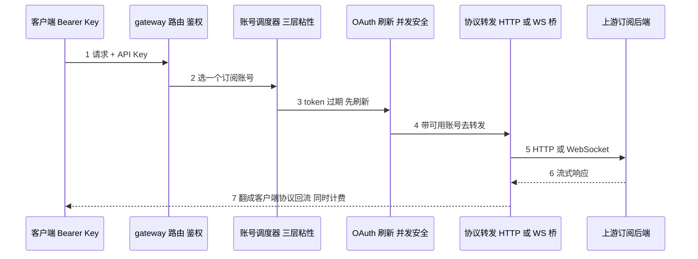
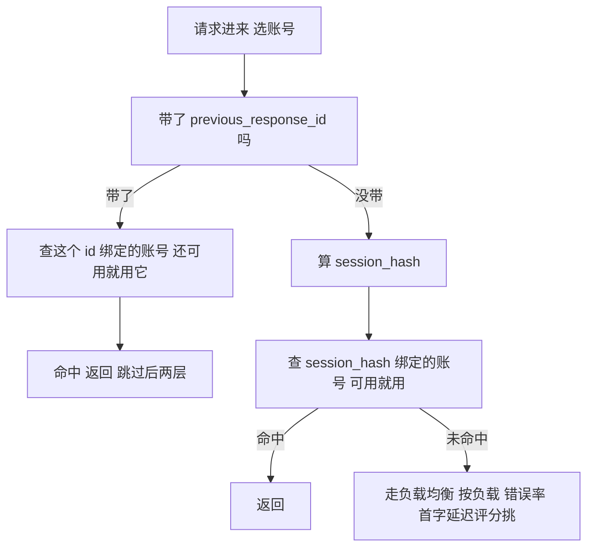
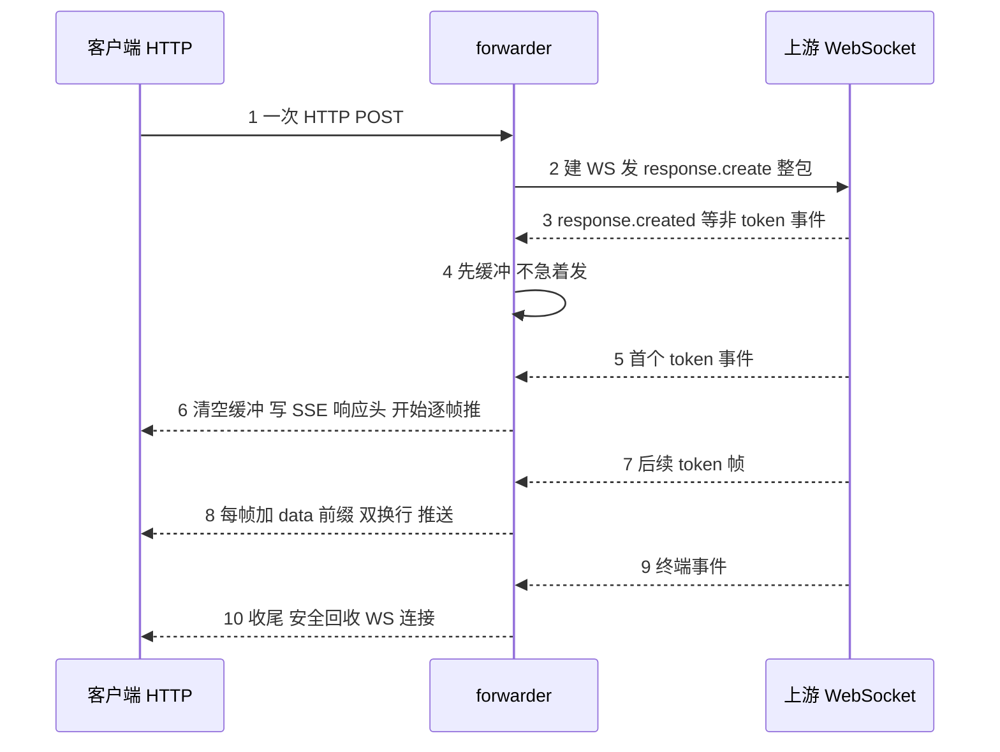
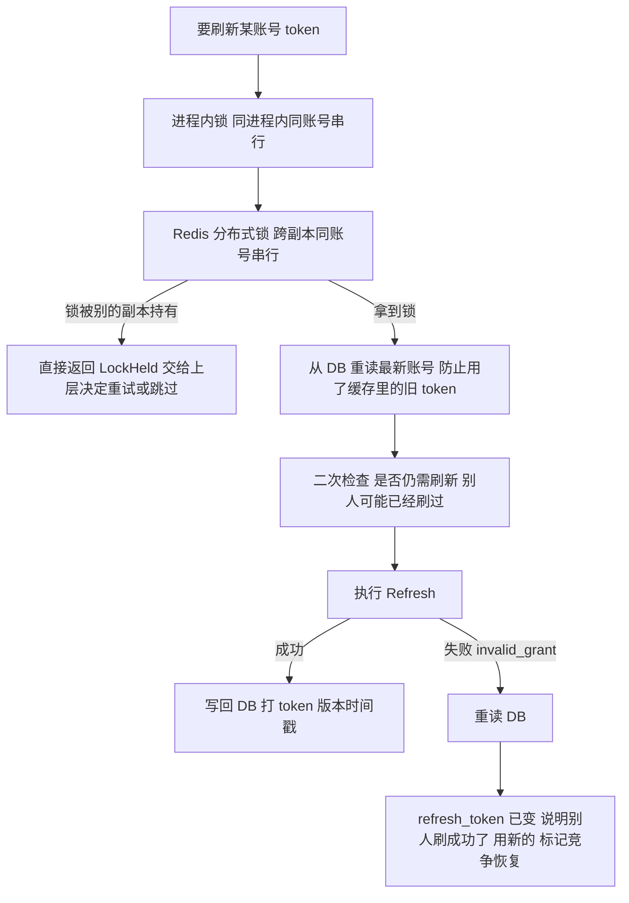

## 1. sub2api

[sub2api](https://github.com/Wei-Shaw/sub2api) 是一个把订阅版 LLM（Claude Pro、ChatGPT Pro、Gemini 等）的能力做成多人共用 API 网关的开源 SaaS。它有完整的用户体系、API Key 发放、多账号池调度、计费、支付集成。后端 Go + Ent ORM + PostgreSQL + Redis，前端 Vue3，是一套能直接部署上线的系统。

### 1.1 痛点：订阅是"个人坐席"，但你想给一群人用

最新最强的模型几乎都先以订阅形式发布。一个 200 美元的 Pro 订阅，一个人用不完，团队几个人合用、或者给脚本和评测台共享，是很自然的需求。但订阅卖的是个人坐席，没有 API key。

把单个 CLI 的 OAuth 翻成 API 的本地代理（如 CLIProxyAPI 这类），解决的是"我一个人本地用"。要把订阅资源做成给一群人用的服务，要处理的事情完全是另一个量级：

- 多个订阅账号组成一个池，请求来了选哪个账号、某个账号 429 了怎么冷却切换
- 上游是**有状态的**：OpenAI 的 Responses API 续聊要带 `previous_response_id`，这个 id 只在当初生成它的那个账号上有效，跨账号就失效，不能随便负载均衡
- ChatGPT Pro 的后端根本不讲 HTTP，讲的是一套半私有的 WebSocket 协议
- 多副本部署时，同一个账号的 OAuth token 过期，几个副本可能同时去刷新，把上游打出 `invalid_grant`（OAuth 标准错误码，意思是这个 refresh_token 已被消费或失效）

这些坑，单进程单用户的玩具代理碰都碰不到。sub2api 把它们一个个填了，填的方式有不少可以直接搬。

### 1.2 三个可迁移工程模式

这一章我们拆三个跟"把订阅当 API 卖"这件具体业务无关、但能迁移到很多系统的工程手法：

1. **有状态后端的粘性会话调度（session affinity）**。上游一旦有状态（续聊要回到同一账号、购物车绑同一 server、有 server-side session），就不能纯负载均衡。sub2api 用三层递进的粘性兜底解决。任何"会话要粘到固定后端"的路由都用得上。

2. **HTTP 入、WebSocket 出的协议桥接**。客户端讲 HTTP/SSE，上游只认 WebSocket，中间要做一个双向桥，还要在首字前缓冲事件以便上游早断时安全回退。任何"两端协议形态不同"的代理都会撞到。

3. **OAuth token 池的并发安全刷新**。多副本下同一个 refresh token 不能被重复消费。sub2api 用进程内锁 + 分布式锁 + DB 重读 + 竞争恢复四道防御。任何多副本共享一份会过期凭证的系统都需要。

本地对照源码看：

```bash
git clone --depth 1 --branch v0.1.133 https://github.com/Wei-Shaw/sub2api.git
cd sub2api
```

路径都从 `backend/` 算起（前端不在本章范围）。本文基于 tag `v0.1.133`（commit `68901cb`）。它是个体量很大的项目（后端约 45 万行 Go，含 ent 生成代码和测试），但本章只挑后端 `internal/service/` 里三个最值得讲的模块，每个都在千行以内、读得动。

## 2. 部署形态与接入路径

sub2api 不是一个能本地 5 分钟跑通的库，它是一套要部署的服务。我们走最短路径 docker compose（仓库 `deploy/` 下有现成的 compose 文件）：

```bash
cd deploy
cp .env.example .env          # 配 PostgreSQL / Redis 连接、管理员账号等
docker compose up -d          # 拉起 backend + postgres + redis + 前端
docker compose logs -f sub2api
```

起来后管理面板在 `http://YOUR_SERVER_IP:8080`。典型接入路径是四步：

1. **加订阅账号**：管理后台里走 OAuth 登录，把你的 Claude / ChatGPT 订阅账号加进账号池（凭证存进 DB）。
2. **建用户、发 API Key**：给每个使用者建账号、发一把 `sk-` 开头的 API Key，设配额。
3. **客户端调用**：使用者拿这把 Key，像调 OpenAI / Anthropic 一样调网关的统一 endpoint：

```bash
curl http://YOUR_SERVER_IP:8080/v1/chat/completions \
  -H "Authorization: Bearer sk-你发的key" \
  -d '{"model":"gpt-5.5","messages":[{"role":"user","content":"ping"}]}'
```

4. **网关内部**：鉴权 → 从账号池按粘性策略选一个订阅账号（4.1 节）→ 必要时刷新它的 OAuth token（4.3 节）→ 翻译协议、转发（ChatGPT 走 WS 桥，4.2 节）→ 计费、回流。

对使用者来说和调官方 API 没区别；网关在背后把"个人订阅"变成了"多租户 API"。

## 3. 全景架构

一次请求穿过网关的链路：



后端代码分层（只列和本章相关的）：

| 区块 | 位置 | 职责 |
|---|---|---|
| 账号调度 | `internal/service/openai_account_scheduler.go`、`openai_sticky_compat.go` | 三层粘性选账号 |
| WS 桥接 | `internal/service/openai_ws_forwarder.go` | HTTP/SSE ↔ ChatGPT WebSocket |
| OAuth 刷新 | `internal/service/oauth_refresh_api.go`、`token_refresh_service.go`、`internal/pkg/openai/oauth.go` | 复用官方 client_id + 并发刷新 |
| 协议翻译 | `internal/pkg/apicompat/` | Anthropic / ChatCompletions / Responses 互转 |
| 数据模型 | `ent/`、`ent/schema/` | Ent ORM 生成的实体与查询 |

核心抽象不多，认得这三个就抓住了本章：

| 抽象 | 位置 | 一句话定位 |
|---|---|---|
| 三层调度层级常量 | `openai_account_scheduler.go:21-23` | `previous_response_id` / `session_hash` / `load_balance` 三档粘性 |
| WS forwarder | `openai_ws_forwarder.go` | 把上游 WebSocket 流桥成对客户端的 SSE 流 |
| OAuthRefreshAPI | `oauth_refresh_api.go:34-39` | 进程内锁 + 分布式锁的并发刷新控制器 |

下面三节按"怎么选账号 → 怎么转发 → 怎么刷 token"的顺序拆开。

## 4. 核心模块

### 4.1 三层粘性会话调度

**一句话总结**：上游有状态时不能随便负载均衡。sub2api 选账号分三层，从"最该粘"到"可以随便挑"递进：先看上游返回的会话 id 能不能粘回原账号，不行再看请求内容 hash 能不能粘，再不行才走负载均衡。

#### 4.1.1 问题：续聊请求换了账号就失效

OpenAI 的 Responses API 是有状态的：模型回一次，给你一个 `response_id`；你下一轮带上 `previous_response_id`，上游就能接着上次的上下文聊。但这个 id 是**绑在生成它的那个订阅账号上的**：会话状态存在那个账号的服务端，换一个账号，id 立刻失效，续聊直接报错。

所以账号池调度不能像无状态后端那样纯负载均衡。同一个会话的连续请求，必须尽量回到同一个账号。但又不能粘死，那个账号要是挂了、满了，得能退化到别的账号。

#### 4.1.2 纯负载均衡 vs 一致性哈希 vs 三层递进粘性

| 方案 | 怎么做 | 优点 | 代价 |
|---|---|---|---|
| 纯负载均衡 | 每次请求按负载挑账号 | 账号利用最均匀 | 续聊会换账号，`previous_response_id` 失效 |
| 一致性哈希 | 按会话 key 哈希到固定账号 | 同会话天然粘同账号 | 账号增减会大面积重新映射；账号挂了不好退化 |
| 三层递进粘性（sub2api） | 先按上游 id 粘 → 再按内容 hash 粘 → 都不命中才负载均衡 | 续聊优先粘、又能优雅退化 | 要维护 id→账号、hash→账号两套映射缓存 |

#### 4.1.3 sub2api 的选择：三层从强到弱兜底

三层的层级名直接写成常量，我们对着源码看，`openai_account_scheduler.go:21-23`：

```go
const (
    openAIAccountScheduleLayerPreviousResponse = "previous_response_id"  // 第一层：最强粘性
    openAIAccountScheduleLayerSessionSticky    = "session_hash"          // 第二层：会话哈希粘性
    openAIAccountScheduleLayerLoadBalance      = "load_balance"          // 第三层：兜底负载均衡
)
```

`Select` 方法按这个顺序从强到弱试，命中就返回：



#### 4.1.4 关键代码：第一层 id 绑定与第二层哈希粘性

我们从第一层看起，它在 `Select` 里（`openai_account_scheduler.go:254-297`）：如果请求带了 `previous_response_id`，先查这个 response 当初绑定的账号，账号还可用就直接用它，跳过后两层，这是续聊能接上的关键。

第二层 `selectBySessionHash`（`:299-309`）：没有 `previous_response_id`（比如新会话或不走 Responses 的请求），就按请求内容算一个 `session_hash`，查这个 hash 之前粘过的账号。命中且账号有效就返回。

第三层 `selectByLoadBalance`（`:311-323`）：前两层都没命中，才真正做负载均衡：按实时负载、错误率、首字延迟等多维度给候选账号打分，挑最优的。

这里有个容易被忽略的工程细节：`session_hash` 的算法升级过一次，sub2api 用双写双读扛过了迁移。`openai_sticky_compat.go:39-49` 的 `deriveOpenAISessionHashes` **同时算新旧两种哈希**（新格式用 xxhash，旧格式用 SHA256）；读缓存时（`:122-152`）先查新键、未命中再降级查旧键。

为什么要这么麻烦？因为 `session_hash` 是用作缓存 key 的，如果直接换算法，上线那一刻所有正在进行的老会话，新算出来的 hash 跟缓存里存的旧 hash 对不上，粘性瞬间全断、续聊集体失效。双写双读让老会话还能按旧 hash 找回原账号，平滑过渡。**任何要改"用作缓存 key 的哈希算法"的系统都会撞到这个迁移问题**，双写双读降级是标准解法。

#### 4.1.5 取舍：粘性优先 vs 利用率均匀

三层粘性的代价是账号利用率不如纯负载均衡均匀，热点会话会持续压在某个账号上。sub2api 接受这个不均匀，因为对有状态上游，"续聊不断"比"负载均匀"重要得多。它把负载均衡降到第三层，只在前两层都不适用时才追求均匀。

对比纯负载均衡（适合无状态后端，如普通 API key 池）和一致性哈希（同会话粘同账号，但账号增减会大面积重映射、且账号故障时退化不优雅），三层递进的好处是**退化路径清晰**：强粘性不可用就自动落到弱粘性，弱粘性不可用就落到负载均衡，每一层都有下一层兜着。判断要不要用：上游有没有状态。有状态就别纯负载均衡。

#### 4.1.6 自己写一个最小三层粘性

核心是两套映射缓存 + 按强到弱试。我们用 Python 写个骨架，约 40 行：

```python
class StickyScheduler:
    def __init__(self, accounts, cache):
        self.accounts = accounts
        self.id2acct = cache       # previous_response_id -> account_id
        self.hash2acct = cache     # session_hash -> account_id

    def select(self, req) -> str:
        # 第一层：上游返回的 id 最强粘性
        prev = req.get("previous_response_id")
        if prev and (aid := self.id2acct.get(prev)) and self.alive(aid):
            return aid
        # 第二层：内容哈希粘性
        h = self.session_hash(req)
        if (aid := self.hash2acct.get(h)) and self.alive(aid):
            return aid
        # 第三层：负载均衡
        aid = self.by_load()
        self.hash2acct.set(h, aid)          # 记住这次的粘性
        return aid

    def on_response(self, req, resp, aid):
        # 把上游新返回的 response_id 绑到这个账号，供下次续聊命中第一层
        if rid := resp.get("id"):
            self.id2acct.set(rid, aid)
```

要做到生产级，再补两件：哈希算法升级时的双写双读降级（4.1.4），以及 `alive()` 里接上账号的冷却 / 错误率状态。

### 4.2 HTTP 入、WebSocket 出的协议桥接

**一句话总结**：客户端讲 HTTP/SSE，ChatGPT Pro 的后端只讲 WebSocket，中间要架一座双向桥。把客户端的一次 HTTP 请求转成一条 WS 会话，把上游的 WS 事件流逐帧翻成 SSE 推回去，还要在首个 token 出来前缓冲事件，万一上游早早断连还能安全回退。

#### 4.2.1 问题：两端协议形态根本不同

普通反向代理能成立，前提是两端都讲 HTTP，改改 URL 和 header 转发就行。但 ChatGPT Pro 的后端讲的是一套基于 WebSocket 的协议（状态更丰富、支持双向交互），帧结构和 SSE 完全不是一回事。客户端发来的是一次 HTTP POST、期待一个 SSE 流，上游要的却是建一条 WS 连接、发一个 `response.create` 帧、再逐帧读回来。这中间是**协议形态的转换**，不是 URL 改写，反向代理做不了。

而且有个棘手细节：上游可能在没吐出任何 token 前就断连（鉴权问题、账号限制）。如果你已经把 HTTP 响应头发出去了，就没法再回退成一个干净的 HTTP 错误了。

#### 4.2.2 反向代理 vs WS 隧道透传 vs 协议桥接 forwarder

| 方案 | 怎么做 | 能不能用 |
|---|---|---|
| 普通反向代理 | 改 URL / header 转发 HTTP | 不行，上游不讲 HTTP |
| WS 隧道直接透传 | 把客户端也升级成 WS，端到端透传 WS 帧 | 不行，客户端是标准 HTTP/SSE 客户端，不懂这套私有 WS 协议 |
| 协议桥接 forwarder（sub2api） | 服务端代客户端建 WS、发帧、读回，逐帧翻成 SSE | 可行，两端协议在网关内被翻译对接 |

#### 4.2.3 sub2api 的选择：服务端代建 WS + 逐帧翻 SSE

`openai_ws_forwarder.go` 把这座桥实现了。我们从入口看起 `forwardOpenAIWSV2`（`:1722-1810`）构建 WS URL、解析请求、从连接池 `Acquire` 一条到上游的 WS 连接。整条桥的数据流：



#### 4.2.4 关键代码：首字前缓冲，是为了能安全回退

上行简单，我们快速带过：一次性把整个 `response.create` payload 发给上游（`:2001-2021`）。下行是精华。`emitStreamMessage`（`:2078-2095`）做帧翻译：把 WS 事件加上 `data: ` 前缀和双换行后缀，组装成标准 SSE 帧写给客户端。

真正的工程巧思在缓冲策略（`:2122-2310` 的双向事件循环 + `:2276-2304`）：

- **首个 token 之前**，上游来的非 token、非终端事件（如 `response.created`）**先缓冲，不立刻发**。
- 等**首个 token** 真的读到了，才清空缓冲、写 HTTP 响应头、开始往客户端推。
- 之后是可配置的批量 flush（默认积 4 帧或 25ms 超时刷一次），平衡实时性和系统调用开销。

为什么首字前要缓冲？因为**一旦写了响应头，HTTP 响应就没法回退了**。如果上游在吐出第一个 token 前就断连（账号失效、被限流），缓冲让网关还能把这次失败干净地变成一个 HTTP 错误码、切换账号重试，而不是给客户端一个半截的、已经发了 200 头的坏流。这一条是"边走边录"类转发器的通用经验：**在第一个不可撤销的动作之前，留一个能反悔的窗口**。

#### 4.2.5 取舍：缓冲带来首字延迟，换可回退性

首字前缓冲的代价是轻微的首字延迟（要等第一个 token 而不是第一个事件就开始回流），换来的是"上游早断时能安全回退"。对要计费、要 failover 的网关，这个交换值得，一个发了一半就断的坏流，客户端体验和计费都难处理。如果你的代理不需要回退（比如纯透传、不计费、不重试），可以不缓冲、事件来了就发，省掉这点延迟。

#### 4.2.6 自己写一个最小 HTTP→WS 桥

我们的骨架抓三件事：代建 WS、首字前缓冲、逐帧翻 SSE。Python（`aiohttp` + `websockets`）约 50 行：

```python
async def bridge(request):
    resp = web.StreamResponse()                  # 先别 prepare，留回退窗口
    buffered, started = [], False
    async with websockets.connect(UPSTREAM_WS, extra_headers=auth) as ws:
        await ws.send(json.dumps(build_create_payload(await request.json())))
        async for raw in ws:
            evt = json.loads(raw)
            if not started:
                if is_token(evt):                # 首个 token：开闸
                    await resp.prepare(request)  # 此刻才写响应头，不可逆
                    started = True
                    buffered.clear()             # 缓冲的前导事件可丢或补发
                else:
                    buffered.append(evt)         # 首字前：只缓冲
                    if is_error(evt):            # 上游早断：还能干净回退
                        return web.json_response({"error": evt}, status=502)
                    continue
            await resp.write(f"data: {json.dumps(evt)}\n\n".encode())  # 翻成 SSE
            if is_terminal(evt):
                break
    return resp
```

关键不是 WS 库怎么用，是 `prepare()`（写响应头）这个不可逆动作要**推迟到首个 token**，前面全程留着回退余地。

### 4.3 复用官方 CLI 的 Client ID + 并发安全刷新

**一句话总结**：走 OAuth 不必自己申请 client_id，可以直接借用官方 CLI 的；而多副本部署时，同一个账号的 token 过期，几个副本会同时去刷新、把上游打出 `invalid_grant`，所以刷新要层层加锁去重，并在撞车时能恢复。

#### 4.3.1 问题：自研 client_id 拿不到，重复刷新会打挂上游

要走订阅账号的 OAuth，第一道坎是 client_id。厂商不会给第三方发"能登录 Codex / Claude Code 订阅"的 OAuth client。第二道坎更隐蔽：token 会过期，刷新用的 `refresh_token` 通常**一次性**（用一次就轮换成新的）。多副本部署时，几个副本同时发现 token 过期、同时拿同一个 `refresh_token` 去刷，第一个成功、其余的拿着已被消费的旧 token 去刷，上游回 `invalid_grant`，账号被标记异常。

#### 4.3.2 各副本各自刷 vs 单点刷新服务 vs 多层锁 + 竞争恢复

| 方案 | 怎么做 | 优点 | 代价 |
|---|---|---|---|
| 各副本各自刷 | 谁发现过期谁刷 | 简单 | 多副本撞车，`invalid_grant` |
| 单独的刷新服务 | 所有刷新走一个中心服务排队 | 无撞车 | 多一个单点服务，要部署维护 |
| 多层锁 + DB 重读 + 竞争恢复（sub2api） | 进程内锁 + 分布式锁串行化，加锁后重读 DB，撞车了能恢复 | 无需独立服务，多副本安全 | 锁逻辑较复杂 |

#### 4.3.3 sub2api 的选择：借官方 client_id + 四道防御

client_id 直接借官方的。`internal/pkg/openai/oauth.go:16-19`，注释都写明了来源：

```go
// OpenAI OAuth Constants (from CRS project - Codex CLI client)
const (
    // OAuth Client ID for OpenAI (Codex CLI official)
    ClientID = "app_EMoamEEZ73f0CkXaXp7hrann"
)
```

这是这类项目的通用做法：复用官方 CLI 公开的 client_id 走标准 OAuth flow，凭证落到自己的 DB。

并发刷新的控制器是 `OAuthRefreshAPI`（`oauth_refresh_api.go:34-39`），手里两把锁：一个 `sync.Map` 装进程内的 per-account 互斥锁，一个可选的 Redis 分布式锁。刷新时四道防御层层收口：



#### 4.3.4 关键代码：加锁后重读 DB，撞车了也能恢复

四道防御的代码落点：

- **进程内锁**（`:56-64` `getLocalLock`）：为每个 `cacheKey` 返回唯一的 `sync.Mutex`，挡住同进程内多个 goroutine 并发刷同一账号。
- **分布式锁**（`:83-106`）：拿到进程内锁后，再抢 Redis 的"刷新中"锁；Redis 不可用就降级为只靠进程内锁；锁被别的副本持有就返回 `LockHeld=true`，让调用方决定重试还是跳过。
- **加锁后 DB 重读 + 二次检查**（`:108-126`）：拿到锁后**从 DB 重新读最新账号**，而不是用进程缓存里可能已过期的 `refresh_token`；再检查一次是否真的还需要刷（很可能在你抢锁的间隙，别的 worker 已经刷好了）。
- **invalid_grant 竞争恢复**（`:131-142`）：万一还是刷出了 `invalid_grant`（refresh_token 被别人消费了），重读 DB，发现 `refresh_token` 已经变了，就说明别的 worker 刷成功了：直接用更新后的账号返回，标记为"竞争恢复"而不是失败。

第三、四道是这套设计最值得抄的部分。**锁只能减少撞车，不能消灭撞车**（Redis 不可用时就退化了），所以加锁后还要"重读 + 二次检查"防住"我抢到锁时别人刚好刚刷完"，`invalid_grant` 恢复则兜住"锁失效真撞了车"的最后情况。这套防御的统一入口是 `RefreshIfNeeded`（定义在 `oauth_refresh_api.go:75`）；上层的 `refreshWithRetry`（`token_refresh_service.go:265-296`）带重试地调它，成功后打一个 `_token_version` 时间戳落库。

#### 4.3.5 取舍：多层锁的复杂度 vs 不引入单点服务

最干净的去重方案其实是搞一个独立的"刷新服务"，所有刷新请求排队走它，天然无撞车。sub2api 没这么做，它选了"在每个副本里用锁 + DB 重读"把并发收口，代价是锁逻辑复杂（进程内、分布式两层，还要处理 Redis 挂掉的降级和恢复），收益是**不必多部署一个单点服务**。对一个本来就连着 PostgreSQL + Redis 的系统，复用现有 Redis 做分布式锁比新增一个服务划算。

这个取舍的判断点：撞车的代价有多高、你愿不愿意为消灭它引入新组件。`invalid_grant` 只是让账号短暂异常、能自动恢复，代价没高到值得专门起个服务，于是用锁 + 恢复兜住就够了。

#### 4.3.6 自己写一个最小并发安全刷新

抓三件事：分布式锁串行、加锁后重读、撞车恢复。Python（Redis 锁）约 40 行：

```python
def refresh_if_needed(account_id):
    with local_lock(account_id):                       # 第一道：进程内
        lock = redis.set(f"refresh:{account_id}", "1", nx=True, ex=30)
        if not lock:
            return {"lock_held": True}                 # 别人在刷，交给上层
        try:
            acct = db.reload(account_id)               # 第二道：加锁后重读最新
            if not acct.token_expired():
                return acct                            # 别人刚刷过，直接用
            try:
                return do_refresh(acct)                # 真正刷
            except InvalidGrant:                       # 第三道：撞车恢复
                fresh = db.reload(account_id)
                if fresh.refresh_token != acct.refresh_token:
                    return fresh                       # 别人刷成功了，用新的
                raise
        finally:
            redis.delete(f"refresh:{account_id}")
```

核心不是锁本身，是**"锁 + 重读 + 恢复"三件套**：锁降低撞车概率，重读应对"刚好别人刚刷完"，恢复兜住"锁没拦住真撞了"。少任何一件，多副本下都会偶发 `invalid_grant`。

## 5. 几个工程细节

读源码时记下的几个小品味，合成一张表：

| 习惯 | 项目怎么做 | 可迁移到哪 |
|---|---|---|
| 哈希算法升级双写双读 | `session_hash` 同时算 xxhash（新）和 SHA256（旧），读时先新键后降级旧键（`openai_sticky_compat.go:39-152`） | 任何要改"缓存 key 哈希算法"的系统，靠双读降级保迁移期不断档 |
| 上游连接池化 | WS forwarder 从连接池 `Acquire` 上游连接，终端事件后安全回收 | 任何高频建上游长连接的代理，池化省握手开销 |
| token 版本时间戳 | 刷新成功后写 `_token_version` 时间戳落库 | 多副本判断"谁的 token 更新"，时间戳比内容比对简单 |
| ent 代码生成 | 实体、查询全用 Ent ORM 生成（`ent/`、`ent/schema/`），业务只写 schema | 想要类型安全 + 少写样板 SQL 的 Go 项目 |
| 协议翻译按方向拆文件 | `apicompat/` 下 `anthropic_to_responses.go`、`chatcompletions_to_responses.go`、`responses_to_anthropic.go` 等，一个方向一个文件 | 多协议互转时按方向拆显式函数，是协议翻译类项目的通用思路 |

`apicompat/` 这套按方向拆的翻译文件，和一个常见疑问相关：为什么不抽一个统一中间 AST？答案和协议翻译类项目一致。协议是别人定义的、字段天天变，中间 AST 永远追不上，按方向写显式函数反而务实。每个方向独立一个文件，改一个不影响别的。

## 6. 适用边界与不该照搬的部分

### 6.1 什么场景该用 / 不该用

| 场景 | 建议 | 原因 |
|---|---|---|
| 学有状态后端的调度 / 协议桥接 / 并发刷新 | 适合 | 三个模式抽象干净，能直接搬到别的系统 |
| 自己内部小团队共享订阅、自担风险 | 看情况 | 技术上能跑，但要清楚 ToS 风险（下条） |
| 对外把订阅转售成商用 API | 不要 | 直接踩各家"账号共享 / 转售"的 ToS 红线，且依赖上游协议稳定，随时可能被风控或协议变更打断 |
| 想要一个无状态 API key 网关 | 不必用它 | 它的复杂度全在"有状态上游 + 多账号订阅"，无状态场景用 one-api / LiteLLM 更轻 |

要诚实说一点：sub2api 的核心价值绑在一个灰色的商业模式上，把个人订阅转成多人 API。这件事本身踩 ToS，且依赖上游协议不变（ChatGPT 的 WS 协议、OAuth client_id 一旦变更或加固，整条链路就断）。把它当生产基础设施前，这个脆弱性和合规风险要想清楚。**但这不影响三个工程模式的可迁移性**：它们和"卖订阅"无关，是任何有状态后端网关都会用到的手法。

### 6.2 哪些模式可以照搬、哪些不要

**可以照搬**：

- 三层递进粘性调度：任何有状态后端的会话路由。
- HTTP→WS 桥接 + 首字前缓冲：任何两端协议形态不同、又要可回退的代理。
- 锁 + 重读 + 竞争恢复的并发刷新：任何多副本共享会过期凭证的系统。
- 哈希算法升级的双写双读降级：任何要改缓存 key 算法的系统。

**不要照搬**：

- 把订阅转售的商业模式本身（ToS + 脆弱性，见上）。
- 直接复用官方 client_id 这件事，技术上能用，但合规上是借用别人的 OAuth 客户端身份，自建产品时要评估风险。

## 7. 串起来落地时的两个判断

三个模块的骨架在 4.1.6 / 4.2.6 / 4.3.6，按"粘性调度 → 协议转发 → 并发刷新"的顺序拼，1-2 周能跑通一个"有状态上游 + 多账号"的迷你网关。这里只补两个串起来时容易踩、前面没强调的点：

- **每一步都用一个针对性测试卡住回归**：加粘性时，每加一层就测一次"续聊会不会断到别的账号"；做并发刷新时，开两个副本压测，确认不再偶发 `invalid_grant`。这两类 bug 不压测根本暴露不出来，上线才发现就晚了。
- **别从业务层开始**：用户体系、计费、支付是 SaaS 业务层，和三个核心模式正交，先别碰。先把最难的"有状态上游怎么粘账号"跑通：那是这个项目里其他多账号网关碰不到、也最值得先啃下来的硬骨头。

## 8. 延伸阅读

- [CLIProxyAPI](https://github.com/router-for-me/CLIProxyAPI)（本书第 1 章）：同样把订阅版 CLI 包成 API，但定位是"单人本地用"，没有多租户、计费、有状态调度这套。两者对照能看清"本地代理"和"多人 SaaS"在工程上差了哪些量级。
- [songquanpeng/one-api](https://github.com/songquanpeng/one-api) 与 [Calcium-Ion/new-api](https://github.com/Calcium-Ion/new-api)：同为多账号 LLM 网关，但面向的是无状态的 API key 渠道，看它们的 channel 调度和计费模型，能反衬出 sub2api 为"有状态订阅"多做的那些事。
- [BerriAI/litellm](https://github.com/BerriAI/litellm)：协议翻译做得更全的 Python 网关，对照它能看 `apicompat/` 按方向拆 vs 统一 IR 两种翻译架构。
- 想系统学网关层的鉴权、计费、限流、渠道管理，可看本书作者的《AI Token 中转站实战》。
