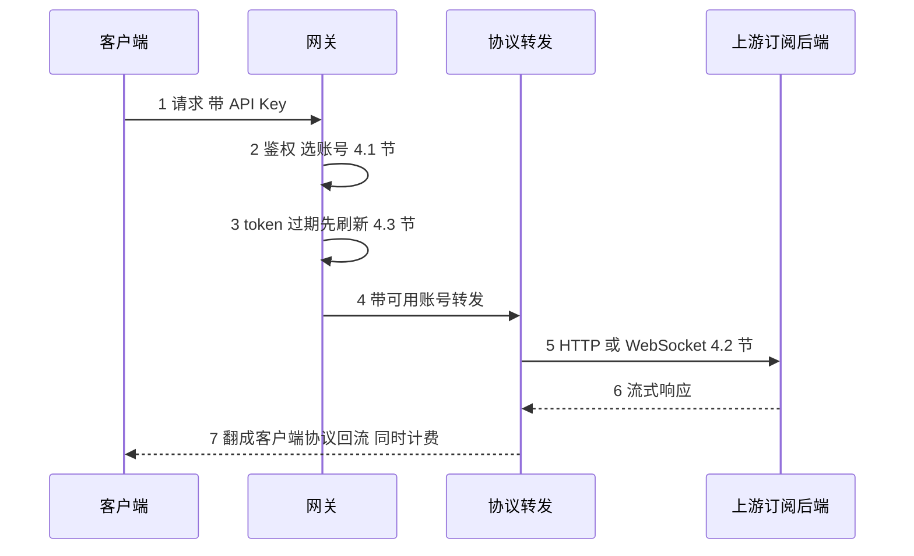
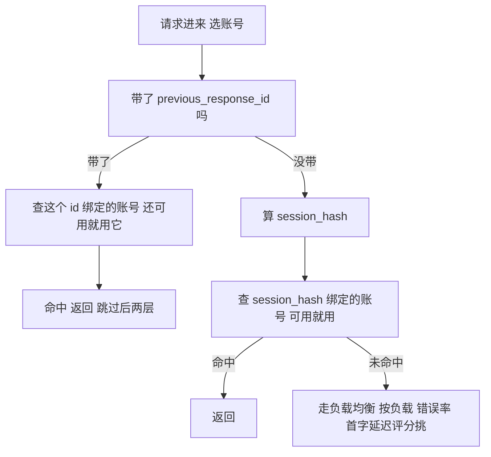
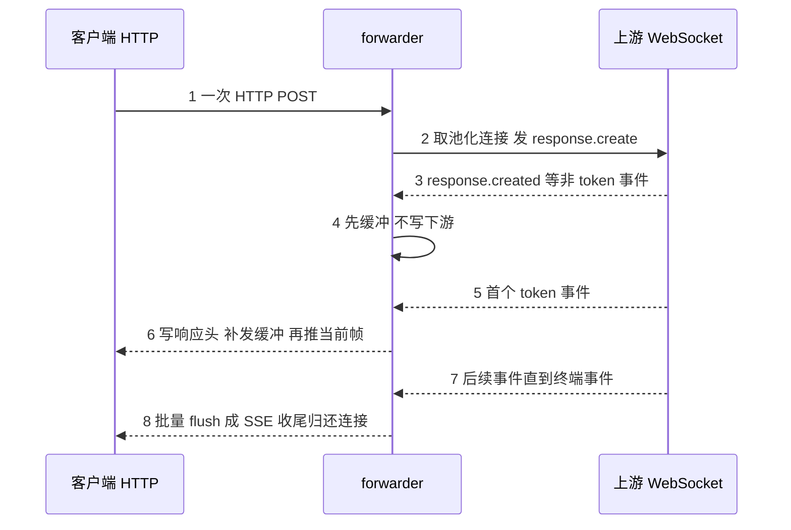
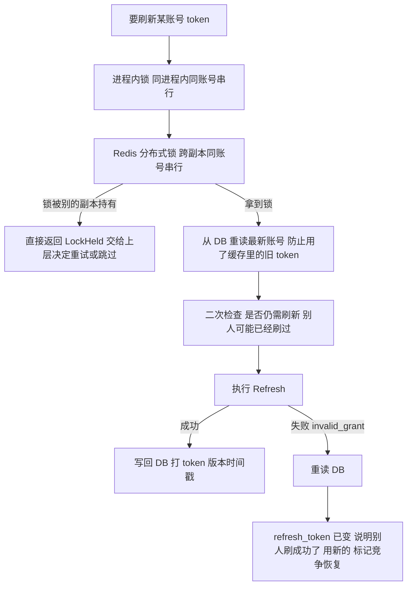

## 1. sub2api

[sub2api](https://github.com/Wei-Shaw/sub2api) 是一个把订阅版 LLM（Claude Pro、ChatGPT Pro、Gemini 等）的能力做成多人共用 API 网关的开源 SaaS。它有完整的用户体系、API Key 发放、多账号池调度、计费、支付集成。后端 Go + Ent ORM + PostgreSQL + Redis，前端 Vue3，是一套能直接部署上线的系统。

新模型有时先在订阅产品里开放，API 晚一步（本书前言提到的 GPT-5.5 就是这样）。一个 200 美元的 Pro 订阅，一个人用不完，团队几个人合用、或者给脚本和评测台共享，是很自然的需求。但订阅卖的是个人坐席，没有 API key。

把单个 CLI 的 OAuth 翻成 API 的本地代理（如第 1 章的 CLIProxyAPI），解决的是"我一个人本地用"。要把订阅资源做成给一群人用的服务，要处理的事情完全是另一个量级：

- 多个订阅账号组成一个池，请求来了选哪个账号、某个账号 429 了怎么冷却切换
- 上游是**有状态的**：OpenAI 的 Responses API 续聊要带 `previous_response_id`，这个 id 只在当初生成它的那个账号上有效，跨账号就失效，不能随便负载均衡
- OpenAI 的 Responses API 除了 HTTP/SSE 还有 WebSocket 模式，长连接能复用、省掉每次握手，但客户端大多只会发 HTTP 请求
- 多副本部署时，同一个账号的 OAuth token 过期，几个副本可能同时去刷新，把上游打出 `invalid_grant`（OAuth 标准错误码，意思是这个 refresh_token 已被消费或失效）

单进程、单用户的本地代理遇不到这些问题。sub2api 里有三个做法和"把订阅当 API 卖"这件业务无关，可以搬到别的系统：

1. **有状态后端的粘性会话调度（session affinity）**。上游一旦有状态（续聊要回到同一账号、购物车绑同一 server、有 server-side session），就不能纯负载均衡。sub2api 按三层递进地粘：先按上游返回的 id，再按会话 hash，最后才负载均衡。会话 hash 优先用客户端显式给的会话标识，实在没有才从请求内容里派生。

2. **HTTP 入、WebSocket 出的协议桥接**。客户端讲 HTTP/SSE，上游走 WebSocket，中间要做一座桥，还要在首个 token 之前缓冲事件，让上游早断时还有机会重试。

3. **OAuth token 池的并发安全刷新**。多副本下同一个 refresh token 不能被重复消费。sub2api 用进程内锁、分布式锁、加锁后重读 DB、`invalid_grant` 竞争恢复四道防御。

对照源码：

```bash
git clone --depth 1 --branch v0.1.133 https://github.com/Wei-Shaw/sub2api.git
cd sub2api
```

路径都从 `backend/` 算起（前端不在本章范围）。本文基于 tag `v0.1.133`（commit `68901cb`）。它是个体量很大的项目：后端约 46 万行 Go（不含测试，含 Ent 生成代码），本章只看 `internal/service/` 里的三个模块。

## 2. 部署形态与接入路径

sub2api 不是一个能本地 5 分钟跑通的库，它是一套要部署的服务。最短路径是 docker compose（仓库 `deploy/` 下有现成的 compose 文件）：

```bash
cd deploy
cp .env.example .env          # 配 PostgreSQL / Redis 连接、管理员账号等
docker compose up -d          # 拉起 backend + postgres + redis + 前端
docker compose logs -f sub2api
```

起来后管理面板在 `http://YOUR_SERVER_IP:8080`。典型接入路径是四步：

1. **加订阅账号**：管理后台里走 OAuth 登录，把你的 Claude / ChatGPT 订阅账号加进账号池（凭证存进 DB）。
2. **建用户、发 API Key**：给每个使用者建账号、发一把 `sk-` 开头的 API Key，设配额。
3. **客户端调用**：使用者拿这把 Key，像调 OpenAI / Anthropic 一样调网关的统一 endpoint：

```bash
curl http://YOUR_SERVER_IP:8080/v1/chat/completions \
  -H "Authorization: Bearer sk-你发的key" \
  -d '{"model":"gpt-5.5","messages":[{"role":"user","content":"ping"}]}'
```

4. **网关内部**：鉴权 → 从账号池按粘性策略选一个订阅账号（4.1 节）→ 必要时刷新它的 OAuth token（4.3 节）→ 翻译协议、转发（OpenAI 账号默认走 WS 桥，4.2 节）→ 计费、回流。

对使用者来说和调官方 API 没区别；网关在背后把"个人订阅"变成了"多租户 API"。

## 3. 全景架构

一次请求穿过网关的链路如图 3-1：


```mermaid
sequenceDiagram
    participant C as 客户端
    participant G as 网关
    participant F as 协议转发
    participant U as 上游订阅后端
    C->>G: 1 请求 带 API Key
    G->>G: 2 鉴权 选账号 4.1 节
    G->>G: 3 token 过期先刷新 4.3 节
    G->>F: 4 带可用账号转发
    F->>U: 5 HTTP 或 WebSocket 4.2 节
    U-->>F: 6 流式响应
    F-->>C: 7 翻成客户端协议回流 同时计费
```

图 3-1：一次请求穿过网关的链路

后端代码分层（只列和本章相关的）：

| 区块 | 位置 | 职责 |
|---|---|---|
| 账号调度 | `internal/service/openai_account_scheduler.go`、`openai_sticky_compat.go` | 三层粘性选账号 |
| WS 桥接 | `internal/service/openai_ws_forwarder.go` | HTTP/SSE ↔ ChatGPT WebSocket |
| OAuth 刷新 | `internal/service/oauth_refresh_api.go`、`token_refresh_service.go`、`internal/pkg/openai/oauth.go` | 复用官方 client_id + 并发刷新 |
| 协议翻译 | `internal/pkg/apicompat/` | Anthropic / ChatCompletions / Responses 互转 |
| 数据模型 | `ent/`、`ent/schema/` | Ent ORM 生成的实体与查询 |

和本章相关的核心抽象有三个：

| 抽象 | 位置 | 作用 |
|---|---|---|
| 三层调度层级常量 | `openai_account_scheduler.go:21-23` | `previous_response_id` / `session_hash` / `load_balance` 三档粘性 |
| WS forwarder | `openai_ws_forwarder.go` | 把上游 WebSocket 流桥成对客户端的 SSE 流 |
| OAuthRefreshAPI | `oauth_refresh_api.go:34-39` | 进程内锁 + 分布式锁的并发刷新控制器 |

第 4 节按请求经过的顺序讲：先选账号，再转发，最后是 token 刷新。

## 4. 核心模块

### 4.1 续聊请求要回到原来的账号

上游有状态，账号池就不能随便负载均衡。sub2api 选账号分三层，从最该粘的到可以随便挑的：先看上游返回的会话 id 能不能粘回原账号，不行再看请求内容 hash，再不行才负载均衡。

OpenAI 的 Responses API 是有状态的：模型回一次，给你一个 `response_id`；你下一轮带上 `previous_response_id`，上游就能接着上次的上下文聊。但这个 id 是**绑在生成它的那个订阅账号上的**：会话状态存在那个账号的服务端，换一个账号，id 立刻失效，续聊直接报错。

所以同一个会话的连续请求，必须尽量回到同一个账号。但又不能粘死，那个账号挂了、满了，得能退化到别的账号。常见的三种做法：

| 方案 | 怎么做 | 优点 | 代价 |
|---|---|---|---|
| 纯负载均衡 | 每次请求按负载挑账号 | 账号利用最均匀 | 续聊会换账号，`previous_response_id` 失效 |
| 一致性哈希 | 按会话 key 哈希到固定账号 | 同会话天然粘同账号 | 账号增减会大面积重新映射；账号挂了不好退化 |
| 三层递进粘性（sub2api） | 先按上游 id 粘 → 再按内容 hash 粘 → 都不命中才负载均衡 | 续聊优先粘、又能优雅退化 | 要维护 id→账号、hash→账号两套映射缓存 |

三层递进多维护两套映射缓存，换来的是清晰的退化路径：强粘性用不了就落到弱粘性，弱粘性用不了就落到负载均衡。代价是账号利用率不如纯负载均衡均匀，热点会话会一直压在某个账号上。对有状态上游，续聊不断比负载均匀重要，所以负载均衡被放到了最后一层。判断标准只有一条：上游有没有状态。

#### Select 的三段判断

三层的层级名直接写成了常量（`openai_account_scheduler.go:21-23`）：

```go
const (
    openAIAccountScheduleLayerPreviousResponse = "previous_response_id"  // 第一层：最强粘性
    openAIAccountScheduleLayerSessionSticky    = "session_hash"          // 第二层：会话哈希粘性
    openAIAccountScheduleLayerLoadBalance      = "load_balance"          // 第三层：兜底负载均衡
)
```

`Select` 按这个顺序从强到弱试，命中就返回（图 3-2）：


```mermaid
graph TB
    A[请求进来 选账号] --> B[带了 previous_response_id 吗]
    B -->|带了| C[查这个 id 绑定的账号 还可用就用它]
    B -->|没带| D[算 session_hash]
    C --> E[命中 返回 跳过后两层]
    D --> F[查 session_hash 绑定的账号 可用就用]
    F -->|命中| G[返回]
    F -->|未命中| H[走负载均衡 按负载 错误率 首字延迟评分挑]
```

图 3-2：三层粘性的判断顺序

主干就是三段顺序判断（`openai_account_scheduler.go:265-323`，删去了日志和指标字段）：

```go
if previousResponseID != "" {
    selection, err := s.service.selectAccountByPreviousResponseIDForCapability(
        ctx, req.GroupID, previousResponseID, req.RequestedModel, /* … */)
    // …账号不支持本次要求的传输方式（HTTP / WS）就放弃这次命中
    if selection != nil && selection.Account != nil {
        decision.Layer = openAIAccountScheduleLayerPreviousResponse
        if req.SessionHash != "" {
            _ = s.service.BindStickySession(ctx, req.GroupID, req.SessionHash, selection.Account.ID)
        }
        return selection, decision, nil
    }
}

selection, err := s.selectBySessionHash(ctx, req)
if selection != nil && selection.Account != nil {
    decision.Layer = openAIAccountScheduleLayerSessionSticky
    return selection, decision, nil
}

selection, candidateCount, topK, loadSkew, err := s.selectByLoadBalance(ctx, req)
decision.Layer = openAIAccountScheduleLayerLoadBalance
```

三层各做一件事：

- **第一层**：请求带了 `previous_response_id`，就查这个 response 当初落在哪个账号，账号可用就直接返回。命中时顺手把 `session_hash` 也绑到这个账号（`:292-294`），下一次即使客户端没带 id，第二层也能接住。
- **第二层** `selectBySessionHash`：请求没带 id，就用 `session_hash` 查它之前粘过的账号。
- **第三层** `selectByLoadBalance`：前两层都没命中，才按实时负载、错误率、首字延迟给候选账号打分，挑最优的。

#### session_hash 从哪来

`session_hash` 不是简单地哈希请求内容。`GenerateSessionHash`（`openai_gateway_service.go:1219-1235`）按优先级取种子：

1. 请求头 `session_id`
2. 请求头 `conversation_id`
3. 请求体里的 `prompt_cache_key`（opencode 会带）
4. 以上都没有，才从请求内容派生：模型、system、工具和第一条用户消息（`openai_content_session_seed.go`）

客户端显式给的会话标识最可靠：同一个会话内它不会变，不同会话之间也不会撞。内容派生只是退路，两个用户发了一模一样的开场白就会被粘到同一个账号上。所以像 `/v1/images` 这类无状态端点，sub2api 用的是 `GenerateExplicitSessionHash`，只认显式标识，没有就不粘（`:1201-1210`，调用方在 `internal/handler/openai_images.go:136`）。

这条可以直接搬走：做粘性调度时，先让客户端传会话标识，内容哈希只做兜底。

#### session_hash 换算法时怎么不断粘性

`session_hash` 的算法升级过一次，sub2api 用双写双读扛过了迁移。`openai_sticky_compat.go:39-49` 的 `deriveOpenAISessionHashes` **同时算新旧两种哈希**（新格式用 xxhash，旧格式用 SHA256）；读缓存时（`:122-152`）先查新键、未命中再降级查旧键。

为什么要这么麻烦？因为 `session_hash` 是用作缓存 key 的，如果直接换算法，上线那一刻所有正在进行的老会话，新算出来的 hash 跟缓存里存的旧 hash 对不上，粘性瞬间全断、续聊集体失效。双写双读让老会话还能按旧 hash 找回原账号，平滑过渡。改"用作缓存 key 的哈希算法"都会遇到这个迁移问题，双写双读加降级是常见解法。

#### 两张映射表就是调度器的全部状态

用 Python 写，按强到弱依次查两张表：

```python
class StickyScheduler:
    def __init__(self, accounts, id_cache, hash_cache):
        self.accounts = accounts
        self.id2acct = id_cache      # previous_response_id -> account_id
        self.hash2acct = hash_cache  # session_hash -> account_id（两张表分开，键空间不会互相污染）

    def select(self, req) -> str:
        # 第一层：上游返回的 id 最强粘性
        prev = req.get("previous_response_id")
        h = self.session_hash(req)
        if prev and (aid := self.id2acct.get(prev)) and self.alive(aid):
            self.hash2acct.set(h, aid)      # 顺手绑 hash，下次没带 id 也能粘回来
            return aid
        # 第二层：内容哈希粘性
        if (aid := self.hash2acct.get(h)) and self.alive(aid):
            return aid
        # 第三层：负载均衡
        aid = self.by_load()
        self.hash2acct.set(h, aid)          # 记住这次的粘性
        return aid

    def on_response(self, req, resp, aid):
        # 把上游新返回的 response_id 绑到这个账号，供下次续聊命中第一层
        if rid := resp.get("id"):
            self.id2acct.set(rid, aid)
```

`session_hash`、`alive`、`by_load` 按你的业务实现，缓存用任何带 `get`/`set` 的 KV 都行。生产环境还要在 `alive()` 里接上账号的冷却和错误率状态。

### 4.2 客户端讲 HTTP，上游讲 WebSocket

sub2api 的 OpenAI 账号默认走 Responses API 的 WebSocket 模式，长连接可以按账号池化复用。可大多数客户端只会发 HTTP 请求，网关得在中间架一座桥。这座桥上最要紧的规则是：首个 token 出来之前不写响应头。

sub2api 给每个 OpenAI 账号单独决定上游传输方式（`openai_ws_protocol_resolver.go:10-12` 定义了 `http_sse`、`responses_websockets`、`responses_websockets_v2` 三种）。WS 默认开启，可以全局或按账号强制回到 HTTP（`internal/config/config.go:717` 的注释写的是"默认开启，可按需回滚到 HTTP"）。

选 WS 是为了复用连接：每个账号维护一个上游 WS 连接池，可以预热、限制并发连接数，请求来了直接 `Acquire` 一条，省掉每次建连。但客户端通常是 OpenAI SDK、curl 这类 HTTP 客户端，发一次 POST，等一个 SSE 流。于是网关要把一次 HTTP 请求变成一次 WS 往返：发一个 `response.create` 帧，再把回来的事件逐个翻成 SSE。

还有一个时间窗口问题。上游可能在吐出任何 token 之前就出错，比如连接被关、读事件失败、上游 5xx。HTTP 响应头一旦发出去，网关就没法再重试，也没法改成一个干净的错误响应了。

把 HTTP 客户端接到上游有三种接法，sub2api 里都有，分别对应不同的组合：

| 接法 | 适用组合 | sub2api 里的位置 |
|---|---|---|
| HTTP/SSE 反向代理 | 上游走 `http_sse` | WS 关闭或账号强制 HTTP 时的默认路径 |
| WS 端到端透传 | 客户端自己就连 WS | ingress `passthrough` 模式（`openai_ws_forwarder.go:2440`） |
| HTTP→WS 协议桥接 | 客户端 HTTP、上游 WS | `forwardOpenAIWSV2`（`openai_ws_forwarder.go:1722`） |

前两种实现简单，但各有前提：反代要求上游也走 HTTP，放弃连接复用；透传要求客户端会讲 WS。下面讲第三种，只有它要处理两端协议形态的转换。

#### 首个 token 之前只缓冲

入口 `forwardOpenAIWSV2`（`:1722-1810`）构建 WS URL、解析请求，再从连接池取一条到上游的连接。整条桥的数据流如图 3-3：


```mermaid
sequenceDiagram
    participant C as 客户端 HTTP
    participant F as forwarder
    participant U as 上游 WebSocket
    C->>F: 1 一次 HTTP POST
    F->>U: 2 取池化连接 发 response.create
    U-->>F: 3 response.created 等非 token 事件
    F->>F: 4 先缓冲 不写下游
    U-->>F: 5 首个 token 事件
    F-->>C: 6 写响应头 补发缓冲 再推当前帧
    U-->>F: 7 后续事件直到终端事件
    F-->>C: 8 批量 flush 成 SSE 收尾归还连接
```

图 3-3：HTTP→WS 桥的一次往返

上行是一次性把整个 `response.create` payload 发给上游（`:2001-2021`）。下行由 `emitStreamMessage`（`:2078-2095`）把每个 WS 事件加上 `data: ` 前缀和双换行，写成 SSE 帧。

缓冲逻辑在事件循环里。来源：`openai_ws_forwarder.go:2276-2304`（节选）

```go
// 在首个 token 前先缓冲事件（如 response.created），
// 以便上游早期断连时仍可安全回退到 HTTP，不给下游发送半截流。
shouldBuffer := firstTokenMs == nil && !isTokenEvent && !isTerminalEvent
if shouldBuffer {
    bufferedStreamEvents = append(bufferedStreamEvents, buffered)
} else {
    flushBufferedStreamEvents(eventType)
    emitStreamMessage(message, isTerminalEvent)
}
```

- **首个 token 之前**：非 token、非终端事件只进缓冲，下游一个字节都没收到。
- **首个 token 到达**：先把缓冲的事件按原顺序补发，再发当前事件。前导事件不丢。
- **之后**：按批量 flush。配置默认每帧都立即 flush，间隔 10ms（`internal/config/config.go:1808-1809`，`deploy/config.example.yaml` 相同）；`openai_ws_forwarder.go:49-50` 里的 4 帧 / 25ms 只在没有配置时兜底。

#### 下游没写过字节，就还能重试

缓冲换来的是重试的机会。每次失败后，调用方先用 `c.Writer.Written()` 检查下游有没有被写过（`openai_gateway_service.go:2889-2891`），没写过才进入重试：

- **可重试的原因**（`read_event`、`dial_failed`、`upstream_5xx` 等）：按退避重连，受总时间预算约束。分类函数是 `classifyOpenAIWSReconnectReason`（`openai_gateway_service.go:594-632`）。
- **续链锚点失效**（`previous_response_not_found`）：去掉 `previous_response_id` 重放一次。
- **不可重试的原因**（`auth_failed`、`policy_violation` 等）：直接停。
- **重试用尽**：`writeOpenAIWSFallbackErrorResponse` 给客户端写一个完整的错误响应，而不是半截的 200 流。

代码注释里的"回退到 HTTP"是早期设计留下的说法。这个版本命中 WS 后不再自动切回 HTTP 传输，`openai_gateway_service.go:2778` 的注释写明了"不再自动回退 HTTP"，只是错误类型名 `openAIWSFallbackError` 保留了下来。

代价是首字延迟略增：要等到第一个 token，而不是第一个事件，才开始回流。对要计费、要重试的网关，这个交换划算，发了一半就断的流，客户端和计费都难处理。只做透传、不计费、不重试的代理，可以事件来了就发。

推广到任何边转发边处理的代理，规则是同一条：**在第一个不可撤销的动作之前，留一个能反悔的窗口。**

#### 把 prepare 推迟到首个 token

桥的骨架只抓三件事：代建 WS、首个 token 前缓冲、逐帧翻成 SSE。下面用 `aiohttp` + `websockets`（v14 以上，v13 的 `connect` 不认 `additional_headers` 参数）写，`is_token`、`is_terminal`、`is_error`、`build_payload` 按上游协议实现，这里省略：

```python
def sse(evt):
    return f"data: {json.dumps(evt)}\n\n".encode()

async def bridge(request):
    resp = web.StreamResponse(headers={"Content-Type": "text/event-stream"})
    buffered = []                                   # 首字前的前导事件
    async with websockets.connect(UPSTREAM_WS, additional_headers=AUTH) as ws:
        await ws.send(json.dumps(build_payload(await request.json())))
        async for raw in ws:
            evt = json.loads(raw)
            if not resp.prepared:
                if is_error(evt):                   # 下游还没收到任何字节，可以干净报错或重试
                    return web.json_response({"error": evt}, status=502)
                if not (is_token(evt) or is_terminal(evt)):
                    buffered.append(evt)
                    continue
                await resp.prepare(request)         # 此刻才写响应头，不可逆
                for b in buffered:                  # 补发前导事件，顺序不变
                    await resp.write(sse(b))
            await resp.write(sse(evt))
            if is_terminal(evt):
                break
    if not resp.prepared:                           # 上游没给 token 就关了连接
        return web.json_response({"error": "upstream closed"}, status=502)
    return resp
```

要点在 `prepare()`：写响应头的动作推迟到首个 token，之前任何失败都还能换成重试或完整的错误响应。

### 4.3 多个副本同时刷新同一个 token

多副本部署时，同一个账号的 token 过期，几个副本会同时去刷新，把上游打出 `invalid_grant`。所以刷新要层层加锁去重，撞车了还要能恢复。在这之前还有一个前提：OAuth 的 client_id 从哪来。

要走订阅账号的 OAuth，第一道坎是 client_id。厂商不会给第三方发"能登录 Codex / Claude Code 订阅"的 OAuth client。第二道坎更隐蔽：token 会过期，刷新用的 `refresh_token` 通常**一次性**（用一次就轮换成新的）。多副本部署时，几个副本同时发现 token 过期、同时拿同一个 `refresh_token` 去刷，第一个成功、其余的拿着已被消费的旧 token 去刷，上游回 `invalid_grant`，账号被标记异常。

#### client_id 借官方 CLI 的

sub2api 直接用 Codex CLI 公开的 client_id，注释写明了来源（`internal/pkg/openai/oauth.go:16-19`）：

```go
// OpenAI OAuth Constants (from CRS project - Codex CLI client)
const (
    // OAuth Client ID for OpenAI (Codex CLI official)
    ClientID = "app_EMoamEEZ73f0CkXaXp7hrann"
)
```

这类项目的通用做法都是这样：复用官方 CLI 公开的 client_id 走标准 OAuth flow，凭证落到自己的 DB。

#### 刷新的四道防御

解决重复刷新有三条路：

| 方案 | 做法 | 代价 |
|---|---|---|
| 各副本各自刷 | 谁发现过期谁刷 | 多副本撞车，`invalid_grant` |
| 独立的刷新服务 | 所有刷新排队走一个中心服务 | 多一个单点服务要部署维护 |
| 多层锁 + 重读 + 竞争恢复 | 锁串行化，加锁后重读 DB，撞车能恢复 | 锁逻辑复杂 |

sub2api 用第三种。它本来就连着 PostgreSQL 和 Redis，复用 Redis 做分布式锁，比新起一个服务省事。`invalid_grant` 只会让账号短暂异常、能自动恢复，代价没高到值得专门起个服务。

并发刷新的控制器是 `OAuthRefreshAPI`（`oauth_refresh_api.go:34-39`），手里两把锁：一个 `sync.Map` 装进程内的 per-account 互斥锁，一个可选的 Redis 分布式锁。刷新时四道防御层层收口（图 3-4）：


```mermaid
graph TB
    A[要刷新某账号 token] --> B[进程内锁 同进程内同账号串行]
    B --> C[Redis 分布式锁 跨副本同账号串行]
    C -->|锁被别的副本持有| D[直接返回 LockHeld 交给上层决定重试或跳过]
    C -->|拿到锁| E[从 DB 重读最新账号 防止用了缓存里的旧 token]
    E --> F[二次检查 是否仍需刷新 别人可能已经刷过]
    F --> G[执行 Refresh]
    G -->|成功| J[写回 DB 打 token 版本时间戳]
    G -->|失败 invalid_grant| H[重读 DB]
    H --> I[refresh_token 已变 说明别人刷成功了 用新的 标记竞争恢复]
```

图 3-4：并发刷新的四道防御

四道防御在代码里的位置：

- **进程内锁**（`:56-64` `getLocalLock`）：为每个 `cacheKey` 返回唯一的 `sync.Mutex`，挡住同进程内多个 goroutine 并发刷同一账号。
- **分布式锁**（`:83-106`）：拿到进程内锁后，再抢 Redis 的"刷新中"锁；Redis 不可用就降级为只靠进程内锁；锁被别的副本持有就返回 `LockHeld=true`，让调用方决定重试还是跳过。
- **加锁后 DB 重读 + 二次检查**（`:108-126`）：拿到锁后**从 DB 重新读最新账号**，而不是用进程缓存里可能已过期的 `refresh_token`；再检查一次是否真的还需要刷（很可能在你抢锁的间隙，别的 worker 已经刷好了）。
- **invalid_grant 竞争恢复**（`:131-142`）：万一还是刷出了 `invalid_grant`（refresh_token 被别人消费了），重读 DB，发现 `refresh_token` 已经变了，就说明别的 worker 刷成功了：直接用更新后的账号返回，标记为"竞争恢复"而不是失败。

后两道是在补锁的漏洞。**锁只能减少撞车，不能消灭撞车**：Redis 不可用时会降级成只有进程内锁，锁 TTL 过期后也可能两个副本同时在刷。所以加锁后还要重读、二次检查，防住"我抢到锁时别人刚刷完"；`invalid_grant` 恢复则处理锁没拦住、真撞了车的情况。这套防御的统一入口是 `RefreshIfNeeded`（定义在 `oauth_refresh_api.go:75`），刷新成功后由它给凭证打上 `_token_version` 时间戳再落库（`:149`）。上层的 `refreshWithRetry`（`token_refresh_service.go:265-296`）带重试地调它，只有在走不了统一入口的降级路径上才自己写这个时间戳（`:291`）。

#### 锁会误删别人的锁

sub2api 的分布式锁本身有一个常见的坑。来源：`internal/repository/gemini_token_cache.go:41-49`

```go
func (c *geminiTokenCache) AcquireRefreshLock(ctx context.Context, cacheKey string, ttl time.Duration) (bool, error) {
    key := fmt.Sprintf("%s%s", oauthRefreshLockKeyPrefix, cacheKey)
    return c.rdb.SetNX(ctx, key, 1, ttl).Result()
}

func (c *geminiTokenCache) ReleaseRefreshLock(ctx context.Context, cacheKey string) error {
    key := fmt.Sprintf("%s%s", oauthRefreshLockKeyPrefix, cacheKey)
    return c.rdb.Del(ctx, key).Err()
}
```

锁的值固定是 `1`，释放时无条件 `Del`。设想副本 A 拿到锁，刷新卡住超过了 TTL，锁自动过期；副本 B 接着拿到锁开始刷；这时 A 刷完执行 `Del`，删掉的是 B 的锁，副本 C 又能进来。正确做法是把锁的值设成持有者自己的随机 token，释放时先比较再删除，而且比较和删除要原子（用 Lua 脚本）。Redis 官方文档讲单实例锁时给的就是这个做法。

在真实 Redis 上跑一遍这个时序（锁 TTL 300ms，A 的刷新要 500ms，B 在 350ms、C 在 550ms 来抢锁），脚本在 `examples/03-sub2api/lock_race.py`：

```text
--- naive ---
[   1ms] A 拿到锁，开始刷新
[ 351ms] B 拿到锁，开始刷新
[ 503ms] A 刷完，释放锁；此刻锁的值 = None
[ 551ms] C 拿到锁，开始刷新
--- owner ---
[   1ms] A 拿到锁，开始刷新
[ 351ms] B 拿到锁，开始刷新
[ 502ms] A 刷完，释放锁；此刻锁的值 = b'B-40bc42'
[ 551ms] C 抢锁失败，锁被别人持有
```

`naive` 是 sub2api 的写法：A 在 503ms 把 B 的锁删了，C 在 551ms 趁机进来，和 B 同时在刷。`owner` 版本里 A 的释放什么也没删，C 被挡住。

两种写法在 351ms 到 503ms 之间都有 A、B 同时在刷：TTL 短于刷新耗时，owner token 也救不了。它只保证不误删，TTL 本身要比最慢的一次刷新长，剩下的撞车交给重读和竞争恢复。

在 sub2api 里这个坑的后果有限，因为后面还有重读和 `invalid_grant` 恢复兜着。但竞争恢复也不是万能的：RFC 6819（5.2.2.3 节）和 RFC 9700（OAuth 2.0 安全最佳实践，4.14 节）都建议授权服务器检测 refresh token 复用，一旦发现旧 token 被再次使用，可以吊销这一整族 token。上游如果这样实现，撞车一次账号就要重新授权，恢复逻辑重读 DB 也拿不到可用的新 token。

#### 带持有者 token 的刷新骨架

把上面的修法和四道防御合在一起，用 Python + redis-py 写（`r` 是 Redis 客户端，`local_lock`、`db`、`do_refresh` 按你的存储实现）：

```python
import uuid

UNLOCK = """
if redis.call('get', KEYS[1]) == ARGV[1] then return redis.call('del', KEYS[1]) end
return 0
"""

def refresh_if_needed(account_id):
    with local_lock(account_id):                        # 第一道：进程内锁
        key, owner = f"refresh:{account_id}", uuid.uuid4().hex
        if not r.set(key, owner, nx=True, px=30_000):   # 第二道：跨副本锁，值是持有者 token
            return {"lock_held": True}                  # 别人在刷，交给上层
        try:
            acct = db.reload(account_id)                # 第三道：加锁后重读 + 二次检查
            if not acct.token_expired():
                return acct                             # 别人刚刷过，直接用
            try:
                return do_refresh(acct)
            except InvalidGrant:                        # 第四道：撞车恢复
                fresh = db.reload(account_id)
                if fresh.refresh_token != acct.refresh_token:
                    return fresh                        # 别人刷成功了，用新的
                raise
        finally:
            r.eval(UNLOCK, 1, key, owner)               # 只删自己持有的锁
```

四道各管一种情况：进程内锁挡同进程内的并发（这里是线程），分布式锁挡其他副本，重读挡"别人刚刷完"，恢复挡"锁没拦住、真撞了车"。少了后两道，多副本下仍会偶发 `invalid_grant`。

## 5. 其他可以搬走的做法

| 做法 | 项目里的位置 | 适用场景 |
|---|---|---|
| 上游 WS 连接按账号池化，终端事件后回收 | `openai_ws_forwarder.go` | 频繁建上游长连接的代理 |
| 刷新成功后写 `_token_version` 时间戳 | `oauth_refresh_api.go:149` | 多副本判断谁的 token 更新 |
| 实体和查询用 Ent ORM 生成，业务只写 schema | `ent/schema/` | 要类型安全、少写样板 SQL 的 Go 项目 |
| 协议翻译一个方向一个文件 | `internal/pkg/apicompat/` | 多协议互转 |

最后一行的目录可以从文件名直接读出方向，例如 `anthropic_to_responses.go`、`responses_to_anthropic.go`、`chatcompletions_to_responses.go`，想看某个方向怎么翻就从对应文件进去。

按方向拆文件也回答了一个常见疑问：为什么不抽一个统一的中间表示？协议是别人定义的，字段经常变，中间表示很难跟上。按方向写显式函数，改一个方向不影响别的。

## 6. 适用边界

| 场景 | 建议 | 原因 |
|---|---|---|
| 学有状态后端的调度、协议桥接、并发刷新 | 适合 | 三个做法不依赖订阅业务，能直接搬 |
| 内部小团队共享订阅、自担风险 | 看情况 | 技术上能跑，先想清 ToS 风险 |
| 对外把订阅转售成商用 API | 不要 | 违反各家禁止转售的条款，随时可能被风控打断 |
| 想要一个无状态 API key 网关 | 不必用它 | 复杂度在有状态上游，无状态用 one-api 更轻 |

sub2api 的核心价值绑在一个灰色的商业模式上，把个人订阅转成多人 API。这件事本身踩 ToS，且依赖上游不变（Responses 的 WS 模式、官方 CLI 的 OAuth client_id 一旦变更或加固，整条链路就断）。把它当生产基础设施前，这个脆弱性和合规风险要想清楚。三个工程做法和卖订阅无关，有状态后端的网关都用得上。不该照搬的只有两样：转售订阅的商业模式本身，以及借用官方 client_id。后者技术上能用，但合规上是借用别人的 OAuth 客户端身份，自建产品时要评估。

## 7. 拼一个迷你网关

三个模块的骨架都在第 4 节，按粘性调度、协议转发、并发刷新的顺序拼。用户体系、计费、支付这些 SaaS 业务层先别碰，它们和这三个做法无关。

两类 bug 只有压测才会暴露，拼的时候各配一个测试：

- **粘性**：每加一层就测一次续聊会不会落到别的账号。
- **并发刷新**：开两个副本同时刷，并把锁 TTL 调得比刷新耗时还短，确认锁过期后不会互删，也不再偶发 `invalid_grant`。

## 8. 延伸阅读

- [CLIProxyAPI](https://github.com/router-for-me/CLIProxyAPI)（第 1 章）：同样把订阅版 CLI 包成 API，但定位是单人本地用，没有多租户、计费和有状态调度。对照着读，能看清本地代理和多人 SaaS 在工程上差在哪。
- [songquanpeng/one-api](https://github.com/songquanpeng/one-api) 与 [Calcium-Ion/new-api](https://github.com/Calcium-Ion/new-api)：同为多账号 LLM 网关，但面向的是无状态的 API key 渠道，看它们的 channel 调度和计费模型，能反衬出 sub2api 为"有状态订阅"多做的那些事。
- [BerriAI/litellm](https://github.com/BerriAI/litellm)：协议翻译做得更全的 Python 网关，对照它能看 `apicompat/` 按方向拆 vs 统一 IR 两种翻译架构。
- [《AI Token 中转站实战》](https://inferloop.dev/llm-gateway)：从 0 搭一个企业级 LLM 网关，覆盖鉴权、计费、限流和渠道管理。
