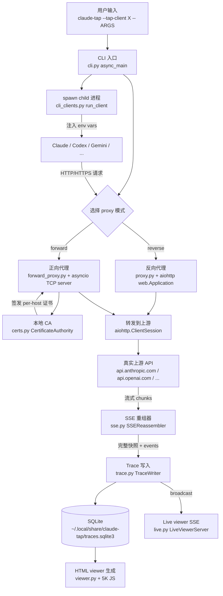

## 1. claude-tap

[claude-tap](https://github.com/liaohch3/claude-tap) 是 AI coding agent 的本地 trace viewer。

正常用 Claude Code / Codex / Gemini CLI 干活，它在背后录下这些 CLI 跟上游 LLM 之间的真实 HTTP 流量：完整的 system prompt、对话历史、工具 schema、工具调用、流式响应、token 用量，全部存在本地。结束后生成一个单文件 HTML viewer 翻看历史，相邻请求之间还有结构化 diff。

### 1.1 痛点：看不到 agent 发出去的请求

调试 LLM agent，最让人抓狂的不是答案不对，而是看不到发出去的请求。

- `-v` 打不出 system prompt
- `strace` 看到的是加密后的 TLS 字节流
- 自己写 HTTP server 假装是 `api.anthropic.com`，又会被 TLS 握手挡住

标准答案叫本地代理 + MITM。但真到落地，每个 CLI agent 脾气不同：

- Claude Code 认 `ANTHROPIC_BASE_URL`
- Codex 认 `OPENAI_BASE_URL`，还要在 `~/.codex/config.toml` 里同时覆盖
- Antigravity 是 Google 的产物，macOS 上不读 `SSL_CERT_FILE`，必须装进 login keychain
- Hermes 是 Python 写的，`gateway start` 会 delegate 到 systemd，代理环境变量全部丢掉

每个坑都要我们自己踩过才知道。claude-tap 把这些差异全部收口在一个 CLI 命令背后：`claude-tap` 一行启动，对使用者来说和直接跑 `claude` 没区别。

### 1.2 三个可迁移工程模式

1. **反向代理 vs 正向代理 + 自签 CA 的二选一**。任何想拦截一个不是自己写的 child 进程的 HTTPS 流量都要做这道选择题，浏览器抓包、API gateway 调试器、移动端 mitm 工具都用得上。

2. **SSE 流式响应的边走边录**。在不破坏 streaming 体验的前提下，把流式 chunk 累积成可持久化的完整快照。任何代理类工具录流量都会撞到这件事。

3. **多 client 适配的策略表抽象**。12 个 client 的差异打包到一个 frozen dataclass 里。多账户认证适配器、多云部署脚本、多 IDE 插件入口都是同一套模式。

本地对照源码看：

```bash
git clone --depth 1 --branch v0.1.104 https://github.com/liaohch3/claude-tap.git
cd claude-tap
```

路径都从 `claude_tap/` 这个 Python 包目录算起。项目当前 1.6K stars、171 forks，代码 1 万行 Python（含 viewer 内嵌 5K 行 vanilla JS），单仓库，`uv tool install claude-tap` 一行装好。本文基于 tag `v0.1.104`（commit `1e6f4ed`，2026-06-09 发布）。

## 2. 上手

claude-tap 装在 PyPI 上，最快的路径是 `uv`：

```bash
uv tool install claude-tap
```

或者 pip：

```bash
pip install claude-tap
```

要求 Python 3.11+。装完检查一下：

```bash
$ claude-tap --version
claude-tap 0.1.104
```

第一次跑之前，先在系统里装好要抓的 CLI agent。最经典的用法是配 Claude Code：

```bash
# 假设你已经装好了 Claude Code 并完成 OAuth 登录
claude-tap
```

不带任何参数时，`claude-tap` 默认包装 Claude Code，启动一个反向代理监听本地随机端口，把 `ANTHROPIC_BASE_URL` 指向自己，然后 spawn `claude` 子进程。从用户视角看就是 `claude` 多了一个 daemon 在背后录流量。终端里会打印这种日志：

```
🚀 Starting Claude Code: claude
   ANTHROPIC_BASE_URL=http://127.0.0.1:54322

[Turn 1] → POST /v1/messages (model=claude-opus-4-7, stream=True, upstream=https://api.anthropic.com/v1/messages)
[Turn 1] ← 200 stream done (3421ms, in=12847 out=482 cache_read=10100 cache_create=2747)
```

`Turn` 是一次完整的 HTTP 请求 / 响应对。一次会话结束后（你 `Ctrl-C` 退出 `claude`），`claude-tap` 会自动生成一份独立的 HTML viewer：

```
✓ Saved trace: ./.traces/2026-06-09/trace_103412.jsonl
✓ Viewer:      ./.traces/2026-06-09/trace_103412.html
```

直接用浏览器打开那个 HTML 就能看到完整的请求历史：每个 turn 的 system prompt、messages、tool definitions、tool calls、流式重组后的响应、token usage，以及相邻两个 turn 之间的 diff（哪句话变了、哪个工具被换了）。从 v0.1.75 开始 live viewer 默认开启，进程跑着的时候浏览器里就能实时刷新看到当前请求。

换一个 client，加 `--tap-client`：

```bash
# Codex CLI（需要 codex login 完成 OAuth，或设 OPENAI_API_KEY）
claude-tap --tap-client codex

# Gemini CLI（需要 gemini login 完成 OAuth）
claude-tap --tap-client gemini -- -p "hello"

# Kimi、OpenCode、Pi、Hermes、Cursor、Qoder、Antigravity、CodeBuddy 同理
```

`--` 之后的参数会原样透传给被包装的 client。所有 `--tap-*` 前缀的 flag 是 claude-tap 自己消费的，其余全部透传。

如果我们不想 spawn 任何 client，只把代理跑起来留给自己接：

```bash
claude-tap --tap-no-launch --tap-port 8080
# 然后在另一个 terminal 自己跑：
ANTHROPIC_BASE_URL=http://127.0.0.1:8080 claude
```

如果我们只想翻历史 trace、不启动新流量：

```bash
claude-tap dashboard
```

会启一个本地 SQLite-backed dashboard，按日期 / client / 模型分组列出所有历史会话，每个会话点进去就是上面那个 HTML viewer。

## 3. 全景架构

我们先把一次被抓的请求从头走一遍，看它会穿过哪些组件：



代码量的分布也呼应这张图，我们从行数就能看出重心压在哪几块：

| 文件 | 行数 | 职责 |
|---|---|---|
| `forward_proxy.py` | 1196 | 正向代理 + CONNECT + MITM TLS |
| `trace_store.py` | 1124 | SQLite 持久化 + schema 版本管理 |
| `cli_clients.py` | 1050 | 12 个 client 的策略表 + spawn 逻辑 |
| `viewer.py` | 1038 | 单文件 HTML viewer 生成 |
| `dashboard.py` | 960 | 历史 trace dashboard |
| `cli.py` | 853 | argparse 入口 + 编排 |
| `proxy.py` | 780 | 反向代理 + 路径白名单 + capture-only |
| `ws_proxy.py` | 608 | WebSocket 代理 |
| `prompt_snapshot.py` | 537 | prompt-only 导出模式 |
| `live.py` | 508 | Live SSE viewer 后端 |
| `export.py` | 383 | 离线导出 HTML / JSONL / compact |
| `sse.py` | 302 | SSE 重组器 |
| `certs.py` | 277 | 本地 CA + 自签证书 |
| `bedrock.py` | 68 | AWS Bedrock EventStream 解码 |

核心抽象不多，我们要盯住的只有 5 个，它们贯穿全项目：

| 抽象 | 位置 | 一句话定位 |
|---|---|---|
| `ClientConfig` | `cli_clients.py:68-100` | 一个 client 的全部适配策略（环境变量、proxy 模式、CA 信任、subcommand 重写）打包成 frozen dataclass |
| `CertificateAuthority` | `certs.py:183-277` | 本地 CA + 进程内 per-host 证书缓存，给 MITM TLS termination 用 |
| `SSEReassembler` | `sse.py:11-302` | 把 SSE chunks 累积成完整响应快照，同时保留原始 event 序列 |
| `TraceWriter` | `trace.py:15-90` | 写一条 trace 同时累加 token / model / error 统计，可选广播给 live viewer |
| `TraceStore` | `trace_store.py:69+` | SQLite 持久化层，schema 版本化、支持 blob dedup |

`ClientConfig` 是策略层，决定我们怎么把 child 进程的流量拐进来。`CertificateAuthority` 是 TLS 层，用来解开 child 发出的 HTTPS。`SSEReassembler` 是协议层，把流式 chunks 还原成可读的完整对话。`TraceWriter` / `TraceStore` 是数据层。

这五个抽象里，`ClientConfig`、`CertificateAuthority`、`SSEReassembler` 是教学价值最高的三个，后面三节按这个顺序逐个拆开。

## 4. 核心模块

### 4.1 反向代理 vs 正向代理：拦截 child 进程 HTTPS 的两条路

#### 4.1.1 选择题的本质

我们要拦的是一个 child 进程发出的 HTTPS 请求。child 不是自己写的（Claude Code 闭源、Codex 是 Rust binary、Antigravity 是 Google 的产物），但我们能控制它的启动环境（环境变量、配置文件、命令行参数）。这件事在 mitmproxy、Charles Proxy、Burp Suite 这些工具里有几十年历史，但今天写代理还是一道选择题：

- **选项 A：反向代理（Reverse Proxy）**。启动一个 HTTP 服务监听本地端口，让 child 把请求地址从真实上游改成本地代理。child 发明文 HTTP 到代理，代理转发到真上游。
- **选项 B：正向代理 + MITM（Forward Proxy + Man-in-the-Middle TLS）**。启动一个 HTTP CONNECT 代理，让 child 把所有 HTTPS 流量都走代理。child 用 TLS 跟代理握手，代理拿一张假装是上游的证书应答，握手成功后 child 把明文 HTTP 写进 TLS 隧道，代理解开来录、转发，再用同样的 TLS 包装把上游响应送回去。

选择题的本质：**能不能让 child 听话地改 base URL**。能就用 A，不能就用 B。

#### 4.1.2 反向代理派与正向代理派

**反向代理派**。mitmproxy 的 `reverse` 模式、Charles 的 "Map Remote"、`socat` 的 TCP 转发都是这个思路。优点是**简单到只需要会写 HTTP server**。最小教学版本不超过 15 行：

```python
# 反向代理最小核心：起 HTTP server，请求来了改 URL 转发
async def handler(request):
    async with ClientSession() as session:
        resp = await session.request(
            request.method,
            "https://api.anthropic.com" + request.path_qs,
            headers={k: v for k, v in request.headers.items() if k.lower() != "host"},
            data=await request.read(),
        )
        return web.Response(status=resp.status, body=await resp.read())
```

代价是**只能拦能改 base URL 的 client**。Claude Code（`ANTHROPIC_BASE_URL`）、Codex（`OPENAI_BASE_URL`）、Kimi（`KIMI_BASE_URL`）都能改，反向代理足够。但 Cursor 把 base URL 编译进 Rust binary、Antigravity 跨多个 Google 域名、Qoder 在 `~/.qoder/conf.json` 写死 endpoint，这些都拦不到。

**正向代理派**。mitmproxy 的 `regular` 模式、Burp Suite、Charles 的标准用法。要解决三个子问题：

1. 让 child 把流量送过来：通过 `HTTPS_PROXY` 环境变量（Python `httpx`、`requests`、Node.js `undici`、Go `net/http`、Rust `reqwest` 都默认认它）。
2. 让 child 信任你的 CA：每家有不同的环境变量：Node.js 是 `NODE_EXTRA_CA_CERTS`，Python 的 httpx 看 `SSL_CERT_FILE`，Python 的 requests 看 `REQUESTS_CA_BUNDLE`，Codex Rust binary 看 `CODEX_CA_CERTIFICATE`。
3. MITM TLS termination：CONNECT 请求来了之后，本地起一个 TLS server 用一张以目标 hostname 为 CN 的自签证书应答，把 child 的 TLS 解开。

正向代理的优点是**只要 child 听 `HTTPS_PROXY`（绝大多数现代 HTTP 客户端都听），就能拦它所有 HTTPS 流量**，不需要 base URL。代价是要实现 CA、要解决"怎么让 child 信任 CA"在不同操作系统上的差异（macOS 还要进 keychain 才能让某些 binary 接受），要实现 CONNECT + 本地 TLS termination。

mitmproxy 是这条路线的开源标杆，5 万行 Python，把整个流程做到了产品级。claude-tap 不是 mitmproxy 的轮子重造，它做的事情更具体：**为每个 LLM CLI agent 做最少配置的 MITM**，并且**和反向代理同时存在**，按 client 选用最合适的一种。

#### 4.1.3 claude-tap 的二选一矩阵

claude-tap 把两种都实现了，由 `ClientConfig.default_proxy_mode` 字段决定每个 client 用哪种。我们可以把它的判别公式压成两行：

> **单 provider 且能改 base URL → 反向**
> **多 provider 或不能改 base URL → 正向**

12 个 client 在 `cli_clients.py:138-276` 的分布完美符合这条公式：Claude Code / Codex / Kimi / CodeBuddy 是单 provider，全部默认反向；Gemini / OpenCode / Pi / Hermes / Cursor / Qoder / Antigravity 是多 provider 或无 base URL，全部默认正向。

**反向代理的实现**：claude-tap 的 `proxy.py:465` 就是上面 15 行教学版的加强版，多做四件事：

- **路径白名单**：只放 LLM API 相关路径（`/v1/messages`、`/v1/chat/completions` 等），其他一律 404，挡住扫描器探测
- **`strip_path_prefix`**：Codex OAuth 走 `chatgpt.com/backend-api/codex/...`，但 base URL env 给的是带 `/v1` 的，要剥掉
- **`Accept-Encoding: identity`**：强制上游不要 zstd 压缩，避免一些 client 解码 bug
- **流式响应分支**：streaming 必须边走边录，不能 `await resp.read()`（4.2 节展开）

**正向代理的实现**：`forward_proxy.py` 复杂得多。CONNECT 隧道 + MITM TLS termination 的核心流程是这样的：

1. 客户端发 `CONNECT api.anthropic.com:443`
2. 代理回 `HTTP/1.1 200 Connection Established`，告诉客户端隧道建好了
3. 客户端开始 TLS 握手，**但客户端以为对端是 `api.anthropic.com`**，期待看到 anthropic 的证书
4. 代理临时签发一张"以 `api.anthropic.com` 为 SAN 的证书"用 CA 签名，应答握手
5. 握手成功后，客户端在 TLS 隧道里发明文 HTTP 请求
6. 代理读明文、转发到真上游、把上游响应套回 TLS 隧道送回

第 4 步是关键。客户端肯接受这张冒牌证书的前提是它信任了代理的 CA，这也是为什么正向代理必须配合 CA 信任的环境变量注入（4.1.4 讲）。

代码上还有一个工程坑值得提：**Python `loop.start_tls()` 在 macOS Python 3.11 上不稳**。作者用了一个 loopback bounce trick（`forward_proxy.py:336-403`）：起一个临时 TLS server 在 `127.0.0.1:随机端口`，再用 TCP relay 把客户端 socket 和这个 TLS server 接上。客户端以为自己在跟原 socket 通信、其实在跟 localhost TLS server 通信。代价是多两次 socket copy，收益是绕开 `start_tls()` bug。**自己写的话，如果只跑 Linux 或 Python 3.12+，直接 `loop.start_tls()` 就行**，不要照搬这个 dance。

#### 4.1.4 CA 证书生成与 SAN 签发

正向代理能跑起来的前提是**有一张能让 child 信任的证书**。`certs.py` 不到 280 行，把 CA 生命周期管理完整地实现了。整个模块只有两个核心函数：

**1. `ensure_ca()`：首次启动签一张自签 CA，存到 `~/.claude-tap/ca.pem`**。关键点不是代码长度，是几个工程决定：

- **CA 寿命 5 年**：够长，省得用户隔几个月被迫重新信任
- **`BasicConstraints(ca=True, path_length=0)`**：`ca=True` 让这张证书可以签发其他证书；`path_length=0` 限制"它签出来的证书不能再签别人"，防止 CA 失窃后无限链式签发
- **`KeyUsage(key_cert_sign=True, ...)`** + **`ExtendedKeyUsage(SERVER_AUTH)`**：声明这张 CA 只用来签服务端 TLS 证书，限制用途
- **私钥写 `0o600`**：限制其他用户读

教学版只要 30 行 `cryptography` 库的 API 调用就能跑通：

```python
from cryptography import x509
from cryptography.hazmat.primitives import hashes, serialization
from cryptography.hazmat.primitives.asymmetric import rsa
from cryptography.x509.oid import NameOID

def make_ca():
    key = rsa.generate_private_key(public_exponent=65537, key_size=2048)
    name = x509.Name([x509.NameAttribute(NameOID.COMMON_NAME, "mini-tap CA")])
    cert = (x509.CertificateBuilder()
        .subject_name(name).issuer_name(name)           # 自签
        .public_key(key.public_key())
        .serial_number(x509.random_serial_number())
        .not_valid_before(datetime.now(timezone.utc))
        .not_valid_after(datetime.now(timezone.utc) + timedelta(days=5*365))
        .add_extension(x509.BasicConstraints(ca=True, path_length=0), critical=True)
        .sign(key, hashes.SHA256()))
    return cert, key
```

**2. `get_host_cert_pem(hostname)`：每个新域名第一次握手时签一张 per-host 证书**。这里有一个新手必踩的坑：

> **现代 TLS 客户端只看 SAN（Subject Alternative Name），不看 CN（Common Name）**。
>
> 只写 `subject_name(CN=hostname)` 不加 SAN，Chrome / Node.js / Python httpx 全都会报 `ERR_CERT_COMMON_NAME_INVALID`。

SAN 还要区分类型：

- 是 IP（比如代理走 VPN 直连 IP）→ `x509.IPAddress(ip)`
- 是 hostname → `x509.DNSName(hostname)`

claude-tap 这段处理在 `certs.py:210-216`，8 行处理了一个新手容易漏的细节：

```python
san_names = []
try:
    ip = ipaddress.ip_address(hostname)
    san_names.append(x509.IPAddress(ip))         # 是 IP 就用 IPAddress
except ValueError:
    san_names.append(x509.DNSName(hostname))     # 是 hostname 就用 DNSName
# 然后在 cert builder 里 .add_extension(x509.SubjectAlternativeName(san_names), critical=False)
```

加上 per-host 证书的进程内缓存（`_host_cache: dict[str, tuple[bytes, bytes]]`，避免每次握手都重签，一次 RSA-2048 keygen 在 macOS 上 100ms+），就构成了一个够用的 MITM CA。剩下的边界 case（IP6、wildcard 证书、SNI 匹配多 hostname）claude-tap 在 v0.1.104 没全部覆盖，按需扩展。

#### 4.1.5 CA 装在哪、TLS 怎么兜底、端口怎么防扫

三个决定，先看结论：

| 决定 | claude-tap 的做法 | 代价 / 边界 |
|---|---|---|
| CA 信任范围 | 只通过环境变量喂给 child：`NODE_EXTRA_CA_CERTS`、`SSL_CERT_FILE`、`REQUESTS_CA_BUNDLE`、`CODEX_CA_CERTIFICATE`，不装系统证书库 | 信任只在被包装的 child 进程内有效，浏览器和系统其他工具一律不信 |
| CONNECT 隧道 | loopback bounce，不用 `loop.start_tls()`（4.1.3 展开过） | 跨平台稳，但多两次 socket copy；只跑 Linux 或 Python 3.12+ 可以直接用 `loop.start_tls()` 省掉这个 dance |
| 端口防护 | `proxy.py:89-119` 的 `ALLOWED_PATH_PREFIXES` 白名单，只放 `/v1/messages`、`/v1/chat/completions`、`/v1internal` 这些，其余一律 404 | 只给反向代理用 |

第一条是安全决定。把 CA 装进系统证书库（macOS keychain root、Linux `/usr/local/share/ca-certificates/`）能一次性解决所有问题，但一旦那个 `ca-key.pem` 失窃，攻击者能伪造整个互联网。

mitmproxy 走的是相反方向，`mitmproxy --install-cert` 直接装进系统库。优点是用户体验更顺，缺点是攻击面更大。两个选择都对，看你的目标用户群：mitmproxy 是给安全研究员用的、用户接受这种风险；claude-tap 是给普通工程师调 prompt 用的、必须默认不动系统。

**例外**：Antigravity CLI（`agy`）在 macOS 上不读 `SSL_CERT_FILE` 这种 per-process 环境变量，必须装进 login keychain 才认。

claude-tap 在 `cli_clients.py` 给这个 client 加了 `auto_trust_ca_macos=True`，启动时跑 `security add-trusted-cert -k ~/Library/Keychains/login.keychain-db`。注意目标是 login keychain 而不是 System keychain：前者不需要 sudo、只影响当前用户、可以单点撤销，后者需要 root 权限、影响整机。一行 boolean 配置背后是对 macOS keychain 模型的精确理解。

第三条挡的是 `/etc/passwd`、`/swagger`、`/.git/config` 这类扫描。反向代理本质上是一个对外的 HTTP server，即便绑 127.0.0.1 也可能被同机器其他进程探测。路径白名单是简单有效的护栏，任何专用 API 代理都可以照搬这条 pattern。

#### 4.1.6 200 行的双模式代理骨架

我们把这两种模式压到最小，< 200 行 Python 就能跑通一个双模式代理：

```python
# mini_tap.py — minimal HTTP/HTTPS proxy with reverse + forward modes
import asyncio
import ssl
from aiohttp import web, ClientSession

# === 反向代理 ===
async def reverse_handler(request: web.Request, upstream: str, client: ClientSession):
    body = await request.read()
    headers = {k: v for k, v in request.headers.items() if k.lower() != "host"}
    resp = await client.request(request.method, upstream + request.path_qs, headers=headers, data=body)
    resp_body = await resp.read()       # 注意 resp.read() 只能调一次，要先存进变量
    print(f"-> {request.method} {request.path}")
    print(f"<- {resp.status}, {len(resp_body)} bytes")
    return web.Response(status=resp.status, body=resp_body, headers=dict(resp.headers))

async def run_reverse(upstream: str, port: int):
    client = ClientSession()
    app = web.Application()
    app.router.add_route("*", "/{path:.*}", lambda r: reverse_handler(r, upstream, client))
    runner = web.AppRunner(app); await runner.setup()
    site = web.TCPSite(runner, "127.0.0.1", port); await site.start()
    print(f"reverse proxy: http://127.0.0.1:{port} -> {upstream}")
    await asyncio.Event().wait()

# === 正向代理 + MITM ===
def ensure_ca(ca_dir="/tmp/mini-tap-ca"):
    # 用 cryptography 库，参考 claude-tap certs.py:37-109
    # 返回 (ca_cert_pem_path, ca_key_pem_path)
    ...

def make_host_ssl_ctx(hostname, ca_cert, ca_key):
    # 用 ca 签一张以 hostname 为 SAN 的证书
    # 返回 ssl.SSLContext，可以 ctx.wrap_socket(sock, server_side=True)
    ...

async def handle_connect(reader, writer, hostname, port, ca):
    while (line := await reader.readline()) not in (b"\r\n", b"\n", b""):
        pass  # 丢弃 CONNECT headers
    writer.write(b"HTTP/1.1 200 Connection Established\r\n\r\n")
    await writer.drain()

    ssl_ctx = make_host_ssl_ctx(hostname, ca.cert, ca.key)
    # 简化版：直接 loop.start_tls()（Linux + Python 3.12 OK，macOS 不稳）
    transport = writer.transport
    loop = asyncio.get_event_loop()
    new_transport = await loop.start_tls(transport, writer._protocol, ssl_ctx, server_side=True)
    # ... 从 new_transport 读明文 HTTP，转发到真上游

async def run_forward(port: int):
    ca = ensure_ca()
    async def client_connected(reader, writer):
        request_line = await reader.readline()
        method, target, _ = request_line.decode().split(" ", 2)
        if method == "CONNECT":
            hostname, p = target.split(":")
            await handle_connect(reader, writer, hostname, int(p), ca)
        else:
            ...  # 处理 plain HTTP

    server = await asyncio.start_server(client_connected, "127.0.0.1", port)
    print(f"forward proxy: HTTPS_PROXY=http://127.0.0.1:{port}")
    async with server:
        await server.serve_forever()

# === 启动 ===
if __name__ == "__main__":
    import sys
    mode = sys.argv[1]  # reverse|forward
    if mode == "reverse":
        asyncio.run(run_reverse("https://api.anthropic.com", 8080))
    else:
        asyncio.run(run_forward(8080))
```

这套骨架的关键工程决策有四个：

1. **反向模式直接复用 aiohttp 的 `web.Application` + `*.{path:.*}` catch-all 路由**。任何 HTTP server 框架都可以，没必要自己手写 socket。
2. **正向模式用裸 `asyncio.start_server`** 而不是 HTTP 框架，因为 CONNECT 是 HTTP 协议里的特殊请求，要在 socket 层做 hijack。
3. **CA 一旦生成就要持久化**到 `~/.config/your-tool/` 之类的地方，不要每次随机生成，用户每次都要重新信任会疯。
4. **per-host 证书做进程内缓存**就够了，CA 寿命 5 年、per-host 证书寿命 1 年是合理选择。

不要试图复刻 claude-tap 的 loopback bounce trick。如果只跑 Linux 或者新版 Python，`loop.start_tls()` 现在已经够稳。用 trick 是为了兼容老 macOS Python，自己项目里不一定需要。

### 4.2 SSE 流式响应：把 chunk 累成可持久化的完整快照

#### 4.2.1 streaming 不能 await 整个响应

LLM 流量百分之八九十是 streaming 的。我们代理 streaming 响应时，要同时满足两个互相冲突的需求：

1. **零延迟转发**：client 期望 chunk 到达就立刻写到自己的输出。如果 `await resp.read()` 把整个响应收完再转发，client 端的 streaming 就死了，`claude` 命令行会卡几秒、然后一次性吐出全部文本。
2. **完整快照写入存储**：又需要把整个响应累积成一份可读的结构化数据。流式响应的每个 chunk 是一段 SSE 协议帧（`event: content_block_delta\ndata: {...}\n\n`），单独看一个 chunk 没意义，`delta = "hello"` 必须放进上下文（第几个 content block、之前累积到哪了）才看得懂。

第二条最难。要把一组 SSE 事件还原成 Anthropic SDK 调 `client.messages.create(...)` 拿到的那种完整 `Message` 对象，里面有 `id`、`role`、`content: [{type: text, text: 完整文本}]`、`usage`。

#### 4.2.2 跑完再处理、套 SDK、还是手写累积器

**方案 A：跑完再处理**。最简单：把所有 SSE chunks buffer 到内存，等流结束统一解析。代价是 streaming UX 完全坏掉，client 看到的是几秒卡顿后一次性吐出全部文本。否决。

**方案 B：用上游 SDK 的 streaming helper**。Anthropic Python SDK 有 `MessageStream` / `client.messages.stream(...)` 的 helper，自带累加逻辑。你可以在代理里临时 mock 一个 fake stream 把上游字节喂给 SDK，SDK 内部就帮你 reassemble 了。代价是：

- 你强绑定了一个 SDK 版本，SDK 不更新你就跟不上新事件类型
- SDK 的内部 API 不保证稳定，下个版本一动你就崩
- 多协议（你想同时支持 Anthropic + OpenAI + Gemini）就要拉进 3 个 SDK，每个十几兆，启动慢
- 测试难，你要 mock SDK 的内部状态

LiteLLM 走的是这条路（部分 stream helper 复用了上游 SDK），代价就是 LiteLLM 自己的 dependency tree 巨大。

**方案 C：手写一个增量累积器**。你自己写一个 reassembler 类，feed bytes 进来，类内部维护 `_snapshot` 字段 + 一个 SSE 帧解析器，每来一个 chunk 就解析出一组 event，按 event 类型增量更新 snapshot。代价是要理解每种协议的 streaming 语义。但好处是：

- 零外部依赖（除了 stdlib 的 `json` 和 `copy`）
- 跨协议统一：snapshot 出来的结构可以设计成对所有协议一样
- 测试好写：feed 一段 fixture bytes，assert snapshot 结果

claude-tap 选了 C。300 行不到，覆盖 Anthropic Messages、OpenAI Chat Completions、OpenAI Responses 三套协议。

#### 4.2.3 SSEReassembler 的内部结构

入口是 `SSEReassembler.feed_bytes()`（`sse.py:23-28`）：

```python
def feed_bytes(self, chunk: bytes):
    self._buf += chunk
    while b"\n" in self._buf:
        line, self._buf = self._buf.split(b"\n", 1)
        self._feed_line(line.decode("utf-8", errors="replace"))
```

这是流式协议解析的标准 pattern：**一个 bytes buffer，每来一段就尝试切出完整的一行处理，剩下半行留着等下一个 chunk**。`split(b"\n", 1)` 限定只切第一个换行，把后续内容留在 buffer 里。这一行很关键，用 `splitlines()` 全切的话，半行会被吃掉。

`_feed_line` 是 SSE 协议状态机（`sse.py:29-60`）：

```python
def _feed_line(self, line: str):
    line = line.rstrip("\r")
    if line.startswith("event:"):
        self._current_event = line[len("event:"):].strip()
        self._current_data_lines = []
    elif line.startswith("data:"):
        self._current_data_lines.append(line[len("data:"):].strip())
    elif line == "":
        # 空行 = 帧结束
        if self._current_event is not None or self._current_data_lines:
            raw_data = "\n".join(self._current_data_lines)
            # OpenAI Chat Completions 的 [DONE] 是协议哨兵，不是数据
            if raw_data == "[DONE]" and self._current_event is None:
                self._current_event = None
                self._current_data_lines = []
                return
            try:
                data = json.loads(raw_data)
            except (json.JSONDecodeError, ValueError):
                data = raw_data
            # bare data 帧（OpenAI Chat Completions）默认 event_type = "message"
            event_type = self._current_event or "message"
            self.add_event(event_type, data)
            self._current_event = None
            self._current_data_lines = []
```

SSE 协议本身简单：`event: <name>` 一行声明事件类型，`data: <json>` 一行（或多行）放数据，空行结束一帧。但实际抓包会遇到三套不同的 emit pattern：

| 协议 | 帧形态 |
|---|---|
| Anthropic Messages | `event: message_start\ndata: {...}\n\n` |
| OpenAI Chat Completions | `data: {...}\n\n`（没有 event 行）+ `data: [DONE]\n\n` 终结 |
| OpenAI Responses API | `data: {"type": "response.created", ...}\n\n`（event 类型藏在 data 里） |

claude-tap 用三招吃掉这三种 pattern：

1. **`event: ` 行可有可无**：缺省时把 event_type 当 `"message"`，处理 OpenAI Chat Completions 的 bare data 帧
2. **`[DONE]` 哨兵特判**：OpenAI Chat Completions 用 `data: [DONE]` 标识结束，要跳过它不当成数据
3. **下层累加器按 event_type 分发**：Responses API 把类型藏在 data 里，进 `_accumulate()` 时先看 `data["type"]` 是不是 `response.created` / `response.completed`，是就当作 Responses 协议处理

`_accumulate()`（`sse.py:67-133`）是核心，按 event_type 分发。Anthropic 协议的语义你要先理解：

- `message_start` 一开始来一次，带空 message 骨架（`id` / `role` / `model` / `content: []`）
- N 组 `content_block_start` / `content_block_delta` / `content_block_stop` 对应 N 个内容块（text / thinking / tool_use 各一种）
- `content_block_delta` 是真正的 chunk，按 `delta.type` 分流累加
- `message_delta` 最后带 final `stop_reason` 和 token usage

代码骨架（教学版，去掉防御 / 边界判断后）：

```python
def _accumulate(self, event_type, data):
    if event_type == "message_start":
        self._snapshot = copy.deepcopy(data["message"])      # 开局快照
    elif event_type == "content_block_start":
        block = copy.deepcopy(data["content_block"])
        self._snapshot["content"][data["index"]] = block     # 新内容块入位
    elif event_type == "content_block_delta":
        block = self._snapshot["content"][data["index"]]
        delta = data["delta"]
        if delta["type"] == "text_delta":
            block["text"] = block.get("text", "") + delta["text"]
        elif delta["type"] == "input_json_delta":
            # 工具参数是流式 JSON 串拼接，累积到 _partial_json，结束时再 json.loads
            block["_partial_json"] = block.get("_partial_json", "") + delta["partial_json"]
    elif event_type == "content_block_stop":
        block = self._snapshot["content"][data["index"]]
        if "_partial_json" in block:
            block["input"] = json.loads(block.pop("_partial_json"))
    elif event_type == "message_delta":
        self._snapshot.update(data["delta"])
        if usage := data.get("usage"):
            self._snapshot["usage"] = usage
```

真实代码（`sse.py:67-133`）多的部分主要是三件事：异常静默（`except Exception: pass`，下面 4.2.5 讲）、`content` 数组扩容、OpenAI 协议分支。**学到这 30 行就够你自己实现一份**，剩下的是细节兼容。

这段逻辑和 Anthropic 自家 SDK 的 `MessageStream.accumulate_event()` 几乎一模一样，注释里也明说了 `This replaces the anthropic SDK's accumulate_event() with a simple manual implementation`。手写比依赖 SDK 多写 30 行代码，省下的是 anthropic-python 全套依赖（zod-like schema、async client、retry policy），启动时间和 Docker 镜像都更小。

**`_partial_json` 累积是亮点**。Anthropic 的 tool_use 参数 chunk 化下来长这样：

```
content_block_delta  → partial_json: "{\"comma"
content_block_delta  → partial_json: "nd\": \""
content_block_delta  → partial_json: "ls\"}"
content_block_stop   → _partial_json 拼好 "{\"command\": \"ls\"}"，可以 json.loads
```

中间任何一个 chunk 单独看都不是合法 JSON，必须**等流结束再 parse**。这条 pattern 在任何"流式累积 JSON"场景都通用，OpenAI 的 function calling `arguments` 流式累积也是同样思路。

**OpenAI 分支额外做了一件事：镜像到 Anthropic shape**。`self._snapshot["content"]` 同时挂一份 Anthropic 风格的 `[{type: "text", text: ...}, {type: "tool_use", id, name, input}]`。这样 viewer 的渲染逻辑**只要认 Anthropic 一套 shape**，OpenAI / Anthropic 都能渲染。这是把"协议适配"做在数据层而不是渲染层的典型：在数据进入存储**之前**统一形态，下游所有消费者（viewer / dashboard / diff 工具）不用关心原始协议。代价是写入路径多一次转换；收益是消费路径越多、回报越大。

#### 4.2.4 转发与累积的串行编排

`SSEReassembler` 是一个**纯数据处理类**，它不知道自己被谁调用、不发起任何 HTTP 请求、不写文件。真正"边走边录"发生在 `proxy.py:609-686` 的 `_handle_streaming`：

```python
async def _handle_streaming(request, upstream_resp, ...):
    resp = web.StreamResponse(
        status=upstream_resp.status,
        headers={k: v for k, v in upstream_resp.headers.items() if k.lower() not in HOP_BY_HOP},
    )
    await resp.prepare(request)  # 把响应头先发回给 client

    reassembler = SSEReassembler(store_events=store_stream_events)

    try:
        async for chunk in upstream_resp.content.iter_any():
            # 关键一行：先转发，再累积
            await resp.write(chunk)
            reassembler.feed_bytes(chunk)
    except (ConnectionError, asyncio.CancelledError):
        pass

    try:
        await resp.write_eof()
    except (ConnectionError, ConnectionResetError, Exception):
        pass

    duration_ms = int((time.monotonic() - t0) * 1000)
    reconstructed = reassembler.reconstruct()
    # ... build record and write to TraceWriter
```

四步是核心：

1. `upstream_resp.content.iter_any()` 异步迭代器，每来一个 chunk 给一次（aiohttp 不缓冲）
2. **先 `resp.write(chunk)`**：把字节立刻吐给 client，client 看到的延迟 = 0
3. **再 `reassembler.feed_bytes(chunk)`**：在内存里累积快照
4. 循环结束（上游连接关掉）→ `resp.write_eof()` 关 client 连接 → `reassembler.reconstruct()` 拿出 snapshot → 写 SQLite

先 `write` 再 `feed` 的顺序很关键。颠倒过来先 feed 后 write，feed 里万一抛异常就把整条流式响应堵死了。先转发、再处理，是流式代理的稳定姿势。

异常处理也值得一看：`ConnectionError` 和 `asyncio.CancelledError` 单独捕获。前者是 client 主动断开（用户 `Ctrl-C` 了），后者是 aiohttp 自己 cancel task（请求超时、shutdown）。两种都不要 raise，应该静默把已经累积的部分写进 trace。这条 pattern 在任何代理代码里都通用：**client 断开不等于错误**。

#### 4.2.5 为什么不用 SDK、为什么默认不存 event、为什么吞异常

| 决定 | 理由 | 代价 |
|---|---|---|
| 手写累加器，不 fork SDK 的 streaming helper | 零依赖、跨协议、好测试。对一个会被很多人 fork 改的工具，依赖越少 fork 越容易跑起来 | 要跟着上游协议变化更新代码，Anthropic 新增 thinking block 时这里要加一支 |
| `SSEReassembler.__init__(store_events: bool)` 默认关，只存最终的 reconstructed snapshot | 一次 Claude Code 对话动辄几千个 SSE event（每个 token 一个 delta），全存会让 trace 文件膨胀十几倍，查询也慢 | 原始 event 数组只在调试代理本身、验证 reconstruction 正确性时有用，要看得开 `--tap-store-stream-events` |
| `_accumulate` 整个 try 套着 `except Exception: pass` | 上游协议演化时偶尔会冒出一种新的 event 类型，老的 claude-tap 不认。宁可这个 chunk 不计入快照、其他 chunk 继续累积，也不要整个流挂掉 | 看起来不够严谨 |

第一条上面 4.2.2 已经讲过，第二条的原因写在 README。

第三条是代理类工具的通用取向：**宁可丢部分，不要全死**。用户的优先级永远是"让 claude 正常用"，trace 残缺是次要问题。

#### 4.2.6 80 行的 SSE 累积器

如果我们只需要代理加录 SSE，最小重组器的骨架是这样：

```python
# mini_sse.py — 不到 80 行的 SSE 累积器
import json
import copy

class MiniSSEReassembler:
    def __init__(self):
        self._buf = b""
        self._cur_event = None
        self._cur_data = []
        self.events = []
        self.snapshot = None

    def feed_bytes(self, chunk: bytes):
        self._buf += chunk
        while b"\n" in self._buf:
            line, self._buf = self._buf.split(b"\n", 1)
            self._feed_line(line.decode("utf-8", errors="replace").rstrip("\r"))

    def _feed_line(self, line):
        if line.startswith("event:"):
            self._cur_event = line[6:].strip()
            self._cur_data = []
        elif line.startswith("data:"):
            self._cur_data.append(line[5:].strip())
        elif line == "":
            if self._cur_event or self._cur_data:
                raw = "\n".join(self._cur_data)
                if raw == "[DONE]":
                    self._cur_event = self._cur_data = None
                    return
                try:
                    data = json.loads(raw)
                except Exception:
                    data = raw
                event_type = self._cur_event or "message"
                self.events.append({"event": event_type, "data": data})
                self._accumulate(event_type, data)
                self._cur_event = None
                self._cur_data = []

    def _accumulate(self, event_type, data):
        # Anthropic 协议 minimal subset
        if event_type == "message_start":
            self.snapshot = copy.deepcopy(data.get("message", {}))
        elif self.snapshot is None:
            return
        elif event_type == "content_block_start":
            block = copy.deepcopy(data.get("content_block", {}))
            content = self.snapshot.setdefault("content", [])
            idx = data.get("index", len(content))
            while len(content) <= idx:
                content.append({})
            content[idx] = block
        elif event_type == "content_block_delta":
            idx = data.get("index", 0)
            delta = data.get("delta", {})
            block = self.snapshot["content"][idx]
            if delta.get("type") == "text_delta":
                block["text"] = block.get("text", "") + delta.get("text", "")
        # 省略其他事件类型 —— 自己补
```

复刻时关键工程决策：

1. **先支持你最关心的一个协议**（Anthropic 或 OpenAI Chat Completions），跑通了再加其他。同时支持三个会让累加逻辑迅速臃肿。
2. **`events` 列表和 `snapshot` 同时维护**。前者是原始事件流（debug 用、可选关），后者是累积结果（写存储用、必须保留）。
3. **`reconstruct()` 是无状态查询**，可以随时调，方便测试。不要把"结束"的逻辑写在 reassembler 里，外层调用方决定什么时候算结束。
4. **测试**：找几个真实的 SSE 流量样本（用 `curl --raw https://api.anthropic.com/v1/messages -d '{...}' -H 'authorization: ...'` 抓一份），存成 fixture，写单元测试 `feed_bytes(fixture); assert reassembler.snapshot == expected_msg`。这种测试好写、跑得快、回归性好。claude-tap 的 `tests/test_sse.py` 是个完整范本。

### 4.3 多 client 适配的策略表：把 if/else 升级成数据

#### 4.3.1 12 个 client 的差异点清单

claude-tap 支持 12 个 client。我们把它们的差异摊开看，不止是命令名不同：

- 用什么环境变量做 base URL（`ANTHROPIC_BASE_URL` / `OPENAI_BASE_URL` / `KIMI_BASE_URL` / ...）
- base URL 后面是不是要加 `/v1` 后缀
- 默认上游 URL 是什么
- 反向代理时要不要在 path 上剥 `/v1` 前缀（Codex OAuth 需要）
- 默认走反向代理还是正向代理
- 启动前要不要清理某些环境变量（避免嵌套调用，比如 `CLAUDECODE`）
- 要不要把环境变量也注入到 CLI 的 `--settings` JSON 里
- 在 macOS 上要不要自动把 CA 装进 login keychain
- 是不是多 provider 项目（决定 prompt export 时怎么探测）
- 有没有需要 subcommand argv 重写（`hermes gateway start` → `hermes gateway run`，避免 systemd 接管）

这是个典型的维度多、但每个维度可枚举的适配问题。最朴素的写法是 if/elif 链：

```python
def run_client(client, port, args):
    if client == "claude":
        env["ANTHROPIC_BASE_URL"] = f"http://127.0.0.1:{port}"
        env.pop("CLAUDECODE", None)
        # ... 50 行
    elif client == "codex":
        env["OPENAI_BASE_URL"] = f"http://127.0.0.1:{port}/v1"
        # ... 80 行（要处理 strip_path_prefix、config 覆盖）
    elif client == "kimi":
        # ...
```

12 个分支、每个 50-80 行，整个函数 1000 行起。新加一个 client 要 review 一长串 if 链确认没遗漏分支。坏处不是写法不好，是难以审查。

#### 4.3.2 从 if/elif 到子类再到配置表

**方案 A：if/elif 链**。一开始就否决了，1000 行不可维护。

**方案 B：策略模式 + 子类**。每个 client 一个 class，继承 `BaseClient`，重写需要不同的方法：

```python
class BaseClient:
    def setup_env(self, env, port): ...
    def get_command(self): ...
    def get_default_target(self): ...

class ClaudeClient(BaseClient):
    def setup_env(self, env, port):
        env["ANTHROPIC_BASE_URL"] = f"http://127.0.0.1:{port}"
        ...
```

OOP 经典写法。代价是：12 个子类 × 平均 50 行 = 600 行 OOP boilerplate，而且**子类之间的差异看不见**：要回答哪个 client 不需要清环境变量，必须打开 12 个文件一个个看。

**方案 C：策略表（Strategy Table / Configuration Object）**。每个 client 是一行配置数据，所有 client 排成一张表。新增 client 等于表里加一行，读 client 差异等于看表的列。

claude-tap 走的是 C。`ClientConfig` 是 frozen dataclass，所有 client 摊开成 `CLIENT_CONFIGS` 字典，runtime 用 `cfg = CLIENT_CONFIGS[client]; cfg.field` 取配置。1000 行的 `run_client` 缩成 200 行通用逻辑 + 12 行配置 × 12 个 client。

#### 4.3.3 ClientConfig + CLIENT_CONFIGS 字典

`ClientConfig` 在 `cli_clients.py:68-136` 一共 14 个字段。教学版只看 6 个核心字段就够：

```python
@dataclass(frozen=True)
class ClientConfig:
    cmd: str                              # 命令名（"claude" / "codex" / ...）
    base_url_env: str                     # 反代时改的主环境变量（ANTHROPIC_BASE_URL）
    base_url_suffix: str                  # base URL 末尾要不要加 /v1（Codex 需要）
    default_target: str                   # 默认上游 URL
    default_proxy_mode: str = "reverse"   # reverse | forward
    nesting_env_keys: tuple[str, ...] = ()  # 启动前要清理的环境变量
    # 还有 8 个字段处理 macOS keychain、config 文件覆盖、subcommand 重写等边界 case
```

`frozen=True` 让实例不可变，避免运行时被改坏。剩下 8 个字段处理边界场景（macOS keychain 信任、TOML 文件覆盖、forward 模式下额外的 base URL 注入），等你扩展到具体 client 时再看。

然后是策略表，看 2 个最对比鲜明的 entry 就能理解（`cli_clients.py:139-152` 和 `:241-252`）：

```python
CLIENT_CONFIGS: dict[str, ClientConfig] = {
    "claude": ClientConfig(
        cmd="claude",
        label="Claude Code",
        base_url_env="ANTHROPIC_BASE_URL",
        base_url_suffix="",
        default_target="https://api.anthropic.com",
        nesting_env_keys=("CLAUDECODE",),              # 避免嵌套调用检测
        inject_settings_env=True,                       # env 也写进 --settings
    ),
    "agy": ClientConfig(                               # Antigravity
        cmd="agy",
        label="Antigravity CLI",
        base_url_env="CLOUD_CODE_URL",
        base_url_suffix="",
        default_target="https://daily-cloudcode-pa.googleapis.com",
        default_proxy_mode="forward",                   # ← 非默认：走正代
        auto_trust_ca_macos=True,                       # ← 非默认：macOS 信任 CA
    ),
    # ... 其余 10 个
}
```

读这张表能一眼看出 client 之间的差异：

- `gemini` 和 `agy` 默认 forward，其他默认 reverse
- `agy` 是唯一需要 macOS keychain 信任的
- `codex` 有 `strip_path_prefix`（OAuth 走的 endpoint 不需要 `/v1` 前缀）
- `claude` 有 `nesting_env_keys`（避免 Claude Code 检测到自己嵌套调用而拒绝启动）

这种"差异一目了然"的价值在 code review。新加 `codebuddy` 时 review 者只看新加的那一行和表里相似的 `claude` 对比，差异点全在几个字段里。

`run_client()` 主体（`cli_clients.py:279-450+`）就成了通用流水线。核心 10 行逻辑：

```python
async def run_client(port, args, client, proxy_mode, ca_cert_path):
    cfg = CLIENT_CONFIGS[client]
    env = os.environ.copy()
    if proxy_mode == "forward":
        env["HTTPS_PROXY"] = f"http://127.0.0.1:{port}"
        for env_key in cfg.forward_base_url_envs:
            env[env_key] = cfg.reverse_base_url(port)
        if ca_cert_path:                                # 同时喂 4 套 CA 环境变量
            for key in ("NODE_EXTRA_CA_CERTS", "SSL_CERT_FILE",
                        "CODEX_CA_CERTIFICATE", "REQUESTS_CA_BUNDLE"):
                env[key] = str(ca_cert_path)
    else:
        env.update(cfg.reverse_base_url_env_map(port))
    for key in cfg.nesting_env_keys:                    # 清理嵌套相关变量
        env.pop(key, None)
    return await spawn_and_wait([cfg.cmd] + list(args), env)
```

注意 `NODE_EXTRA_CA_CERTS` / `SSL_CERT_FILE` / `CODEX_CA_CERTIFICATE` / `REQUESTS_CA_BUNDLE` 4 个变量一起喂，每种语言 / 库认不同的 env：

| 环境变量 | 谁认 |
|---|---|
| `NODE_EXTRA_CA_CERTS` | Node.js（Claude Code、Codex CLI、Gemini CLI 内嵌的 fetch） |
| `SSL_CERT_FILE` | Python httpx |
| `REQUESTS_CA_BUNDLE` | Python requests（Hermes 用） |
| `CODEX_CA_CERTIFICATE` | Codex 的 Rust binary（OpenAI 自定义的，不是社区标准） |

让 child 信任 CA 的环境变量碎片化是 MITM 工具的日常烦恼。同时喂 4 套是成本最低的鲁棒性，多设几个变量没副作用，少设一个就调不通。

新加一个 client 只需要：

1. `CLIENT_CONFIGS` 加一行配置
2. 如果有不能用现有字段表达的特殊行为（如 hermes 的 `gateway start` → `gateway run`），单独写一个 helper 函数在 `run_client` 入口调一下

#### 4.3.4 配置表的边界 case

策略表的边界是差异可枚举。有几个客户端的特殊行为塞不进字段，作者老老实实留了 escape hatch：

**Hermes 的 subcommand rewrite**。Hermes 的 `gateway start` 会 delegate 到 systemd（Linux）或 launchd（macOS），守护进程不继承代理环境。`_maybe_rewrite_hermes_gateway_start()`（`cli_clients.py` 里独立函数）检测到这个 argv pattern 时把它改成 `gateway run`，前台执行（继承 env）。

**Codex 的 config override**。Codex 自定义 provider 不认 `openai_base_url` env，必须在 `~/.codex/config.toml` 里覆盖。`base_url_config_key="openai_base_url"` 是声明"这个 client 有 config override 需求"，但具体怎么写 TOML 文件、怎么处理 selected provider，是另一组私有 helper 函数（`_codex_config_override_value` 等）。

**CodeBuddy 的 endpoint auto-detect**。CodeBuddy 有四种登录模式（iOA / WeChat / Google-Github / Enterprise），不同模式连不同的 endpoint。`TARGET_DETECTORS` 字典（`cli_clients.py` 里另一个表）把"client → target detector 函数"映射起来，运行时调 detector 读 `~/.codebuddy/local_storage/` 自动定位真上游。

这三种 escape 是**对策略表模式的诚实补丁**。如果硬把它们塞进 dataclass 字段，会让字段定义复杂到失去意义（你不能在 frozen dataclass 里放任意 Python 函数）。明确分层：**90% 的差异走配置表，10% 的真特殊性走独立 helper**。

#### 4.3.5 frozen、默认值、字典与空 tuple

四个 dataclass 层面的决定：

| 决定 | 收益 | 代价 |
|---|---|---|
| `frozen=True` | 字典里的值不会被改写，多线程访问安全，单元测试能用一份 cfg fixture 跑所有 client | runtime 不能根据当前环境动态改 client 行为（比如用户传 `--debug` 就把 `default_proxy_mode` 改成 forward），这种场景必须在 `run_client` 入口判断、临时构造一个修改过的 cfg |
| 默认值集中在 dataclass 定义里，不在每个 entry 里写 | 有了 `ClientConfig.default_proxy_mode: str = "reverse"`，`CLIENT_CONFIGS["claude"]` 就不用再写一遍 `default_proxy_mode="reverse"`，只有 forward 派需要显式写；12 个 entry 平均从 15 行降到 8 行，整张表一屏看完 | 新读者要回 dataclass 定义查默认值 |
| 用 `CLIENT_CONFIGS: dict[str, ClientConfig]` 而不是 list | `cfg = CLIENT_CONFIGS[client]` 是 O(1) 查找；列举所有 client 就是 `CLIENT_CONFIGS.keys()`；新加 client 时按字母序或类别 group 找位置 | 用 list 每次查都要遍历找 `cmd == client`，多个 client 共享一个 cmd（一个工具的多种用法）时还会出 bug |
| `extra_base_url_envs` 用 `tuple[str, ...] = ()` 而不是 `Optional[List]` | frozen dataclass 的字段不能有可变默认值（`List` / `Dict` 会触发 dataclass error），空 tuple 做 sentinel 是 Python 社区惯例，读起来也清晰，表示"没有 extra" | — |

适配层这种启动时定型、运行时只读的对象，`frozen=True` 是合适选择。

#### 4.3.6 100 行的策略表骨架

我们要适配多个外部 CLI / SDK / API 时，< 100 行的策略表骨架就够用：

```python
# mini_strategy_table.py
import os
import shutil
import subprocess
from dataclasses import dataclass, field

@dataclass(frozen=True)
class TargetConfig:
    """每个外部目标的适配配置"""
    cmd: str                    # 必填：命令名
    label: str                  # 必填：人类可读名
    env_overrides: dict[str, str] = field(default_factory=dict)
    args_prefix: tuple[str, ...] = ()
    cleanup_env: tuple[str, ...] = ()
    needs_special_handling: bool = False

# 关键：所有差异在这一张表里
TARGETS: dict[str, TargetConfig] = {
    "claude": TargetConfig(
        cmd="claude",
        label="Claude Code",
        env_overrides={"ANTHROPIC_BASE_URL": "http://127.0.0.1:{port}"},
        cleanup_env=("CLAUDECODE",),
    ),
    "codex": TargetConfig(
        cmd="codex",
        label="Codex",
        env_overrides={"OPENAI_BASE_URL": "http://127.0.0.1:{port}/v1"},
        needs_special_handling=True,
    ),
}

# 通用逻辑：从配置驱动
def run(target_name: str, port: int, args: list[str]) -> int:
    cfg = TARGETS.get(target_name)
    if cfg is None:
        raise ValueError(f"Unknown target: {target_name}")
    resolved = shutil.which(cfg.cmd)
    if not resolved:
        print(f"Install {cfg.label} first")
        return 1
    env = os.environ.copy()
    for key, tmpl in cfg.env_overrides.items():
        env[key] = tmpl.format(port=port)
    for key in cfg.cleanup_env:
        env.pop(key, None)
    if cfg.needs_special_handling:
        args = _handle_special(cfg.cmd, args)  # escape hatch
    return subprocess.call([resolved] + list(cfg.args_prefix) + args, env=env)

def _handle_special(cmd: str, args: list[str]) -> list[str]:
    # 个别 target 的特殊 patch
    if cmd == "codex" and args and args[0] == "old-subcmd":
        return ["new-subcmd"] + args[1:]
    return args
```

复刻关键点：

1. **先把 80% 的差异塞进字段，剩 20% 留 escape hatch**。不要追求字段表达 100% 的差异。
2. **每个字段名要能让读者一看就懂含义**。`env_overrides` 比 `extras_1`、`flags_a` 强。
3. **字段默认值集中在 dataclass 定义**，让 entries 短到能一屏看完。
4. **`frozen=True` + 不可变默认值（tuple / frozenset / 函数 factory）** 是 Python 社区标准做法。
5. **特殊行为有专属函数 + 在主流程里显式 dispatch**。不要把 escape hatch 也搞成动态注册，那就回到 OOP 子类的复杂度了。

## 5. 几个工程细节

下面这些是我们可以原样照抄到自己项目里的工程小品味。

**aiohttp 自带的 hop-by-hop header 过滤**。`proxy.py:33-44` 维护了一个 `HOP_BY_HOP` frozenset 列出所有不该转发的代理头（`Connection`、`Keep-Alive`、`Proxy-Authenticate`、`TE`、`Trailers`、`Transfer-Encoding`、`Upgrade`），过滤函数 `filter_headers` 直接复用。这是 HTTP 协议规定的 hop-by-hop headers，写代理工具的人**应当**记住这张清单，不过滤会导致一些 client 拒绝接受响应（比如 client 看到 `Transfer-Encoding: chunked` 但你只是 `Content-Length: N` 转发的，client 会 disconnect）。这条 frozenset 可以直接 copy 到任何 HTTP 代理项目里。

**敏感 header 的"前缀保留 + 余下打码"**。`filter_headers(headers, redact_keys=True)` 在写 trace 时把 `Authorization: Bearer sk-abc123def456` 改成 `Authorization: Bearer sk-abc12...`（保留 12 字节）。这是个对的设计：

- 完全擦除 → 调 prompt 时认不出当时用的是哪个 key，调试痛苦
- 完全保留 → trace 文件落到任何第三方就出事
- 保留前缀 → 用户能识别这是哪个 key 的 trace，又不会泄露完整 secret

12 这个数字也讲究，OpenAI / Anthropic 的 key 都以 `sk-XXX-` 或 `sk-ant-XXX-` 开头，保留 12 字节通常够看到 prefix 区分 organization / project。这条 pattern 凡是写 log scrubber 都用得上。

**`Accept-Encoding: identity` 强制不压缩**。`proxy.py:564` 一行：

```python
fwd_headers["Accept-Encoding"] = "identity"
```

把 client 的 `Accept-Encoding: gzip, br, zstd` 改成 `identity`。**作者强制告诉上游：别压缩响应**。这一行解决两个问题：

- SSE 流解析时不用处理压缩（zstd 流式解压很麻烦）
- 一些 client 自己实现了 zstd 解压但 buggy（Codex 早期版本），上游 zstd 压缩了反而它崩

代价是上游响应的字节数变大、网络传输慢。但代理在本地 loopback、流量小、首字延迟比总字节数重要，这条 trade-off 是对的。任何 LLM 流式代理都建议照搬。

**用 `iter_any()` 而不是 `iter_chunks()`**。aiohttp 的 `upstream_resp.content` 有 `iter_chunks()` / `iter_chunked()` / `iter_any()` 几种迭代方式。`iter_any()` 是"有数据就给"，多大都行，不限制单 chunk 大小。对 SSE 流式响应来说这是对的：上游每发送一个 event，我们就尽快转发，不要再 buffer。`iter_chunked(8192)` 会等到 8K 才给一次，引入额外延迟。这是 streaming 代理的一个不起眼但重要的选型细节。

**SQLite 持久化路径走 XDG**。`trace_store.py:38-48`：

```python
def resolve_db_path() -> Path:
    override = os.environ.get("CLOUDTAP_DB", "").strip()
    if override:
        return Path(override).expanduser().resolve()
    xdg_data = os.environ.get("XDG_DATA_HOME", "").strip()
    if xdg_data:
        base = Path(xdg_data).expanduser() / "claude-tap"
    else:
        base = Path.home() / ".local" / "share" / "claude-tap"
    return (base / "traces.sqlite3").resolve()
```

`XDG_DATA_HOME` → `~/.local/share/` 是 Linux 的标准用户数据目录，不污染 home。环境变量覆盖（`CLOUDTAP_DB`）给开发者和测试用，单元测试可以指向临时目录。这是 unix-native CLI 工具的标准做法。把 trace DB 放在 `~/Documents/.claude-tap-traces/` 之类的地方是新手写法。

**`viewer.py` 把 5K 行 JS 内嵌成单文件 HTML**。`viewer_assets/` 下 12 个 JS 文件按职责切分（`state.js` 状态、`renderers.js` 渲染、`diff.js` 结构化 diff、`sidebar.js` 侧边栏、`live_bootstrap.js` SSE 接入），生成时拼成一个 `<script>` 块嵌进模板。**为什么不上 React + Vite？** 单文件 HTML 是 portable 的，用户能把它发给同事/塞进 issue 附件/上传到内网 wiki。任何打包工具一旦引入，离线分享就要带 `dist/` 目录，麻烦十倍。对"导出可分享 artifact"是核心需求的工具来说，vanilla JS + 拼接是正确选型。代价是没有组件复用、没有类型检查，但 5K 行 viewer 还在"一个人能 hold 住"的规模内。

## 6. 适用边界

我们分两件事说：什么场景适合用 claude-tap，它的哪些工程模式不要照搬。

### 6.1 什么场景该用、不该用

**该用的场景**：

- **调 prompt**：写一个 Claude Code skill 或 Codex prompt，想看每轮的 system prompt 究竟传了什么、tool definition 是什么 schema、模型回的是不是符合预期。claude-tap 的 trace viewer 把这些字段都摊开成可读 JSON + 结构化 diff。
- **理解 agent 的 context 演化**：相邻两轮请求之间的 diff（哪条 message 新增、tool result 是什么）在 diff modal 里直接出来。用 `mitmproxy` 也能做，但要自己写脚本对比 JSON。
- **跨多个 client 统一观察**：团队同时用 Claude Code 和 Codex，想要一套工具同时录两边的流量做对比。claude-tap 的 `CLIENT_CONFIGS` 覆盖了 12 个 client。
- **本地、单机、个人调试**：这个工具的 `~/.local/share/claude-tap/traces.sqlite3` 设计就是为单机优化的，启动零配置，trace 永远在你本机。

**不该用的场景**：

- **生产环境抓流量**：不是 production-grade 的工具，没有访问控制、没有 trace 写入的 backpressure、SQLite 在多 worker 写入下会被锁。生产请上 OpenTelemetry + 你自己的 SDK 埋点。
- **大规模流量分析**：trace 落 SQLite，单库十几万条记录开始变慢。再大体量要外接 ClickHouse / Loki 之类的存储。claude-tap 没设计这个。
- **CI / 自动化测试**：默认 live viewer 会启动浏览器，CI 跑会卡。要在 CI 用必须加 `--tap-no-live --tap-no-open`，并且要打开 `--tap-no-update-check` 避免对 PyPI 的网络请求。能用但配置略繁琐。
- **抓 Cursor IDE / VS Code 插件的流量**：claude-tap 是包装 CLI 进程的，IDE 用的不是 CLI、用的是 IDE 自己的 HTTP 客户端。Cursor CLI 可以抓（forward proxy 模式），但 Cursor 的 GUI 抓不到。
- **代理 binary CLI 的 OAuth login 流程**：OAuth 跳浏览器后，浏览器跟上游握手，那是浏览器和上游的事，跟 claude-tap 包装的 child 进程没关系。OAuth 完成把 token 写到 child 的 cache 里之后，claude-tap 才能开始抓 API 调用。

### 6.2 哪些工程模式可以照搬、哪些不要

#### 可以照搬

- **`CertificateAuthority` 类的完整结构**（`certs.py`）。CA 持久化 + per-host 缓存签发 + macOS keychain 集成 + ssl_ctx 工厂方法。任何想做 MITM TLS 的 Python 项目都可以原样抄过去。注意把里面的 `claude-tap` 字样改一下，否则两个工具装在同台机器上会共享同一个 `~/.claude-tap/ca.pem`，谁先生成谁有效。
- **`SSEReassembler` 的协议分发模式**（`sse.py`）。`feed_bytes() → _feed_line() → _accumulate(event_type, data)` 的三层切分。中间层处理 SSE 协议本身（事件 + 数据 + 空行），最内层按 event_type 分发到协议特定累加逻辑。扩展新协议只要在 `_accumulate` 里加一个 elif 分支。这套结构可以原样搬到任何代理流式协议的场景。
- **`ClientConfig` 策略表 + `frozen=True` dataclass**。任何要适配多个外部 SDK / CLI / API 的工具都可以借鉴。读上面 4.3.6 节的 mini 复刻骨架，把字段换成自己业务的差异点。
- **hop-by-hop header frozenset + sensitive header 前缀打码**。这是 HTTP 代理工具的常识，但很多新手不知道，照抄就是。
- **路径白名单（`ALLOWED_PATH_PREFIXES`）**。专用 API 代理的标准护栏。
- **`Accept-Encoding: identity` 强制不压缩 + `iter_any()` 取流**。SSE / 流式响应代理的两条优化。

#### 不要照搬

- **CONNECT 隧道的 loopback bounce trick**（`forward_proxy.py:336-403`）。这是给 macOS Python 3.11 兜底的。Linux 或 Python 3.12+ 直接用 `loop.start_tls()` 就够，少两次 socket 拷贝。
- **`viewer.py` 拼 5K JS 成单 HTML 的写法**。这是 claude-tap 的领域决策（要单文件可分享），别的项目 95% 应该用现代前端工具链。不要因为 claude-tap 这么写就觉得"原来 vanilla JS 拼接是好习惯"。
- **`_accumulate()` 里 `except Exception: pass`**。这条只在代理类工具有意义，你的优先级是"别让 child 进程崩"。一般业务代码里这么写就是 anti-pattern。
- **路径里硬编码 `/v1/messages`、`/v1/responses` 这些 endpoint**。claude-tap 是 LLM 专用工具，硬编码合理。但如果你写个通用 HTTP 代理，把这个 list 改成可配置或者 wildcard。
- **SQLite + JSON blob 存 trace**。`record_blobs` 表里把大的 message JSON 拆出来 dedup（`trace_store.py:873-887`），是个 nice-to-have 优化。但对一般日志型存储，直接 append JSONL 文件足够，不需要 schema 版本管理 + blob dedup 这种工程化。claude-tap 用 SQLite 是为了支持 dashboard 的跨会话查询。
- **`PI_CODING_AGENT_DIR` / `CODEX_CA_CERTIFICATE` 这种"每家 client 一套环境变量"**。claude-tap 是被迫识别的，因为它服务于 12 个 client。你自己项目大概率没这么多上游，硬塞一个 N 字段配置表只会让代码空旷。等真出现第 3 个差异维度时再上策略表，不要预设。
- **`_maybe_rewrite_hermes_gateway_start()` 这种 client-specific 函数堆**。escape hatch 当然合理，但当你的 escape hatch 函数加到第 5 个时，说明策略表模式已经不够用了，应该考虑重新设计抽象，比如改成 `ClientConfig` 持有一个 `customize_argv: Callable | None` 字段。

## 7. 自己实现一个 mini 版

最有练手价值的项目，是我们自己写一个只认 Claude Code 一个 client、只支持反向代理、只录 streaming 的 mini-tap。1-2 周能做完，做完前面三个模式都跑通了。

技术大纲：

### 阶段 1：最小反向代理

半天的量。目标：能 `mini-tap claude` 启动 Claude Code，所有 `/v1/messages` 请求经过本地代理录到一个 JSONL 文件。

技术栈：

- Python 3.11+
- aiohttp（HTTP server + client）
- 单文件实现，< 200 行

骨架：

```python
# mini_tap.py
import asyncio, json, os, sys, subprocess
from datetime import datetime
from aiohttp import web, ClientSession

UPSTREAM = "https://api.anthropic.com"
TRACE_FILE = f"trace_{datetime.now():%Y%m%d_%H%M%S}.jsonl"

async def proxy(request):
    body = await request.read()
    upstream_url = UPSTREAM + request.path_qs
    headers = {k: v for k, v in request.headers.items() if k.lower() != "host"}
    headers["Accept-Encoding"] = "identity"
    
    async with ClientSession() as session:
        resp = await session.request(
            request.method, upstream_url, headers=headers, data=body,
            timeout=aiohttp.ClientTimeout(total=600),
        )
        # 暂时全 await 读完（streaming 在阶段 2 加）
        resp_body = await resp.read()
        with open(TRACE_FILE, "a") as f:
            f.write(json.dumps({
                "timestamp": datetime.now().isoformat(),
                "request": {"method": request.method, "path": request.path_qs, "body": body.decode("utf-8", errors="replace")},
                "response": {"status": resp.status, "body": resp_body.decode("utf-8", errors="replace")},
            }) + "\n")
        return web.Response(status=resp.status, body=resp_body, headers=dict(resp.headers))

async def main():
    app = web.Application()
    app.router.add_route("*", "/{path:.*}", proxy)
    runner = web.AppRunner(app); await runner.setup()
    site = web.TCPSite(runner, "127.0.0.1", 0); await site.start()
    port = site._server.sockets[0].getsockname()[1]
    
    env = os.environ.copy()
    env["ANTHROPIC_BASE_URL"] = f"http://127.0.0.1:{port}"
    print(f"Trace: {TRACE_FILE}")
    proc = await asyncio.create_subprocess_exec("claude", *sys.argv[1:], env=env)
    await proc.wait()
    await runner.cleanup()

asyncio.run(main())
```

这个版本能用，但 streaming 响应会卡，`await resp.read()` 把整个响应收完再转发，Claude Code 看到的是"等几秒后一次性出全部"。

### 阶段 2：流式响应 + SSE 重组

2 到 3 天。目标：streaming UX 完全正常 + trace 里有完整重组后的 message snapshot。

把 `proxy` 函数改成上面 4.2.4 节展示的"边走边录"模式：

```python
async def proxy(request):
    body = await request.read()
    is_streaming = "stream" in (body.decode("utf-8", errors="replace") or "")  # 简化判断
    
    async with ClientSession() as session:
        upstream_resp = await session.request(...)
        
        if is_streaming and upstream_resp.status == 200:
            resp = web.StreamResponse(
                status=200,
                headers={k: v for k, v in upstream_resp.headers.items() 
                         if k.lower() not in HOP_BY_HOP}
            )
            await resp.prepare(request)
            
            reassembler = MiniSSEReassembler()
            async for chunk in upstream_resp.content.iter_any():
                await resp.write(chunk)         # 先转发
                reassembler.feed_bytes(chunk)   # 再累积
            await resp.write_eof()
            
            # 写完整快照
            write_trace(request, body, upstream_resp.status, reassembler.snapshot)
            return resp
        else:
            ...  # 非流式
```

`MiniSSEReassembler` 用上面 4.2.6 节的 80 行版本。先只支持 Anthropic 协议（`message_start` / `content_block_delta` / `message_delta`）。

测试方法：跑一次 Claude Code 让它做 `read_file` 之类的工具调用，然后检查 trace 里是否能看到完整 reassembled 的 message（含 tool_use block）。

### 阶段 3：加正向代理 + MITM CA

3 到 5 天，这一步最费时间。目标：能抓 Cursor CLI 这种没 base URL override 的 client。

步骤：

1. 写 CA 生成（复刻 `certs.py:37-109` 的 `ensure_ca`）
2. 写 per-host 证书签发（复刻 `certs.py:193-254`）
3. 写 CONNECT 隧道处理。**先不要复刻 loopback bounce**，直接用 `loop.start_tls()`。这一段在 Linux 和 Python 3.12+ 上完全够用。
4. 在 spawn 时注入 `HTTPS_PROXY` + `NODE_EXTRA_CA_CERTS`

这一步会卡很久。不是代码难，是调试难。建议：

- 用 `curl --cacert ca.pem --proxy http://127.0.0.1:8080 https://api.anthropic.com/v1/messages` 先验证 CA 信任和 proxy 路由都通
- 用 `mitmproxy --listen-port 9090 -k` 跑一个对照组，对比握手成功失败的状况
- 测试 client 用 Node.js 的 `fetch`（最简单），调通后再换 Python httpx、再换 Rust reqwest

### 阶段 4：策略表抽象

一天。目标：把"硬编码 Claude Code"重构成支持任意 client 的配置驱动结构。

把 4.3.6 节的 `TargetConfig` 抽象搬过来。加 2-3 个 client（Codex、Kimi）。每加一个 client 都尽量只改配置不改 `run()` 函数。如果发现某个 client 必须改 `run()`，停下来想想：是不是要给 `TargetConfig` 加一个新字段？

### 阶段 5：viewer 和 dashboard

这一阶段可选。要做 claude-tap 完整功能（HTML viewer、live SSE、跨会话 dashboard），加阶段 5。这一步是纯前端 + SQLite 工作，没有新模式。建议直接用 React + Vite，比 5K 行 vanilla JS 拼接友好。

## 8. 延伸阅读

**同领域 / 同方向的相关项目**：

- [mitmproxy/mitmproxy](https://github.com/mitmproxy/mitmproxy) — TLS MITM 工具的开源标杆。比 claude-tap 复杂得多（5 万行 Python，支持 mitmweb / mitmdump / mitmproxy TUI 三种界面），但教学价值依然在。读它的 `mitmproxy/proxy/server.py` 和 `mitmproxy/proxy/layers/tls.py` 能看到产品级的 CONNECT + TLS 实现，跟 claude-tap 的 loopback bounce 形成有趣对比。
- [stripe/smokescreen](https://github.com/stripe/smokescreen) — Stripe 写的 HTTP CONNECT 代理。不做 MITM，但 CONNECT + 流量审计的实现写得简洁。只要做白名单 + 审计不做 MITM 解密，看它而不是 mitmproxy。
- [BurpSuite](https://portswigger.net/burp) — 商业 TLS MITM 工具的标杆。读不了源码但操作 UI 一次能理解 MITM workflow 该长什么样。
- [songquanpeng/one-api](https://github.com/songquanpeng/one-api) 与 [BerriAI/litellm](https://github.com/BerriAI/litellm) — 不是抓流量工具，是 LLM API 网关。但它们的 streaming reassemble、SSE 解析、多 provider 适配能跟 claude-tap 的 `SSEReassembler` / `ClientConfig` 做横向对比。

**同领域的书 / 论文**：

- 《Computer Networking: A Top-Down Approach》（Kurose & Ross）第 3 章 transport 和第 7 章 security 的 TLS 部分。如果你 CONNECT + TLS termination 这一段读得吃力，回去复习这一节。
- TLS 1.3 RFC 8446。如果你想理解为什么 CONNECT 之后必须立刻 TLS handshake、为什么 SAN 比 CN 重要。
- 《Designing Data-Intensive Applications》第 11 章 Stream Processing。流式数据处理的通用思路。`SSEReassembler` 是一个 minimal 的 stream processor，理解 stateful streaming 的更大语境会让人看懂它的取舍。

读源码的建议路径：`proxy.py` → `forward_proxy.py` → `certs.py` → `sse.py` → `cli_clients.py` 这 5 个文件依次读完，每读完一个写一段我学到的可迁移模式。读完不写 mini-tap 也行，但连一段笔记都不写就过去了，学到的东西一周后会忘掉八成。
