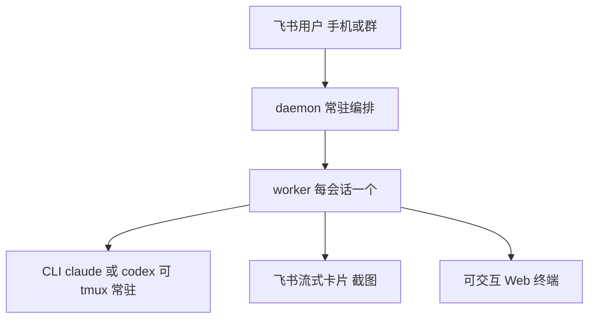
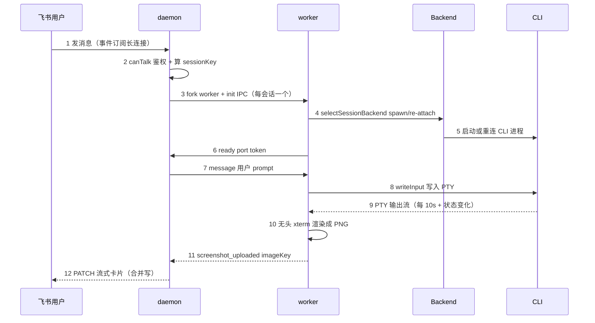
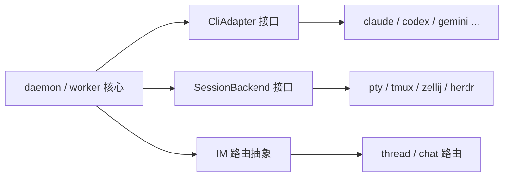
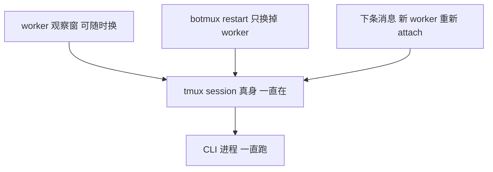
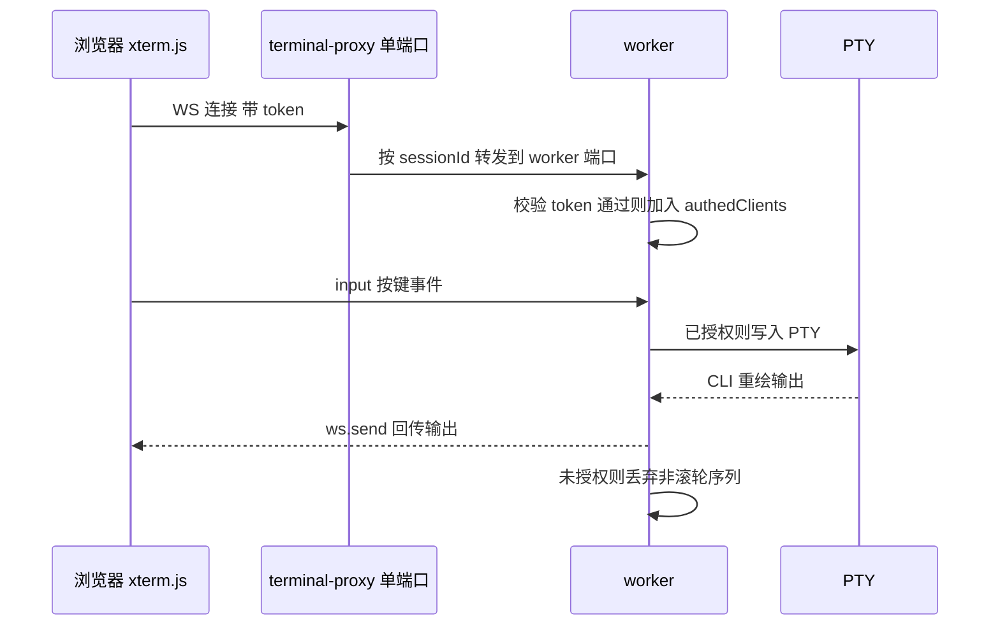
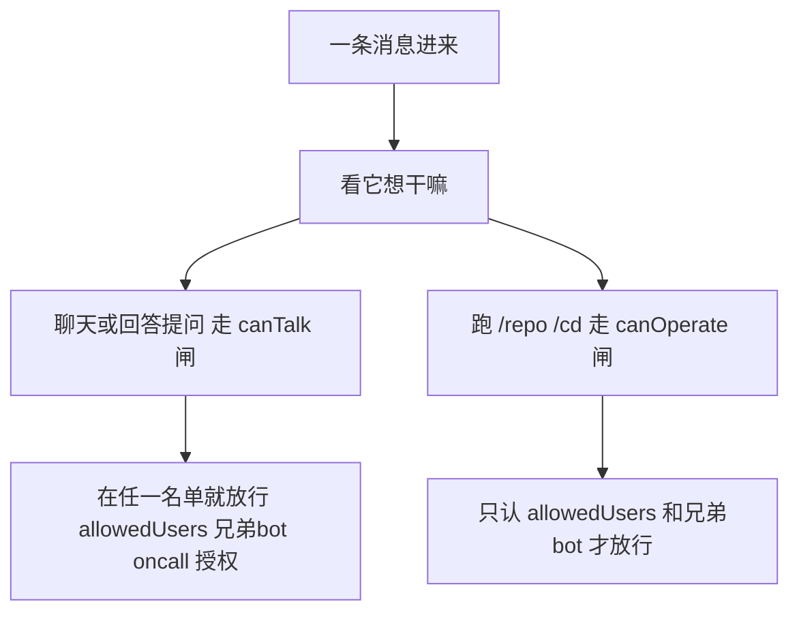
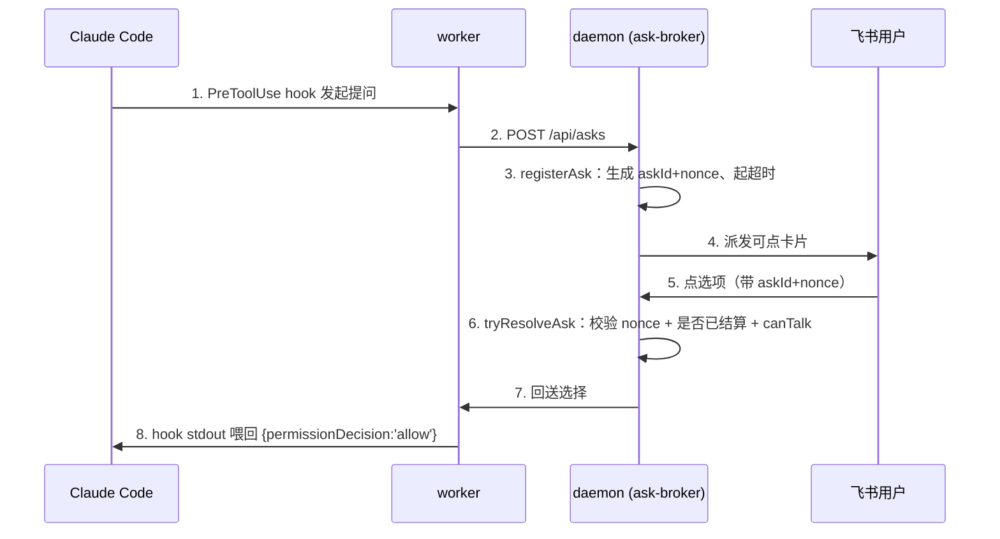

## 1. botmux

[botmux](https://github.com/deepcoldy/botmux) 是一个常驻 daemon：它监听飞书 / Lark 的消息，为每一个会话拉起一个独立的 AI 编程 CLI 进程（Claude Code、Codex、Cursor、Gemini、OpenCode、Antigravity、GitHub Copilot 等），把 CLI 的终端画面实时渲染成图片推送到飞书卡片，同时为每个会话开一个可交互的 Web 终端。你在手机飞书里发一句话，机器人在服务器上替你跑 `claude`，跑的过程一帧一帧回传到卡片上，你随时能点开一个网页终端直接敲键盘接管。

它的定位写在 README 第一句：**不做 SDK wrapper，直接桥接 CLI 进程**。记忆、上下文管理、工具调用、权限体系这些能力，CLI 自己都在快速迭代，botmux 不平行重造，而是站在 CLI 之上做编排——CLI 升级，botmux 零适配自动受益。这个定位决定了它几乎不碰 agent 能力，它解决的是另外三类纯工程问题：**进程编排、终端 I/O 投影、多租户路由**。

### 1.1 痛点：人不在电脑前，但 agent 在干活

设想一个具体场景：周五晚上你已经离开工位，线上一个服务报警，你想让 agent 先去看日志、定位问题、给个初步修复。手头只有手机。你发一句话过去——看下 order-service 最近的 5xx，先别改代码——服务器上的 `claude` 就在仓库目录里跑起来，分析过程你在飞书里一帧一帧看着；它要执行一条 `kubectl` 前先弹张卡片等你点同意；分析完给结论，你觉得可以动手了，点开一个链接，手机浏览器里就是那个 `claude` 的完整终端，你直接接管敲命令。

这不是个例。重构模块、跑一轮测试改 bug、批量处理日志，这些耗时任务你都不想守着电脑等——派出去、随时瞄一眼、要拍板时弹个卡片、要上手时点开就是完整终端，这是最理想的工作方式。

可真要把它做出来，会连续撞到四个工程问题：

- agent CLI 是个 TUI 程序（TUI = 全屏终端界面，靠光标控制原地刷新重绘，像 `top`、`vim` 那种满屏滚的东西），输出是一堆带 ANSI 颜色转义的字节，怎么把它投到一个只能显示图片和文本的 IM 卡片上？
- 服务器上同时有几十个会话在跑，daemon 要升级重启，怎么做到**重启不打断正在跑的 CLI**、也不丢上下文？
- 一个群里多个机器人、多个用户，谁能让机器人干活、谁只能围观、谁能替 agent 点同意执行，这套权限怎么收敛？
- 接了 7 种 CLI，每种启动参数、输入方式、就绪信号都不同，怎么不让这些差异污染核心逻辑？

botmux 把这四件事都做了，而且做法都有可迁移价值。

### 1.2 四个可迁移工程模式

1. **三轴适配器 + 注册表工厂**。把三件会变的事——接哪种 CLI、跑在哪种终端、对接哪个 IM——各做成一个接口加一张注册表。新增一种只改局部，核心不动。多云部署脚本、多 IM 网关、多数据源 ETL，凡是要桥接一堆异构外部系统的工具，都是这套骨架。

2. **进程脱离编排者常驻 + 惰性重连**。用 tmux/zellij 把子进程托管成独立常驻，编排进程重启时只读回元数据、先不拉起子进程，等下一条请求再重新接管。管理进程要频繁升级、被管进程却不能跟着死的场景，都用得上。

3. **无头终端投影**。一个不是你写的 child 进程，它的终端界面用无头 xterm 渲染成图片推出去，再反向代理出一个能交互的 Web 终端，读和写两条通道用 token 分权。远程运维面板、CI 实时日志、把任意 CLI 投到远端看，都是它的变体。

4. **双闸权限**。用 `canTalk` 和 `canOperate` 两个纯函数，把能不能跟机器人对话、能不能让它跑管理命令拆成两条互不相干的判定线，再守住一条底线：对话权限绝不升级成管理权限。多租户机器人、多人协作工具的授权都能照搬。

本地对照源码看：

```bash
cd _references && git clone https://github.com/deepcoldy/botmux.git
cd botmux && git checkout v2.93.1
```

路径都从仓库根算起。项目代码以 TypeScript 为主，daemon / worker / web 终端三类进程协作，核心模块单文件偏大（`worker.ts` 5580 行、`daemon.ts` 3998 行）。本文基于 tag `v2.93.1`（commit `1d24e82a`）。

## 2. 部署形态与 5 分钟接入

botmux 能本地跑，但它不是一个纯本地工具——它要先在飞书开放平台建一个应用（拿 AppID / AppSecret、配事件订阅），再以 daemon 形态常驻。所以5 分钟跑起来对它来说是5 分钟接入飞书。

前置要求三样：Node.js ≥ 22；本地已装好并登录至少一种 AI 编程 CLI（`claude` / `codex` / `gemini` 等在 PATH 中，botmux 桥接它们而不自带）；推荐顺手装 tmux（终端复用器，能让终端里的程序在你断开连接后继续跑——装了它 botmux 自动启用会话常驻，见 4.2）。还有一个容易漏的——**CJK 字体**：截图要把中文渲染出来，Linux 精简镜像常常没装，botmux 启动时检测到缺会后台 `apt-get install fonts-noto-cjk`（需免密 sudo），macOS 自带 PingFang / Hiragino 不用管（细节见 4.3.3）。

```bash
npm install -g botmux
botmux setup
```

`botmux setup` 是交互式向导，核心是**扫两次码**：

- 第一次扫码走飞书官方 device flow（底层 `@larksuiteoapi/node-sdk`），自动建出一个 PersonalAgent 应用、落盘 AppID/AppSecret，事件订阅和机器人能力默认配好。
- 第二次扫码让 botmux 内置的飞书 Web 登录自动导入权限、配重定向 URL、创建并提交发布版本。

向导里会让你选这个机器人接哪种 CLI、默认工作目录填哪。配完启动：

```bash
botmux start
```

第二次扫码是为了让 botmux 以你的身份完成开放平台那一串配置（导权限、配回调、发版），省掉手点浏览器——失败也不阻塞，会打印手动步骤回退。确认机器人能正常收发后，跑一次 `botmux autostart enable` 设开机自启，daemon 就常驻了。

然后在飞书里建一个话题群，把机器人加进去，发消息就会自动响应。一次完整的使用流程是这样：

1. 在话题群发消息开新话题；机器人弹出仓库选择卡片，选项目或点直接开启会话。
2. CLI 在所选目录下启动，话题里出现一张实时流式卡片，逐帧刷新终端画面。
3. 卡片上能直接点 Esc / Ctrl+C / 方向键操作终端，点获取操作链接会私聊给你一个可写的 Web 终端地址。
4. 每轮对话一张新卡片，上一轮冻结存档。

多机器人是它的招牌玩法：同一台机器跑多个飞书机器人，每个对应不同 CLI，同群里 `@<bot1> @<bot2> /t 任务` 可以让两个机器人各起独立会话并行干活。这套多 bot 协作能成立的地基，是复合会话键（4.1.4 展开）。

如果你只是想读懂它而不接飞书，也可以纯静态读源码——本文后面所有结论都锁定到了具体文件行号，不需要把环境跑起来。

## 3. 全景架构

先给一张全景图垫底。botmux 跑起来就三层东西：你这边是飞书，中间是一个常驻的 daemon，daemon 给每个会话开一个 worker 小弟，每个小弟管一个真正干活的 CLI。手机看的截图、网页里的终端，都是 worker 从 CLI 那儿引出来的两根管子。先把这张图记在脑子里，后面每一节都是在放大其中一块。



带着这张图看，botmux 运行期就是三类进程协作。一条飞书消息从进来、到 CLI 收到 prompt、再到画面回传，完整走一遍是这样：



进程职责对照：

| 进程 | 文件 | 职责 | 数量 |
|---|---|---|---|
| daemon | `src/daemon.ts` | 编排层：监听飞书事件、路由、持有全部会话状态、fork worker、PATCH 卡片 | 每个 bot 一个 |
| worker | `src/worker.ts` | 每会话一个子进程：驱动 CLI、捕屏渲染、跑 Web 终端 HTTP+WS 服务 | 每个活跃会话一个 |
| CLI | 外部二进制 | 真正干活的 agent，可常驻在 tmux 内 | 每会话一个 |

为什么要把 worker 拆成独立进程，而不是在 daemon 里开个协程跑 CLI？三个理由：

- **隔离崩溃**：CLI 是外部二进制，卡死或 OOM 不能拖垮管着几十个会话的 daemon。worker 是独立进程，崩了 daemon 只收到一个 `exit` 事件。
- **独占资源**：每个 worker 要给自己的 CLI 开一根 PTY（伪终端，操作系统伪造的一根"键盘 + 屏幕"数据线，程序以为对面坐着个真人在敲），还要起一个 Web 终端 HTTP 服务。进程级隔离让这些资源天然不打架。
- **独立 env**：per-bot 的环境变量（GLM 端点、代理）按进程注入，进程边界就是隔离边界。

代价是进程间只能传可序列化的消息、不能共享内存——于是有了 daemon ↔ worker 那两条 IPC（进程间通信）总线。

daemon 与 worker 之间走 Node `fork` 的 IPC channel，消息是两条判别联合类型（`src/types.ts:272` 起）。`DaemonToWorker` 是下行指令，`WorkerToDaemon` 是上行事件，收端各一个 `switch (msg.type)` 穷尽分发。下面这段不用逐字段细读，扫一眼两个方向各有哪些代表消息就够：

```ts
type DaemonToWorker =
  | { type: 'init'; sessionId: string; cliId: string; backendType: BackendType; prompt: string; /* …共 44 个字段 */ }
  | { type: 'message'; content: string }      // 用户后续消息
  | { type: 'raw_input'; content: string }     // 原样透传给 CLI 的斜杠命令
  | { type: 'term_action'; key: TermActionKey } // 卡片键盘按钮
  | { type: 'close' } | { type: 'set_display_mode'; mode: DisplayMode } /* … */;

type WorkerToDaemon =
  | { type: 'ready'; port: number; token: string }              // Web 终端起好了
  | { type: 'screen_update'; content: string; status: ScreenStatus }  // 文本态
  | { type: 'screenshot_uploaded'; imageKey: string; status: ScreenStatus }  // 图片态
  | { type: 'tui_prompt'; options: Array<…> }  // CLI 弹了菜单
  | { type: 'final_output'; … } | { type: 'claude_exit'; … } /* … */;
```

`init` 这条单消息就背了 44 个字段（从 sessionId、cliId 到 adopt 元数据、skill 目录、per-bot env 全塞在里面），因为 worker fork 出来是张白纸，启动所需的一切都得靠这一条消息带过去。

代码量分布也能呼应这张图——重量都压在IM 交互和进程编排两块：

| 文件 | 行数 | 职责 |
|---|---|---|
| `worker.ts` | 5580 | 每会话子进程：驱动 CLI、捕屏渲染、内嵌 Web 终端前端 |
| `cli.ts` | 5639 | CLI 入口 + setup 交互向导 |
| `daemon.ts` | 3998 | 编排层：事件路由、会话状态、卡片 PATCH |
| `worker-pool.ts` | 2949 | worker 生命周期、会话→worker 映射、IPC 路由 |
| `command-handler.ts` | 2937 | 斜杠命令三层分发 |
| `card-handler.ts` | 2175 | 卡片按钮回调（term_action / tui / approve…） |
| `card-builder.ts` | 1993 | 飞书卡片 JSON 构造 |
| `event-dispatcher.ts` | 1874 | 事件分发 + `canTalk` / `canOperate` 鉴权 |
| `session-manager.ts` | 1560 | 会话持久化 + 重启恢复 |
| `report.ts`（insight） | 1399 | 会话洞察：解析 transcript 出报告 |
| `bot-registry.ts` | 928 | 多机器人配置加载 + 状态 |
| `tmux-backend.ts` | 781 | tmux 常驻后端 |
| `screenshot-renderer.ts` | ~284 | 无头 xterm → PNG |

核心抽象不多，五个贯穿全项目：

| 抽象 | 位置 | 一句话定位 |
|---|---|---|
| `DaemonSession` | `src/core/types.ts:30` | 一个会话的全部状态：worker 句柄、端口、token、scope、工作目录、卡片渲染态 |
| `CliAdapter` | `src/adapters/cli/types.ts` | 一种 CLI 的全部差异（启动参数、输入写入、就绪正则）打包成一个接口 |
| `SessionBackend` | `src/adapters/backend/types.ts:34` | CLI 进程跑在哪、I/O 怎么进出（pty / tmux / zellij / herdr） |
| `WorkerPool` | `src/core/worker-pool.ts` | 管 worker 子进程生命周期、会话→worker 映射、IPC 路由、卡片合并写 |
| 双闸函数 | `src/im/lark/event-dispatcher.ts:843/881` | `canTalk` / `canOperate` 两条独立授权判定线 |

`CliAdapter` 和 `SessionBackend` 是两根变化轴的隔离层，`DaemonSession` 是状态中枢，`WorkerPool` 是进程编排核心，双闸函数是权限脊梁。后面四节按三轴适配器 → 会话常驻 → 终端投影 → 双闸权限的顺序逐个拆开，正好对应开头承诺的四个模式。

## 4. 核心模块

### 4.1 三轴适配器：把三个变化轴各自隔离

**30 秒版**：botmux 要接 7 种 CLI、3 种终端后端、还可能换 IM 平台——把这三件会变的事各做成一个接口加一张注册表，新增一种只改一处，核心不动。

#### 4.1.1 桥接 N 个异构外部程序的发散问题

botmux 要接 7 种以上 CLI，每种的脾气都不一样：Claude Code 的就绪信号是一个 SessionStart hook，Codex 有自己的消息队列支持 type-ahead，Gemini 可以把首轮 prompt 直接塞进 `-i` 参数，有的提交输入要回车有的不用。与此同时，CLI 进程可以跑在裸 PTY 里，也可以跑在 tmux / zellij 里，还可以是远程执行服务。再叠加一层：今天对接飞书，明天可能要对接 Lark 国际版甚至别的 IM。

如果不做隔离，这些差异会以 `if (cliId === 'claude') ... else if (cliId === 'codex')` 的形式渗透进 daemon 的每一个角落，最后变成没人敢动的分支地狱。

#### 4.1.2 两种主流隔离方式对比

| 方案 | 怎么做 | 优点 | 代价 |
|---|---|---|---|
| A：插件式 + 运行时注册 | 每个适配单元一个独立模块，运行时动态发现、加载（像 webpack loader、ESLint plugin） | 第三方可扩展、热插拔 | 要维护插件协议、版本兼容、加载顺序——对自用工具是过度设计 |
| B：编译期接口 + 静态注册表工厂 | 定义一个接口，每种实现一个文件，switch-case 工厂按 id 实例化，TS 编译器全程兜类型 | 简单、类型安全、IDE 跳转友好 | 加新实现要改注册表那一个文件（但只改一处） |

还有第三条路：OpenClaw 这类基于 Agent SDK 重建的方案不桥接 CLI，而是用 SDK 重新实现 agent 能力——绑定单一 SDK，换 CLI 等于重写。botmux 选了方案 B 的桥接路线，把"接入差异"收敛成接口实现，而不是"能力差异"收敛成 SDK 调用。

#### 4.1.3 botmux 的选择：编译期接口 + 三轴划分

botmux 走方案 B——编译期接口加静态注册表，不搞运行时插件系统。在这个前提下，它把变化拆成三根正交的轴，每根一个接口加一个注册表：



- **CLI 轴**（`src/adapters/cli/`）：接口 `CliAdapter`（`adapters/cli/types.ts:54`）把每种 CLI 的差异抽象成方法和属性。光看 `buildArgs` 的入参就能感到这层抽象的密度——它要兜住这个 CLI 怎么 resume、怎么塞首轮 prompt、收不收 `--model`、要不要绕过审批这些发散需求：

  ```ts
  buildArgs(opts: {
    sessionId: string; resume: boolean; resumeSessionId?: string;
    initialPrompt?: string;        // Gemini 直接 -i 塞进 args，别的写 stdin
    model?: string;                // CLI 不认 --model 的就忽略这个字段
    disableCliBypass?: boolean;    // true 时不加「绕过审批 / 关沙箱」的默认 flag
    skillPluginDir?: string;
  }): string[];
  readonly passesInitialPromptViaArgs?: boolean;   // 首轮 prompt 走 args 还是 stdin
  buildResumeCommand?(opts): string | null;        // 给「会话已关」卡片生成可粘贴的本地 resume 命令
  ```

  注意 `buildResumeCommand` 返回 `string | null`——opencode、Gemini 的只能 resume 最新一个模式没法精确按会话 resume，就老实返回 `null` 让卡片退回静态提示。接口用可空返回值显式承认不是每个 CLI 都支持这能力，比假装支持然后跑出错强。
- **后端轴**（`src/adapters/backend/`）：接口 `SessionBackend` 把进程跑在哪抽象成 `spawn / write / resize / onData / onExit / kill`。
- **IM 轴**（`src/im/lark/`）：用 `DaemonSession.scope` 字段把回复路由收敛成 `thread`（话题内回复）和 `chat`（普通群消息）两种策略，再用 `ChatReplyMode` 四态（`bot-registry.ts:15`，`chat` / `new-topic` / `shared` / `chat-topic`）描述普通群里每次 @ 该开新话题、该折进同一话题还是该复用一个 chat-scope 会话。

CLAUDE.md 里把新增一种 CLI写成一张 8 步 checklist——加文件、加进 `CliId` 联合类型、注册表加 case、几处显示名加映射。改动是机械的、局部的，这正是接口隔离到位的体现。

三轴隔离之上，消息进核心后还有一层**命令分发**，是同一个路子（`command-handler.ts`）。一条消息进来，分三层判定：

- **passthrough 命令**（`/model` `/clear` 这类 CLI 自己的斜杠命令）：原样透传给 CLI。
- **daemon 命令**（`/repo` `/relay` 这类 botmux 自己处理的）：进程内处理。
- **都不是**：当普通用户消息，路由给会话。

有效的 passthrough 集合是三份并起来的——内置的、适配器默认的、bot 自定义的（`resolvePassthroughCommands`，`command-handler.ts:115`）。判定顺序上 passthrough 排在 daemon 命令之前，这样某个 CLI 自带的 `/status` 不会被 botmux 的同名命令吃掉。

命令该走哪条路是查集合，不是写一长串 `if`。这跟三轴适配器一个品味：把分支收敛成数据。

#### 4.1.4 复合会话键：让多 bot 同群成立的一行代码

三轴隔离之外，多租户路由还有一个关键抽象——复合会话键。daemon 在内存里维护 `Map<string, DaemonSession>`，键不是简单的会话 id，而是（`src/core/types.ts:171`）：

```ts
export function sessionKey(anchorId: string, larkAppId: string): string {
  return `${anchorId}::${larkAppId}`;
}
```

`anchorId` 在 thread-scope 下是话题根消息 id（飞书里以 `om_` 开头），chat-scope 下是群 id（以 `oc_` 开头）——两个地址空间前缀不同，天然不会撞。再叠加 `larkAppId` 这一维，**同一条话题里多个机器人各自独立持有会话、互不干扰**。多机器人同群 @mention 路由、各起独立会话这个招牌功能，地基就是这一个函数。

#### 4.1.5 关键代码：注册表工厂与 claude-code adapter

接口定义之外，真正把加一种 CLI 是局部改动落实的是注册表那个工厂函数（`src/adapters/cli/registry.ts:111`）：

```ts
switch (id.toLowerCase() as CliId) {
  case 'claude-code': return createClaudeCodeAdapter(pathOverride);
  case 'codex':       return createCodexAdapter(pathOverride);
  case 'gemini':      return createGeminiAdapter(pathOverride);
  // ... 18 个 case，每个对应一个独立 adapter 文件 ...
  default: throw new Error(`Unknown CLI adapter: ${id}`);
}
```

`id` 先被断言成 `CliId` 联合类型再进 switch——这一步把字符串收窄成有限集合，新增一种 CLI 要先往 `CliId` 里加成员，TS 才让你在 switch 里加 case。联合类型当成待实现清单，是这套静态注册表能保持完整的关键。

具体某个 adapter 的 `buildArgs` 才是接口字段 → 真实命令行的落点。看 claude-code 的实现（`src/adapters/cli/claude-code.ts:492`），哪一行体现核心设计一目了然：

```ts
buildArgs({ sessionId, resume, resumeSessionId, model, disableCliBypass, skillPluginDir }) {
  const args: string[] = [];
  if (resume) args.push('--resume', resumeSessionId ?? sessionId);   // ← 续接
  else        args.push('--session-id', sessionId);                  // ← 新建
  if (model?.trim())     args.push('--model', model.trim());          // CLI 不认就不会进来
  if (!disableCliBypass) args.push('--dangerously-skip-permissions'); // 绕过审批的默认 flag
  // ... 进程级 --settings（只承载 bypass 键）+ --plugin-dir 注入 botmux 内置 skill ...
  args.push('--append-system-prompt', buildBotmuxSystemPromptText({ locale, botName, botOpenId }));
  return args;
}
```

最体现设计的是开头那个 `if (resume)` 分支：**同一个接口方法兜住新建会话（`--session-id`）和续接会话（`--resume`）两种状态**，上层（worker）只管传一个 `resume` 布尔，至于这个 CLI 用什么 flag 表达续接是 adapter 自己的事。`disableCliBypass` 那行是另一处——它把要不要绕过审批从一个散落各处的判断收敛成接口的一个入参，沙箱模式下置 true，这一行连同 `--settings` 里的 bypass 键就都不加了。adapter 的价值就在这里：把每种 CLI 五花八门的 flag 翻译成几个语义化的接口字段。

`DaemonSession`（`src/core/types.ts:30`）本身是状态中枢，它的注释划清了一条边界：纯 IM 渲染态放在 IM 适配器自己的 Map 里，不挂到这个类型上——保持核心会话态与具体 IM 解耦，这是 IM 轴可替换的前提。

多 bot 的配置模型在 `bot-registry.ts`。每个机器人是 `bots.json` 里的一条记录，以 `larkAppId` 为主键，各自配各自的 `cliId`、`model`、`backendType`、`workingDir`、`allowedUsers`，甚至各自一套 `env`。最值得单看的是 `env`：它让一台机器上 bot A 跑官方 Claude、bot B 跑第三方 GLM 成立，只需给后者填两个环境变量（`ANTHROPIC_BASE_URL` 加 key）。

而这套 env 的关键是不能串台。tmux 后端的注入走每个 pane 的 `/usr/bin/env`，不写进共享 server 的全局 env（这个 shell 包装的精巧处 4.2.3 会讲），所以 bot A 的服务商配置绝不会漏进 bot B 的会话。一份配置文件养一群脾气各异的机器人，就靠两点：每条记录自带全套适配参数，加进程级隔离。

#### 4.1.6 关键取舍

这个模块真正的取舍只有一个，但值得记一辈子——**静态注册表 vs 插件系统**：botmux 选静态，换来类型安全和简单，放弃了第三方热插拔。对比 claude-code-router 这类纯路由层，它面对的是 N 个 provider 的协议翻译，差异是数据形状的（端点、鉴权头、字段映射），用一张配置表就能描述清楚；botmux 面对的是 N 个 CLI 的行为差异（怎么拼参数、怎么写输入、怎么判就绪），没法用表表达，只能用接口。

一句话尺子：**差异是数据就用表，差异是行为就用接口**。硬把行为差异塞进配置表，会得到一张带"回调字符串""条件分支字段"的畸形表；硬把数据差异写成接口，又会得到一堆只 return 一个常量的样板实现。

（`DaemonSession` 那个 50+ 字段巨型类型也是个值得说的取舍，但它属于"不该照搬"，放到第 6 节一起讲。）

#### 4.1.7 自己实现最小版本

三轴适配器的骨架其实很短，核心就是接口 + 注册表工厂 + 缓存：

```ts
// 1. 定义接口（CLI 轴）
interface CliAdapter {
  id: string;
  buildArgs(opts: SpawnOpts): string[];           // 怎么拼启动参数
  writeInput(pty: IPty, content: string): void;   // 怎么把输入喂进去
  readyPattern: RegExp;                            // 怎么判断「就绪可接收输入」
}

// 2. 每种实现一个文件
const claudeAdapter: CliAdapter = {
  id: 'claude-code',
  buildArgs: (o) => ['--resume', o.sessionId, '--settings', o.settingsPath],
  writeInput: (pty, c) => { pty.write(c + '\r'); },
  readyPattern: /│\s*>\s*$/,
};

// 3. 注册表工厂 + 缓存（唯一需要改的「中心」文件）
type CliId = 'claude-code' | 'codex';   // 待实现清单：加一种 CLI 先往这里加成员
const cache = new Map<string, CliAdapter>();
function createCliAdapter(id: CliId): CliAdapter {
  if (cache.has(id)) return cache.get(id)!;
  let a: CliAdapter;
  switch (id) {
    case 'claude-code': a = claudeAdapter; break;
    case 'codex':       a = codexAdapter;  break;
    default: {
      const _exhaustive: never = id;  // CliId 加了成员却忘了 case，这里编译期报错
      throw new Error(`unknown cli: ${_exhaustive}`);
    }
  }
  cache.set(id, a);
  return a;
}

// 4. 后端轴同构：interface SessionBackend { spawn; write; onData; kill } + selectBackend(type)
```

新增第 8 种 CLI，就是写一个新对象 + 在 switch 里加一行。后端轴照抄这套结构，把 `spawn` 实现换成 `pty.spawn` 或 `tmux new-session` 即可。

### 4.2 会话常驻：让 CLI 进程脱离 daemon，重启不丢

**30 秒版**：把 CLI 跑进 tmux，daemon 只是趴窗户往里看的那个 pty。daemon 重启、worker 换代，房间里的 CLI 照样活着，下条消息来了新 worker 重新趴上去看就行。

#### 4.2.1 编排进程要升级，但被管进程不能死

botmux daemon 会频繁重启——改了代码要 `botmux restart`，升级版本要重启。但服务器上可能有几十个 CLI 会话正在跑，有的 agent 正干到一半。如果 daemon 重启就把所有 CLI 杀掉，每次升级都等于让所有人的活白干，这不可接受。

需求拆成两半：

- **进程存活**：daemon 重启时，CLI 进程要继续活着。
- **状态恢复**：daemon 起来后，要能找回之前有哪些会话、各自跑到哪、卡片在哪条消息上。

#### 4.2.2 三种主流做法对比

| 做法 | 思路 | 卡在哪 / 代价 |
|---|---|---|
| A：全序列化状态、重启整盘恢复 | 像 pm2 那样存下状态再恢复 | CLI 的状态是内存里的对话上下文，没法序列化；只能靠 `--resume` 从磁盘重载，丢内存态又有成本 |
| B：每会话一个 systemd service | 把每个会话跑成独立守护进程 | 进程是活了，但 daemon↔CLI 的 I/O 通道（PTY）随 daemon 消失，重连要重新接管，systemd 不管这个 |
| C：CLI 跑进 tmux / zellij 终端复用器 | 复用器是独立 server 进程，daemon 只当"attach 上去看"的客户端 | 保活和 I/O 通道一起给了，daemon 死了 CLI 不受影响；代价是依赖系统装了 tmux |

做法 C 这条路上有 tmux-resurrect、Eternal Terminal、mosh 等成熟方案，但它们面向人（手动 attach、断线自动重连）；botmux 要的是程序化地 attach/detach/capture，所以用的不是交互 attach，而是 `pipe-pane` + `send-keys` 这套适合程序驱动的接口。

botmux 选 C 当主路径，再拿做法 A 的磁盘 transcript 兜底：有 tmux 时进程真常驻、热重连；没 tmux 时退到 `PtyBackend` + `--resume` 冷恢复。主路径要能力，兜底路径要可用，两条都给。

#### 4.2.3 botmux 的实现：pty 是观察窗口，tmux session 才是真身

tmux 会话名是确定性的（`src/adapters/backend/tmux-backend.ts:70`）：

```ts
static sessionName(sessionId: string): string {
  return `bmx-${sessionId.slice(0, 8)}`;
}
```

spawn 时先探测同名 session 在不在，决定新建还是重连（`tmux-backend.ts:205` 一带）：

```ts
this.reattaching = TmuxBackend.hasSession(this.sessionName);
if (this.reattaching) {
  // CLI 还在跑 —— 这个 node-pty 只是 attach 上去当观察窗口
  this.process = pty.spawn('tmux', ['attach-session', '-t', this.sessionName], opts);
} else {
  // 新建 session，用 shell 包一层把 CLI 跑进去（实参做了精简，见下）
  this.process = pty.spawn('tmux',
    ['new-session', '-s', this.sessionName, '--', shell, '-c', script, bin, ...args], opts);
}
```

上面的 `new-session` 实参为了读着清楚做了精简——完整版还要传 `-x` / `-y` 把终端尺寸定死，以及一串 `envAssignments`（per-bot 环境变量注入的关键步骤，4.2 末尾会讲它为什么要放在这里），完整参数结构见 `tmux-backend.ts:235` 一带。

这段代码就一个关键认知，记住它整节就通了：**那个 node-pty 句柄只是一扇观察窗，tmux session 才是真身。** 打个比方——tmux session 是一间一直开着灯、有人在里面干活的房间，worker 的 pty 只是趴在窗户上看的人。看的人走了（worker 退出），房间里的人照样干活。下面这张图就是这个意思：



worker `kill()` 时只是把这扇观察窗关掉，房间（tmux session）和里面的 CLI 继续跑。这就是为什么 `botmux restart` 不打断任何会话：daemon 和 worker 全换一遍，CLI 一个没死，下条消息来了新 worker 重新趴窗户上就行。只有 `/close` 才是真把房间拆了。

生产实际用的是 `TmuxPipeBackend`（observe 模式），它连 attach 都不做，而是旁路观察（`tmux-pipe-backend.ts:9` 注释）：

```
- mkfifo 建一个唯一的 fifo
- tmux pipe-pane -O -t <pane> 'cat > <fifo>'  —— tmux 把 pane 每一字节复制进 fifo
- fs.createReadStream(<fifo>) 读这条 ANSI 流
- 所有写入走 tmux send-keys / paste-buffer，capture-pane 取当前屏
```

为什么不直接 attach 而要 pipe？因为 `/adopt` 接管用户自己的 tmux 时，用户那边可能正开着 iTerm2 的 `-CC` 控制协议客户端，再 attach 一个会让控制协议和 ANSI 互相打架、画面错乱。pipe-pane 是从 tmux 视角完全零侵入的单向观察。

fifo 这条路有个一般性坑值得记一下：读端跟不上，写端（`cat > fifo`）就会阻塞，反压回 tmux，连带把 pane 里 CLI 的输出卡住。botmux 靠一个一直在 drain 的 `createReadStream` + 流式解码器（处理 64KB 边界上断成两半的多字节字符）避开它。自己仿的时候要守住一条：fifo 的 reader 必须一直读、读出来的活别在主路径上干重的，否则管道一堵，被观察的进程跟着卡。

命名上还藏了个细节。CLI 一旦启动失败，botmux 不会让那个失败的 pane 继续顶着 `bmx-<id>` 这个正常名字。为什么？因为下次探测会照名字找 session，看到它还在就以为 CLI 活着，re-attach 上去才发现是个空 shell。

它的做法是换个前缀：失败的现场挪到 `bmx-diag-<id>` 另存（`tmux-backend.ts:82`），把错误留在那儿待查。正常态叫 `bmx-`，诊断态叫 `bmx-diag-`，名字一区分，状态就不会认错。

daemon 重启后怎么把会话找回来？逻辑在 `restoreActiveSessions()`（`session-manager.ts:695`）：从磁盘读出所有还在活跃状态的会话，按三种情况分头处理。

- **adopt 会话**：先确认外部 pane 还活着，再重连。
- **queued 待办会话**：只登记、不拉起 CLI，保持 `hasHistory:false`（`:787`）。这条注释里标了红线——它绝不能走通用恢复分支，否则下一条消息会去 `--resume` 一个根本不存在的 CLI。
- **有历史的活跃会话**：先建好会话对象，但 worker 留空，等下一条消息来了才真正 fork（`:830`）。

最后一条是省资源的关键。重启后哪怕有 50 个历史会话，也不会一上来就拉起 50 个 worker——恢复的只是元数据，进程留到真有请求时再起。

会话状态落在 `~/.botmux/sessions-<larkAppId>.json`。写入走临时文件 + `renameSync` 原子替换，避免写到一半被读到半截。还有个小优化：要写的内容跟磁盘上现有的一模一样，就直接跳过这次写（`session-store.ts:110`）。daemon 处理一条消息会触发好几次 `updateSession`，这一下就挡掉了大量重复写盘。

常驻还有一个反向的用法：把一个**已经在跑、但不是 botmux 起的** CLI 接管进来（`/adopt`）。你可能在 iTerm2 里手动开了个 `claude` 干到一半，想转手机上继续——botmux 要能发现它、attach 上去观察、再双向同步。难点在发现：botmux 怎么知道某个 tmux pane 里跑的是哪种 CLI、是哪个会话？答案是翻进程信息（`src/core/session-discovery.ts`）：

```ts
// /proc/<pid>/cmdline → argv（Linux 快路径，macOS 回退 ps）
export function readCmdline(pid: number): string[] {
  return readFileSync(`/proc/${pid}/cmdline`, 'utf-8').split('\0').filter(Boolean);
}
// 进程名 → CliId 的映射表
const CLI_COMM_MAP: Record<string, CliId> = { claude: 'claude-code', codex: 'codex', /* ... */ };
```

zellij 的接管更麻烦，因为 `zellij list-panes` 不暴露 pid，没法直接把 pane 对到进程上。它的解法绕了个弯（`zellij-adopt-discovery.ts`）：先枚举 zellij session-server 的后代进程，收集所有已知 CLI 和各自的 cwd；再用 `dump-layout` 拿到每个 pane 的 command 和 cwd；最后按 `(cliId, cwd)` 两边匹配。

关键是**拒绝歧义匹配**：同一个 `(cliId, cwd)` 匹配到 0 个或多于 1 个进程，都不接（`findAllClisUnder` 还会把 `node → codex` 这种解释器包装链折叠掉，只认最深的原生进程）。识别没把握时宁可不接，也不乱接——接管本来就是在猜外部状态，保守点是对的。

接管之后，`adoptedFrom` 元数据落盘。daemon 重启时先用 `validateAdoptTargetState` 确认那个 pane 还活着才重连，配合前面的 liveness 去抖，免得把一次探活抖动误判成用户的会话没了。

#### 4.2.4 关键取舍

- **强依赖 tmux 的边界**。`BackendType`（`adapters/backend/types.ts:1`）一共四种，能力和适用场景如下：

  | 后端 | 进程脱离 daemon | daemon 重启 | 适用 |
  |---|---|---|---|
  | `pty` | 否 | CLI 随 worker 死，只能冷 `--resume` | 无 tmux 的环境，最简降级 |
  | `tmux` | 是 | 热重连，上下文不丢 | 默认推荐，装了 tmux 自动启用 |
  | `zellij` | 是 | 热重连 | 偏好 zellij 的用户 |
  | `herdr` | 是（远程） | 远程执行服务保活 | Hermes 内部的远程后端 |

  没 tmux 时降级到 `PtyBackend`（`pty-backend.ts`，仅 78 行）——CLI 是 worker 的直接子进程，worker 死则 CLI 死，daemon 重启只能冷 resume。这是个干净的降级：能力差，但不崩。选择策略在 `session-backend-selector.ts:18`，按 `backendType` 分流，tmux / zellij / herdr 模式下还会先探测对应的 `hasSession` 决定新建还是重连。四种后端实现同一个 `SessionBackend` 接口，所以 daemon / worker 的上层代码完全不感知自己跑在哪种后端上——这又回到 4.1 的三轴适配器：后端轴换实现，核心零改动。
- **会话数上限靠计数而非超时**。`idle-worker-sweeper.ts:13` 给每个 bot 一个 `maxLiveWorkers`（默认 30），超限时挑最久未活动且处于 idle 的会话 suspend（worker 退出，tmux 后台 session 保活），下次消息再冷恢复。注意它是计数上限不是空闲超时——绝不打断进行中的轮次。对比一下，很多 serverless 平台用空闲 N 分钟回收，那会误杀正在思考但没输出的 agent；botmux 用 `lastScreenStatus === 'idle'` 做守卫，只回收真空闲的。
- **liveness 去抖**。tmux/zellij 探活在高负载或 EMFILE 下会偶发超时，`liveness-gate.ts` 要求连续多次失败才判定真死，任何一次成功清零。单点探测不可靠时，用连续 N 次失败代替一次失败是通用的稳态判定技巧。
- **空闲本身怎么判**。计数回收依赖"这个会话是不是 idle"，可 CLI 是个不报告状态的黑盒，botmux 只能从 PTY 输出反推（`idle-detector.ts`），三条判据叠加：
    - 适配器的 `completionPattern`（每种 CLI 输入框就绪的特征正则）命中后，静默 500ms 判 idle；
    - PTY 静默 2 秒、且 3 秒内没出现过 spinner（转圈加载动画）；
    - spinner 一出现就刷新计时、把判定往后推，免得把"还在转圈思考"误判成空闲。

  这套启发式同时驱动三件事：卡片头部颜色、`final_output` 该不该发、回收时这个会话能不能动。从黑盒进程的输出流反推它的运行状态，是桥接任何不报告状态的外部程序都绕不开的活——正则 + 静默窗口 + spinner 抑制，是一套可复用的组合。

#### 4.2.5 自己实现最小版本

进程脱离 + 惰性重连的最小骨架，核心就是确定性 session 名 + 探测后二选一 + 元数据落盘：

```ts
import { spawn as ptySpawn } from 'node-pty';
import { execSync } from 'node:child_process';
import { writeFileSync, readFileSync, renameSync } from 'node:fs';

const sessName = (id: string) => `myapp-${id.slice(0, 8)}`;
const hasSession = (n: string) => {
  try { execSync(`tmux has-session -t ${n}`, { stdio: 'ignore' }); return true; }
  catch { return false; }
};

// 拉起或重连一个常驻会话
function openSession(id: string, cwd: string, bin: string, args: string[]) {
  const n = sessName(id);
  const view = hasSession(n)
    ? ptySpawn('tmux', ['attach-session', '-t', n], { cwd })          // 重连
    : ptySpawn('tmux', ['new-session', '-s', n, '--', bin, ...args], { cwd }); // 新建
  // view 死了不影响 tmux session 里的 bin 进程
  persist(id, { cwd, bin, args, status: 'active' });
  return view;
}

// 原子落盘 + 相同则跳过
function persist(id: string, meta: object) {
  const fp = `${process.env.HOME}/.myapp/sessions.json`;
  let raw = '';
  try { raw = readFileSync(fp, 'utf-8'); } catch { /* 首次还没这个文件 */ }
  const all = raw ? JSON.parse(raw) : {};
  all[id] = meta;
  const next = JSON.stringify(all);
  if (next === raw) return;            // 和磁盘上一模一样就跳过这次写
  const tmp = `${fp}.${process.pid}.tmp`;
  writeFileSync(tmp, next); renameSync(tmp, fp);
}

// 重启恢复：只登记元数据，worker 等首条消息才 re-fork（惰性）
function restore() {
  const all = JSON.parse(readFileSync(`${process.env.HOME}/.myapp/sessions.json`, 'utf-8'));
  for (const [id, meta] of Object.entries(all)) {
    if (meta.status !== 'active') continue;
    registry.set(id, { meta, view: null });   // view=null：先不 attach
  }
}
```

关键就两点：① attach 用的 pty 是可丢弃的观察窗口，tmux session 才是真身；② 重启恢复只填元数据，把 attach 推迟到真正有请求时。

### 4.3 把终端投影到手机

**30 秒版**：CLI 的终端画面，用一个不接显示器的 xterm 在内存里渲染成图片，定时推到飞书卡片给你看；想动手就开一个 xterm.js 网页终端连回去，读和写按 token 分权。

#### 4.3.1 把一个会刷新重绘的 TUI 塞进只能显示图片的卡片

agent CLI 是个 TUI 程序——输出带 ANSI 颜色、用光标控制序列原地刷新、画进度条和方框。这种东西没法直接当文本贴进 IM：贴原始字节是一屏乱码，贴 strip 掉转义的纯文本又丢了布局、丢了正在重绘的那一帧。

要把它投到手机飞书上，本质是要解决：怎么在服务器上**无头地**把终端画面渲染出来（没有真实显示器），再变成 IM 能展示的形态（图片），同时还得让用户能反向操作（在卡片上点键、在网页里敲键盘）。

#### 4.3.2 三种主流做法对比

| 做法 | 怎么做 | 问题 / 代价 |
|---|---|---|
| A：贴文本 | 把 ANSI strip 掉直接发文本消息 | 最简单，但 TUI 的方框、表格、进度条全废，Claude 那种重绘界面没法看 |
| B：录制成 asciinema 回放 | 录终端会话、事后回放 | 保真，但是事后回放不是实时投影，且 IM 里放不了播放器 |
| C：无头渲染成图片、定时推帧 | 无头 xterm（不接显示器，画面在内存里一格格算好、不往屏幕画）把屏幕缓冲区用 canvas 画成 PNG，定时上传 | 保真、IM 原生支持图片、能叠交互按钮；代价是要处理字体（CJK/emoji）、控制推帧频率不打爆 IM API |

Web 终端侧另有一条成熟路线：ttyd / gotty 把本地终端通过 WebSocket 暴露成网页 xterm.js。botmux 的 Web 终端正是这条路线，但它把IM 截图和Web 终端做成了同一个会话的两个投影面，共享同一个 PTY 源。

botmux 选 C 做卡片投影 + ttyd 式 Web 终端，两条通道并行。它的库选择极其克制——`package.json` 里只有 `@xterm/headless` + `@napi-rs/canvas` + `node-pty` + `ws`，**没有 puppeteer、没有 sharp、没有 electron**。无头渲染没有走起个 headless Chrome 截图的重路线。

#### 4.3.3 无头 xterm → PNG 的渲染管线

核心在 `src/utils/screenshot-renderer.ts`。`captureToPng()`（`screenshot-renderer.ts:215`）把 `@xterm/headless` 的屏幕缓冲区用 `@napi-rs/canvas`（skia 的 Node 原生绑定）逐格画成 PNG：

```ts
import { createCanvas, GlobalFonts } from '@napi-rs/canvas';
import xtermHeadless from '@xterm/headless';

export function captureToPng(terminal: Terminal, opts: CaptureOpts): Buffer {
  ensureFontRegistered();
  const { cols, rows, startY } = opts;
  const buffer = terminal.buffer.active;
  const canvas = createCanvas(PADDING * 2 + cols * CELL_W, PADDING * 2 + rows * CELL_H);
  const ctx = canvas.getContext('2d');
  // 逐行逐格遍历 buffer，每格取字符 + 前景/背景色 + 粗体 + 反色，画到 canvas
  for (let row = 0; row < rows; row++) {
    const line = buffer.getLine(startY + row);
    // ... line.getCell(col).getChars() / getFgColor() / isBold() ...
  }
  return canvas.toBuffer('image/png');
}
```

固定格宽 8.4px、格高 18px，Tokyo Night 配色（和 Web 终端一致）。**这里最值得抄的是字体链的顺序**：skia 在 Linux 上不自动发现系统字体，必须显式 `GlobalFonts.registerFromPath()`，且它会按字体链顺序逐字符找含该 glyph 的字体。源码注释把一个实测踩出来的坑写得很清楚（`screenshot-renderer.ts:42` 一带）：

```ts
// ── fontFamilyChain 顺序很关键 ──
// skia 按 chain 顺序逐字符找含该 glyph 的字体。Latin 必须放在 CJK 前面，
// 否则 CJK 字体（Hiragino / Noto Sans CJK）自带的 ASCII glyph 会先抢走拉丁
// 字符的渲染权，宽度跟 cell grid 不匹配 → 截图里英文字符间距时疏时密。
// 顺序：BotmuxMono → Latin mono → CJK mono → Color emoji。
```

直觉上把覆盖最全的 CJK 字体放前面，反而是错的——CJK 字体里那套全角 ASCII 字形会让等宽英文忽宽忽窄。正确顺序是：拉丁等宽（DejaVu / JetBrains / macOS 的 Menlo）放最前面占住 ASCII，CJK 只补汉字，emoji 再兜彩色符号。每一档都列了 Linux 和 macOS 各自的候选路径，逐个 `tryRegister` 探，哪个在用哪个。emoji 和 dingbats 还单独做了垂直居中校正，对齐位图字形的度量。

一句话记住：拉丁优先、CJK 补字、emoji 兜底，这个顺序是中英混排终端能正确截图的前提。装反了英文间距就乱，CJK 没注册中文就成方块。

字体文件本身从哪来，也是个落地问题。服务器尤其是精简的 Linux 镜像，常常根本没装 CJK 字体，那截图里中文就是一片方块。

botmux 用 `src/utils/font-installer.ts` 兜这件事：daemon 启动时检测到缺字体，就后台 `apt-get install fonts-noto-cjk fonts-noto-color-emoji`（需免密 sudo 或 root）。同时 `screenshot-renderer.ts:48` 的候选路径第一顺位就是 `~/.botmux/fonts/`，`botmux setup` 会把 Noto CJK / JetBrains Mono 下载到这里。字体探测每一档都从用户目录排到系统路径，列一串候选逐个 `tryRegister`，哪个在用哪个。

把渲染要用的外部资源缺失当成头等问题来处理，而不是假设环境里一定有，是这类要在陌生服务器上出图的工具必须补的功课。

对 pipe-pane 后端，用的是 `transient-snapshot.ts`：每次从 `tmux capture-pane` 拿一份新鲜 ANSI，喂进一个**用完即弃的 headless xterm**，截完即销毁——避免长生命周期 renderer 的状态漂移。

#### 4.3.4 推帧管线：定时 + 去重 + 合并写

worker 端是个 10 秒定时器（`src/worker.ts:2429`）：

```ts
const SCREENSHOT_INTERVAL_MS = 10_000;
screenshotTimer = setInterval(() => { void captureAndUpload(); }, SCREENSHOT_INTERVAL_MS);
```

从 CLI 吐字节到飞书卡片更新，整条流水线长这样：


`captureAndUpload()` 的链路对着图看就是：渲染 PNG → **MD5 去重**（屏幕没变就不传）→ 上传飞书 `POST /open-apis/im/v1/images` 拿 `image_key` → `send({ type:'screenshot_uploaded', imageKey })` 回 daemon。用户点了卡片按钮后还会 1 秒补一发单次截图给即时反馈，再恢复 10 秒节奏。

daemon 收到后（`worker-pool.ts`）缓存 `currentImageKey`，只在 `displayMode==='screenshot'` 且卡片已 POST 时重建卡片 JSON、调 `scheduleCardPatch()`。这个调度做**合并写**：飞书卡片 PATCH 还在飞的时候，新的卡片 JSON 排队（latest-wins），在飞的那次完成后再 flush——挡住高频帧把飞书 API 打爆。三道闸（10s 节流 + hash 去重 + 合并写）层层削掉冗余请求，是这类高频状态推送到限流外部 API的标准防御。

worker 回传的不是一种消息，是两种，分轻重。`screen_update`（`src/types.ts:311`）轻，只带文本快照和状态（starting / working / idle / analyzing / limited），每次状态变化都发；`screenshot_uploaded`（`:315`）重，要先渲染上传，才带新的 `imageKey`。

为什么拆两条？因为成本和频率不一样。状态一变就要立刻反映到卡片头部颜色（idle 绿、working 蓝、limited 红），这事轻、要勤发；但没必要每次都重渲一张图。更进一步，`displayMode` 默认是 `hidden`，用户点了显示输出才切到 `screenshot`——切之前 worker 连图都不渲。能省的渲染都推迟到用户真的要看的那一刻。

还有一类特殊的回传是 `tui_prompt`（`:313`）：worker 的 screen-analyzer 检测到 CLI 弹出了一个 TUI 选择菜单（比如 Claude 的是否允许多选），就把选项结构化地发给 daemon，daemon 渲染成一张可点的卡片，用户点选的结果再作为导航键回送、驱动 CLI 在菜单里选中。这跟 4.3.5 的卡片键盘按钮是两回事——键盘按钮是盲发一个按键，`tui_prompt` 是把 CLI 当前的菜单语义解析出来变成结构化选项。

#### 4.3.5 反向操作：从卡片按钮和 Web 终端写回 PTY

投影是单向的看，botmux 还做了反向的操作，两个入口：

**卡片键盘按钮**。只有 screenshot 模式才渲染那排手机键盘工具栏（`card-builder.ts:776`），按钮 value 是 `{ action: 'term_action', key }`，键有 `esc` / `ctrlc` / 方向键 / 半屏翻页。点击后 `card-handler.ts:1683` 把 `{ type:'term_action', key }` 发给 worker，worker 把键名转成 ANSI 字节写进 PTY。这就是在飞书卡片上敲 Esc / Ctrl+C 操作终端的闭环。

**可交互 Web 终端**。worker 内嵌一个自包含单页 HTML（`worker.ts` 4817 行起），前端是 xterm.js 加一堆 addon（FitAddon 自适应、Unicode11、WebglAddon GPU 渲染失败回退 Canvas/DOM），通过 WebSocket 连回 worker，`term.onData(d => ws.send({type:'input', data:d}))` 把每个键发出去，服务端把 PTY 输出 `ws.send` 回来 `term.write`。**只读 vs 可写靠 token**：可写链接带 `?token=<writeToken>`，握手校验通过才进 `authedClients`；未授权的 WS 只放行鼠标滚轮序列（让你能翻屏看历史），键盘输入直接丢弃并提示只读。

服务端的 WS 处理按后端类型分三条路，区别都落在同一件事上：输出从哪来、输入往哪写。

- **tmux**：每个 WS 客户端各起一个 `tmux attach-session` 的 pty，输入写进它、输出从它读。
- **zellij**：用 `zellij attach`，还会临时清掉 zellij 的锁定键位，让所有按键都落到 CLI pane。
- **pty（含 pipe）**：所有 WS 客户端共享同一个 backend pty。

移动端还有个巧处理。Claude 这类用了 alt-screen 的 CLI 没有本地 xterm 滚动缓冲，手指上下滑会被转成 SGR 鼠标滚轮事件发给 CLI，让 CLI 自己重绘历史——这样连只读连接也能翻屏（只读放行的恰好就是这类滚轮序列）。普通 buffer 的 CLI 则走 xterm 原生的 `scrollLines`。同一个上滑手势，两类 CLI 各走一套实现，为的是翻屏在哪种 CLI 上都好使。

整条写回链路如下，注意只读连接在握手时就被分流到只放滚轮的支路：



多会话的 Web 终端统一入口靠 `core/terminal-proxy.ts`——一个单端口反向代理，`/s/<sessionId>/...` 解析出 sessionId、查该会话 worker 的实际端口、转发 HTTP 和 WS upgrade。好处是 SSH 端口转发只需转一个端口，还能按需把睡眠的 worker 唤醒。

#### 4.3.6 关键取舍

- **截图 vs 文本**。截图保真但有延迟（10s 节流）、占带宽、不可搜索。botmux 给了 displayMode 让用户切截图 / 隐藏 / 导出文字，把选择权交出去，而不是替用户定死一种。这是对的——盯进度看截图，复制内容要文本。
- **原生 canvas vs headless 浏览器**。选 `@napi-rs/canvas` 而不是 puppeteer，换来轻量（不拉一个 Chromium）和快，代价是要自己实现逐格渲染和字体回退。对渲染一个固定网格的终端这种规整场景，自己画反而比起浏览器更可控。如果要渲染的是任意 HTML，结论会反过来。
- **单端口反代 vs 每会话直连**。`terminal-proxy.ts` 把所有会话的 Web 终端收到一个端口后面（`/s/<sessionId>/`），换来的是 SSH 只转一个端口就能访问全部会话、会话睡着了访问时还能按需唤醒 worker；代价是多一跳转发、proxy 自己成了单点。对比 ttyd 那种一个终端一个端口的直连，反代在"会话多、要远程访问"时明显更省心，在"就一个终端、本地访问"时则是没必要的复杂度。选不选反代取决于会话数和访问拓扑，不是组件越多越好。

#### 4.3.7 自己实现最小版本

无头终端投影的最小骨架，把渲染成图和Web 终端两条通道都立起来：

```ts
import { Terminal } from '@xterm/headless';
import { createCanvas, GlobalFonts } from '@napi-rs/canvas';
import { spawn } from 'node-pty';
import { WebSocketServer } from 'ws';

// 字体链：拉丁优先，再 CJK，再 emoji（顺序很关键）
GlobalFonts.registerFromPath('/path/DejaVuSansMono.ttf', 'mono');
GlobalFonts.registerFromPath('/path/NotoSansCJK.otf', 'mono');     // 同 alias 追加为回退
GlobalFonts.registerFromPath('/path/NotoColorEmoji.ttf', 'emoji');

const CELL_W = 8.4, CELL_H = 18, PAD = 8;
function render(term: Terminal): Buffer {
  const { cols, rows } = term;
  const cv = createCanvas(PAD * 2 + cols * CELL_W, PAD * 2 + rows * CELL_H);
  const ctx = cv.getContext('2d');
  ctx.fillStyle = '#1a1b26'; ctx.fillRect(0, 0, cv.width, cv.height);
  ctx.font = `14px mono, emoji`; ctx.textBaseline = 'top';
  const buf = term.buffer.active;
  for (let r = 0; r < rows; r++) {
    const line = buf.getLine(r); if (!line) continue;
    for (let c = 0; c < cols; c++) {
      const cell = line.getCell(c); if (!cell) continue;
      const w = cell.getWidth();
      if (w === 0) continue;                         // 宽字符的"尾格"，前一格已画过，跳过
      const x = PAD + c * CELL_W, y = PAD + r * CELL_H;
      if (cell.getBgColor() >= 0) {                  // 背景：宽字符占两格宽
        ctx.fillStyle = toCss(cell, 'bg'); ctx.fillRect(x, y, CELL_W * w, CELL_H);
      }
      const ch = cell.getChars(); if (!ch) continue;
      ctx.font = `${cell.isBold() ? 'bold ' : ''}14px mono, emoji`;
      ctx.fillStyle = toCss(cell, 'fg');             // 256 调色板索引 or RGB，看 cell.isFgRGB()
      ctx.fillText(ch, x, y);
    }
  }
  // 别忘了光标：在 buf.cursorY / buf.cursorX 那格画一个反色块
  return cv.toBuffer('image/png');
}

// PTY 源 → 喂给 headless term（出图）+ 广播给所有 WS（Web 终端）
const pty = spawn('claude', [], { name: 'xterm-256color', cols: 100, rows: 30 });
const term = new Terminal({ cols: 100, rows: 30, allowProposedApi: true });
const wss = new WebSocketServer({ port: 0 });
pty.onData((d) => { term.write(d); wss.clients.forEach((w) => w.send(d)); });

// 定时出帧 + hash 去重（伪代码）
let lastHash = '';
setInterval(() => {
  const png = render(term);
  const h = md5(png); if (h === lastHash) return; lastHash = h;
  uploadToIM(png);  // 换成你的 IM 图片上传
}, 10_000);

// Web 终端写回：带 token 才放行键盘
wss.on('connection', (ws, req) => {
  const writable = new URL(req.url!, 'http://x').searchParams.get('token') === MY_TOKEN;
  ws.on('message', (raw) => {
    const m = JSON.parse(String(raw));
    if (m.type === 'input' && writable) pty.write(m.data);   // 只读连接丢弃
  });
});
```

一个 PTY 源，扇出成定时图片和实时 WS 两个投影面，写回按 token 分权——这就是终端投影的全部要件。

骨架立起来了，但真正能出一张"中文不乱、颜色对、光标在位"的截图，硬骨头全在 `render` 的内层循环里，得自己补三样（`toCss` 也得自己写）：

- **宽字符**：一个中文或 emoji 占两格。xterm 把它存成"宽格（`getWidth()===2`）+ 一个尾格（`getWidth()===0`）"，尾格要 skip、背景要按两格宽画。漏了这步，中文就重叠错位——这是最容易翻车的一处。
- **取色**：`getFgColor()` 拿到的可能是 256 调色板索引，也可能是 24 位 RGB，得看 `isFgRGB()` 分别转成 CSS 颜色。
- **粗体 / 反色 / 光标**：粗体换字体、反色交换前后景、光标在 `cursorX/cursorY` 那格画个反色块。

botmux 的 `screenshot-renderer.ts` 那一百多行干的就是这三件事。骨架负责把流程跑通，这三样补齐才是"能自己写出可用版"的分水岭。

### 4.4 双闸权限：把能对话和能操作分开

**30 秒版**：两个纯函数两道闸——`canTalk` 管能不能跟机器人说话，`canOperate` 管能不能让它跑管理命令。死守一条底线：操作闸绝不读对话授权名单。

#### 4.4.1 一个群里，谁能让机器人干什么

机器人在飞书群里，群里有人、有别的机器人。需要回答的问题不是简单的允许 / 拒绝，而是分层的：

- 谁能让这个机器人响应自己（路由级）？
- 谁能跑 `/repo`、`/cd`、`/relay` 这些会改会话工作目录、搬运会话的管理命令（操作级）？
- agent 跑到一半弹出是否允许执行这条命令，谁有权替它点同意？
- 别的部署的外部机器人来 @ 它，给不给路由、给不给操作权？

如果用一个布尔白名单一刀切，要么管得太松（能对话的人就能改你的工作目录），要么管得太死（围观者想帮 agent 点个确认都不行）。

#### 4.4.2 两种主流授权模型对比

| 模型 | 怎么做 | 局限 |
|---|---|---|
| A：单一白名单 / 单一角色 | 一个 `allowedUsers` 列表，在就全放行，不在全拒 | 简单，但表达不了"能对话但不能操作"这种中间态 |
| B：RBAC / scope 体系 | 给每个动作定义权限位、给每个主体分角色（像 Slack 的 OAuth scope、Unix sudoers） | 表达力强，但维护一套角色-权限矩阵对自部署机器人太重 |

botmux 走了 B 的简化版：不搞通用 RBAC，而是把权限收敛成**两个语义明确的闸**——能对话和能操作，每个闸是一个纯函数，各自独立判定。这是在表达力和复杂度之间一个精准的折中：只要两档，但这两档覆盖了真实需求的绝大部分。

为什么不上完整 RBAC？因为 RBAC 真正的成本不在定义权限位，而在维护两张映射——角色到权限、主体到角色——外加授权 UI、审计、角色继承一整套。

Slack app 的 OAuth scope 有几十个，Discord 的 permission 是个 64 位整数按位与。那是给成千上万第三方应用 + 公开生态准备的复杂度。对一个自部署、用户就是机器主人和几个同事的工具，这套机器太重了。

botmux 赌的是：在它的用户画像下，谁能让 bot 干活、谁只能旁观，这两档就够用，更细的粒度（比如能跑 `/repo` 但不能跑 `/relay`）现实里几乎没人要。赌对了，整个权限系统两个纯函数读完就懂；赌错了再加档也不迟——先别为想象中的需求买单。

#### 4.4.3 canTalk / canOperate 两条独立判定线

把权限想成门口两道闸：一道管"能不能进来说话"，一道管"能不能动设备"。一条消息进来先过哪道闸，取决于它想干嘛——普通聊天和回答 agent 提问走第一道，`/repo` `/cd` 这种管理命令走第二道。两道闸各查各的名单，互不相通。



看这张图要抓住一点：`canOperate` 那道闸**不读**对话授权名单。下面的代码就是这句话的落地。两个闸函数都在 `src/im/lark/event-dispatcher.ts`：

```ts
// :843  能不能跟这个 bot 对话（路由闸）
export function canTalk(larkAppId, chatId, senderOpenId): boolean
// :881  能不能跑 operate 级管理命令（/repo /cd /relay /config ...）
export function canOperate(larkAppId, _chatId, senderOpenId): boolean
```

`canTalk` 背后的 `evaluateTalk`（`:847`）依次判定：在 `allowedUsers` 里 → 放行；是 oncall 群成员 → 放行；是同部署兄弟 bot（`isKnownPeerBot`）→ 放行；完全没配白名单 → open 模式全放行；命中 `chatGrants` / `globalGrants` 这种 talk-only 授权 → 放行。

`canOperate`（`:881`）的关键区别——**它绝不读 talk-only 授权**：

```ts
export function canOperate(larkAppId, _chatId, senderOpenId): boolean {
  const bot = getBot(larkAppId);
  if (isKnownPeerBot(config.session.dataDir, larkAppId, senderOpenId)) return true; // 同部署 bot 互信
  const allowedUsers = bot.resolvedAllowedUsers;
  if (!hasConfiguredAllowlist(bot)) return true;     // open 模式人人是 owner
  return !!senderOpenId && allowedUsers.includes(senderOpenId);
}
```

源码注释直接点名这是 PR #46 要堵的洞：`chatGrants` / `globalGrants` 这类 talk-only 授权，**绝不能**通过 `canOperate` fall through 泄漏成操作权限。这是整个权限设计的脊梁——能跟 bot 说话和能让 bot 跑管理命令是两套完全独立的判定，一个用户可以前者有、后者无。

各身份层能做什么，对照如下：

| 层级 | 识别方式 | canTalk | canOperate |
|---|---|---|---|
| Owner | `allowedUsers` 里第一个 `ou_*`（`bot-registry.ts:472`） | ✓ | ✓ |
| AllowedUser（共同 owner） | 在 `allowedUsers` | ✓ | ✓ |
| 同部署兄弟 bot | `isKnownPeerBot()` | ✓ | ✓ |
| Oncall 群成员 | `findOncallChat(chatId)` 命中 | ✓ | ✗ |
| chat / global 授权人 | `chatGrants[chatId]` / `globalGrants` | ✓ | ✗ |
| 外部 bot（已 grant） | 进 `chatGrants` | ✓ | ✗ |
| 外部 bot（未 grant） | 未登记 | ✗ | ✗ |
| Open 模式（无白名单） | —— | ✓ | ✓（人人 owner） |

几条印证 README 论断的细节：`/grant @bot` 只写进 `chatGrants`（talk-only，碰不到 `allowedUsers`）；`/introduce` 只登记 open_id **不授任何权**；`/grant` / `/revoke` 本身是 owner-only（校验 `senderOpenId === getOwnerOpenId`）。

#### 4.4.4 ask-broker：权限提示桥按对话级授权

最值得细读的是 ask-broker——当底层 CLI（如 Claude Code）需要工具授权时，botmux 把它变成飞书可点卡片，再把人的选择回送给 CLI。这是一条跨进程、跨平台的多跳链路：



第 6 步的校验有三道：`nonce` 对不上是过期卡片（旧轮的按钮）、已结算的拒绝重复点、最后才是 `isAuthorizedToAnswer` 的身份判定。

授权判定在 `src/core/ask-broker.ts:54`：

```ts
function isAuthorizedToAnswer(ask, by): boolean {
  return canTalkChecker?.(ask.larkAppId, ask.chatId, by) ?? false;
}
```

注释写明：回答 agent 的提问是**对话级交互**，所以走 `canTalk` 而非更严的 `canOperate`——talk-only 授权人也能帮 agent 点确认。`canTalkChecker` 在 daemon 启动时用 `evaluateTalk` 注入。结算后 hook 适配器拼出 `{ permissionDecision:'allow', updatedInput }` 的 JSON，从 hook stdout 喂回 Claude Code。这里的设计判断很关键：**ask 是 talk 级，命令是 operate 级**——围观者能帮 agent 点同意读这个文件，但不能跑 `/repo` 改工作目录。权限的粒度跟交互的性质对齐，而不是一刀切。

#### 4.4.5 身份解析：按成本递增三档

权限判定都以 open_id 为主体，但 open_id 是个不可读的字符串，要落到这是谁、是人还是 bot才能在卡片和日志里显示、才能做角色匹配。`src/im/lark/identity-cache.ts` 把 open_id → 姓名 / 类型的解析按**成本递增**排成三档，能用便宜的就不调贵的：

- **mention 载荷**（免费）：飞书的 @ 消息里本来就带 `(name, open_id)` 对，`learnFromMentions`（`identity-cache.ts:147`）直接收下。
- **sender 事件**（免费）：消息事件自带发送者 open_id 和类型，`resolveSender` 就地记缓存。
- **contact API**（要权限）：前两档都没命中才调 `contact.v3.user.get`（`fetchUserName`，`:215`）。这里有个务实处理：如果 app 没开 `contact:user.base:readonly` 权限，飞书返回 `99991672`，代码不会反复重试，而是**标记该 app 的这个 scope 不可用、之后直接降级到显示 open_id**（`:229`）。外部依赖一旦确认无权限就停止重试、优雅降级，而不是每条消息都撞一次墙。

缓存按 appId 分文件（open_id 在飞书侧是 app-scoped 的）、防抖落盘。`core/role-resolver.ts` 的角色要和权限区分开——它不是权限层，而是注入 CLI prompt 的 persona（`roles/<appId>/<chatId>.md`，chat 级覆盖 team 级）。coder / reviewer 是角色不是权限：一个人可以被设成 reviewer 角色但根本不在 `allowedUsers` 里。把你是谁你扮演什么你能干什么三件事拆成 identity / role / permission 三套独立机制，是这套权限模型清楚的另一面。

Oncall 绑定（`/oncall bind`）是权限的一个便利出口：owner 把一个群绑到一个工作目录后，该群成员发消息自动以那个目录起会话、跳过选仓库卡片，且群成员获得 canTalk（但不升级 canOperate）。它的权限模型注释里写得很直白——绑 / 解绑只有 allowedUsers 能做，不搞 per-chat owner 列表，简单到底。

#### 4.4.6 Web 终端与 Dashboard：用 token 而不是身份

前面四档都是飞书 open_id → 能不能的判定，但 Web 终端和 Dashboard 是浏览器入口，没有飞书身份可认，于是改用 token 分权，分三层：

- **Web 终端写 token**：每个 worker 起来时随机生成一个 writeToken，可写链接带 `?token=`，握手校验通过才进 `authedClients`（4.3.5）。只读链接挂在群卡片上人人能看，可写链接经 `/term`（需 canOperate）私聊下发——身份闸（canOperate）和 token 闸在这里串联：先用飞书身份换取 token，再用 token 进网页。
- **Dashboard 一次性 token**：`botmux dashboard` 出一个 token 落盘 `~/.botmux/.dashboard-token`（`dashboard.ts:99`），URL 带 `?t=`。token 持久化所以重启后旧链接还能用，只有再跑一次 `botmux dashboard`（命中 `/__cli/rotate`）才轮换、旧链接立刻失效。
- **Dashboard ↔ daemon 的 HMAC 回环签名**：dashboard 要让某个 daemon mint 一个 web 终端写 token 时，用 `~/.botmux/.dashboard-secret` 对 `时间戳:nonce` 做 HMAC-SHA256 签进请求头（`dashboard.ts:202`），daemon 用同一份 secret 验。这样只有能读到这份 secret 的进程（即 dashboard 本身）才能签出有效请求；一个只知道 daemon 本地 ipcPort 的进程光靠 ipcPort 是签不出来的。本地回环也要签名，是因为能连上本地端口不等于有权操作——这条假设在多用户机器上尤其重要。

身份闸（canTalk / canOperate）管 IM 侧、token 管浏览器侧，两套在 `/term` 这种从 IM 换取浏览器入口的命令上交接，是这套权限模型完整的最后一块。

#### 4.4.7 关键取舍

- **两档 vs 多档**。只有 talk / operate 两档，换来极简和可推理（两个纯函数读完就懂全部规则）。代价是表达不了更细的粒度（比如能跑 `/repo` 但不能跑 `/relay`）。对比 Discord/Slack bot 动辄几十个 permission bit，botmux 赌的是自部署场景两档就够——这个赌注对它的用户画像是对的。
- **open 模式人人是 owner**。没配白名单时 `canOperate` 直接返回 true。这是个危险的默认（谁进群谁能改工作目录），但它注释里清楚标了这是无信任根状态，且 `/grant` 在这个模式下变成 no-op。把危险默认显式化、文档化，比偷偷拒绝更诚实——但生产部署务必配 `allowedUsers`。
- **per-bot env 净化**。`src/core/per-bot-env.ts:41` 定义 `RESERVED_ENV_PREFIXES = ['BOTMUX', 'LARK_APP_']`，再加一组具名保留键（`SESSION_DATA_DIR`、`IS_SANDBOX`、`CLAUDE_CONFIG_DIR`、`__OWNER_OPEN_ID` 等），任何 per-bot 自定义 env 命中前缀或保留键一律 `continue` 丢弃，连非法变量名、非原始类型值也一并滤掉（`sanitizePerBotEnv`，`:65`）。为什么要拦：这些键是 botmux 用来路由会话、定位 daemon、携带 bot 凭证的，一旦让用户配置覆盖，就能劫持会话身份、改写 CLI 的数据根、或冒充 owner。把系统保留的命名空间从用户可配的输入里硬性剔除，是任何让用户填环境变量的功能都该做的防御。但注释也老实交代：这只防串改、不防泄露——值仍明文存在 `bots.json` 和进程 env 里，不是密钥库。

#### 4.4.8 自己实现最小版本

双闸权限的最小骨架，核心是两个纯函数 + 操作闸绝不读对话授权：

```ts
interface BotPerm {
  allowedUsers: string[];               // 既能对话也能操作
  talkGrants: string[];                 // 只能对话（talk-only）
  peerBots: Set<string>;                // 同部署兄弟，双权
}

function hasAllowlist(p: BotPerm) {
  return p.allowedUsers.length > 0 || p.talkGrants.length > 0;
}

// 对话闸：宽
function canTalk(p: BotPerm, who: string): boolean {
  if (p.allowedUsers.includes(who)) return true;
  if (p.peerBots.has(who)) return true;
  if (!hasAllowlist(p)) return true;          // 未配白名单 → 全开
  return p.talkGrants.includes(who);          // talk-only 授权
}

// 操作闸：严 —— 关键：绝不读 talkGrants！
function canOperate(p: BotPerm, who: string): boolean {
  if (p.peerBots.has(who)) return true;
  if (!hasAllowlist(p)) return true;
  return p.allowedUsers.includes(who);        // 只认 allowedUsers
}

// 权限提示桥：回答 agent 的提问 = 对话级，走 canTalk
function canAnswerAsk(p: BotPerm, who: string): boolean {
  return canTalk(p, who);                      // 故意不是 canOperate
}

// 命令分发处按命令性质选闸
function dispatch(cmd: string, p: BotPerm, who: string) {
  const operateCmds = new Set(['/repo', '/cd', '/relay', '/config']);
  const gate = operateCmds.has(cmd) ? canOperate : canTalk;
  if (!gate(p, who)) throw new Error('unauthorized');
  // ... run ...
}
```

记住唯一的硬约束：`canOperate` 的实现里**不能出现 `talkGrants`**。这一条守住，对话授权泄漏成操作权的洞就堵死了。

## 5. 工程细节闲谈

这一节是边角料里的好品味。先用一张表把六个"一句话就能带走"的小习惯过掉，再单独展开三个值得细看的子系统。

### 5.1 六个一句话小习惯

| 习惯 | botmux 怎么做 | 可迁移到哪 |
|---|---|---|
| 判别联合当进程间契约 | daemon↔worker 全部消息是两个判别联合 + 收端穷尽 `switch`，编译器替你查漏（`src/types.ts`） | 任何进程/线程间通信：比 JSON-RPC 轻、没 schema 文件，改个类型立刻在所有没处理的分支报错 |
| 确定性命名当句柄 | tmux session 名由 sessionId 推导（`bmx-<前 8 位>`），不存映射表 | 跨进程要共享句柄又不想维护注册表时，从稳定 id 推名字比存一张表更不容易腐烂 |
| 惰性恢复 | 重启只恢复元数据，真正的 fork 推迟到第一条消息（`session-manager.ts`） | 重启/冷启动要恢复 N 个资源时，先问一句：这 N 个能不能惰性化 |
| 合并写挡限流 | 卡片 PATCH 在飞时新内容排队、latest-wins、飞完再 flush | 高频本地状态 → 低频远端 API（编辑器自动保存、协同光标都用它） |
| 安静重启 | `suppressRecoveryCard` 压住补卡，owner 收一条私聊汇总（`restart-report.ts`），群里不刷屏 | 运维动作对终端用户该无感——把系统自己的动静和用户触发的动静分开 |
| 干净降级 | 没 tmux 退 pty、API 没权限就停重试、探活连续失败才判死 | 每条降级都做到"能力变弱但不崩"，而不是"要么全有要么报错" |

还有句反面的：`worker.ts` 5580 行、`daemon.ts` 3998 行都是巨型单文件，Web 终端前端 HTML 也整段内嵌在 `worker.ts` 里。能读，但不是模块化范例——读它靠 `grep` 函数名比靠文件结构快。

### 5.2 定时任务：中文怎么变成可靠的调度

**一句话**：botmux 把"中文好写"和"调度可靠"两件容易打架的事捏到了一起——前面用正则把中文翻成 cron，后面用一个每几秒一跳的循环保证不重复、不漏炸。

入口是 `parseSchedule`（`scheduler.ts:184`），按优先级试探四种写法，归一成三种 kind：

```ts
// 1. 中文自然语言 → cron 表达式（每日17:50 / 每周一10:00 / 工作日9:00 …）
// 2. every 30m / every 2h        → { kind: 'interval', minutes }
// 3. 五段且全是 cron 字符         → { kind: 'cron', expr }
// 4. ISO 时间戳 / 30m / 2h 后     → { kind: 'once', runAt }
```

中文那条走一组正则（`每天/每日 HH:MM`、`每周X`、`工作日` 等）翻成标准 cron，同时留一个人类可读的 `display` 串。底层真正算下次触发用的是 croner 这个库，时区钉死 `Asia/Shanghai`。给人留中文的顺手，给机器留 cron 的精确，两者在解析层一次弥合。

可靠性体现在 tick 循环（`scheduler.ts:344`，每几秒扫一遍 `schedules.json`）的三个细节：

- **at-most-once（最多跑一次）**：周期任务在**执行之前**就把 `nextRunAt` 推到下一个点（`:378`），这样进程在任务跑一半时崩了，重启后也不会重复触发。**但要知道它的另一面**：这一次要是失败或崩了，就真没了——`markRun(false)` 只记个错，`nextRunAt` 早推走、不重试。拿它跑"必须成功"的巡检，得自己在任务里加重试或失败告警。
- **错过了要不要补**：`computeGraceSeconds`（`:322`）按周期的一半算一个宽限窗。错过得不多就照常补跑一次；错过得超过宽限（比如机器睡了一整晚），就直接快进到下一个点、**不补**——免得开机瞬间把积压的几十次任务一次性轰出来。
- **多 daemon 不打架**：每个 daemon 只管一个 bot，tick 里 `taskBelongsToThisDaemon`（`:350`）让它只触发属于自己 bot 的任务。同机器跑多个 bot 时靠归属过滤、而不是分布式锁来防重复触发，简单且够用。

最后是"原话题延续"：`extractDeliveryMode`（`:273`）识别 prompt 开头有没有"新话题"这类关键词，没有就 `deliver='origin'`——到点在**原来那条话题**里继续发，而不是另起一条。一个每天跑的巡检，结果都落在同一条话题里顺着往下看，这个默认值是对的。`/schedule` 命令、对话里触发 `botmux-schedule` Skill、`botmux schedule add` CLI 三个入口最后都汇到这套 `parseSchedule` + tick。

### 5.3 读全部、写隔离的文件沙箱

oncall 这种群成员都能支使 agent 的场景，得防着 agent 改坏真实文件。botmux 的 `sandbox.ts` 给了个很务实的模型，一句话概括：读放开，写收口。

读这边完全不拦。沙箱里的 agent 原生读整个真实文件系统，CLI 的配置、认证、项目代码原样可见、不擦不改，所以 CLI 照常工作。写这边全部隔离：改动落到一层 overlayfs（联合挂载文件系统，能把"改动层"叠在"只读底层"之上）的 per-session UPPER，真实下层永不动，只有被改过的文件 copy-up 进 UPPER（读是零拷贝，只有改动量占盘，不用 git clone 一份）。任务做完，再把 UPPER 这层改动集 land 回真实项目。

实现上，`buildSandboxArgs`（`sandbox.ts:151`）拼出的 bwrap 命令先 `--ro-bind / /` 把整个根挂成只读，再把 overlay 的 merged 目录 `--bind` 进来盖住工作区。想藏的敏感文件，per-bot 用 `sandboxHidePaths` 拿空文件 `--ro-bind` 盖掉即可。平台上 Linux 走 bubblewrap + overlayfs，macOS 复用 Anthropic 的 sandbox-exec。

读放开、写收口，比读写都沙箱实现简单得多，又正好命中真实诉求：让 agent 能干活，但别毁现场。隔离粒度卡在这儿，值得抄。

### 5.4 自描述的用量账本

token 用量记在 `~/.botmux/usage/` 下按天分的 JSONL，每行是一条自描述记录（recordId、时间戳、会话 / bot / chat 上下文、token 增量加累计值）。CONTEXT.md 里特意强调两条纪律：基线锚定在 worker spawn 那一刻，所以 `--resume` 重载进来的历史 token 不会被记进账（避免把别人之前烧的 token 算到你头上）；worker 起来时先写一条 `kind:"ownership"` 的零增量记录当占位标记：

```jsonc
// worker spawn 时先落一条占位（零增量），告诉消费方「这个会话归我了，别用你的原生解析器算它」
{ "recordId": "...", "ts": 1719300000, "sessionId": "abc12345", "kind": "ownership", "deltaIn": 0, "deltaOut": 0 }
// 之后每轮才落正增量记录
{ "recordId": "...", "ts": 1719300042, "sessionId": "abc12345", "deltaIn": 12847, "deltaOut": 482, "totalIn": 12847, "totalOut": 482 }
```

让外部消费方（比如 kaboo 这类用量追踪器）能在第一笔正增量落地前就把这个会话从它自己的解析里排除。账本只追加不修改、每行自带全部上下文，外部工具直接 tail 就能消费，botmux 自己不往任何地方上传——这是给数据留出口但不绑定消费方的干净做法。

## 6. 适用边界与不该照搬的部分

**什么场景该用 botmux**：你想把 AI coding agent 的操作面从电脑挪到手机 / 飞书，让 agent 在服务器上常驻干活、你随时遥控；或者你要多个 agent 在一个群里并行协作（一个写代码一个 review）。它的甜区是个人 / 小团队自部署 + 重度用飞书。

**什么场景不该用**？三种。

第一，面向公网用户的多租户 SaaS。botmux 的 `bots.json` 明文存 AppSecret 和第三方 key，open 模式默认全放行，每会话一个 worker 进程在大规模下吃资源——这些都是为自部署优化的，不是为多租户隔离设计的。

第二，只想要个聊天机器人。它的重量全压在终端投影和进程编排上，纯对话场景是杀鸡用牛刀。

第三种要想清楚：如果你的 agent 能力是自研的、不是现成 CLI，那 botmux 桥接 CLI 这个前提根本不成立，你需要的是 OpenClaw 那种基于 SDK 自建的方案。botmux 的全部价值都建立在一个前提上——有一个值得桥接的成品 CLI。前提不在，价值归零。

判断要不要用它，归根到底就一句话：**你是不是已经在重度用某个 AI 编程 CLI、只是想把它的操作面搬到手机/飞书上**。是，botmux 几乎是现成最完整的答案；不是，它的大部分复杂度对你都是负担。

**哪些工程模式可以照搬**：

- 三轴适配器 + 注册表工厂（4.1）——任何桥接 N 个异构外部系统的工具。
- 进程脱离 + 惰性重连（4.2）——任何管理进程要热更新、被管进程不能死的系统。
- 无头终端投影 + token 分权 Web 终端（4.3）——远程运维面板、CI 实时日志。
- 双闸权限 + 提权隔离（4.4）——多租户 bot、多人协作工具。
- 判别联合契约、确定性命名、合并写、干净降级（第 5 节）——通用工程习惯。

**哪些不要照搬**：

- `DaemonSession` 50+ 字段的单一巨型状态类型。核心会话态（sessionId、worker 句柄、cliId、workingDir、scope）和飞书渲染态（streamCardId、currentImageKey、displayMode、frozenCards、tuiPromptCardId）揉在一个对象上，靠注释和IM 态外置的口头约定维持边界。迁移时该拆成两层：一个 IM-agnostic 的 `SessionCore`（会话身份 + 进程句柄 + CLI 状态），一个挂在 IM 适配器里的 `RenderState`（卡片 / 截图 / TUI 菜单）。这样换 IM 平台时只动 RenderState，core 不碰——这正是 botmux 自己嘴上说要做、但没在类型上落实的事。
- 5000 行级的单文件 + 整段内嵌的前端 HTML。`worker.ts` 把 PTY 驱动、截图渲染、Web 终端的 HTML/JS 全塞在一个文件里，后果是命名空间拥挤、单元测试难写（一个文件几十个互相耦合的闭包）、前端代码没法走正常的打包和 tree-shaking。正确做法是把 Web 终端前端拆成独立的静态资源、把 backend 驱动和截图各自成模块。读它的时候靠 `grep` 函数名定位比靠文件结构定位高效，这本身就是组织有问题的信号。
- `bots.json` 明文存 AppSecret 和第三方 key。值以明文躺在配置文件和进程环境里，本机任何能读这个文件或 `/proc/<pid>/environ` 的诊断工具都看得到。自部署自用没问题，但绝不要原样搬到多租户场景。要带凭证上生产，最起码用 sops/age 加密配置文件、或挂系统 keychain / 云厂商的 secret manager，运行时再解密注入。
- open 模式默认全放行。没配 `allowedUsers` 时 `canOperate` 直接返回 true，等于谁进群谁能改工作目录、跑管理命令。这个默认对先跑起来试试友好，对生产危险。务必显式配 `allowedUsers` 建立信任根——否则 `/grant` 也会退化成 no-op（没有信任根就无所谓授权）。

## 7. 自己写一个 mini 版的路线图

把本章四个模式串成一个 1-2 周能跑通的 mini 版 IM ↔ CLI 桥接器。栈用 Node.js + TS（node-pty / @xterm/headless / @napi-rs/canvas / ws 这套 botmux 验证过的组合最省事），IM 先用 Telegram Bot API（比飞书好接），跑通再换飞书。每个阶段就是把前面某个模块的 mini 骨架接上去：

| 阶段 | 做什么 | 做完你有了 |
|---|---|---|
| 1（2-3 天）单会话直通 | IM 消息 → `node-pty` spawn `claude` → PTY 输出 strip ANSI 回发文本。先不做截图/多会话/权限 | IM ↔ CLI 最小回路 |
| 2（3-4 天）截图投影 | 文本回发换成 4.3.7 的渲染管线：headless xterm → `captureToPng` → 10s 定时 + hash 去重 + 上传。重点磨字体链 | 手机上看终端 |
| 3（3-4 天）多会话 + 常驻 | `Map<chatId, Session>`（mini 不做多 bot，省掉复合键）+ 每会话 fork worker（IPC 三个 type 够：init/message/close）；backend 换 tmux（4.2.3 探测二选一）+ 惰性恢复 | 多会话常驻、随时重启 |
| 4（2-3 天）Web 终端 + 双闸 | xterm.js + ws 反代单端口、token 分读写；`canTalk`/`canOperate` 两函数（mini 先硬编码 `allowedUsers`、不做 open 模式） | 完整遥控 + 分权 |

**能砍的**：定时任务、dashboard、会话洞察、多 bot 协作、`/adopt`、zellij/herdr——都是产品化外延，对理解四个核心模式没增量。砍到只剩四个模式，mini 反而更清楚。

**最容易漏的坑**：tmux session 的生命周期得自己收尸。`/close` 时记得 `tmux kill-session`，daemon 异常重启后扫一遍 `bmx-*` 清掉对不上活跃会话的（botmux 用 `reapOrphanWorkers` 干这事）。常驻的另一面就是"谁来收尸"，demo 阶段最容易漏，跑久了才发现机器上挂着几十个孤儿 session。

## 8. 延伸阅读

- [OpenClaw](https://github.com/openclaw/openclaw)（本系列另有精读）——同样是IM ↔ agent桥接，但走 Agent SDK 重建路线。和 botmux 对着读，能清楚看到桥接完整 CLI与基于 SDK 重造两条路线在能力、维护成本上的此消彼长。
- [ttyd](https://github.com/tsl0922/ttyd) / [gotty](https://github.com/yudai/gotty)——把本地终端通过 WebSocket 暴露成网页 xterm.js 的成熟实现。botmux 的 Web 终端是同一思路，读 ttyd 能看到单纯的 Web 终端最干净的样子，对比出 botmux 多做的截图投影 + token 分权。
- [mitmproxy](https://github.com/mitmproxy/mitmproxy) 与本书 claude-tap 一章——同属拦截 / 投影一个不是自己写的进程的 I/O这一类问题，一个拦 HTTPS 流量、一个投终端画面，方法论可互相印证。
- [tmux](https://github.com/tmux/tmux) 的 `pipe-pane` / `capture-pane` 文档——4.2.3 的零侵入观察全靠这两个命令，读一遍 man page 能理解为什么 botmux 选 pipe 而不是 attach。
- node-pty、`@xterm/headless`、`@napi-rs/canvas` 三个库的 README——本章终端投影的全部依赖。先记住它们在 botmux 里的分工再去读会更快：node-pty 是 PTY master（给 CLI 一个真终端、收发原始字节），`@xterm/headless` 是终端状态机（把 ANSI 字节流喂进去，维护一个无显示的屏幕缓冲区），`@napi-rs/canvas` 是无头渲染器（把那个缓冲区逐格画成 PNG）。三句话建好分工模型，再动手实现 mini 版能省掉大量踩坑。

---

本文基于 botmux tag `v2.93.1`（commit `1d24e82a`）写就。项目仍在快速迭代，CLI 适配器和后端实现会持续增减，但本章拆解的四个核心模式——三轴适配器、进程脱离常驻、无头终端投影、双闸权限——是结构性的，预计在后续版本里保持稳定。读源码时如遇行号漂移，按文中给出的函数名和文件名重新定位即可。
