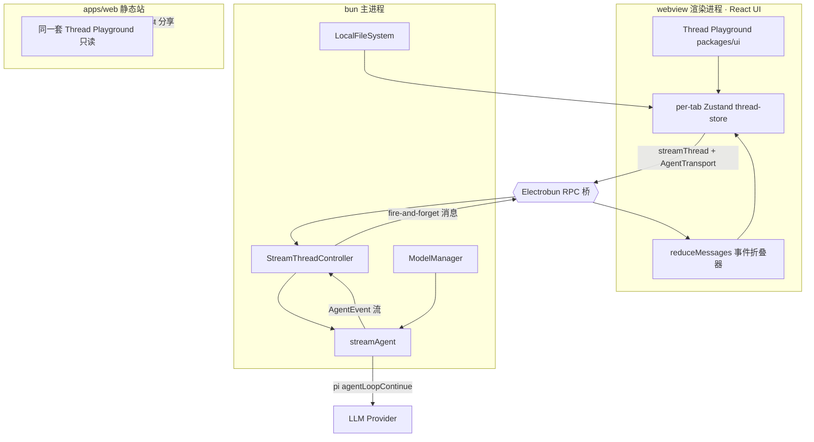
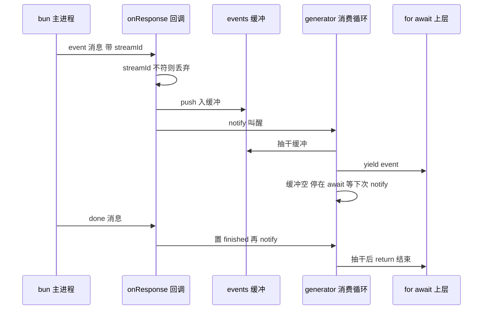
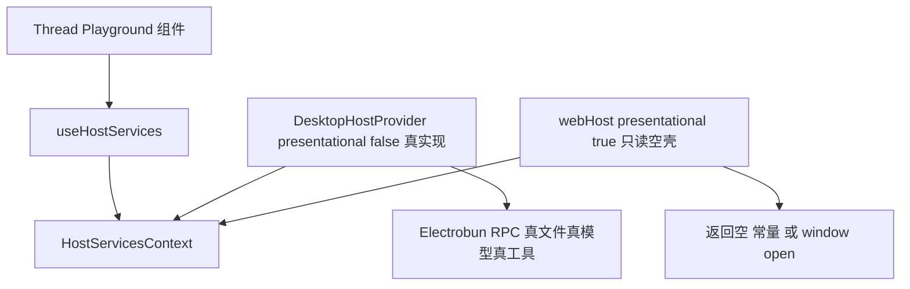
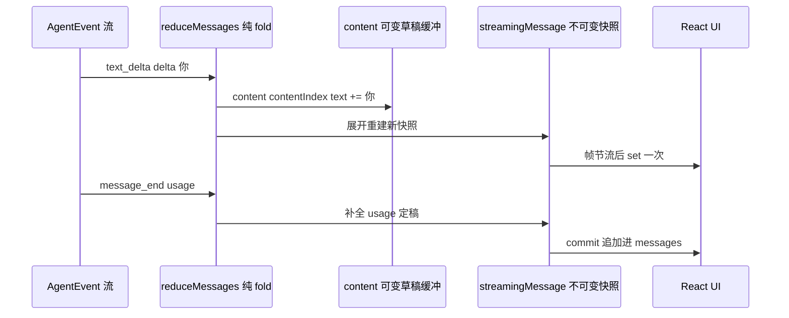
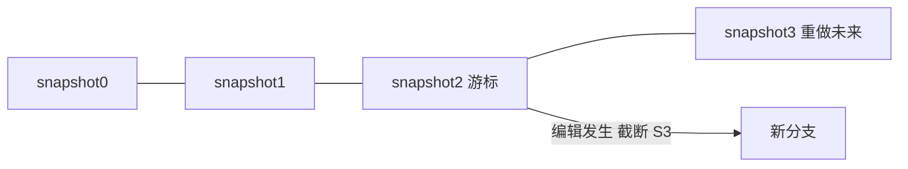
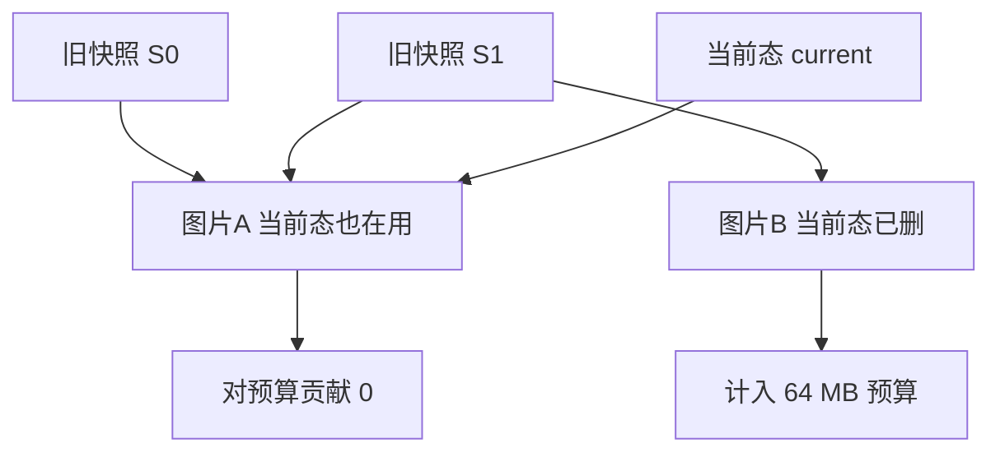

## 1. LLM Space

[LLM Space](https://github.com/deer-flow/llm-space) 是一个桌面应用，给 Agent 开发者用来搭、试、调、评一个 Agent。它把 Agent 开发里那套循环：写 prompt 和工具、跑一轮看模型怎么反应、逐步单步调试、回放失败的 run、跨多次 run 打分对比，收进一个本地工具里。它是字节 [DeerFlow](https://github.com/bytedance/deer-flow) 的姊妹项目，DeerFlow 每个版本都是用它调出来的。

它的核心数据单位叫 Thread（线程），你可以把 Thread 理解成一个可存盘的实验文件：一个 `.json` 文件，里面记着这次实验用哪个模型、system prompt 是什么、给了哪些工具、消息列表长什么样、每次 run 的历史快照。改一改 system prompt、换个模型、把某条工具返回结果改掉再重跑，就是 Agent 开发者每天在做的事。

### 1.1 痛点：Agent 跑飞了，你却看不见中间发生了什么

设想你在调一个会调工具的 Agent。你写好 system prompt，挂上三个工具，发一句话，模型回了一坨，然后工具参数是错的，或者它该调工具时没调、不该调时乱调。你想知道：模型到底收到了什么上下文？它为什么选了这个工具？如果我把这条工具返回结果改一下，它下一步会不会就对了？

用 `curl` 打 API、用 SDK 写脚本，这些都能跑通一次对话，但它们是黑盒：你看不到 Agent loop 里每一步的中间态，改一个变量要重写代码重跑，失败了没法回放，两次 run 哪个更好只能凭感觉。你要的其实是一个能**直接编辑 Agent 运行时状态**的工作台：改模型、改工具、改消息、改工具返回值，然后单步往下走，看每一步的变化。

这正是 LLM Space 干的事。但把这样一个工作台做出来，会连续撞到四个和 Agent 本身无关、却是任何"实时、可交互、要存盘"的前端工具都会遇到的工程问题。这四个问题的解法，才是这一章要讲的东西。

### 1.2 四个可迁移工程模式

1. **在没有原生流的边界上模拟一条流**。桌面 app 的两个进程之间隔着一条通道，这条通道只能发一条条离散消息，不支持"流"。项目把这些离散消息重新拼成一个能循环消费、能中途取消的事件流。任何回调式 / WebSocket 式的推送源，都能套用这套骨架。

2. **一套 UI，两个运行时**。同一套界面，既跑在功能齐全的桌面 app 里，又跑在一个只读的网页里。做法不是复制两份代码，而是把界面对外界的需求抽成一组接口，每个运行时各注入一份自己的实现，端口与适配器。

3. **把事件流折叠成消息快照**。模型是一个字一个字、一个片段一个片段往外吐的，界面要的却是一条条完整、不断长大的消息。中间用一个纯函数把碎片折叠成消息：这是所有聊天 / Agent 界面的通用做法。

4. **copy-on-write 撤销 / 重做**。编辑要能撤销，但每次改动都深拷贝整个 Thread（里面还内联着图片）会撑爆内存。项目让新旧快照共享没改动的部分，于是撤销变成一次指针移动，再用内存预算淘汰旧快照。

本地对照源码看：

```bash
cd _references && git clone https://github.com/deer-flow/llm-space.git
cd llm-space && git checkout v4.4.5
```

路径都从仓库根算起。项目是 Bun monorepo，TypeScript 写的，核心库 `packages/core` 约 1.3 万行，桌面 app 在 `apps/desktop`，共享 UI 在 `packages/ui`。本文基于 tag `v4.4.5`（commit `8433eae`）。项目 2026 年 6 月底开源，一个月拿到 1.2K stars。

## 2. 5 分钟跑起来

LLM Space 有两种用法：装 DMG 直接用，或从源码跑。

**直接用**：从 [release 页](https://github.com/deer-flow/llm-space/releases/latest)下 DMG（macOS，Apple Silicon / Intel 都有）。两个版本：普通版用系统 WebView（约 27 MB，省内存省电），Performance 版内嵌自己的渲染引擎（约 130 MB，跨 macOS 版本渲染一致、通常更快）。两个版本共用 `~/.llm-space` 数据目录，装哪个都行。

**从源码跑**（要读代码建议走这条）：

```bash
bun install          # 仓库根目录
mise run dev         # 启动桌面 app 开发模式
```

首次打开会进 onboarding。LLM Space 会去读你当前 shell 环境变量里可能存在的 API Key（`OPENAI_API_KEY`、`ANTHROPIC_API_KEY` 之类），自动推荐能用的 Model Provider。右边如果出现 `Providers detected`，点一下就加上了；出现 `Ready to run` 就说明至少有一个模型可用。没检测到就点 `Configure models` 手填 Provider / API Key / Base URL。

配好模型点 `Get started` 进主界面。点 `Start from Example` 选一个例子建 Thread。第一个 Thread 建议选 `General Agent`，它自带一组常用工具和 system prompt。点右上角 `Run` 跑起来。

跑起来之后是理解这个工具设计的关键：**它默认不自动执行工具**。模型返回一个工具调用后，会停在那儿等你。你可以点工具卡片上的播放键单独执行这一个工具，或点底部 `Call tools` 并行跑完所有待执行的工具，工具返回后再点 `Continue` 进入下一轮。这个"每一步都停下来"的行为不是 UI 层拦的，而是从 Agent loop 内部就设计成了单步（第 5 节工程细节里会看到源码怎么做，服务端每个工具的 `execute()` 直接返回 `terminate: true`）。想让它自动连跑，在 `Run` 旁边下拉里打开 `Enable ReAct loop`。

数据都在本地 `~/.llm-space`（可用 `LLM_SPACE_HOME` 覆盖）：`workspace/` 放 Thread 文件（`.json`），`settings/` 放模型 / 窗口 / MCP 等配置。Thread 文件名就是 UI 上显示的标题。

## 3. 全景架构

我们先建立一张地图。LLM Space 最值得记住的是它的三个运行时上下文，以及贯穿它们的两条数据流。

桌面壳用的是 Electrobun（一个跨平台桌面框架：系统 WebView 渲染 UI、Bun 跑主进程，定位类似 Electron / Tauri，但更轻）。它把桌面 app 拆成两个进程，加上一个独立的 Web 站，一共三个运行时上下文：

- **bun 主进程**（`apps/desktop/src/bun/`）：握着原生窗口、菜单、文件系统、模型配置和 Agent 流式执行。
- **webview 渲染进程**（`apps/desktop/src/app` + 共享的 `packages/ui`）：那套 React UI。它和主进程之间只有一条类型化的 RPC 通道。
- **Web 静态站**（`apps/web`）：复用同一套 `packages/ui`，只读展示别人分享的 Thread，没有任何后端。

图 6-1 是整个系统的骨架。



图里两条最重要的线：

一条是**运行一次 Thread 的数据流**，它从 UI 出发、跨过 RPC 到主进程打模型、再流回 UI，一共这么几跳（`pi` 是 LLM Space 底层用的轻量 Agent 框架，`agentLoopContinue` 就来自它）：

1. UI 点 Run，触发 store 的 `run()`，调 core 的 `streamThread()`，塞进去一个 `AgentTransport`；
2. 桌面端这个 transport 是 `createRpcTransport()`，把请求通过 RPC 送到 bun 侧；
3. bun 的 `StreamThreadController.run()` 迭代 `streamAgent()`，后者驱动 pi 的 `agentLoopContinue()` 真正打模型；
4. 吐回来的 `AgentEvent` 流经 RPC 回到渲染进程，`reduceMessages()` 折叠成消息，UI 重渲染。

这条线跨了两个进程、两次形态转换（迭代器 → 一条条离散消息 → 又拼回迭代器），4.1 和 4.3 节分别讲这两次转换的两端。

另一条是**同一套 UI 跑在两个宿主里**。`packages/ui` 里的 Thread Playground 不知道自己跑在桌面还是网页，它只调一个 `useHostServices()` 拿宿主能力。桌面端注入的是 Electrobun 撑腰的真实现，Web 端注入的是一堆只读空壳。4.2 节讲这个 seam。

五个核心抽象，先记住这张表，后面所有模块都挂在它上面（表 6-1）。

| 抽象 | 是什么 | 在哪 |
|---|---|---|
| **Thread** | 可存盘的实验文件：模型 + system prompt + 工具 + 消息 + run 历史，一个 `.json` | `packages/core/src/types` |
| **AgentTransport** | 流式传输的接缝：一个 `(request, {signal}) => AsyncIterable<AgentEvent>` 的函数 | `packages/core/src/client/transport.ts` |
| **HostServices** | 宿主能力注入的接缝：transport / 工具执行 / 文件 / 导航等，按运行时换实现 | `packages/ui/src/host/types.ts` |
| **AgentEvent → reduceMessages** | 事件流折叠成消息快照的 reducer | `packages/core/src/client/reducer.ts` |
| **thread-store** | 每个打开的 Thread 一个 Zustand（轻量 React 状态管理库）store，含 copy-on-write 撤销历史 | `packages/ui/src/components/thread-playground/stores/` |

这五个抽象里，Thread 是地基，其余都围着它转。它就是一个 `.json`，落在 `~/.llm-space/workspace/` 下，文件名即 UI 标题。剥掉细节，骨架长这样：

```json
{
  "title": "core-concepts",
  "model": { "provider": "openai", "id": "gpt-4.1",
             "params": { "temperature": 0.7, "maxTokens": 4096 } },
  "context": {
    "systemPrompt": "You are a helpful assistant.",
    "tools": [ { "type": "function", "name": "lookup_order", "parameters": { } } ],
    "messages": [
      { "id": "msg_1", "role": "user", "content": [ { "type": "text", "text": "查订单 A123" } ] },
      { "id": "msg_2", "role": "assistant", "content": [ ],
        "toolCalls": [ { "id": "call_1", "input": { "name": "lookup_order",
          "arguments": { "orderId": "A123" } }, "output": { "content": [ ] } } ] }
    ]
  }
}
```

一次实验要的全部输入（模型、参数、system prompt、工具、消息、工具调用及其返回）都在这一个对象里。这解释了后面很多设计：4.3 的 reducer 吐出的就是这里的 `messages[i]`，4.4 的撤销快照就是整个这个对象的 copy-on-write 副本。真实文件还会带 `runHistory`、`evaluations` 等 run 元数据，由 app 自动维护。

`packages/core` 有个值得留意的分层：它把浏览器安全的代码（`./client`、`./thread`、`./types`）和只能在 Node/Bun 跑的服务端实现（`./server`，含 `streamAgent`、文件系统、本地存储）分成不同的 exports 入口。渲染进程只 import 前者，通过 RPC 够到后者；bun 进程才 import `./server`。这条分层是"同一套 core 跑在两端"能成立的物理边界。

## 4. 核心模块

下面四个模块对应 1.2 节承诺的四个模式，我们逐个拆。路径都从仓库根算起。

### 4.1 在没有原生流的边界上模拟一条流

我们先说人话：桌面 app 里，真正打模型、一个 token 一个 token 往外吐的是 bun 主进程；负责把这些 token 画到屏幕上的是 webview 渲染进程。这两个进程之间隔着一条 RPC 通道。问题是，**这条通道不支持流**。

这一节的代码建立在三个 JavaScript 概念上，先用一句话垫平（熟的可跳过）：

- **generator（生成器）**：一种能中途暂停的函数，执行到 `yield` 就吐出一个值并挂起，下次被拉动时从这儿接着跑。`async function*` 就是异步版的生成器。
- **异步迭代器（async iterable）**：能被 `for await` 一次取一个值的数据源，每个值都可能要等一会儿才到（比如等网络）。一个 `async function*` 天然就是异步迭代器。
- **`for await (const x of it)`**：能等待每个值的 for 循环，值没到就停在那儿等。

这一节要做的事，一句话讲完：**把 bun 侧发来的一条条离散消息，包装成一个异步迭代器，让上层能用 `for await` 一个个消费。**

#### 4.1.1 痛点：RPC 只有"一问一答"和"发了不管"，都不是流

我们手里能用的只有两种原语，Electrobun 的 RPC（底层是 `rpc-anywhere`）只给这些（`apps/desktop/src/shared/rpc.ts`）：

- **requests**：一次调用换一个响应，像函数调用返回 Promise。默认 1 秒超时，而且只能 return 一次。
- **messages**：单向 fire-and-forget，发出去就不管了，没有响应、没有关联、没有完成信号。

一次 Agent run 要在几秒到几分钟里吐出几十上百个 `AgentEvent`，还得随时能取消。requests 会超时、只能返回一次，用不了；messages 是散的，没有"这是第几条""流结束了没""这条属于哪次 run"。但渲染进程那边的代码想要的却是最顺的形态：

```ts
for await (const event of transport(request, { signal })) { ... }
```

怎么用一堆散消息，拼回一个 `for await`？

#### 4.1.2 三条常见解法：回调 / 攒批返回 / 手搓迭代器

| 方案 | 怎么做 | 代价 |
|---|---|---|
| 回调 / EventEmitter | 传进去 `onEvent`、`onDone`、`onError` 三个回调，推给你 | 调用方要自己管状态机、拼消息、处理取消和清理；控制流散在回调里，和 `async/await` 割裂 |
| 用一次 request 攒完再返回 | 等 Agent 全跑完，一次性把所有事件塞进响应 | 丢掉流式：用户盯着空屏等几十秒；且会撞 request 的超时上限 |
| **fire-and-forget 消息 + 手搓异步迭代器** | 用 `streamId` 关联，每个事件发一条 message，消费端把消息缓冲起来喂给一个 async generator | 要自己写缓冲、信号、终止协议、清理，但一次写好就藏在 transport 里，上层完全无感 |

LLM Space 选第三条。关键在于它先定义了一个极简的接缝，让"用什么通道"成为唯一的变量。

#### 4.1.3 LLM Space 的选择：AgentTransport 是一个函数

整个流式传输的抽象就一行（`packages/core/src/client/transport.ts:13-16`）：

```ts
export type AgentTransport = (
  request: AgentStreamRequest,
  options: { signal?: AbortSignal }
) => AsyncIterable<AgentEvent>;
```

一个 transport 就是"给我一个请求和取消信号，还你一个能 `for await` 的事件流"的函数，没别的。注释把设计意图讲得很直白：换 transport 是不同部署形态之间唯一的差异（Web 用 HTTP，桌面用 Electrobun RPC），而 convert / validate / reduce 全都共享。

于是有了两个实现：

- `createHttpTransport`（`transport.ts:22-48`）：Web 版用。`fetch` POST 到 SSE 端点，`parseServerSentEvents` 解析，每条 `data:` 行 `JSON.parse` 成 `AgentEvent`。浏览器的 `fetch` + `AbortSignal` + SSE 本身就是真流，不用模拟。
- `createRpcTransport`（`apps/desktop/src/client/rpc-transport.ts`）：桌面版用，要在 fire-and-forget 消息上把流模拟出来。这个才是硬活。

上层调用点也干净（`packages/core/src/client/api.ts:36-38`）：

```ts
// Transport is the only HTTP-vs-RPC-specific piece; default to HTTP/SSE.
const transport = config.transport ?? createHttpTransport(config.endpoint);
yield* transport(request, { signal: config.signal });
```

`streamThread` 把共享的活（校验、转成 pi 格式、组装请求）做完，剩下的一句 `yield*` 甩给 transport。

#### 4.1.4 关键代码：三个部件拼出一条流

`createRpcTransport` 是一个 async generator，靠三个部件把散消息拼成流。我们先看这三个部件怎么协作一个回合（图 6-2）：一条 event 消息到达 → 回调把它塞进缓冲 → notify 叫醒停等的 generator → generator 抽干缓冲逐个 yield → 没有新消息就再次停等。



**部件一：streamId 关联。** 渲染进程可能同时开好几个 Thread tab 在跑，回来的消息都走同一个共享监听器。每次调用先 `const streamId = uuid()`，发请求时带上，收消息时按 `streamId` 过滤，不是自己的直接扔掉（`rpc-transport.ts:34-47`）：

```ts
const onResponse = (message: StreamThreadResponsePayload) => {
  if (message.streamId !== streamId) {
    return;                        // 别人家的流，忽略
  }
  if (message.type === "event") {
    events.push(message.event);    // 入缓冲
  } else if (message.type === "done") {
    finished = true;
  } else {
    errorMessage = message.message;
    finished = true;
  }
  notify();                        // 叫醒消费者
};
```

bun 侧同一个 `streamId` 也用来索引 `AbortController`（`AbortController` 是标准的取消句柄，`.abort()` 一发，正在监听它 `signal` 的异步操作就会中止），取消时能精确找到那一次 run。

**部件二：wake/notify 信号（核心 trick）。** 一句话直觉：**generator 没数据时就睡着，来了消息就被拍醒。** generator 需要一个地方"等下一条消息"，但消息是通过同步回调进来的，回调没法直接 `await`。做法是：generator 抽干缓冲、又还没结束时，就停在一个空 Promise 上睡着，把这个 Promise 的 `resolve`（那个"拍醒"开关）存进变量 `wake`；每来一条消息，回调就调 `wake()` 把它拍醒，再把开关清空、用完即焚（`rpc-transport.ts:29-32`）：

```ts
const notify = () => {
  wake?.();
  wake = null;
};
```

写过多线程的读者会认出来，这就是一个手搓的单槽条件变量（condition variable，操作系统里"没满足条件就等、条件好了被唤醒"的线程同步原语），只不过这里用一个 Promise 当"睡一觉"，用 `wake` 这一个槽当唤醒开关。

**部件三：缓冲 + 终止协议。** 主循环长这样（`rpc-transport.ts:65-95`，为聚焦省去缓冲压缩细节）：

```ts
while (true) {
  while (eventHead < events.length) {   // 先把缓冲抽干
    const event = events[eventHead];
    events[eventHead] = undefined;      // 置空，让 GC 能回收
    eventHead += 1;
    yield event!;
    // …此处有一段缓冲压缩逻辑，见下…
  }
  if (aborted) throw ABORT_ERROR();     // 抽干后才检查终止
  if (errorMessage !== null) throw new Error(errorMessage);
  if (finished) return;
  await new Promise<void>((resolve) => {
    wake = resolve;                     // 停下来，等 notify() 叫醒
  });
}
```

有一行体现了核心设计：**终止状态（aborted / error / finished）只在缓冲彻底抽干之后才检查**。这样即便 `done` 消息在还有事件没消费时就到了，也不会丢掉任何已缓冲的事件。这是流式实现里最容易写错的地方：先看到"结束"标志就 return，尾巴上的几个事件就没了。

桥的另一端很对称。bun 侧 `StreamThreadController.run()` 就是"迭代 `streamAgent`、每个事件发一条消息"，跑完发 `done`，出错发 `error`（`stream-thread.ts:32-52`）：

```ts
for await (const event of streamAgent(request, { /* models, signal … */ })) {
  send({ streamId, type: "event", event });    // 每个事件一条 fire-and-forget 消息
}
send({ streamId, type: "done" });              // 正常收尾
// catch: 若不是 abort，则 send({ streamId, type: "error", message })
```

一个不对称值得注意：被取消时 bun 侧只是 `return`、**不发任何终止消息**，靠渲染端自己的 `onAbort` 就地了结。两端各自拆流、互不等待对方确认，好处是取消立即生效，不用多一个回合的握手。

#### 4.1.5 游标代替 shift、没有背压、早退要通知对端

**取舍一：不用 `Array.shift()`。** 每消费一个事件就 `shift()` 是 O(n)，长流会退化成 O(n²)。它改用一个 `eventHead` 游标往前走、消费过的槽置 `undefined`，等游标越过阈值 `EVENT_COMPACTION_THRESHOLD = 1024` 且死掉的前缀超过数组一半时，才用 `slice` 压缩一次（`rpc-transport.ts:72-81`）。用游标 + 摊还压缩换掉逐个搬移，是队列类结构的常见优化。

**取舍二：没有真正的背压（一个要诚实说清的限制）。** bun 侧 `send` 是 fire-and-forget，producer 不 await，它以 `streamAgent` 吐出的速度往外推。如果渲染端消费慢，事件就在渲染端缓冲里堆着，没有任何信号能让 bun 侧停一停。压缩逻辑管的是数组开销，不是未消费事件的内存。实践里 agent 事件速率不高、React reducer 消费很快，所以不咬人，但设计上确实没有流控。对比一下：Node.js 的 stream、RxJS、gRPC 的流都内建了背压机制；这里为了实现简单主动放弃了。

**取舍三：早退要主动通知对端。** 如果消费者 `break` 了或下游抛错，generator 会在 `finally` 里补发一条 `abortStreamThread`（`rpc-transport.ts:96-104`）：

```ts
} finally {
  rpc.removeMessageListener("receiveStreamThreadResponse", onResponse);
  signal?.removeEventListener("abort", onAbort);
  // 消费者提前停了又没带 abort 信号——确保 bun 侧也把流拆掉
  if (!finished) {
    rpc.send.abortStreamThread({ streamId });
  }
}
```

这行很微妙：`break` 出 for-await 会触发 generator 的 `.return()`，进而跑 `finally`：这是唯一能捕获"读的人走了"的地方。没有它，bun 侧会继续跑 `streamAgent` 烧 token 喂一个没人看的流。同一个 `finally` 还负责摘监听器，否则每次 run 都在共享 rpc 对象上漏一个监听器。

#### 4.1.6 四十行把推模式变成拉模式

抛开 streamId 和 abort 的枝节，我们把这个模式的骨架写出来，就是"把推模式的回调源变成拉模式的 `for await`"，四十行能写完：

```ts
function toAsyncIterable<T>(
  subscribe: (h: {
    onData: (v: T) => void;
    onEnd: () => void;
    onError: (e: Error) => void;
  }) => () => void            // 返回一个退订函数
): AsyncIterable<T> {
  return {
    async *[Symbol.asyncIterator]() {
      const buffer: T[] = [];
      let wake: (() => void) | null = null;
      let done = false;
      let error: Error | null = null;
      const notify = () => { wake?.(); wake = null; };

      const unsubscribe = subscribe({
        onData: (v) => { buffer.push(v); notify(); },
        onEnd:  () => { done = true; notify(); },
        onError:(e) => { error = e; done = true; notify(); },
      });
      try {
        while (true) {
          while (buffer.length) yield buffer.shift()!;   // 先抽干
          if (error) throw error;                        // 抽干后才判终止
          if (done) return;
          await new Promise<void>((r) => { wake = r; }); // 停下来等
        }
      } finally {
        unsubscribe();                                   // 一定清理
      }
    },
  };
}
```

四样东西缺一不可：一个**缓冲**吸收突发、一个**单槽 resolver**（`wake`）让消费者停等、**终止标志只在抽干后检查**、**订阅放 try 里退订放 finally 里**。任何 EventEmitter、WebSocket 的 `onmessage`、`.on('data')` 回调、或者这里的 fire-and-forget 消息通道，套上这个骨架就变成了 `for await`。生产版本无非再加上 streamId 关联、外部 `AbortSignal`、以及用游标换掉 `shift()`。

### 4.2 一套 UI，两个运行时

Thread Playground 是一大坨 React UI，它得同时跑在两个八竿子打不着的地方：桌面 app（Electrobun 撑腰，有真文件系统、真模型 Provider、真工具 / MCP 执行、原生文件选择器）和一个纯静态网页（部署在 GitHub Pages 上，只读展示别人用 Gist 分享出来的 Thread，没有任何后端）。同一棵组件树，两个世界。

#### 4.2.1 痛点：宿主能力天差地别，UI 却只想写一份

Web 版没有文件系统、没有模型后端、不能执行工具，桌面版全都有。我们最先想到的两种做法都不行：

- **fork 两份 UI**：Playground 这么大，两份立刻就漂移了，每个 feature 和 bugfix 都要改两遍。
- **满屏 `if (isDesktop)`**：不只是难读。更深的问题是依赖：`packages/ui` 必须对 Electrobun 零依赖。一旦 UI 里 `if (isDesktop)` 后面够到 Electrobun RPC，Web 打包就得把一个桌面专属运行时也拖进来，UI 包就硬依赖了桌面宿主。

#### 4.2.2 三条常见解法：编译期分叉 / 运行时判断 / 依赖注入

| 方案 | 怎么做 | 代价 |
|---|---|---|
| 编译期分叉 | 用打包器的 `define` / 条件编译，按 target 剔掉另一端代码 | 运行时假设散在几十个组件里；两端行为差异不集中，难测；UI 仍然"知道"有几种宿主 |
| 运行时 `if (isDesktop)` | 组件里到处判断当前环境 | UI 硬依赖所有宿主的 SDK；分支爆炸；加第三种宿主要全局翻一遍 |
| **端口与适配器 + 依赖注入** | UI 只声明它需要哪些能力（接口），每个运行时注入一份实现 | 要先想清楚"UI 到底需要外界给它什么"，把接口设计好 |

#### 4.2.3 LLM Space 的选择：HostServices seam

UI 把它对外界的全部需求声明成一组接口，通过 React context 注入。我们看这个聚合接口长什么样（`packages/ui/src/host/types.ts:168-181`）：

```ts
export interface HostServices {
  presentational: boolean;              // 只读展示态：藏掉所有操作 chrome
  transport: AgentTransport | null;     // 4.1 那个流式传输
  executeTool: ExecuteTool | null;      // 执行内置 / MCP 工具
  skills: SkillsHost;                   // 只读读 skills
  mcp: McpHost;                         // 只读读 MCP
  builtinTools: BuiltinToolsHost;
  paths: PathsHost;
  files: FilesHost;                     // 读文本 / 原生文件选择器
  generator: GeneratorHost | null;      // 导出成可跑的 LangGraph 项目
  actions: HostActions;                 // 导航：打开设置 / 链接 / 分享
}
```

注意几个字段是 `| null`：`transport`、`executeTool`、`generator`：在只读宿主里它们就是 null。这是"能力可缺席"从类型层面就写进了契约。

这套注入的形状很简单（图 6-3）：UI 组件只认一个 `useHostServices()`，它从 Context 里取值；两个运行时各自在 Context 里塞进一份不同的实现。



seam 本身只有一个 Provider 加一个 hook（`packages/ui/src/host/host-services.tsx:7-36`）：

```ts
const HostServicesContext = createContext<HostServices | null>(null);

export function useHostServices(): HostServices {
  const ctx = useContext(HostServicesContext);
  if (!ctx) {
    throw new Error("useHostServices must be used within a HostServicesProvider");
  }
  return ctx;
}
```

默认值是 `null` 并在 hook 里抛错。组件如果在 Provider 外面用宿主能力，是响亮地崩，而不是悄悄变成空操作。UI 里所有需要外界能力的地方，只调 `useHostServices()`，永远不 import electrobun。

#### 4.2.4 关键代码：同一份接口，两份实现的对照

我们先看桌面适配器（`apps/desktop/src/host/host-services.tsx:85` 起），它注入的全是真货：

```tsx
const value = useMemo<HostServices>(() => ({
  presentational: false,
  transport,                       // createRpcTransport()，4.1 那个
  executeTool,                     // 通过 RPC 真执行工具
  skills: { getSettings: getSkillsSettings, listSkills },
  files: { readText: readTextFile, exists: textFileExists,
           pickFile, pickDirectory, /* … */ },
  generator: { checkUv, runUv, writeFile, /* … */ },
  actions: { /* 路由到命令总线 */ },
}), [/* … */]);
```

Web 适配器（`apps/web/src/host/web-host.ts:13` 起）是一堆只读空壳：

```ts
export const webHost: HostServices = {
  presentational: true,
  transport: null,
  executeTool: null,
  skills: {
    getSettings: () => Promise.resolve({ discoveryPaths: [] }),
    listSkills: () => Promise.resolve([]),
  },
  files: {
    readText: () => Promise.resolve(""),   // @include 宏解析成空
    exists: () => Promise.resolve(false),
    pickFile: () => Promise.resolve(null),
    /* … */
  },
  generator: null,
  actions: {
    openLink: (url) => window.open(url, "_blank", "noopener,noreferrer"),
    openSettings: () => {}, shareThread: () => {}, /* … 其余空操作 */
  },
};
```

对照一眼看清：`presentational` false→true；`transport` / `executeTool` / `generator` 真实现→null；各种读操作从"打 RPC"→"返回空常量"；`actions` 从"路由到命令总线"→空操作。两个 app 各自在根上挂 `<HostServicesProvider value={对应宿主}>`，共享 UI 只管 `useHostServices()`。所有运行时 SDK 的 import 都关在适配器里，从不进共享包，而"共享包不声明那个 SDK 依赖"这一点，就是这条接缝守得住的编译期保证。

#### 4.2.5 用一个布尔收敛只读降级

Web 版能力全缺，UI 怎么优雅地退化成只读？靠 `presentational` 这一个布尔，配合两层机制：

**一层，它折进全局 `readonly`**（`thread-playground.tsx:214-217`）：

```ts
const { presentational } = useHostServices();
const readonly = useMemo(() =>
  readonlyFromProps || presentational || status === "running",
[readonlyFromProps, presentational, status]);
```

于是凡是 `readonly` 已经拦着的编辑，`presentational` 都一起拦了，同时组件按它藏掉运行 / 添加 / 删除这些操作按钮，把模型选择器换成一行静态文本。

**另一层，null 能力兜底。** 就算某条路径漏过了 `presentational` 检查真去跑了，运行路径会在调用点检查 `transport`（`use-stream-text.ts:158-164`）：null 就弹一句友好错误，而不是崩。`presentational` 藏 chrome，`null` 保证底层操作即便被够到也是惰性的，两层是同一套优雅降级策略。

这个"同一套 UI、按运行时能力优雅降级"的做法，VS Code 的扩展体系是更大规模的同类实践：同一份扩展 API surface 同时跑在桌面（Node 扩展宿主）和 vscode.dev（浏览器扩展宿主），能力缺席时 API 直接 no-op 或抛 `not supported`，扩展代码基本不用为两种宿主分叉。区别在注入粒度。VS Code 靠模块解析在宿主层换实现，LLM Space 靠一个 React context 在组件树顶注入，更轻，但思路是同一个：把"能力"抽象成契约，让宿主决定这份契约有多少是真的。

#### 4.2.6 宿主能力表 + 一个 presentational 开关

1. 把共享组件树需要外界给的东西列成一个接口，每个方法返回 `Promise`（或是 fire-and-forget 的 action）；运行时专属的能力设成可空。
2. 建 context + Provider + 一个 `useX()` hook，用 `createContext<T | null>(null)` 加"在 Provider 外用就抛错"的守卫。
3. 每个运行时写一个实现该接口的适配器对象：运行时 A 全真，运行时 B 空操作 / 返回空 / 抛错。
4. 每个宿主 app 在根上挂 `<XProvider value={本运行时的适配器}>`，共享 UI 只调 `useX()`。
5. 所有运行时 SDK 的 import 只留在适配器里，绝不进共享包：靠"共享包不声明那个 SDK 依赖"从编译期锁死。

这就是六边形架构 / 端口与适配器的最小落地：UI（高层策略）不依赖桌面运行时（低层细节），两者都依赖 UI 包里那个接口。

### 4.3 把事件流折叠成消息快照

4.1 把 Agent 事件从 bun 侧运过了 RPC 桥，落到渲染进程。但这些事件是碎的：模型不是一次吐一整条回复，而是吐一串增量：先来一个"文本开始"，然后一个字一个字地"文本增量"，中间可能插进"工具调用开始"、参数一段段流进来、"思考块"、最后一个"消息结束"带着 token 用量。UI 要显示的却是一份份完整、能一帧帧长大的 Message 卡片。中间差着一次形态转换。

#### 4.3.1 痛点：碎事件 vs 完整消息

一次模型回复，Agent loop（pi 框架的 `agentLoopContinue`）吐出的事件流大致是这样的顺序：

```
message_start
  text_start(index=0) → text_delta("你") → text_delta("好") → …
  toolcall_start(index=1, name="search") → toolcall_delta('{"q') → toolcall_delta('":"…"}') → toolcall_end
message_end(usage={in:1200,out:80})
```

UI 不能直接渲染这个流：它需要的是一个 `AssistantMessage` 对象：有 `content` 文本、有 `toolCalls` 数组、有 `thinking`、有 `usage`，而且随着增量到来这个对象要**原地长大**，每一帧都能拿去渲染，跑完了还能原样存进 `.json`。谁来把碎事件攒成这个对象？

#### 4.3.2 三条常见解法：边收边拼 / 攒完再渲染 / reducer 折叠

| 方案 | 怎么做 | 代价 |
|---|---|---|
| 在 UI 组件里边收边拼 | 组件订阅事件，直接往 state 里 `setText(prev + delta)` | 拼装逻辑和渲染耦死；换个传输层（HTTP / RPC）要重写；没法单测；工具调用参数的流式 JSON 解析散在组件里 |
| 累积完整份再渲染 | 等 `message_end` 一次性拿到完整消息 | 丢掉流式，用户盯着空屏等模型吐完 |
| **纯函数 reducer 折叠** | `(当前累积, 一个事件) => 新累积`，UI 只渲染累积结果 | 要设计好累积状态的形状，但一次写好就和传输层、渲染层完全解耦，可单测 |

第三条就是 Redux / event sourcing 那套思路搬到流式场景。LLM Space 的 `reduceMessages` 正是一个纯 fold。

#### 4.3.3 LLM Space 的选择：两份表示，一个纯 fold

`reduceMessages` 的精髓是它同时维护**两份表示**（`reducer.ts`，调用方状态在 `thread-store.ts:985-986`）：

- `content: ReducedMessageContent[]`：一个**可变的草稿缓冲**，按模型给的 `contentIndex` 下标寻址，是增量往里追加的落点。文本增量 `+=` 到这里，工具参数的原始 JSON 字符串也拼在这里。
- `streamingMessage: AssistantMessage`：一份**不可变的快照**，每来一个事件用结构共享重建一次，是给 React 渲染、给磁盘持久化的干净形态。

为什么要两份？草稿缓冲负责"高效地原地追加"，快照负责"不可变、可 diff、能渲染"。一个 reducer 在它俩之间架桥。图 6-4 是这次折叠的数据流。



#### 4.3.4 关键代码：增量怎么累积、快照怎么定稿

**文本增量**：草稿缓冲原地 `+=`，快照不可变重建（`reducer.ts:213-224`）：

```ts
case "text_delta": {
  const textContent = content[event.contentIndex] as TextContent;
  textContent.text += event.delta;                    // 草稿缓冲：原地追加
  return _createUpdateMessageEvent(
    { ...message,                                      // 快照：展开重建
      content: message.content.map((c) =>
        c.type === "text" ? { ...textContent } : c) },
    content);
}
```

**工具调用参数**是最见功力的一段。参数以**原始 JSON 字符串**一段段流进来，中途都是残缺的 JSON（比如刚到 `{"q`）。它每来一段就**投机解析一次**，解析失败就返回上一份好快照，等更多字符到齐（`reducer.ts:252-271`）：

```ts
case "toolcall_delta": {
  const toolCallContent = content[event.contentIndex] as ToolCallContent;
  toolCallContent.arguments += event.delta;           // 累积原始 JSON 文本
  let args: Record<string, unknown> = {};
  try {
    args = parseJSON(toolCallContent.arguments);
  } catch {
    return _createUpdateMessageEvent(message, content); // JSON 还没完整，保留上一份好快照
  }
  return _createUpdateMessageEvent(/* 用解析出的 args 重建 toolCall */, content);
}
```

这一行 `catch` 里返回旧快照，体现了核心设计：**流式 JSON 的不完整是常态，不是错误**。投机解析 + 回退到上一份，是把"半截 JSON"优雅吸收掉的标准手法。

**定稿**分两段。reducer 在 `message_end` 产出带 usage 的最终快照，还会给全空的消息补一个空文本块，保证没有内容为空的助手消息（`reducer.ts:66-69`）。然后 store 侧再给它盖上客户端观测到的 `timing`（首 token 延迟、总耗时），`commit()` 追加进持久的 `messages[]`，清空 `streamingMessage`（`thread-store.ts:1123-1187`）。

#### 4.3.5 节流渲染而非折叠、快照即持久化形态、错误不 reject

**取舍一：节流的是渲染，不是折叠。** 每一个事件都要 reduce（不能漏，漏了消息就断），但推给 React 最多一帧一次。它用 `createFrameThrottle` 按帧对齐，源码明确说明逐事件 `set()` 不安全、且每帧重渲染整份增长中的文档太贵（`thread-store.ts:999-1010`）。对比很多聊天 UI 直接在 `onDelta` 里 `setState`，高频流下会掉帧，分离"折叠频率"和"渲染频率"是关键。

**取舍二：快照即持久化形态。** reducer 吐出的就是最终要存盘的 `AssistantMessage`（用 typebox，一个 TS 的 schema 定义 + 校验库，类似 zod，严格定义了形状）。跑完一轮"提交"消息，只是把最后一份快照挪进数组（`thread-store.ts:976-982`）。累积态和持久态是同一个东西，省掉了一次"渲染模型 → 存储模型"的转换。

**取舍三：错误不 reject，而是塞进消息里再 throw。** 模型 API 失败时，Agent loop 不是让流 reject，而是正常跑完、把错误塞进助手消息的 `errorMessage`。reducer 在 `agent_end` 事件上检查到任何助手消息带 `errorMessage` 就**主动 throw**（`reducer.ts:84-89`），store 的 try/catch 接住、标记这次 run 失败、并把它排除出 run 历史。错误路径和正常路径共用同一条事件流，只在末尾分叉。

#### 4.3.6 二十行的纯函数 reducer

我们要写的核心就是一个纯函数加两份表示，骨架二十行：

```ts
function reduce(prev: Snapshot, ev: Event, scratch: any[]): Snapshot {
  switch (ev.type) {
    case "message_start": return { text: "", toolCalls: [], done: false };
    case "text_delta":
      scratch[ev.i] = (scratch[ev.i] ?? "") + ev.delta;   // 草稿缓冲累积
      return { ...prev, text: scratch[ev.i] };            // 结构共享重建快照
    case "toolcall_delta":
      scratch[ev.i] = (scratch[ev.i] ?? "") + ev.delta;
      try { const args = JSON.parse(scratch[ev.i]);       // 投机解析
        return { ...prev, toolCalls: upsert(prev.toolCalls, ev.id, args) };
      } catch { return prev; }                            // 半截 JSON，保留上一份
    case "message_end": return { ...prev, done: true };
    default: return prev;
  }
}
```

五个要点都在里面：**两份表示**（可变 `scratch` 按 index 寻址 + 不可变快照展开重建）、**纯 `(state, event) => state`**（可单测、与传输无关）、**投机解析累积中的 JSON**（失败回退上一份）、**快照即持久化形态**、**节流渲染不节流折叠**。任何流式聊天 / Agent UI，把这个 reducer 抠出来独立于传输层和渲染层，就能既好测又不掉帧。

### 4.4 copy-on-write 撤销 / 重做

Thread Playground 让你编辑一切：system prompt、变量、工具、模型参数、每条消息的文本和图片附件。每一次编辑都要能撤销 / 重做。图片附件是以 base64 内联存在 Thread 里的，一个 Thread 可能带着几十 MB 图片。这个前提让撤销历史的实现变得有意思。

#### 4.4.1 痛点：每次改动深拷贝整个 Thread 会爆

最朴素的撤销实现：每次改动把整个 `Thread` 深拷贝一份压栈。两个代价让它在这里行不通：

- **每次击键都深拷贝。** 编辑是文本框击键级别的，每敲一个字符就深拷贝整棵消息树，纯浪费。
- **图片被 N 倍放大。** 附件是内联在 Thread 里的 base64。保留 N 步撤销就把这几十 MB 乘以 N：一次由二进制数据驱动的、用户根本没在编辑它的内存爆炸。

#### 4.4.2 三条常见解法：深拷贝 / 存操作 / copy-on-write

| 方案 | 怎么做 | 代价 |
|---|---|---|
| 每步深拷贝快照 | `structuredClone(thread)` 压栈 | 图片被 N 倍放大，内存爆 |
| 存操作而非状态（command / diff） | 记录每个编辑操作及其逆操作，撤销时反着执行 | 每种编辑都要写正 / 逆一对逻辑，容易漏；复杂编辑的逆操作难写 |
| **copy-on-write 快照 + 字节预算** | 浅展开产出新 Thread，未改动子结构按引用共享；再按图片字节预算淘汰旧快照 | 要理解结构共享，并设计基于对象身份的字节核算 |

#### 4.4.3 LLM Space 的选择：结构共享 + 双闸淘汰

**结构共享。** 每次改动通过浅展开 `{ ...oldThread, ...partial }` 产出新 Thread。只有从根到改动点这条路径上的对象是新的，其余全部（包括那些大 `image_data` 对象）**按引用共享**给所有快照（`thread-store.ts:252-254`）。所以一个撤销快照的成本是一个浅对象，不是一次深拷贝。

**数据结构不是双栈，是一个线性数组加一个游标**（`thread-history.ts:9-12`）：

```ts
export interface ChangeHistory {
  snapshots: Thread[];   // 从旧到新
  index: number;         // snapshots[index] 是当前态
}
```

游标左边是可撤销的过去，右边是可重做的未来。**撤销就是 O(1) 的指针移动**：不克隆、不重建，只是 `index - 1` 然后把那个已存的 Thread 引用还回去（`thread-history.ts:90-99`）：

```ts
export function undo(history: ChangeHistory): UndoRedoResult | null {
  if (!canUndo(history)) return null;
  const index = history.index - 1;
  const thread = history.snapshots[index];
  return { history: { ...history, index }, thread };   // 只挪游标，数组不动（源码这里还有一层 thread === undefined 的防御性判空，此处略去）
}
```

图 6-5 是撤销栈的形态：一个数组 + 游标，编辑截断重做分支，撤销 / 重做只挪游标。



#### 4.4.4 关键代码：基于对象身份的字节核算

淘汰是双闸：先按条数硬上限（`MAX_HISTORY = 100`）从头砍，再按图片字节预算（`MAX_HISTORY_IMAGE_BYTES = 64 MiB`）淘汰（`thread-history.ts:69-88`）：

```ts
export function recordSnapshot(history: ChangeHistory, next: Thread): ChangeHistory {
  if (next === history.snapshots[history.index]) return history;  // 同一引用，空操作
  const snapshots = history.snapshots.slice(0, history.index + 1); // 截断重做分支
  snapshots.push(next);
  if (snapshots.length > MAX_HISTORY)                              // 闸一：条数
    snapshots.splice(0, snapshots.length - MAX_HISTORY);
  while (snapshots.length > 2 &&
         _retainedImageBytes(snapshots) > MAX_HISTORY_IMAGE_BYTES) // 闸二：字节
    snapshots.shift();
  return { snapshots, index: snapshots.length - 1 };
}
```

字节核算是最妙的一段。先建立直觉：因为结构共享，多个快照可能指向**同一个**图片对象；一张图片只有在**没有任何当前还在用的地方引用它**时，才算是"纯粹为撤销才占着的内存"。图 6-6 把这层引用关系画出来。



看这张图该看到：图片 A 被 S0、S1、当前态一起指向，删不得，所以它不算历史的账；图片 B 只剩旧快照 S1 还留着，它才是"为撤销付的内存"。`_retainedImageBytes` 就照这个规则来。只统计**旧快照里有、但当前态没有**的图片，用**对象身份**（`Set` 存对象引用）判断是否共享，每个唯一对象只数一次（`thread-history.ts:46-67`）：

```ts
const live = new Set<unknown>(_imageContents(current));   // 当前态还在用的图片
const counted = new Set<unknown>();
for (/* 遍历除当前态外的旧快照 */) {
  for (const content of _imageContents(snapshot)) {
    if (!live.has(content) && !counted.has(content)) {     // 只数当前态没有的
      counted.add(content);
      bytes += content.data.length;
    }
  }
}
```

体现核心设计的是 `!live.has(content)` 这一行：一张仍在当前 Thread 里的图片，不管多少快照引用它，对历史预算的贡献是**零**。只有纯粹为了撤销才留着的图片才算进 64 MB 天花板，也就是注释说的"只被撤销历史留着的图片负载"。

这套核算能成立，恰恰**因为**更新是 copy-on-write 的。只有 copy-on-write 才能保证"同一张图没变过就还是同一个对象"，对象身份才成为可靠的共享判据。（一个小限定：`_imageContents` 只遍历 `role === "user"` 的消息，所以这里算的是用户上传的图片附件，助手消息里的图片不计入这个预算。）

#### 4.4.5 流式期间不记快照、run 元数据不回退、简单胜过渐进最优

**取舍一：流式期间不记快照。** 一次 run 会往消息里灌几十上百个增量，如果每个都记一步撤销，撤销栈就被冲爆了。它用运行状态而非定时器来合并：流式期间 `patchThread` 照常更新 UI，但 `status === "running"` 分支跳过 `recordSnapshot`；整个 run（含重跑截断 + 所有生成的消息）在结束时被折叠成**一步**撤销（`thread-store.ts:255-259`、`finalizeActiveRun`）。

**取舍二：run 元数据不该被文本编辑回退。** 撤销恢复的是旧 Thread，但 `runHistory`、`evaluations` 这些是持久的 run 元数据，撤销一次 prompt 编辑不该把它们也倒回去。store 用"重新嫁接 + 原地改写游标处快照"解决：撤销时把**当前**的 run 元数据嫁接到恢复出的旧 Thread 上，再把这个组装好的 thread 写回 `snapshots[index]`，让存储引用和实时态一致（`thread-store.ts:1250-1272`）。撤销只回退内容，不回退 run 历史。

**取舍三：简单胜过渐进最优。** 字节淘汰的 `while` 循环每轮都重算 `_retainedImageBytes`（O(快照数 × 图片数) 的扫描），每次 `shift()` 又是 O(n)。在 100 条上限下这些都无所谓。这是一个"正确但非渐进最优"的清醒选择，上限调到几万条才需要优化。对照 Immer / Redux 那种用专门的不可变数据结构做结构共享的方案，这里手写浅展开更轻、更好懂，代价是字节核算走的是线性全扫描，而不是增量维护一本账。

#### 4.4.6 一个数组加一个游标的撤销栈

```ts
interface History<T> { snapshots: T[]; index: number; }

function record<T>(h: History<T>, next: T, opts: {
  maxCount: number; maxBytes: number;
  bytesRetained: (snaps: T[]) => number;  // 只数旧快照里、当前态没有的 blob 字节
}): History<T> {
  if (next === h.snapshots[h.index]) return h;       // 同引用空操作
  const snaps = h.snapshots.slice(0, h.index + 1);   // 截断重做分支
  snaps.push(next);
  if (snaps.length > opts.maxCount) snaps.splice(0, snaps.length - opts.maxCount);
  while (snaps.length > 2 && opts.bytesRetained(snaps) > opts.maxBytes) snaps.shift();
  return { snapshots: snaps, index: snaps.length - 1 };
}
// undo/redo 只挪 index，返回已存引用——从略
```

三个可迁移的点：**状态视作不可变、用浅展开更新**（快照是指针不是深拷贝，撤销 / 重做变成挪下标）；**线性 `snapshots[] + index` 胜过双栈**（撤销、重做、截断分支用一个数组一个游标统一表达）；**按真实成本而非步数设预算**（状态里有大 blob 时，数"只因历史才留着"的字节，用对象身份当共享判据，这一步能成立正是因为更新是 copy-on-write 的）。`bytesRetained` 是唯一和业务相关的部分，其余全通用。

## 5. 工程细节

四个核心模块之外，LLM Space 里还有一批小手法，单拎出来不够成一节，但都是能直接搬进自己项目的习惯（表 6-2）。

| 习惯 | 项目怎么做 | 可迁移到哪 |
|---|---|---|
| **服务端从不真跑工具** | Agent loop 里每个工具的 `execute()` 返回 `{ terminate: true }`，模型一吐出工具调用就停下，工具执行交给客户端（`stream.ts:176-181`） | 任何"要在每一步暂停、让人检查 / 编辑再继续"的调试器、workflow 单步执行器 |
| **共享对象的 per-run 覆盖要在 finally 还原** | pi 的模型注册表是进程全局共享对象，per-run 覆盖 `baseUrl` 后必须在 `finally` 还原，否则泄漏到下次 run；而 headers 是 per-call 传入、从不改共享对象（`stream.ts:72-89,149-152`） | 任何"临时改一个共享单例的字段"的场景，改了就要在 finally 复原，或干脆别改共享对象 |
| **per-run AbortController 注册表** | 一个 `Map<streamId, AbortController>`，取消时精确找到那次 run，`shutdown()` 一次性取消所有在飞的流（`stream-thread.ts:14,66-77`） | 任何并发多任务、要单独取消或整体优雅关停的后端 |
| **折叠每个事件，渲染节流到帧** | reduce 不漏任何事件，但 `set()` 到 React 最多一帧一次（`thread-store.ts:999-1010`） | 所有高频流式 UI：日志流、进度流、协作光标 |
| **浏览器安全 / 服务端专属分 exports** | `packages/core` 把 `./client`、`./thread`、`./types`（浏览器安全）和 `./server`（Node/Bun 专属）分成不同入口，渲染进程物理上 import 不到服务端代码（`package.json` exports map） | 任何同构 / 跨端共享的库，用 exports 入口把只能在某一端跑的代码隔离掉 |
| **monorepo 依赖版本用 catalog 单点管理** | `@earendil-works/pi-*`、`react`、`typebox` 等在根 `package.json` 的 `catalog` 里统一钉版本，各包引 `"catalog:"`（`package.json:28-63`） | 任何多包 monorepo，避免同一依赖在各包版本漂移 |

还有一个值得单独提的功能：**把 Thread 一键导出成能跑的 LangGraph Python 项目**（`packages/core/src/generator/langgraph/`）。它把你在 UI 里调好的 system prompt、工具、变量、模型配置，生成成一套完整的 LangGraph 工程（`agent.py`、`pyproject.toml`、工具桩、`.env` 模板），`uv sync` 就能跑。这里藏着一个 codegen 的硬约束：prompt 的模板语义（``、`@include` 宏、内置变量）有两套运行时实现。TypeScript 的 thread 渲染器和生成出来的 Python 渲染器。两边必须严格对齐，加一个内置变量要同时改两处，否则导出的 Agent 行为和 UI 里预览的不一致。这是所有"配置 → 代码"生成器都会撞到的双实现漂移问题，它的解法是把生成器回归测试和"生成后真跑一次 Python"写进发布前检查单。

## 6. 适用边界与不该照搬的部分

**什么时候用 LLM Space。** 它是本地优先的 Agent 原型 / 调试台：你想逐步检查 harness 每一步、想直接编辑运行时状态（改工具返回值看模型下一步）、想回放失败的 run、想跨 run 打分对比。单人开发、macOS 环境，它比 `curl` + SDK 脚本高效得多。它和 LangSmith / Langfuse 这类云端 observability 平台是两个物种：后者面向团队、面向生产 trace 聚合和长期留存，LLM Space 面向个人开发时的快速试错，数据全在本地。

**什么时候不用。** 它目前只出 macOS 桌面版，没有 Web 托管的多人协作，没有生产环境的 trace 采集和告警。要做团队级、生产级的 Agent 可观测性，它不是答案。

不该照搬的三处：

- **RPC 流没有背压**（4.1 取舍二）。agent 事件速率低、消费快，所以不咬人。但如果你要传的是高吞吐、大体积的二进制流（文件、音视频帧），照搬这套无流控的缓冲会让内存无界增长：那种场景要用有背压的 stream。
- **服务端从不真跑工具**（`stepByStep: true`）是调试器的产品选择，不是通用最佳实践。它专门为"每一步停下来给人看"设计。真要做自动连跑的生产 Agent，工具就得在服务端执行，别把这个单步语义搬过去。
- **字节核算是线性全扫描**（4.4 取舍三）。100 条上限下无所谓，但如果你的历史要留几万条，每次淘汰都全扫一遍会变成瓶颈：那时才需要增量维护的字节账本。

## 7. 自己写一个 mini 版：从哪下手

四个模块各自的 mini 骨架前面都给了，这里只说把它们拼成一个最小 Agent Playground 时的**实现顺序**：顺序错了会白走弯路。

- **reducer 和数据模型先行**：先定义 `Thread` 和 `AgentEvent`，把 4.3 的 `reduce(state, event)` 在纯 Node 里用假事件流喂熟。它是整个应用的心脏。
- **传输和宿主接缝随后**：先用浏览器 `fetch` + SSE 套上 4.1 的 `AgentTransport`，让"事件 → reduce → 渲染"端到端跑通；这时再按 4.2 抽 HostServices，将来换桌面壳只多写一个适配器。
- **撤销历史最后**：它是增量优化，先只做条数上限，真塞了图片再加 4.4 的字节预算。

反过来先纠结桌面壳和 RPC，会在还没有一个能跑的核心时就陷进胶水代码。

## 8. 延伸阅读

- [pi-agent-core](https://github.com/earendil-works/pi)：LLM Space 底层的轻量 Agent 框架，`agentLoopContinue` 就来自这里。想看 Agent loop 本身（而非工作台）怎么实现，读它。
- [DeerFlow](https://github.com/bytedance/deer-flow)：LLM Space 的姊妹项目，字节开源的多智能体研究框架。它是 LLM Space "dogfood" 的对象：想看这个工作台在真实项目里怎么被用来调 Agent，看它。
- [LangGraph](https://github.com/langchain-ai/langgraph)：LLM Space 的 Thread 导出目标。想理解"配置 → 可运行 Agent 代码"这条链路的下游长什么样，读它的图 / 节点模型。
- [LangSmith](https://www.langsmith.com/) / [Langfuse](https://github.com/langfuse/langfuse)：云端 Agent / LLM 可观测性平台，和 LLM Space 形成对照：一个面向团队生产 trace 聚合，一个面向个人本地调试。同一个"看清 Agent 每一步"的需求，两种截然不同的产品形态。
- 想深入本章的两个底层模式：异步迭代器与背压，读 [MDN async iterator 协议](https://developer.mozilla.org/en-US/docs/Web/JavaScript/Reference/Iteration_protocols) 和 Node.js Streams 的 backpressure 文档；端口与适配器，读 Alistair Cockburn 的 Hexagonal Architecture 原文。
