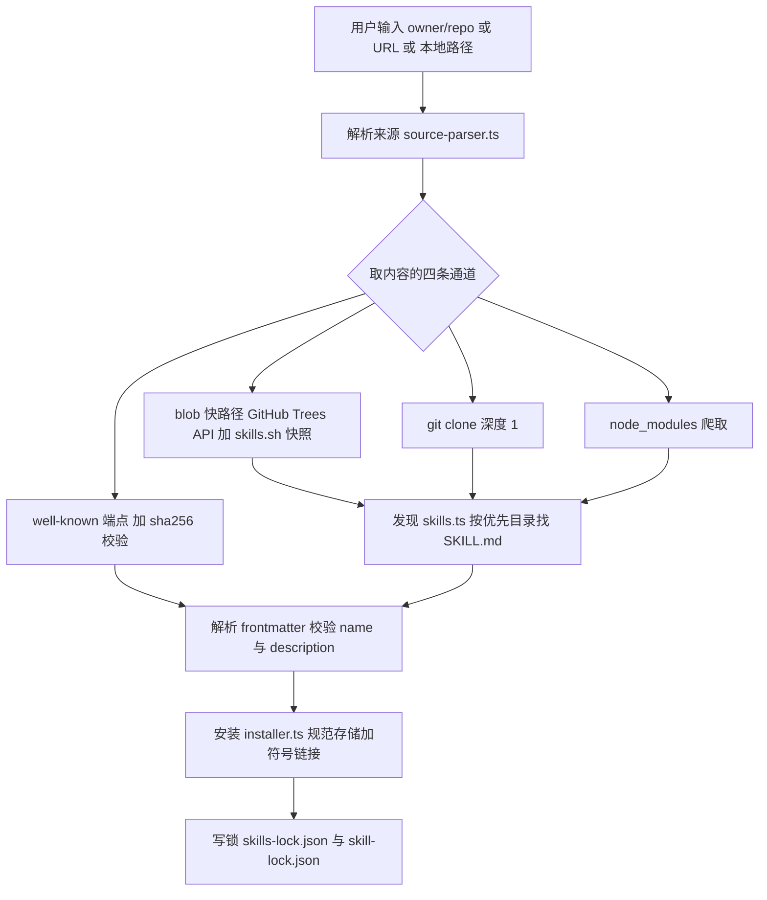
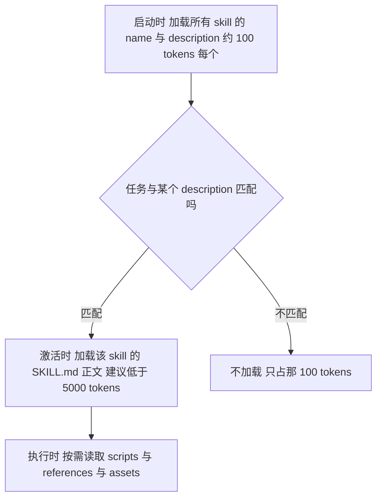
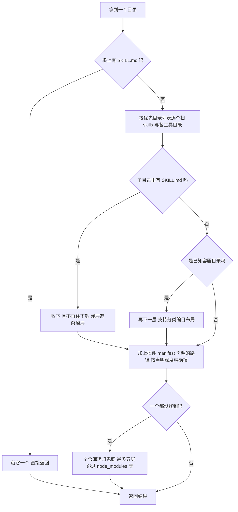
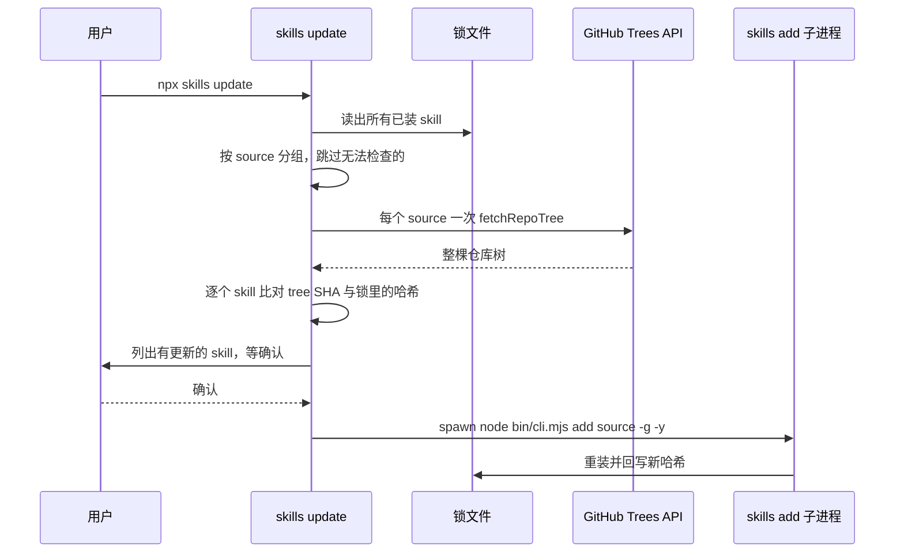
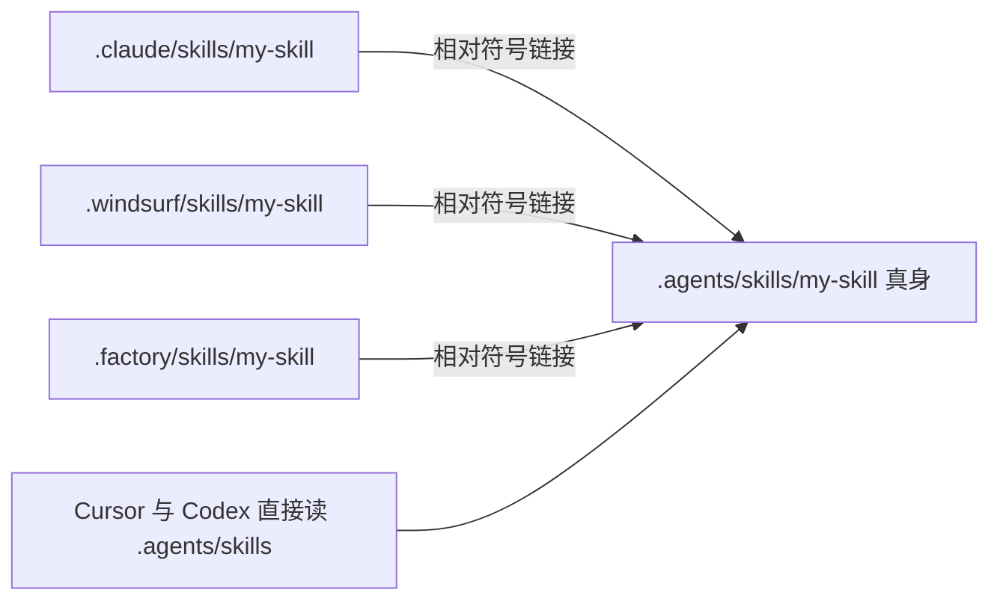
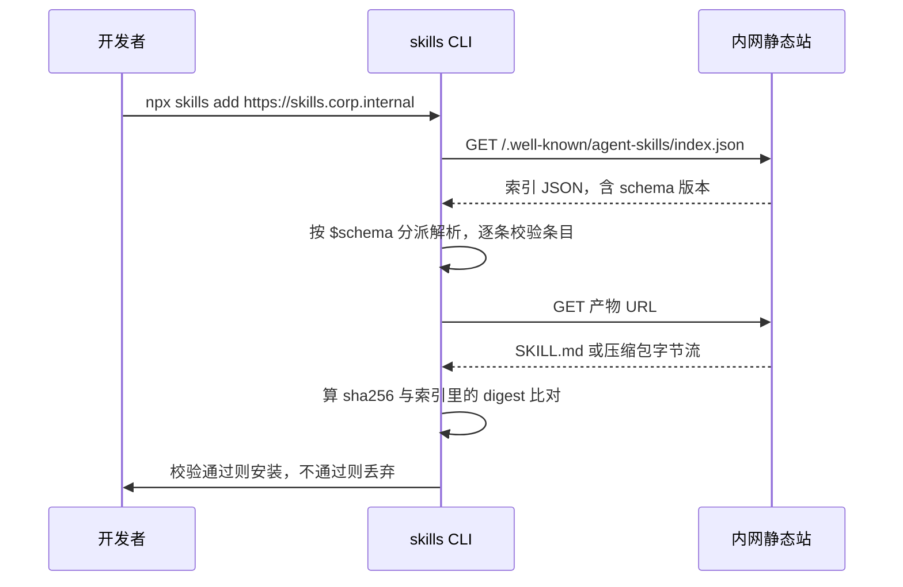
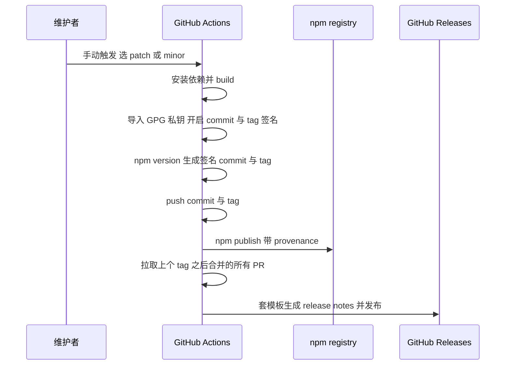

## 1. vercel-labs/skills

[vercel-labs/skills](https://github.com/vercel-labs/skills) 是 `npx skills` 这个命令背后的 CLI：把一个 Agent Skill 从 GitHub 仓库、任意 git 地址、企业内网 URL 或本地路径，装进你机器上任何一个 AI 编程工具的技能目录。它不生产 skill，它是 skill 的包管理器。

它值得读的原因不在代码量（`src/` 约 1.2 万行 TypeScript），而在它站的位置：**Agent Skills 这个格式没有中央仓库、没有版本号、没有 manifest**，可它已经被 70 多个 agent 产品支持。一个没有 registry 的生态怎么完成"安装、更新、锁版本、私有分发"这四件包管理器的活儿？这个 CLI 就是当前事实上的答案。

### 1.1 痛点：团队要建自己的 Skill 库，第一天就撞上四个问题

假设你要在公司内部推 skill：把代码评审规范、发布流程、内部 API 用法写成几十个 skill，让全组人的 Claude Code、Cursor、Codex 都能用上。第一天你就会问出四个问题：

- **格式到底怎么写才算合规？** 网上的 SKILL.md 五花八门，有人写 `version`，有人写 `tags`，有人写 `author`。哪些是规范里的，哪些是某个工具的私货？
- **怎么控版本？** 规范里压根没有 version 字段。那"这个 skill 升级了"是怎么被发现的？团队怎么钉住一个已验证的版本？
- **一份 skill 怎么同时进 N 个工具的目录？** `.claude/skills/`、`.cursor/skills/`、`.windsurf/skills/`……拷贝 N 份，改一次要同步 N 次。
- **不能开源的 skill 怎么分发？** 公司内网，不能推 GitHub，也不想为此搭一个 registry。

这四个问题，vercel-labs/skills 都给了具体答案，而且答案都能直接搬进你自己的团队。

### 1.2 四个可迁移工程模式

1. **规范的三层结构，以及"以哪一层为准"**。Agent Skills 有一份人读的规范文档、一个官方参考校验器、一个跑在几千万次安装上的真实实现——三者在字段白名单、命名字符集、目录名匹配上互不一致。搞清楚差异在哪，是任何"定一份团队资产格式"的第一步。

2. **没有版本号的生态怎么做版本控制**。用内容哈希替代 semver 做变更检测，用 git ref 做钉版本，用两个职责不同的 lockfile 分别管团队基线和本机安装。这套做法可以直接搬到 prompt 库、知识库、eval 数据集这些同样"没有版本号"的资产上。

3. **一份内容，多个目录，一次更新**。规范存储加相对符号链接的经典做法，加上符号链接失败时的降级路径和路径穿越防护。

4. **不靠 registry 的私有分发，加不靠人肉的适配层维护**。`.well-known` 静态端点加 sha256 校验就能撑起一个内网源；一张注册表加一个 CI job 就能让 70 多个平台的文档永远不过期。

本地对照源码看：

```bash
cd _references && git clone https://github.com/vercel-labs/skills.git
cd skills && git checkout v1.5.20
```

路径都从仓库根算起。本文基于 tag `v1.5.20`（commit `c042b91`，2026-07-22）。规范侧的引用来自 `github.com/agentskills/agentskills`（无 tag，取 2026-07 的 main）。项目 2026 年 1 月开源，半年拿到 2.7 万 stars。

## 2. 5 分钟跑起来

不用装，`npx` 直接跑。

**看一个仓库里有哪些 skill**：

```bash
npx skills add vercel-labs/agent-skills --list
```

**装到当前项目**（`-a` 指定目标工具，`-y` 跳过所有交互，适合写进脚本）：

```bash
npx skills add vercel-labs/agent-skills \
  --skill vercel-composition-patterns \
  -a claude-code -a windsurf -y
```

装完的目录长这样——这是理解整个工具的关键一眼：

```
.agents/skills/vercel-composition-patterns/   # 真身：规范存储
.claude/skills/vercel-composition-patterns    # 符号链接 → ../../.agents/skills/...
.windsurf/skills/vercel-composition-patterns  # 符号链接 → ../../.agents/skills/...
skills-lock.json                              # 锁文件，提交进 git
```

一份内容放在 `.agents/skills/`，每个工具的目录里只放一个相对符号链接。更新时只改真身，N 个工具同时生效。

**其他常用命令**：

| 命令 | 干什么 |
|---|---|
| `npx skills list` | 列出已装的 skill，标出装给了哪些工具 |
| `npx skills update` | 检查并更新（第 4.2 节详解） |
| `npx skills remove <name>` | 卸载 |
| `npx skills init my-skill` | 生成一个 SKILL.md 模板 |
| `npx skills experimental_install` | 按 `skills-lock.json` 还原（相当于 `npm ci`） |
| `npx skills use <repo>@<skill>` | 不安装，只把 skill 内容渲染成一段 prompt 打到 stdout |

**两个作用域**：默认装进当前项目（`./`，跟着 git 走，全组共享）；加 `-g` 装到用户级（`~/`，跨项目可用）。

**在 CI 或 agent 里跑**要注意：CLI 会检测自己是不是跑在 agent 环境里（`src/detect-agent.ts`，底层用 `@vercel/detect-agent` 认环境变量），检测到就自动进非交互模式。上面那条命令在 Claude Code 里跑，会先打印一行 `Agent detected — installing non-interactively`。

## 3. 全景架构

一次 `skills add` 干的事，可以拆成五个阶段。图 7-1 是整条主链路，后面每个核心模块都挂在这张图的某一段上。



图 7-1：一次 `skills add` 的五个阶段。看这张图你该看到的是：取内容有四条并列通道，但它们最后都汇进同一个"发现—解析—安装—写锁"的下游。所有分歧都在上游被抹平了。

五个核心抽象，记住这张表（表 7-1）：

| 抽象 | 是什么 | 在哪 |
|---|---|---|
| **Skill** | 一个目录，里面必须有 `SKILL.md`，frontmatter 必须有 `name` 和 `description` | `src/types.ts:78-87` |
| **ParsedSource** | 归一化后的来源：`github` / `gitlab` / `git` / `local` / `well-known` 五选一，加上可选的 ref、子路径、skill 过滤器 | `src/types.ts:102-110` |
| **AgentConfig** | 一个目标工具的适配条目：项目目录、全局目录、探测函数 | `src/types.ts:89-100` |
| **规范存储（canonical）** | `.agents/skills/<name>`，一份内容的唯一真身 | `src/installer.ts:98-101` |
| **两个 lockfile** | 项目级 `skills-lock.json`（提交进 git）加全局 `~/.agents/.skill-lock.json` | `src/local-lock.ts` / `src/skill-lock.ts` |

目录对照（表 7-2）：

| 目录 / 文件 | 职责 |
|---|---|
| `src/source-parser.ts` | 把用户输入的字符串解析成 `ParsedSource` |
| `src/git.ts` / `src/blob.ts` | 两条 GitHub 取内容通道：clone 与免下载快路径 |
| `src/providers/wellknown.ts` | `.well-known` 私有分发源 |
| `src/skills.ts` | 发现协议：在一个目录树里找出所有合法 skill |
| `src/installer.ts` | 安装：规范存储、符号链接、拷贝降级、路径安全 |
| `src/local-lock.ts` / `src/skill-lock.ts` | 两个锁文件 |
| `src/update.ts` | 哈希比对与重装 |
| `src/agents.ts` | 70 多个目标工具的注册表 |
| `scripts/sync-agents.ts` | 从注册表回写 README 与 package.json |

## 4. 核心模块

### 4.1 规范：SKILL.md 到底规定了什么

**30 秒版**：规范只强制两个字段——`name` 和 `description`，其他全是可选。但"规范"这个词在这里有三层含义，而且三层互不一致。

#### 4.1.1 一个格式，三份互不一致的"标准"

Agent Skills 格式由 Anthropic 起草并开放，规范落在三个地方：

| 层 | 载体 | 性质 |
|---|---|---|
| 规范文档 | [agentskills.io/specification](https://agentskills.io/specification)（源码在 `agentskills/agentskills` 的 `docs/specification.mdx`） | 人读的散文加表格，无版本号 |
| 参考校验器 | `skills-ref`（Python，版本 `0.1.0`），README 自称"仅供演示，不适合生产" | 可执行，但没人在生产里用 |
| 真实实现 | vercel-labs/skills 这个 CLI，以及各个 agent 自己的加载器 | 几千万次安装真正跑的那套 |

这三层在同一个字段上会给出不同答案。下面这张表是我把规范文档、参考校验器源码、CLI 源码逐条对齐后的结果（表 7-3）：

| 规则 | 规范文档 | 参考校验器 skills-ref | vercel-labs/skills |
|---|---|---|---|
| 必填字段 | `name`、`description` | 同左，缺一报错 | 同左，缺一跳过并打 warning |
| 未知 frontmatter 字段 | 未明说，暗示忽略 | **报错**（白名单外一律拒） | 忽略 |
| `name` 字符集 | 小写字母、数字、连字符 | Unicode 字母数字加连字符（**中文合法**） | 不校验；只在 well-known 索引里用 ASCII 正则卡 |
| `name` 必须等于目录名 | 是 | **强制** | 不校验 |
| `name` 长度 ≤ 64 | 是 | 强制 | 本地发现不校验，well-known 索引校验 |
| `description` 长度 ≤ 1024 | 是 | 强制 | 本地发现不校验，well-known 索引校验 |
| 文件名大小写 | `SKILL.md` | `SKILL.md` 优先，接受 `skill.md` | 本地磁盘只找 `SKILL.md`，远程 tree 里大小写不敏感 |

规范里的字段清单本身很短（`skills-ref/src/skills_ref/validator.py:10-22`）：

```python
MAX_SKILL_NAME_LENGTH = 64
MAX_DESCRIPTION_LENGTH = 1024
MAX_COMPATIBILITY_LENGTH = 500

# Allowed frontmatter fields per Agent Skills Spec
ALLOWED_FIELDS = {
    "name", "description", "license",
    "allowed-tools", "metadata", "compatibility",
}
```

六个字段，两个必填。`license` 写授权、`compatibility` 写环境依赖（"需要 Python 3.14+ 和 uv"这种）、`allowed-tools` 是实验性的工具预授权、`metadata` 是留给客户端塞私货的自由键值对。

**注意 `ALLOWED_FIELDS` 是白名单不是黑名单**。参考校验器对白名单外的字段直接报错（`validator.py:104-115`）：

```python
def _validate_metadata_fields(metadata: dict) -> list[str]:
    extra_fields = set(metadata.keys()) - ALLOWED_FIELDS
    if extra_fields:
        errors.append(f"Unexpected fields in frontmatter: {...}")
    return errors
```

我把这个校验函数摘出来跑了一遍，结果是（左边是输入，右边是校验器返回）：

| 输入 | 参考校验器 | 同一个 skill 装进 CLI |
|---|---|---|
| `name: 团队评审` + 同名目录 | OK | 能装，但目录名变成 `unnamed-skill` |
| `name: team-review`，目录叫 `review` | 报错：目录名必须等于 name | 能装，目录名以 `name` 为准 |
| 顶层写 `version: "1.2.0"` | **报错：Unexpected fields** | 能装，字段被忽略 |
| `metadata: {version: "1.2.0"}` | OK | 能装，字段进 `metadata` 原样保留 |

最后两行直接回答了"版本号怎么写"：**规范里没有顶层 `version` 字段，写了就不合规；唯一合法的放法是塞进 `metadata`**，而且规范文档自己的示例就是这么写的：

```yaml
name: pdf-processing
description: Extract PDF text, fill forms, merge files. Use when handling PDFs.
license: Apache-2.0
metadata:
  author: example-org
  version: "1.0"
```

但要清醒：`metadata.version` 对任何工具都没有语义。没有人会因为它变了而提示你更新，也没有人会因为它是 `2.0` 就拒绝加载。它是给人看的注释，不是给机器看的约束。真正驱动更新的是内容哈希，那是 4.2 节的事。

#### 4.1.2 第一条给团队的硬约束：name 必须是 ASCII kebab-case

中文团队会立刻踩到的坑，值得单独拎出来。

参考校验器明确支持 i18n（`validator.py:28-29` 的注释就写着 "Skill names support i18n characters"），逐字符判断用的是 Python 的 `str.isalnum()`，中文字符返回 `True`。所以 `name: 团队评审` 在规范层面完全合法。

但 CLI 安装时会先净化目录名（`src/installer.ts:50-65`）：

```typescript
export function sanitizeName(name: string): string {
  const sanitized = name
    .toLowerCase()
    // 把所有非 a-z0-9._ 的字符段替换成一个连字符
    .replace(/[^a-z0-9._]+/g, '-')
    .replace(/^[.\-]+|[.\-]+$/g, '');

  return sanitized.substring(0, 255) || 'unnamed-skill';
}
```

中文字符全部落进 `[^a-z0-9._]`，整个名字被替换成一个连字符，再被首尾修剪成空串，最后落到兜底值。实测装两个中文名的 skill：

```
✓ 团队评审 (copied)  → ./.claude/skills/unnamed-skill
```

装第二个中文 skill，会覆盖第一个。**结论：内部 skill 的 `name` 一律用 ASCII kebab-case，中文写进 `description` 和正文。** 这一条应该写进团队规范的第一行。

#### 4.1.3 渐进式披露：为什么 description 是最重要的字段

规范只强制两个字段，很容易让人以为写 skill 很随意。恰恰相反——**正因为只有两个字段，这两个字段的写法就是全部**。

原因在规范定义的加载机制：agent 不会把所有 skill 的正文都塞进上下文，而是分三段按需加载（`agentskills.io/specification` 的 Progressive disclosure 一节）。图 7-2 是这三段。



图 7-2：skill 的三段式加载。第一段对所有 skill 恒定发生，第二、三段只对被激活的 skill 发生。

这个机制有三个直接后果，每一条都该写进团队规范：

**一、`description` 是唯一的触发器。** agent 判断"这个任务要不要用这个 skill"，看的**只有** description 这一行——正文它还没读。所以 description 必须同时写清两件事：做什么，以及**什么时候用**。规范文档给的正反例对比很直白：

```yaml
# 差
description: Helps with PDFs.

# 好
description: Extracts text and tables from PDF files, fills PDF forms, and
  merges multiple PDFs. Use when working with PDF documents or when the user
  mentions PDFs, forms, or document extraction.
```

好的那条塞进了具体的触发关键词（PDF、forms、extraction）。这不是啰嗦，是**给检索器喂词**。一个内部 skill 如果没人用，九成问题出在 description 太抽象，而不是正文写得不好。

**二、装了多少个 skill 是有恒定成本的。** 每个 skill 的名字加描述约 100 tokens，且对**每一次对话**都生效。装 50 个 skill 就是每轮对话固定烧 5K tokens 的上下文。这是一条真实的预算约束——内部 skill 库不是越大越好，超过某个数量就该考虑按项目拆分安装，而不是全组全局安装。

**三、正文要短，细节外置。** 规范建议 `SKILL.md` 正文低于 500 行，详细内容放进 `references/` 让 agent 按需读。目录约定是：

```
my-skill/
├── SKILL.md       # 必须：元数据 + 指令
├── scripts/       # 可选：可执行代码
├── references/    # 可选：详细文档，agent 按需读
└── assets/        # 可选：模板、图片、数据文件
```

引用其他文件用相对路径，且规范明确建议"只深一层"，不要搞多级引用链——agent 顺着链子读三层文件的成本，比一开始就写在正文里还高。

#### 4.1.4 发现协议：目录约定就是 manifest

规范只管单个 skill 长什么样，"一个仓库里有哪些 skill"是 CLI 定的。做法是纯目录约定，没有任何索引文件。

搜索顺序在 `src/skills.ts:246-264`：

```typescript
const prioritySearchDirs = [
  searchPath,                                  // 仓库根，如果根上就有 SKILL.md
  join(searchPath, 'skills'),
  join(searchPath, 'skills/.curated'),
  join(searchPath, 'skills/.experimental'),
  join(searchPath, 'skills/.system'),
  ...AGENT_PROJECT_SKILL_DIRS.map(...),         // .claude/skills、.cursor/skills 等 26 个
];

// 已知容器目录多走一层，支持 skills/<分类>/<skill>/SKILL.md 的编目布局
const deepContainerDirs = new Set(prioritySearchDirs.slice(1));
```

图 7-3 是这套发现规则的判定顺序。



图 7-3：发现协议的判定顺序。看这张图你该看到的是：优先目录是快路径，全仓库递归只是兜底——所以把 skill 放进 `skills/` 目录，是让你的仓库被正确识别的最省事做法。

三条规则决定了它能找到什么：

- **容器目录往下走两层**：`skills/<name>/SKILL.md` 是常见的平铺布局，`skills/<category>/<name>/SKILL.md` 是编目布局，两种都认。仓库根只走一层，避免把 `examples/foo/SKILL.md` 当成 skill。
- **浅层遮蔽深层**：某一层找到 `SKILL.md` 就不再往下钻（`src/skills.ts:292`），所以一个 skill 内部的 `references/` 里就算有 `SKILL.md` 也不会被误认成另一个 skill。
- **兜底递归**：优先目录里一个都没找到才全仓库递归（最多 5 层，跳过 `node_modules`、`.git`、`dist`、`build`、`__pycache__`）。

发现之后是解析。`parseSkillMd`（`src/skills.ts:75-128`）只做三件强校验：

```typescript
if (!data.name || !data.description) {
  warnSkippedSkill(skillMdPath, `missing required frontmatter field(s): ...`);
  return null;
}
if (typeof data.name !== 'string' || typeof data.description !== 'string') {
  // YAML 会把 1.0 解析成 number、把 yes 解析成 boolean
  return null;
}
```

第二条比看起来重要：YAML 会把 `name: 2024` 解析成数字、把 `description: yes` 解析成布尔。不卡类型的话，后面 `.toLowerCase()` 会直接崩。

还有一个安全细节值得抄。frontmatter 解析器是手写的（`src/frontmatter.ts:3-7`），注释说明了为什么不用 gray-matter：

```
Minimal frontmatter parser. Only supports YAML (the `---` delimiter).
Does NOT support `---js` / `---javascript` to avoid eval()-based RCE
that exists in gray-matter's built-in JS engine.
```

skill 是从互联网下载的、要喂进 agent 的可执行指令。用一个支持 `---js` 块的 frontmatter 库解析它，等于给远程代码执行开了后门。**任何解析不可信 Markdown 的地方，都该做同样的取舍。**

配套的还有终端转义净化（`src/sanitize.ts`）：skill 的 `name` 和 `description` 会被打到终端上，恶意 skill 可以在描述里塞 ANSI 转义序列改窗口标题、清屏、伪造 CLI 输出（CWE-150，终端转义注入类漏洞的统一编号）。所有来自 frontmatter 的字符串在显示前都过一遍 `sanitizeMetadata()`。

#### 4.1.5 兼容 Claude Code 插件市场

除了目录约定，还有一条 opt-in 的显式声明路径。如果仓库里有 `.claude-plugin/marketplace.json` 或 `plugin.json`，里面声明的 skill 路径也会被搜（`src/plugin-manifest.ts:51`）：

```json
{
  "metadata": { "pluginRoot": "./plugins" },
  "plugins": [
    { "name": "my-plugin", "source": "my-plugin",
      "skills": ["./skills/review", "./skills/test"] }
  ]
}
```

manifest 声明的路径按声明深度精确搜索，不参与上面那个两层遍历。相对路径必须以 `./` 开头，且解析后必须仍在仓库内（`isContainedIn`，`plugin-manifest.ts:8-12`）——防的是 manifest 里写 `../../../.ssh` 这种。

这里的模式值得记：**约定优先，声明兜底**。绝大多数仓库零配置就能被发现，需要精确控制的仓库再写 manifest。反过来（强制所有人写 manifest）会劝退 90% 的贡献者。

#### 4.1.6 规范自身怎么迭代和发布

问"schema 每次怎么迭代、怎么发布"，对 Agent Skills 规范的诚实答案是：**它没有版本号，没有 tag，没有 release**。

`agentskills/agentskills` 仓库到 2026 年 7 月一共 130 个 commit，**零个 tag**。规范正文 `docs/specification.mdx` 从 2025 年 12 月建仓至今被改过 15 次，全部是文档级修订，一次都没有伴随版本号变更。发布方式就是 merge 进 main，Mintlify 自动构建 agentskills.io。

看一个真实的修订能明白这套机制的粒度。2026-05-16 的 commit `6868401`：

```
docs: fix name field character range to include digits

The body text described valid characters as '(a-z)' but the summary
table above correctly states 'Lowercase letters, numbers, and hyphens
only'. Updated the range to '(a-z, 0-9)' for consistency.
```

改动只有一行：

```diff
-- May only contain unicode lowercase alphanumeric characters (`a-z`) and hyphens (`-`)
+- May only contain unicode lowercase alphanumeric characters (`a-z`, `0-9`) and hyphens (`-`)
```

规范正文和它自己的摘要表格，在"名字能不能带数字"这件事上不一致了五个月才被人发现修掉。这不是黑这个项目——它恰恰说明了**散文式规范的固有代价**：同一条规则在文档里出现两次，就有两次不同步的机会。

那么规则的权威定义在哪？在参考校验器的代码里。`skills-ref/src/skills_ref/validator.py` 从 2025-12-18 加进来之后**一次都没改过**——那 15 次文档修订，没有一次触及校验逻辑。也就是说，散文一直在追赶代码，代码才是那份没写出来的规范。

治理规则写在 `CONTRIBUTING.md` 里，几条对想参与的人很重要：

| 想做什么 | 走哪 |
|---|---|
| 提案、规范设计问题、开放式讨论 | **Discussions**（不是 Issues） |
| 具体的 bug | Issues |
| 文档改进、错别字、更好的示例 | 直接提 PR |
| 提交自己写的 skill | **不收**。项目不维护社区 skill 目录 |
| 给参考校验器贡献代码 | **不收**。方向未定，只收 bug 报告 |
| 把自己的产品列进兼容清单 | 提 PR 加 logo 和条目，但产品必须**已经真的能跑**，只宣布支持的不列 |

提案还有一条硬门槛：

> Proposals should address real implementation challenges you've encountered, not theoretical concerns. Show us the problem you faced and how your proposal addresses it.

**要带着你实际撞到的问题来，不收理论探讨。** 这和前面那句"加字段容易删字段难"是同一套防御：规范的敌人不是缺功能，是功能太多。

对做团队内部规范的人，这套模式可以照抄，但要补上它缺的那一环：

| 这个项目怎么做 | 你该怎么做 |
|---|---|
| 规范是散文，规则同一条写两遍 | 散文照写，但**规则的唯一权威是那个校验器**，散文里标注"以 `validate` 为准" |
| 无版本号，靠"不加东西"避免破坏 | 团队规模小、迭代快，可以照做；但要在校验器里给出**明确的错误信息**，让不合规的人当场知道 |
| 参考实现自称"仅供演示" | 你的校验器必须是生产可用的，并挂进 CI |

#### 4.1.7 关键取舍：规范为什么故意这么小

规范只有六个字段，且明确不打算长大。`agentskills/agentskills` 的 `CONTRIBUTING.md` 写得很直白：

> We maintain a high bar for additions to the spec — it is much easier to add things to a specification than to remove them. Every new feature adds complexity that all implementers must understand and support. When in doubt, leave it out.

对比同类格式的选择（表 7-4）：

| 格式 | 元数据来源 | 版本 | 依赖声明 | 中央仓库 |
|---|---|---|---|---|
| **Agent Skills** | SKILL.md frontmatter，6 个字段 | 无 | 无 | 无 |
| npm package | package.json，几十个字段 | semver 强制 | dependencies | registry.npmjs.org |
| MCP server | 无统一包格式，各家配置文件 | 跟宿主语言的包管理器走 | 跟语言走 | 无（有若干目录站） |
| VS Code 扩展 | package.json + engines | semver 强制 | extensionDependencies | Marketplace |

Agent Skills 选了最小的那一格，代价和收益都很明确：

- **收益**：一个 agent 产品支持 skill 的成本是"扫一个目录、读 frontmatter、把 name 和 description 拼进 system prompt"——半天工作量。这是它半年铺到 70 多个产品的直接原因。参考实现里那个生成 prompt 的函数只有 50 行（`skills-ref/src/skills_ref/prompt.py`），输出就是一段 `<available_skills>` XML。
- **代价**：没有版本、没有依赖、没有中央仓库。这三件事全部被推给了下游工具——也就是这个 CLI——去解决。4.2 到 4.4 节讲的就是它怎么解决。

**给团队的判断**：你自己定内部资产格式（prompt 库、知识库、eval 集）时，默认选小的那一格。字段可以后加，加错的字段删不掉——所有已经写了这个字段的人都会骂你。

### 4.2 版本：一个没有 version 字段的生态怎么控版本

**30 秒版**：不用版本号，用**内容哈希**判断"变没变"，用 **git ref** 钉住"用哪个版本"，用**两个 lockfile** 分开记"团队基线"和"我这台机器装了什么"。

#### 4.2.1 问题：`skills update` 靠什么判断有更新

npm 靠 registry 上的版本列表。这里没有 registry，skill 就是别人仓库里的一个目录。要判断"我装的这份和上游现在的一样吗"，能选的路只有几条。

#### 4.2.2 四种做法的代价

| 做法 | 怎么判断有更新 | 代价 |
|---|---|---|
| 让作者写 `version` | 比对 semver | 靠自觉。作者改了内容忘了改版本号就完全失效 |
| 记住 commit SHA | 比对仓库 HEAD | 仓库里任何一个文件动了都算"这个 skill 更新了"，噪声极大 |
| clone 下来算文件哈希 | 比对内容 | 准确，但每次检查都要 clone 一遍全仓库 |
| 取远端目录树的哈希 | 比对目录 SHA | 准确且免下载，但依赖平台提供 tree API |

#### 4.2.3 项目的选择：两级哈希，能免下载就免下载

CLI 两条路都走，按来源分派。

**GitHub 来源走 Trees API**。一次 API 调用拿到整棵仓库树，从里面挑出目标目录的 tree SHA（`src/blob.ts:225-247`）：

```typescript
export function getSkillFolderHashFromTree(tree: RepoTree, skillPath: string): string | null {
  let folderPath = skillPath.replace(/\\/g, '/');
  // 去掉 SKILL.md 后缀，拿到目录路径
  if (folderPath.toLowerCase().endsWith('/skill.md')) {
    folderPath = folderPath.slice(0, -9);
  }
  ...
  if (!folderPath) return tree.sha;      // 根级 skill 用整棵树的 SHA

  const entry = tree.tree.find((e) => e.type === 'tree' && e.path === folderPath);
  return entry?.sha ?? null;
}
```

git 的 tree 对象哈希天然是"这个目录及其所有子内容"的摘要。目录里任何一个字节变了，tree SHA 就变；目录外的文件怎么改都不影响。**这正好就是我们想要的粒度**——不用下载任何文件内容，一次 API 调用就能判断几十个 skill 有没有更新。

**非 GitHub 来源退回本地计算**（`src/local-lock.ts:117-132`）：

```typescript
export async function computeSkillFolderHash(skillDir: string): Promise<string> {
  const files = [];
  await collectFiles(skillDir, skillDir, files);

  // 按相对路径排序，保证哈希确定性
  files.sort((a, b) => a.relativePath.localeCompare(b.relativePath));

  const hash = createHash('sha256');
  for (const file of files) {
    hash.update(file.relativePath);   // 路径也进哈希，所以改名能被检测到
    hash.update(file.content);
  }
  return hash.digest('hex');
}
```

三个细节都是有意的：排序保证同样内容在不同机器上算出同样哈希；路径进哈希所以重命名算变更；跳过 `.git` 和 `node_modules` 避免噪声。

#### 4.2.4 两个 lockfile，两种职责

这是整个版本控制设计里最值得抄的一笔：**同一件事在两个作用域下需求完全不同，所以用了两个格式不同的锁文件**（表 7-5）。

| | 项目锁 `skills-lock.json` | 全局锁 `~/.agents/.skill-lock.json` |
|---|---|---|
| 位置 | 项目根目录 | `$XDG_STATE_HOME/skills/` 或 `~/.agents/` |
| 进 git 吗 | **进**，团队共享 | 不进，本机状态 |
| schema 版本 | 1 | **3** |
| 哈希字段 | `computedHash`：本地文件内容 SHA-256 | `skillFolderHash`：GitHub tree SHA |
| 有时间戳吗 | **没有** | 有 `installedAt` / `updatedAt` |
| 排序 | 按 skill 名字典序 | 不排序 |
| 还存了什么 | 仅安装所需的最小信息 | 还存"上次选了哪些 agent"、"哪些提示已被忽略" |

项目锁的设计目标写在源码注释里（`src/local-lock.ts:11-14`）：

```
Intentionally minimal and timestamp-free to minimize merge conflicts.
Two branches adding different skills produce non-overlapping JSON keys
that git can auto-merge cleanly.
```

**不写时间戳、按名字排序**，这两条合起来的效果是：两个人在各自分支上各装一个 skill，合并时 git 能自动 merge，因为两次改动落在 JSON 的不同键上，且键的顺序是确定的。如果带了 `updatedAt`，每次安装都会改动整个文件的时间戳字段，冲突率会陡增。

一个真实的项目锁长这样：

```json
{
  "version": 1,
  "skills": {
    "vercel-composition-patterns": {
      "source": "vercel-labs/agent-skills",
      "sourceType": "github",
      "skillPath": "skills/composition-patterns/SKILL.md",
      "computedHash": "f98931159fa9c7fed043bcd18a891a46dcf89ababa38df13a4c5b7b30dc0ce07"
    }
  }
}
```

`skillPath` 是为了更新时只重装这一个 skill 而不是整个仓库（`local-lock.ts:25-31` 注释写明了这一点）。这条信息很容易漏掉，漏掉的后果是 `update` 一个 skill 要拉整个仓库重装所有 skill。

把它放进主流锁文件的谱系里看，缺的那一格就很明显了（表 7-6）：

| 锁文件 | 记版本 | 记内容哈希 | 能表达版本范围吗 |
|---|---|---|---|
| `package-lock.json` | `version` 精确版本 | `integrity` 的 SRI 哈希 | 能（`^1.2.0` 在 package.json 里） |
| `Cargo.lock` | `version` 精确版本 | `checksum` 的 sha256 | 能（Cargo.toml 里） |
| `.terraform.lock.hcl` | `version` 精确版本 | `hashes` 列表 | 能（`~> 5.0`） |
| `skills-lock.json` | **无**，只有可选的 git `ref` | `computedHash` 的 sha256 | **不能** |

前三个都是**版本号加内容哈希双轨**：版本号负责表达意图（我要 5.x 的最新版），哈希负责保证事实（我装到的确实是那一份）。skills 因为格式里没有版本号，只剩哈希单轨——**它能保证你装到的和锁里记的一致，但你没法表达"跟着 1.x 走"这种意图**。

这个缺口的实际后果是：升级只有全有或全无两档，要么钉死一个 tag，要么跟着分支跑。没有中间地带。所以 4.2.7 那条"内部仓库一律用 `#tag` 安装"的建议不是洁癖，是这个生态目前唯一能表达"我审过这一版"的方式。

#### 4.2.5 schema 迭代：两种截然不同的策略

两个锁文件对"schema 变了怎么办"给了同一个答案，但它值得单独讲，因为它对团队自建工具直接适用。

全局锁的做法（`src/skill-lock.ts:9-10`、`:88-97`）：

```typescript
const CURRENT_VERSION = 3; // Bumped from 2 to 3 for folder hash support (GitHub tree SHA)

// ...
if (typeof parsed.version !== 'number' || !parsed.skills) {
  return createEmptyLockFile();
}
// 老版本直接清空重来（不兼容变更）
// v3 加了 skillFolderHash —— 我们希望重装来填上这个字段
if (parsed.version < CURRENT_VERSION) {
  return createEmptyLockFile();
}
```

**读到旧版本就整个清空**。没有迁移代码，没有字段补全，用户下次装 skill 时重新填。

这个决定看着粗暴，但对这个场景是对的：全局锁是**可重建的本机缓存**，丢了最坏的后果是"更新检查暂时失效，直到你重装一次"。为一个可重建的缓存写迁移代码，是纯粹的负债。

对比一下项目锁——它同样在 `version < CURRENT_VERSION` 时清空（`local-lock.ts:84-86`），但它进了 git，清空意味着团队基线丢失。这里项目锁的 schema 版本至今还是 1，一次都没升过。**这不是巧合，是"进 git 的文件轻易不改 schema"的自律。**

给团队的判断标准很清晰：

| 文件性质 | schema 变更策略 |
|---|---|
| 可重建的本机缓存 | 版本号加一，读到旧版本直接丢弃重建 |
| 提交进仓库的团队基线 | 尽量不改；非改不可就写迁移，并且只做加字段这种向后兼容的改动 |

而 `.well-known` 索引的 schema 演进给了第三种答案，是最正规的一种，放在 4.4 节讲。

#### 4.2.6 update 的完整链路

图 7-4 是 `skills update` 的时序。看这张图你该看到的是：GitHub 来源整条链路一次 API 调用就够，其他来源才需要 clone。



图 7-4：`skills update` 的时序。

哈希比对就是一行（`src/update.ts:373-374`）：

```typescript
const latestHash = getSkillFolderHashFromTree(tree, entry.skillPath!);
if (latestHash && latestHash !== entry.skillFolderHash) {
  updates.push({ name: skillName, source, entry });
}
```

有两个实现选择值得说。

**一是重装不走内部函数，而是 spawn 一个自己的子进程**（`src/update.ts:469-471`）：

```typescript
const result = spawnSync(
  process.execPath,
  [cliEntry, 'add', installUrl, ...fullDepthArgs, '-g', '-y'],
  // 绝不通过 shell 启动。process.execPath 是 node 的绝对路径
```

绕开 `npx` 的嵌套行为（`npx` 里再调 `npx` 会重新解析包、可能拉到不同版本），同时用 `spawnSync` 加绝对路径、不经 shell，避免 `installUrl` 里的字符被 shell 解释。

**二是诚实地告诉用户哪些查不了**（`src/update.ts:167-185`）：

```typescript
export function getSkipReason(entry: SkillLockEntry): string {
  if (entry.sourceType === 'local') return 'Local path';
  if (entry.sourceType === 'git') return 'Git URL';
  if (entry.sourceType === 'well-known') return 'Well-known skill';
  if (!entry.skillFolderHash) return 'Private or deleted repo';
  if (!entry.skillPath) return 'No skill path recorded';
  return 'No version tracking';
}
```

查不了的 skill 会被单独列出来，并给出手动更新的命令。**没有静默跳过**——这是一个小细节，但它决定了用户会不会误以为"没提示就是最新的"。

#### 4.2.7 钉住版本：ref 语法

内容哈希解决的是"变没变"，钉版本是另一件事。CLI 支持在来源后面用 `#` 加 ref（`src/source-parser.ts:203-233`）：

```bash
npx skills add 'vercel-labs/skills#v1.5.19'          # 钉 tag
npx skills add 'owner/repo#main@my-skill'            # 钉分支 + 只装某个 skill
npx skills add 'https://github.com/o/r/tree/v2/skills/x'  # tree URL 里的 ref
```

ref 会被写进锁文件的 `ref` 字段，后续 `update` 会带着这个 ref 去比对——也就是说**钉在 tag 上的 skill 只会在那个 tag 指向的内容变了时才提示更新**，不会被 main 分支的改动惊动。

实测（shell 里 `#` 是注释符，必须引号包起来）：

```
◇  Source: https://github.com/vercel-labs/skills.git @ v1.5.19
◇  Found 1 skill
```

**给团队的落地建议**：内部 skill 仓库打 tag，业务仓库里一律用 `#tag` 安装。这样"升级 skill"变成一次显式的、可 review 的锁文件改动，而不是某个人某天跑了 `skills update` 之后组里行为集体漂移。

#### 4.2.8 自己实现最小版本

一个够用的 skill 版本控制器，核心不到 60 行：

```typescript
// 1. 算内容哈希：排序 + 路径入哈希，保证确定性
async function folderHash(dir: string): Promise<string> {
  const files = await collectFilesRecursively(dir);  // 跳过 .git / node_modules
  files.sort((a, b) => a.path.localeCompare(b.path));
  const h = createHash('sha256');
  for (const f of files) { h.update(f.path); h.update(f.content); }
  return h.digest('hex');
}

// 2. 锁文件：无时间戳、键排序，最小化 merge 冲突
async function writeLock(lock: Lock, cwd: string) {
  const sorted: Record<string, Entry> = {};
  for (const k of Object.keys(lock.skills).sort()) sorted[k] = lock.skills[k];
  await writeFile(join(cwd, 'skills-lock.json'),
    JSON.stringify({ version: 1, skills: sorted }, null, 2) + '\n');
}

// 3. 检查更新：能用远端 tree API 就免下载，否则 clone 后本地算
async function checkUpdates(lock: Lock) {
  const bySource = groupBy(Object.entries(lock.skills), ([, e]) => e.source);
  const stale = [];
  for (const [source, entries] of bySource) {
    const tree = await fetchRepoTree(source);            // 一次调用覆盖整组
    for (const [name, e] of entries) {
      const latest = tree
        ? treeShaOf(tree, dirname(e.skillPath))
        : await folderHash(join(await clone(source), dirname(e.skillPath)));
      if (latest && latest !== e.hash) stale.push({ name, source });
    }
  }
  return stale;
}
```

自己写的时候，三个地方最容易做错，按踩坑概率排序：

1. **哈希不确定**。目录遍历顺序在不同文件系统上不一样，不排序就会出现"什么都没改但哈希变了"。
2. **按 skill 而不是按 source 分组去查**。10 个 skill 来自同一个仓库就打 10 次 API，很快撞限流。
3. **忘了记 `skillPath`**。更新时只能重装整个来源，一个 skill 的更新会顺带把其他 9 个也覆盖掉。

### 4.3 安装：一份内容，N 个目录

**30 秒版**：内容只存一份在 `.agents/skills/`，每个工具目录里放一个**相对**符号链接指过去；符号链接建不了就退化成拷贝。

#### 4.3.1 问题：70 多个工具，70 多个目录

每个 agent 产品自己定技能目录：Claude Code 是 `.claude/skills/`，Cursor 和 Codex 是 `.agents/skills/`，Windsurf 是 `.windsurf/skills/`，Droid 是 `.factory/skills/`。一个开发者机器上装三四个工具很正常。装一个 skill 要进四个目录，更新时要同步四份。

#### 4.3.2 三种做法的代价

| 做法 | 怎么做 | 代价 |
|---|---|---|
| 拷贝 N 份 | 每个目录一份独立拷贝 | 更新要遍历所有目录；用户手改了其中一份后，各份悄悄漂移 |
| 只装一个共享目录 | 都写进 `.agents/skills/` | 只对认这个目录的工具有效，Claude Code 之类看不到 |
| 规范存储 + 符号链接 | 内容存一份，各目录放链接 | Windows 默认不给普通用户建符号链接；有些工具不跟随链接 |

#### 4.3.3 项目的选择：符号链接优先，拷贝兜底

图 7-5 是安装后的目录拓扑。



图 7-5：安装后的目录拓扑。注意 Cursor 和 Codex 这类工具的技能目录本来就是 `.agents/skills`，它们不需要任何链接，直接读真身。

`.agents/skills` 这个"通用目录"的概念在代码里叫 universal agent（`src/agents.ts:809-815`）：

```typescript
export function getUniversalAgents(): AgentType[] {
  return Object.entries(agents)
    .filter(([_, config]) => config.skillsDir === '.agents/skills' && ...)
    .map(([type]) => type);
}
```

判断条件就是"技能目录等于 `.agents/skills`"——不需要额外标记字段，配置本身就是判据。这类工具安装时跳过建链接，避免出现指向自己的死循环链接。

核心安装逻辑（`src/installer.ts:289-300`，节选）：

```typescript
const installMode = options.mode ?? 'symlink';

// 规范位置：.agents/skills/<skill-name>
const canonicalDir = join(getCanonicalSkillsDir(isGlobal, cwd), skillName);
// 工具位置（放链接的地方）
const agentDir = join(getAgentBaseDir(agentType, isGlobal, cwd), skillName);
```

然后是"先链接、失败就拷贝"（`src/installer.ts:391-405`）：

```typescript
const symlinkCreated = await createSymlink(canonicalDir, agentDir);

if (!symlinkCreated) {
  // 链接失败，退回拷贝
  await cleanAndCreateDirectory(agentDir);
  await copyDirectory(skill.path, agentDir, agentType);
  return { success: true, path: agentDir, canonicalPath: canonicalDir,
           mode: 'symlink', symlinkFailed: true };
}
```

注意返回值里 `mode` 仍是 `symlink`、另有一个 `symlinkFailed: true`——**"你要的是什么"和"实际发生了什么"分开记**，调用方才能给出准确的提示，而不是假装用户选了拷贝。

#### 4.3.4 三个跨平台细节

`createSymlink`（`src/installer.ts:197-263`）不到 70 行，但踩过的坑都在里面。

**一是用相对路径而不是绝对路径**（`:251-258`）：

```typescript
// 用真实（解析过符号链接的）父目录来算相对路径
const realLinkDir = await resolveParentSymlinks(linkDir);
const relativePath = relative(realLinkDir, target);
const symlinkType = platform() === 'win32' ? 'junction' : undefined;
const symlinkTarget = symlinkType === 'junction' ? resolvedTarget : relativePath;
```

相对链接才能跟着项目一起被拷贝、被打包进容器、被同步到另一台机器。实测装出来是：

```
.claude/skills/vercel-composition-patterns -> ../../.agents/skills/vercel-composition-patterns
```

Windows 上换成 junction（目录联接），因为它不需要管理员权限，而普通符号链接需要。junction 只支持绝对路径，所以那一行做了分支。

**二是防自我引用导致的 ELOOP**（ELOOP，Unix 下符号链接互相指向形成死循环时返回的错误码。代码在 `:210-222`）。如果用户把 `~/.claude/skills` 做成了指向 `~/.agents/skills` 的符号链接，那么"在 `.claude/skills/x` 建一个指向 `.agents/skills/x` 的链接"实际上是让 x 指向自己。

代码为此做两次比较：一次把两边路径都彻底解析（含符号链接）后比，另一次只解析父目录后比。任一次相等，就说明目标已经指向自己，直接返回成功——什么都不做才是对的。

**三是绝不覆盖源目录**（`src/installer.ts:327-334`）：

```typescript
// 绝不安装到源目录里面或其自身。用户在 OpenClaw 项目里跑
// `skills add ./skills --all` 时，源 ./skills/<name> 和目标 ./skills/<name>
// 是同一个路径。清理目标会在链接或拷贝之前删掉用户的源文件。
if (pathsOverlap(skill.path, agentDir)) {
  return { success: true, path: agentDir, mode: installMode, skipped: true };
}
```

安装流程里有一步是"清空目标目录再写入"（为了清掉上次安装留下的、这次已被删除的文件）。如果目标和源是同一个目录，这一步会先把用户的源码删干净。注释里点名了触发场景，说明这是线上真实发生过的。

**给团队的判断**：只要你的工具会 `rm -rf` 一个由用户输入决定的路径，就必须有 `pathsOverlap` 这类检查。它挡的不是攻击，是普通用户的一次手滑。

安全侧还有一层：所有拼出来的路径都过 `isPathSafe(base, target)`（`installer.ts:73-78`），确认结果仍在 base 之内。配合 4.1.2 的 `sanitizeName`，`name: ../../.ssh/authorized_keys` 这种会先被净化成 `.ssh-authorized_keys`，再被路径检查拦一道。**净化和校验都做，不二选一**。

#### 4.3.5 关键取舍：什么时候不该用符号链接

模式默认是符号链接，但有两处会自动切成拷贝（`src/add.ts:786-789`）：

```typescript
} else if (uniqueDirs.size <= 1) {
  // 只有一个目标目录 —— 直接拷贝（不需要符号链接）
  installMode = 'copy';
}
```

只装给一个工具时，链接没有意义——真身和链接一比一，白白多一层间接。实测装给单个 `claude-code` 时输出是 `✓ vercel-composition-patterns (copied)`，`.agents/` 目录压根不会被创建。

对比一下同类工具的选择：pnpm 用硬链接加内容寻址存储，节省的是磁盘（同一个包在几百个项目里只存一份）；这里用符号链接，图的不是省磁盘（skill 就几 KB），而是**单一更新点**。目标不同，做法就该不同——如果你的场景是"内容小、更新频繁、一处内容多处引用"，符号链接是对的；如果是"内容大、极少更新"，硬链接或直接拷贝更省事。

### 4.4 分发：不靠 registry 的四条通道

**30 秒版**：GitHub 公开仓库走免下载快路径，其他 git 源走浅克隆，企业内网走 `.well-known` 静态端点，npm 包里的 skill 走 `node_modules` 爬取。四条通道，没有一条需要中央仓库。

#### 4.4.1 问题：没有 registry，内容从哪来

npm 有 registry.npmjs.org，pip 有 PyPI。Agent Skills 什么都没有——skill 就散落在 GitHub 仓库、文档站、npm 包里。要当包管理器，就得把这些异构来源统一成一个接口。

#### 4.4.2 四条通道对比

| 通道 | 触发条件 | 怎么取 | 适合谁 |
|---|---|---|---|
| **blob 快路径** | GitHub 且属于白名单 owner | Trees API 找路径，raw 拉 frontmatter，快照 API 拉全文 | 高频安装的公开仓库 |
| **git clone** | 其他所有 git 源 | `--depth 1` 浅克隆到临时目录 | 私有仓库、GitLab、自建 git |
| **well-known** | 非 git 的 HTTP(S) URL | 拉 `index.json`，按 digest 校验后拉产物 | **企业内网自建源** |
| **node_modules** | `experimental_sync` | 爬 `node_modules` 找 `SKILL.md` | 随 npm 包分发的 skill |

对做团队内部建设的人来说，第三条是重点，第二条是保底。

#### 4.4.3 通道一：blob 快路径

先说这条，因为它解释了一个你会立刻观察到的现象：装 `vercel-labs/agent-skills` 时终端显示的是 `Fetching skills…` 而不是 `Cloning repository…`。

判据在 `src/add.ts:1146-1155`：

```typescript
} else if (parsed.type === 'github' && !options.fullDepth) {
  // 按仓库（BLOB_ALLOWED_REPOS，自托管下载地址）或按 owner
  // （BLOB_ALLOWED_OWNERS，skills.sh 托管）判定是否走快路径
  const BLOB_ALLOWED_OWNERS = ['vercel', 'vercel-labs', 'heygen-com'];
  ...
  if (ownerRepo && owner && (isSelfHostedRepo || BLOB_ALLOWED_OWNERS.includes(owner))) {
    blobResult = await tryBlobInstall(ownerRepo, {...});
  }
}
```

流程是三步（`src/blob.ts:5-11` 的文件头注释）：Trees API 找出所有 `SKILL.md` 的位置 → `raw.githubusercontent.com` 拉 frontmatter 拿到名字 → `skills.sh/api/download` 拉预构建的文件快照。整个过程不下载 `.git`，装单个 skill 时比克隆一个大仓库快一个数量级。

`tryBlobInstall` 任何一步失败都返回 `null`，调用方无缝退回 clone（`src/add.ts:1164-1166`）。**快路径必须是纯优化**——它挂了只能变慢，不能变不可用。这条在自己写缓存层时同样适用。

白名单是个诚实的取舍：快照需要服务端预构建，所以只对几个已知 owner 开。第三方仓库自己托管快照也行（`BLOB_ALLOWED_REPOS`，目前只有 `zapier/connectors` 一家）。

#### 4.4.4 通道二：git clone，以及两层认证兜底

保底通道是 `--depth 1` 浅克隆（`src/git.ts:235-245`）。真正值得抄的是它在克隆失败时的处理。

**认证失败时的两级降级**（`src/git.ts:268-289`）：

```typescript
if (isAuthError && repo && isGitHubHttpsCloneUrl(url)) {
  try {
    await resetTempDir(tempDir);
    if (await tryGhClone(repo, tempDir, ref)) return tempDir;   // 试 gh CLI
  } catch { /* 继续试 SSH */ }

  try {
    await resetTempDir(tempDir);
    await createGitClient(process.env.GIT_SSH_COMMAND ?? 'ssh -o BatchMode=yes')
      .clone(repo.sshUrl, tempDir, cloneOptions);               // 试 SSH
    return tempDir;
  } catch { /* 落到下面的报错 */ }
}
```

HTTPS 失败 → 试 `gh` CLI（很多人的 GitHub 凭证只在 `gh` 里）→ 试 SSH。三条都失败才报错，而且报错里带上下文（`git.ts:206-233`）：

```
GitHub blocked HTTPS access to <url> because the organization enforces SAML SSO.
  skills tried your existing git credentials and available fallbacks, but none succeeded.
  - Re-authorize your GitHub credentials/app for that org's SSO policy
  - Or rerun with SSH: npx skills add git@github.com:org/repo.git
  - Verify access with: gh auth status -h github.com or ssh -T git@github.com
```

**装公司私有仓库的 skill 最常见的失败就是 SSO**，这段错误信息直接给出了三条可执行的下一步。这是那种"看着不起眼但决定用户会不会提 issue"的工程投入。

另一个坑是 git-lfs（`src/git.ts:107-125`）。没装 git-lfs 的机器上克隆一个用了 LFS 的仓库会 checkout 失败。解法是在命令级把 lfs filter 全禁掉：

```typescript
config: [
  'filter.lfs.required=false',
  'filter.lfs.smudge=',
  'filter.lfs.clean=',
  'filter.lfs.process=',
],
```

注释里写明了原因：skill 是纯文本（HTML/MD/JSON），从来不会是 LFS 追踪的对象，所以留下 130 字节的指针文件完全无害。**知道自己不需要什么，才敢关掉它。**

#### 4.4.5 通道三：`.well-known` 自建源（团队内网首选）

这是整个项目里对内部 skill 建设最直接有用的一块。

思路来自 [RFC 8615](https://www.rfc-editor.org/rfc/rfc8615)：任何 HTTP 服务在 `/.well-known/<name>/` 下放约定的资源，客户端就能发现它。这里的约定是（`src/providers/wellknown.ts:104`）：

```typescript
private readonly WELL_KNOWN_PATHS = ['.well-known/agent-skills', '.well-known/skills'] as const;
```

先试 `agent-skills`，再退回 `skills`（老路径）。**你要做的只是把两个静态文件放到一个内网能访问的地址上。**

图 7-6 是完整流程。



图 7-6：`.well-known` 分发的完整流程。关键在最后一步：**digest 不匹配就整个丢弃**。

我搭了一个最小可用的内网源验证整条链路。索引文件 `index.json`：

```json
{
  "$schema": "https://schemas.agentskills.io/discovery/0.2.0/schema.json",
  "skills": [
    {
      "name": "team-review",
      "type": "skill-md",
      "description": "Run our team's PR review checklist.",
      "url": "./team-review.md",
      "digest": "sha256:8e7e0d74c099975e7f555412fde8708e7b9fb04ff69eaa7483dc059765838e82"
    }
  ]
}
```

产物就是那个 `team-review.md`，跟 `index.json` 放同一目录。起一个 `python3 -m http.server`，然后：

```bash
npx skills add http://localhost:8899 -a claude-code -y
# ✓ team-review (copied) → ./.claude/skills/team-review
```

锁文件里记的是 `"sourceType": "well-known"`，`"source": "localhost"`。

**digest 校验是真的在跑**。我往产物文件末尾追加了一行文字（不改 `index.json`），重装的结果是：

```
◇  No skills found
└  No skills found at this URL. Make sure the server has a
   /.well-known/agent-skills/index.json ... file.
```

校验代码就一行（`src/providers/wellknown.ts:470`）：

```typescript
const bytes = new Uint8Array(await response.arrayBuffer());
if (this.computeDigest(bytes) !== entry.digest) return null;
```

这意味着：**改内容必须同时改索引里的 digest**。这条约束顺手给了你两样东西——发布流程必须走脚本（人工改两个地方迟早忘），以及一个天然的完整性保护（内网静态服务器被人塞了东西，客户端装不上）。

索引条目的校验规则很严（`src/providers/wellknown.ts:325-345`），任何一条不满足这个条目就被丢掉：

```typescript
private isValidSkillEntryV2(entry: unknown): entry is WellKnownSkillEntryV2 {
  if (!this.isValidSkillName(e.name)) return false;              // ASCII kebab，1-64 字符
  if (typeof e.description !== 'string' || !e.description
      || e.description.length > 1024) return false;
  if (e.type !== 'skill-md' && e.type !== 'archive') return false;
  if (typeof e.url !== 'string' || !e.url) return false;
  if (typeof e.digest !== 'string'
      || !/^sha256:[a-f0-9]{64}$/.test(e.digest)) return false;
  ...
}
```

注意 `isValidSkillName` 用的是 `/^[a-z0-9-]+$/`（`:290`）——**ASCII only**。这是 4.1.2 那条约束的第二次出现：中文 name 在这条通道上会被直接拒绝，连 `unnamed-skill` 的机会都没有。

#### 4.4.6 schema 迭代的正规做法

`.well-known` 索引是整个项目里唯一一个**做对了 schema 版本化**的地方，值得单独学。

它同时支持两代格式（`src/providers/wellknown.ts:34-51`）：

| | v0.1.0（legacy） | v0.2.0（当前） |
|---|---|---|
| 怎么标识 | **没有 `$schema` 字段** | `$schema` 指向 schema URL |
| 条目形状 | `{name, description, files: [...]}` | `{name, type, description, url, digest}` |
| 分发单位 | 一个目录，逐个文件拉 | 一个产物（单文件或压缩包） |
| 完整性 | 无 | sha256 digest 强制 |

分派逻辑（`:230-258`）：

```typescript
const schema = record.$schema;

if (schema === DISCOVERY_SCHEMA_V2) {
  // ... 按 v0.2.0 解析
}

// 按 v0.2.0 草案，缺少 $schema 意味着 legacy/v0.1.0。
// 未知 schema 不予处理，因为其形状可能已发生不兼容变更。
if (schema !== undefined) return null;

// ... 按 v0.1.0 解析
```

这三条规则合起来是一套完整的版本演进协议：

1. **老格式靠"字段缺席"识别**。v0.1.0 发布时没人想到要加版本字段——这是所有 schema 演进的起点现实。v0.2.0 把"没有 `$schema`"本身定义成 v0.1.0，于是老发布者一个字都不用改。
2. **新格式靠 URL 标识，不是数字**。`https://schemas.agentskills.io/discovery/0.2.0/schema.json` 既是版本号，又是能取到 JSON Schema 的地址，还能直接喂给编辑器做补全。
3. **未知版本拒绝处理，而不是尽力而为**。这是最反直觉、也最重要的一条。遇到 `0.3.0` 的索引，老客户端不猜、不降级、不部分解析，直接不处理。因为形状可能已经不兼容地变了，猜错的后果是装上一个损坏的 skill。

把这三条抄进团队的任何一份 JSON 格式里，你就有了一个能演进十年的 schema。对照 4.2.5 讲的锁文件策略，三种文件三种做法（表 7-7）：

| 文件类型 | 版本标识 | 遇到不认识的版本 |
|---|---|---|
| 本机缓存（全局锁） | 整数 `version` | 直接清空重建 |
| 团队基线（项目锁） | 整数 `version`，尽量不升 | 直接清空重建（所以要极力避免升） |
| 对外发布的格式（well-known 索引） | `$schema` URL | 拒绝处理，不猜 |

#### 4.4.7 通道四：随 npm 包分发

`skills experimental_sync` 会爬 `node_modules`，在每个包的根目录、`skills/`、`.agents/skills/` 下找 `SKILL.md`（`src/sync.ts:48-92`），找到就装。

这条通道的适用场景很具体：**你的团队本来就有内部 npm 私服**。那么把 skill 打进一个 `@corp/agent-skills` 包，`npm install` 之后 `npx skills experimental_sync` 一把装完——版本控制直接复用 npm 的 semver 和 lockfile，完全绕开了本章前面所有的哈希机制。

对已经有私服的团队，这可能是最省事的路。代价是 skill 的更新绑死在 `npm install` 上，而且 `sourceType: 'node_modules'` 的条目会被 `skills update` 跳过（`src/update.ts` 的 `getProjectSkillsForUpdate` 直接过滤掉）。

### 4.5 平台适配：一张表驱动 70 多个工具

**30 秒版**：所有平台差异收敛成一个 `Record<AgentType, AgentConfig>`，README 表格和 npm keywords 由 CI 从这张表自动生成回写。新增一个平台等于加 8 行代码。

#### 4.5.1 问题：适配层怎么扛住社区 PR

70 多个工具、每个都有自己的项目目录、全局目录、探测方式，而且这个列表每周都在长。如果每加一个工具要改代码、改 README 表格、改 package.json keywords、改文档里的路径列表，那么：文档一定会过期，而且维护者会被 PR 淹死。

#### 4.5.2 项目的选择：注册表即单一事实源

一个平台就是表里的一条（`src/agents.ts:136-145`）：

```typescript
'claude-code': {
  name: 'claude-code',
  displayName: 'Claude Code',
  skillsDir: '.claude/skills',
  globalSkillsDir: join(claudeHome, 'skills'),
  detectInstalled: async () => existsSync(claudeHome),
},
```

五个字段，其中一个是函数。全局目录允许是 `undefined`，表示这个工具不支持全局安装（Eve 和 PromptScript 就是这样）。探测函数绝大多数就是"这个目录存在吗"。

环境变量覆盖统一在文件顶部处理（`src/agents.ts:10-15`）：

```typescript
const codexHome = process.env.CODEX_HOME?.trim() || join(home, '.codex');
const claudeHome = process.env.CLAUDE_CONFIG_DIR?.trim() || join(home, '.claude');
const vibeHome = process.env.VIBE_HOME?.trim() || join(home, '.vibe');
```

个别工具需要更复杂的探测，也照样塞进表里（`src/agents.ts:33-47`），比如 OpenClaw 改过两次名，要按历史顺序试三个目录：

```typescript
export function getOpenClawGlobalSkillsDir(homeDir = home, pathExists = existsSync) {
  if (pathExists(join(homeDir, '.openclaw'))) return join(homeDir, '.openclaw/skills');
  if (pathExists(join(homeDir, '.clawdbot'))) return join(homeDir, '.clawdbot/skills');
  if (pathExists(join(homeDir, '.moltbot'))) return join(homeDir, '.moltbot/skills');
  return join(homeDir, '.openclaw/skills');
}
```

注意签名里的 `homeDir` 和 `pathExists` 都有默认值——**为了测试可注入**。适配层最难测的就是"这个目录存不存在"，把 `existsSync` 做成参数，测试就不需要真的去建目录。

#### 4.5.3 CI 把表回写成文档

这是解决"文档必然过期"的那一环，也是本节最值得抄的部分。

README 里那张 70 多行的平台表、`package.json` 里那串 keywords、文档里的技能目录列表，**全都不是手写的**。`scripts/sync-agents.ts` 从 `agents` 这张表生成它们，用 HTML 注释做锚点（`scripts/sync-agents.ts:86-97`）：

```typescript
function replaceSection(content: string, marker: string, replacement: string, inline = false) {
  const regex = new RegExp(`(<!-- ${marker}:start -->)[\\s\\S]*?(<!-- ${marker}:end -->)`, 'g');
  return content.replace(regex, `$1\n${replacement}\n$2`);
}

function main() {
  let readme = readFileSync(README_PATH, 'utf-8');
  readme = replaceSection(readme, 'agent-list', generateAgentList());
  readme = replaceSection(readme, 'supported-agents', generateAvailableAgentsTable());
  readme = replaceSection(readme, 'skill-discovery', generateSkillDiscoveryPaths());
  writeFileSync(README_PATH, readme);

  const pkg = JSON.parse(readFileSync(PACKAGE_PATH, 'utf-8'));
  pkg.keywords = generateKeywords();     // 基础关键词 + 所有 agent 名
  writeFileSync(PACKAGE_PATH, JSON.stringify(pkg, null, 2) + '\n');
}
```

README 里对应的位置就是一对注释包着的表格：

```markdown
<!-- supported-agents:start -->
| Agent | `--agent` | Project Path | Global Path |
|-------|-----------|--------------|-------------|
| Claude Code | `claude-code` | `.claude/skills/` | `~/.claude/skills/` |
...
<!-- supported-agents:end -->
```

生成表格时还会**按路径分组合并**（`sync-agents.ts:22-56`）：所有 `skillsDir` 和 `globalSkillsDir` 都相同的工具压成一行。所以 README 里会出现 `| Cline, Dexto, Kimi Code CLI, Loaf, Warp, Zed | ... | .agents/skills/ | ~/.agents/skills/ |` 这种行——70 多个工具压成 60 多行表格，可读性明显更好。

然后 CI 把这件事变成自动的（`.github/workflows/agents.yml`）：

```yaml
on:
  pull_request:
    paths: ["src/agents.ts"]
  push:
    branches: [main]
    paths: ["src/agents.ts"]

jobs:
  validate-agents:            # PR 阶段：只校验
    steps:
      - run: node scripts/validate-agents.ts

  sync-agents:                # 合入 main 后：生成并回写
    needs: validate-agents
    if: github.event_name == 'push' && github.ref == 'refs/heads/main'
    steps:
      - run: pnpm exec node scripts/sync-agents.ts
      - run: |
          git diff --quiet README.md package.json \
            || (git add README.md package.json \
                && git commit -m "chore: update README and package.json with latest agents")
      - run: git push
```

**PR 阶段只校验、不改文件**（贡献者的分支不会被机器人搅乱），**合入 main 之后才由 bot 生成并提交**。工作流只在 `src/agents.ts` 变动时触发，日常 PR 不会被它拖慢。

校验脚本本身只有 100 行，做的事是查重（`scripts/validate-agents.ts:23-39`）：`displayName` 不能重复（大小写不敏感），否则 UI 上会出现两个"Cursor"分不清。有意思的是路径查重被注释掉了（`:90-91`）：

```typescript
checkDuplicateDisplayNames();
// It's fine to have duplicate skills dirs
// checkDuplicateSkillsDirs();
```

因为多个工具共用 `.agents/skills` 是这个设计的核心，路径重复是特性不是缺陷。**留着代码加一行注释说明为什么不启用，比删掉更有价值**——下一个人不会再写一遍。

最后一环是 issue 模板。`.github/ISSUE_TEMPLATE/agent-request.yml` 定义了"请求支持一个新工具"要填的五个字段：Agent Name、Skills Documentation URL、Project Skills Directory、Global Skills Directory、Detection Path。

**这张表单基本覆盖了 `AgentConfig` 需要的全部信息**（`Agent Name` 拆成 `name` 和 `displayName`，两个目录字段直接对应，`Detection Path` 变成探测函数的函数体；只有文档链接是给维护者自己查证用的，不进代码）。提 issue 的人填完表，维护者照抄成八行代码就完事。表单即 schema——这是整套设计里最省人力的一笔。

#### 4.5.4 发布：一次点击，六个动作

适配表变了要发版，发版流程本身也是这套"人只做决策、机器做执行"的延续。整条流水线在 `.github/workflows/publish.yml`，图 7-7 是它做的六件事。



图 7-7：发布流水线。维护者只做一个决策——patch 还是 minor。

六个动作里有四个是安全或自动化上的刻意设计：

**一、只有 patch 和 minor，没有 major。** 触发入口是 `workflow_dispatch`，选项写死两个：

```yaml
inputs:
  bump:
    description: 'Version bump type'
    type: choice
    options: [patch, minor]
```

39 个 tag 里，`v1.5.0` 到 `v1.5.20` 全是 patch，节奏约一周一次。一个被 70 多个平台依赖的工具，major 意味着所有下游要改，所以干脆把这个选项从 UI 上拿掉。这和 4.1.7 讲的"规范不加字段"是同一种克制。

**二、commit 和 tag 都做 GPG 签名。** `npm version` 之前先导入签名密钥，开启 `git_commit_gpgsign` 和 `git_tag_gpgsign`。这样"哪个 commit 对应哪个发布版本"是可验证的，不能被伪造。

**三、第三方 action 全部钉 commit SHA，GPG action 还换成了自己的 fork**（`publish.yml:45-50`）：

```yaml
# Pinned to a maintainer-owned fork of crazy-max/ghaction-import-gpg
# so a compromise of the upstream namespace can't push malicious code
# into our release pipeline. Update the SHA deliberately when pulling
# upstream changes.
uses: quuu/ghaction-import-gpg@72c784c2e295f26ec09b0c20761c93711beaa338
```

签名密钥要经手的那个 action，是整条流水线权限最高的一环。钉 SHA 防的是 tag 被移动，fork 防的是上游命名空间被接管。**权限越高的环节，供应链假设越要保守。**

**四、`npm publish --provenance`。** 这会让 npm 记录"这个包是由哪个仓库的哪次 workflow 构建的"，用户可以在 npm 页面上验证包和源码的对应关系。配合 `id-token: write` 权限使用，几乎零成本。

**五、changelog 从 PR 列表生成，不手写**（`publish.yml:80-96`）：

```bash
LATEST_TAG=$(git describe --tags --abbrev=0 HEAD^)
SINCE=$(git log -1 --format=%cI ${LATEST_TAG})
PRS=$(gh pr list --state merged --search "merged:>=${SINCE}" --json number,title,author --limit 100)

CHANGELOG=$(echo "$PRS" | jq -r '.[] | "- \(.title) (#\(.number))"')
CONTRIBUTORS=$(echo "$PRS" | jq -r '.[].author.login' | sort -u | sed 's/^/@/' | paste -sd ', ' -)

envsubst < .github/RELEASE_TEMPLATE.md > release-notes.md
gh release create "v${VERSION}" --notes-file release-notes.md
```

用"上个 tag 的提交时间"做时间锚点去查合并的 PR，比解析 commit message 更准（squash merge 之后 commit message 里的信息已经损失了）。模板本身只有六行——标题加两个变量。贡献者名单自动去重署名，这一步对社区项目的意义不比 changelog 小。

**给团队的判断**：内部工具不一定需要 GPG 和 provenance，但"发布只有一个手动决策点、其余全自动"这条应该照做。发布流程里每多一个人工步骤，就多一个在周五下午被跳过的机会。

#### 4.5.5 自己实现最小版本

把这套搬到团队里，核心是三个文件：

```typescript
// 1. registry.ts —— 单一事实源，唯一需要人改的文件
export const targets = {
  'claude-code': { displayName: 'Claude Code', dir: '.claude/skills',
                   globalDir: join(home, '.claude/skills'),
                   detect: () => existsSync(join(home, '.claude')) },
  // ... 加一个平台就加一条
};

// 2. scripts/sync-docs.ts —— 从 registry 生成文档片段，用注释锚点替换
const table = Object.entries(targets).map(([k, t]) =>
  `| ${t.displayName} | \`${k}\` | \`${t.dir}/\` |`).join('\n');
readme = readme.replace(
  /(<!-- targets:start -->)[\s\S]*?(<!-- targets:end -->)/,
  `$1\n| 工具 | 标识 | 目录 |\n|---|---|---|\n${table}\n$2`);

// 3. .github/workflows/sync.yml —— PR 校验，合入后回写
//    on.pull_request.paths: [src/registry.ts]  → 只跑 validate
//    on.push.branches: [main]                  → 跑 sync 并 commit
```

配一个 issue 表单，字段和 registry 条目一一对应。这套东西加起来不到 200 行，但它把"每加一个平台的边际成本"从"改四个地方加一次 review"压到了"加一条记录"。

## 5. 工程细节

一些不构成模块、但可以直接搬走的做法（表 7-8）：

| 习惯 | 项目怎么做 | 可迁移到哪 |
|---|---|---|
| 遥测默认开、给两个关闭开关 | `DISABLE_TELEMETRY` 和 `DO_NOT_TRACK` 任一存在即关，CI 环境自动关（`src/telemetry.ts:84-86`） | 任何 CLI。`DO_NOT_TRACK` 是跨工具的社区约定，值得跟随 |
| 遥测不阻塞主流程 | 请求 promise 存进数组，退出前统一 await（`telemetry.ts:136-138`） | 任何有埋点的 CLI：既不丢数据，也不让用户等 |
| 安装前显示第三方安全审计 | 装之前拉一次审计 API，把 Socket / Snyk 的风险等级做成表打出来；3 秒超时，失败就不显示（`telemetry.ts:108-134`） | 任何分发第三方可执行内容的工具 |
| 限流后才取凭证，并提前告知 | 先匿名请求，撞限流才去读 `gh auth token`，且执行前往 stderr 打一行说明（`src/skill-lock.ts:157-164`） | 任何会 spawn 凭证工具的 CLI。注释写明了原因：企业终端防护会把这个动作报成凭证窃取 |
| 进程内记住限流状态 | 一旦撞过限流，后续调用直接走带 token 的路径（`src/blob.ts:88-93`） | 任何会对同一 API 发多次请求的客户端 |
| 交互只在必要时出现 | 只有一个目标目录时不问"链接还是拷贝"（`src/add.ts:763-767`） | 所有交互式 CLI：没有区别的选项就别问 |
| 记住上次的选择 | 全局锁里存 `lastSelectedAgents` | 重复使用的 CLI |
| CI 矩阵覆盖真实下限 | ubuntu + windows × Node 22.20 / 24 / 26（`.github/workflows/ci.yml`） | 任何声明了 `engines.node` 的包：把声明的最低版本真的跑一遍 |
| CI 跳过纯文档改动 | `paths-ignore: ['**/*.md']` | 任何 README 改动频繁的仓库，省掉大量无意义的 CI 分钟数 |
| 预发布走独立 dist-tag | `npm version prerelease --preid=snapshot && npm publish --tag snapshot`（dist-tag 是 npm 给版本起的别名，`latest` 是默认那个） | 需要让少数人先试的包：`npm i pkg@snapshot` 才装到，普通用户不受影响 |

## 6. 适用边界与不该照搬的部分

### 6.1 该用 / 不该用

| 场景 | 判断 |
|---|---|
| 团队内部推 skill，成员用多种 agent | **该用**。多目标安装加符号链接这件事自己写不划算 |
| 内网私有 skill 分发 | **该用** `.well-known` 通道，两个静态文件的成本 |
| 只有一种 agent、skill 只有几个 | 不必用。直接 `git submodule` 或拷贝进 `.claude/skills/` 更简单 |
| 需要 skill 之间有依赖关系 | 不适用。格式里没有依赖概念，得自己想办法 |
| 需要精确的语义版本和回滚 | 谨慎。只能靠 git tag 加 `#ref`，没有 `^1.2.0` 这种范围表达 |

### 6.2 几个实测出来的坑

**一是 `experimental_install` 不还原符号链接布局。** 这是团队协作场景里最容易中的招。A 同学执行：

```bash
npx skills add corp/skills -a claude-code -a windsurf -y
```

得到 `.agents/skills/` 加两个工具目录的符号链接，然后提交 `skills-lock.json`。B 同学 clone 后执行 `npx skills experimental_install`，得到的是：

```
Project Skills
my-skill  ./.agents/skills/my-skill
  Agents: not linked   Source: corp/skills
```

只有规范存储，没有任何符号链接。原因写在 `src/install.ts:13-14`：还原只装给 universal agents。对 Cursor、Codex 这类直接读 `.agents/skills` 的工具没问题，但 Claude Code 会看不到这些 skill。

**规避办法**：把 `.agents/skills/` 提交进 git（内容本来就该进版本控制），或者在团队文档里把还原命令写成完整的 `skills add` 而不是 `experimental_install`。

**二是 digest 不匹配的报错具有误导性。** 4.4.5 节实测过：产物被改动而索引没更新时，用户看到的是 `No skills found at this URL. Make sure the server has a /.well-known/... file.`——一句关于文件不存在的提示，实际原因是校验失败。自建内网源时，把"改内容必须重算 digest"写进发布脚本，不要指望报错会提醒你。

**三是遥测默认开。** 安装行为（来源、skill 名、目标工具）会上报。公司环境里建议在 CI 和开发机的 shell profile 里统一设 `DO_NOT_TRACK=1`。

**四是 skill 以 agent 的完整权限运行。** CLI 自己在每次安装结束时都会提醒：`Review skills before use; they run with full agent permissions.` 一个 skill 可以指示 agent 执行任意命令。内部 skill 库必须走 code review，外部 skill 引入前必须有人通读 `SKILL.md` 和 `scripts/`。

### 6.3 不该照搬的部分

**别照搬"内容哈希即版本"到有兼容性契约的资产上。** 这套机制回答的是"变了没有"，不是"能不能升"。skill 是纯文本指令，改坏了最坏结果是 agent 表现变差；如果你的资产是代码或有格式契约的数据，语义版本仍然必要。

**别照搬 `ALLOWED_FIELDS` 白名单式校验到会被多方扩展的格式上。** 参考校验器对未知字段报错，但真实实现全都选择了忽略——因为白名单在一个多实现的生态里必然导致"某家加了个字段，另一家就报错"。定内部格式时，**必填字段严格校验，未知字段一律忽略**，这是这个生态用真实结果投票选出来的做法。

**别照搬 blob 快路径的白名单模式**，除非你也运营着那个快照服务。对绝大多数团队，clone 通道够用了。

## 7. 自己搭一套内部 Skill 分发，一周的路线图

把本章的东西组装成一个内部方案，按依赖顺序排：

**第 1 天：定规范。** 写一份两页的内部约定，硬约束只要三条：`name` 用 ASCII kebab-case 且等于目录名；`description` 写清"做什么"和"什么时候用"（这是 agent 判断要不要激活的唯一依据）；版本信息只能写进 `metadata.version` 且仅供人读。把 `skills-ref validate` 挂进 skill 仓库的 CI。

**第 2 天：建仓库。** 一个 `corp/agent-skills` 仓库，布局用 `skills/<name>/SKILL.md`。每次发布打 tag。团队成员用 `npx skills add corp/agent-skills#v1.3.0` 安装——**一律带 tag**，让升级变成一次显式的锁文件改动。

**第 3-4 天：搭内网源（如果不能上 GitHub）。** 一个静态站，两类文件：`/.well-known/agent-skills/index.json` 和各个产物。发布脚本干三件事：打包产物、算 sha256、重写 index.json。这个脚本是整套方案唯一需要自己写的代码，不到 100 行。

**第 5 天：接 CI。** 业务仓库的 CI 里加一步 `npx skills experimental_install`（注意 6.2 的第一个坑，视情况改成完整的 `skills add`），保证 CI 环境和开发机装的是同一份。`skills-lock.json` 进 git 并要求 review。

**第 6-7 天：治理。** 一个每周跑的 job，执行 `skills update` 的检查部分，把有更新的 skill 列成报告发到群里，由人决定要不要升 tag。别做成自动升级——skill 是直接改变 agent 行为的东西，自动升级等于让全组的 agent 在某个周二早上集体换了个性格。

整套下来，你自己写的代码只有那个发布脚本和那个周报 job。其余全是别人写好的。

## 8. 延伸阅读

**规范与参考实现**

- [agentskills.io/specification](https://agentskills.io/specification) — 规范正文，二十分钟能读完，建议全组通读
- [github.com/agentskills/agentskills](https://github.com/agentskills/agentskills) — 规范仓库，`skills-ref/` 是参考校验器（Python），`CONTRIBUTING.md` 说明了提案该走 Discussions 而不是 Issues
- [RFC 8615](https://www.rfc-editor.org/rfc/rfc8615) — `.well-known` URI 的原始定义，4.4.5 那套私有分发的理论基础

**同领域的其他项目**

- [anthropics/skills](https://github.com/anthropics/skills) — 官方示例 skill 集合，看规范怎么被实际使用
- [vercel-labs/agent-skills](https://github.com/vercel-labs/agent-skills) — 本章各处实测用的 skill 仓库，可以直接当内部仓库的布局模板
- [skills.sh](https://skills.sh) — 这个 CLI 背后的目录站，提供搜索 API 和安装量统计。看点在于它是一个**可选的**索引层：没有它 CLI 照样能装，这和 npm 离了 registry 就废掉形成对比
- Claude Code 插件市场（`.claude-plugin/marketplace.json`）— 另一条显式声明式的分发路线，和本章的目录约定路线正好是两端

**相关阅读**

- [The Update Framework (TUF)](https://theupdateframework.io/) — 如果你的内网源要防的不只是手滑而是攻击，这是软件更新安全的完整威胁模型
- pnpm 的[内容寻址存储设计](https://pnpm.io/motivation) — 同样是"一份内容多处引用"，但用硬链接、图的是省磁盘，和本章 4.3 的取舍差异值得对照

---

本文基于 vercel-labs/skills tag `v1.5.20`（commit `c042b91`，2026-07-22）写就。规范侧引用取自 `agentskills/agentskills` 2026 年 7 月的 main 分支（该仓库无 tag）。项目于 2026 年 1 月开源，写作时 2.7 万 stars、2.3 千 forks、39 个发布 tag。
