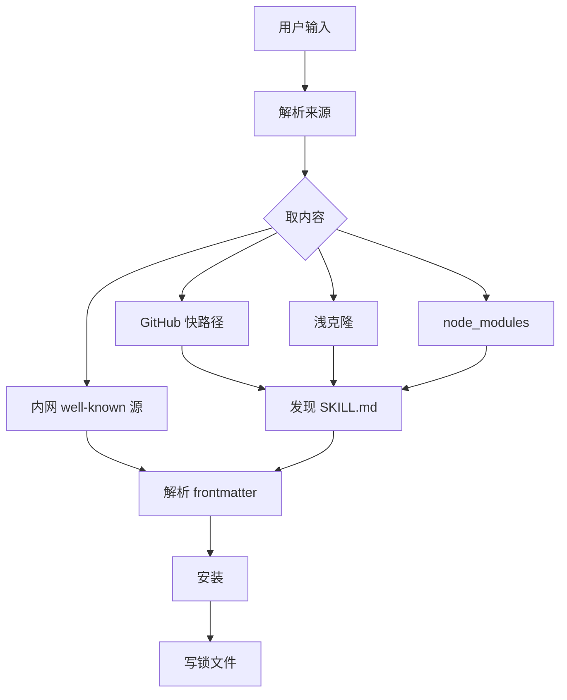
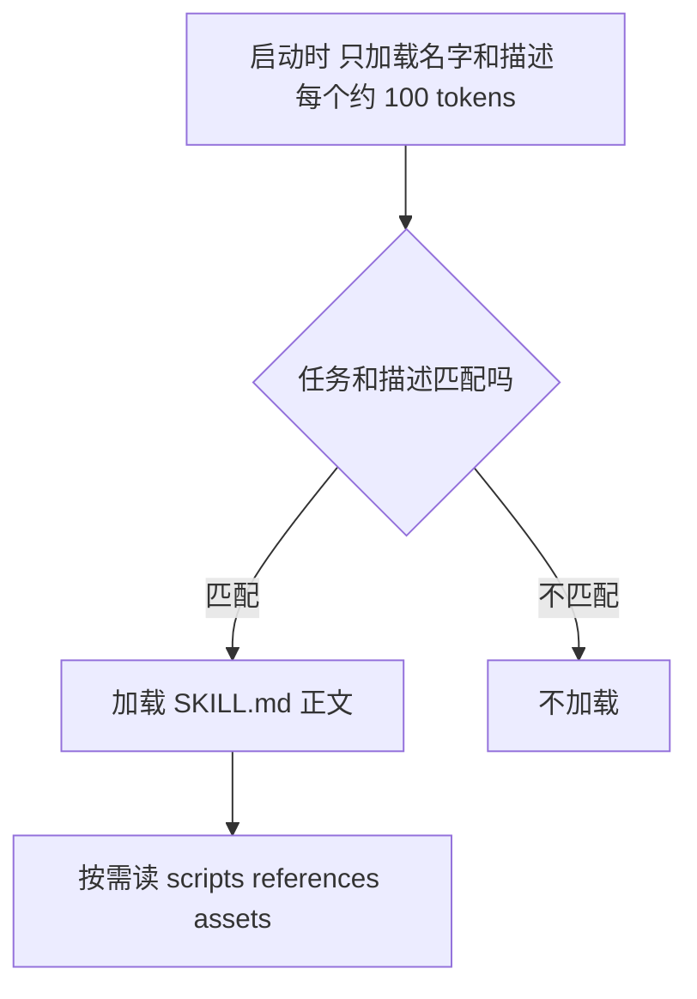
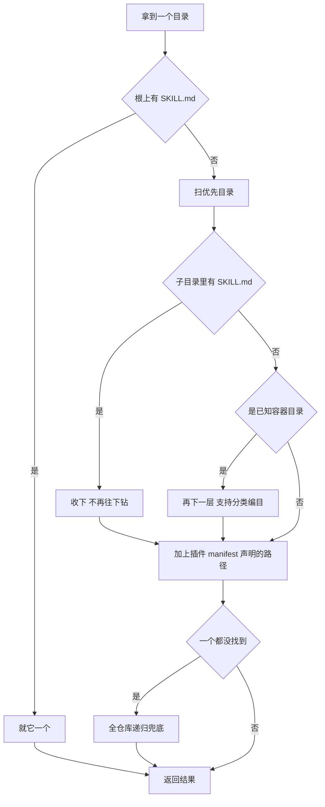
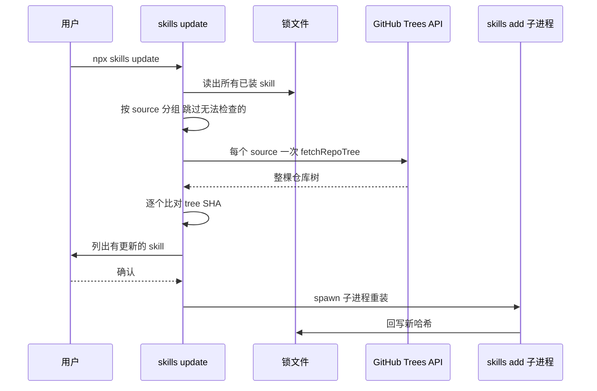
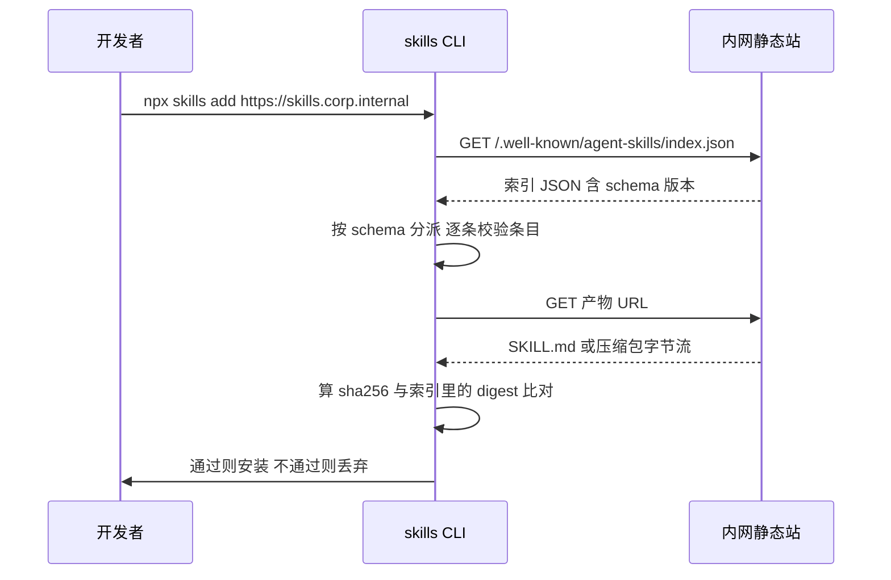

## 1. vercel-labs/skills

[vercel-labs/skills](https://github.com/vercel-labs/skills) 是 `npx skills` 这个命令背后的 CLI，把一个 Agent Skill 从 GitHub 仓库、任意 git 地址、企业内网 URL 或本地路径，装进你机器上任何一个 AI 编程工具的技能目录。它是 skill 的包管理器。

有意思的地方在它站的位置。Agent Skills 这个格式没有中央仓库，没有版本号，也没有 manifest 文件，可它已经被 70 多个 agent 产品支持。一个没有 registry 的生态，怎么完成安装、更新、锁版本、私有分发这四件包管理器的活儿？这个 CLI 是当前事实上的答案，虽然读完你会发现，其中有一件它其实没做成。

### 1.1 痛点：团队建 Skill 库，第一天撞上的四个问题

假设你要在公司内部推 skill，把代码评审规范、发布流程、内部 API 用法写成几十个 skill，让全组人的 Claude Code、Cursor、Codex 都能用上。第一天你就会问出四个问题：格式怎么写才算合规，网上的 SKILL.md 五花八门，有人写 `version` 有人写 `tags`，哪些是规范里的哪些是私货；版本怎么控，规范里压根没有 version 字段，那"这个 skill 升级了"是怎么被发现的；一份 skill 怎么同时进 `.claude/skills/`、`.cursor/skills/`、`.windsurf/skills/` 而不用改一次同步三次；不能开源的 skill 怎么分发，公司内网推不了 GitHub，也不想为此搭一个 registry。

这四个问题这个项目都给了答案。有两个答案很漂亮，有一个是半成品，还有一个它自己都没意识到有洞。

### 1.2 读完你会带走什么

**规范的三层结构，以及以哪一层为准。** Agent Skills 有一份人读的规范文档、一个官方参考校验器、一个跑在几千万次安装上的真实实现，三者在字段白名单、命名字符集、目录名匹配上互不一致。搞清楚差异在哪，是定任何一份团队资产格式的第一步。

**没有版本号的生态怎么做版本控制，以及内容哈希的边界在哪。** 这一章会把这套机制拆开看，也会指出它做不到的事，它能告诉你"上游变了"，不能告诉你"我装到的是对的"。这两件事在文章里经常被混为一谈，包括这个项目自己的文档。Go modules 用 dirhash 加伪版本把同一道题做完了，我们会拿它当参照。

**一份内容多个目录一次更新。** 主副本目录加相对符号链接，加上符号链接失败时的降级路径和路径穿越防护。

**不靠 registry 的私有分发，和不靠人肉的适配层维护。** `.well-known` 静态端点能撑起一个内网源，一张注册表加一个 CI job 能让 70 多个平台的文档永远不过期。

本地对照源码看：

```bash
cd _references && git clone https://github.com/vercel-labs/skills.git
cd skills && git checkout v1.5.20
```

路径都从仓库根算起。本文基于 tag `v1.5.20`（commit `c042b91`，2026-07-22）。规范侧的引用来自 `github.com/agentskills/agentskills`（该仓库无 tag，取 2026 年 7 月的 main）。项目 2026 年 1 月开源，半年拿到 2.7 万 stars。

## 2. 5 分钟跑起来

不用装，`npx` 直接跑。我们先看一个仓库里有哪些 skill：

```bash
npx skills add vercel-labs/agent-skills --list
```

装到当前项目，`-a` 指定目标工具，`-y` 跳过所有交互：

```bash
npx skills add vercel-labs/agent-skills \
  --skill vercel-composition-patterns \
  -a claude-code -a windsurf -y
```

装完的目录长这样，这是理解整个工具的关键一眼：

```
.agents/skills/vercel-composition-patterns/   # 主副本，真身在这
.claude/skills/vercel-composition-patterns    # 符号链接 → ../../.agents/skills/...
.windsurf/skills/vercel-composition-patterns  # 符号链接 → ../../.agents/skills/...
skills-lock.json                              # 锁文件，提交进 git
```

一份内容放在 `.agents/skills/`，每个工具的目录里只放一个相对符号链接。更新时只改真身，N 个工具同时生效。

其他常用命令：

| 命令 | 干什么 |
|---|---|
| `npx skills list` | 列出已装的 skill，标出装给了哪些工具 |
| `npx skills update` | 检查并更新，项目级和全局都管 |
| `npx skills remove <name>` | 卸载 |
| `npx skills init my-skill` | 生成一个 SKILL.md 模板 |
| `npx skills experimental_install` | 按 `skills-lock.json` 重装（注意它不校验哈希，4.3 会讲） |
| `npx skills use <repo>@<skill>` | 不安装，只把 skill 渲染成一段 prompt 打到 stdout |

默认装进当前项目（`./`，跟着 git 走，全组共享），加 `-g` 装到用户级（`~/`，跨项目可用）。

在 CI 或 agent 里跑要注意两件事。一是 CLI 会检测自己是不是跑在 agent 环境里（`src/detect-agent.ts`，底层用 `@vercel/detect-agent` 认环境变量），检测到就自动进非交互模式，上面那条命令在 Claude Code 里跑会先打印一行 `Agent detected — installing non-interactively`。二是别写裸的 `npx skills`，那样每次构建都从 npm 拉最新版；写成 `npx skills@1.5.20` 把版本钉住。

## 3. 全景架构

我们先把一次 `skills add` 干的事走一遍，它分五个阶段，图 7-1 是整条主链路，后面每个模块都挂在这张图的某一段上。



图 7-1：一次 `skills add` 的五个阶段。取内容有四条并列通道，但它们最后都汇进同一个下游，所有分歧都在上游被抹平了。

五个核心抽象：

| 抽象 | 是什么 | 在哪 |
|---|---|---|
| **Skill** | 一个目录，里面必须有 `SKILL.md`，frontmatter 必须有 `name` 和 `description` | `src/types.ts:78-87` |
| **ParsedSource** | 归一化后的来源，`github` / `gitlab` / `git` / `local` / `well-known` 五选一，加可选的 ref、子路径、skill 过滤器 | `src/types.ts:102-110` |
| **AgentConfig** | 一个目标工具的适配条目：项目目录、全局目录、探测函数 | `src/types.ts:89-100` |
| **主副本目录** | `.agents/skills/<name>`，一份内容的唯一真身，代码里叫 canonical | `src/installer.ts:98-101` |
| **两个锁文件** | 项目级 `skills-lock.json`（带 s，进 git）和全局 `~/.agents/.skill-lock.json`（不带 s，本机状态） | `src/local-lock.ts` / `src/skill-lock.ts` |

最后那一行的命名差一个字母，全章会反复出现，记一个助记：**带 s 的那个进 git**。

目录对照：

| 目录 / 文件 | 职责 |
|---|---|
| `src/source-parser.ts` | 把用户输入的字符串解析成 `ParsedSource` |
| `src/git.ts` / `src/blob.ts` | 两条 GitHub 取内容通道：clone 与免下载快路径 |
| `src/providers/wellknown.ts` | `.well-known` 私有分发源 |
| `src/skills.ts` | 发现协议：在一个目录树里找出所有合法 skill |
| `src/installer.ts` | 安装：主副本、符号链接、拷贝降级、路径安全 |
| `src/local-lock.ts` / `src/skill-lock.ts` | 两个锁文件 |
| `src/update.ts` | 哈希比对与重装 |
| `src/agents.ts` | 70 多个目标工具的注册表 |
| `scripts/sync-agents.ts` | 从注册表回写 README 与 package.json |

## 4. 核心模块

### 4.1 规范：SKILL.md 到底规定了什么

#### 4.1.1 一个格式，三份互不一致的标准

规范只强制两个字段：`name` 和 `description`，其他全是可选。我们先看这两个字段。

但"规范"这个词在这里指三样东西。规范落在三个地方：[agentskills.io/specification](https://agentskills.io/specification) 上一份人读的散文文档（源码在 `agentskills/agentskills` 的 `docs/specification.mdx`，无版本号）；一个叫 `skills-ref` 的 Python 参考校验器，README 自称"仅供演示，不适合生产"；以及跑在几千万次安装上的这个 CLI 和各个 agent 自己的加载器。

三者在同一个字段上会给出不同答案。下面这张表是我把规范文档、参考校验器源码、CLI 源码逐条对齐，并把每条规则实际拿去装了一遍之后的结果：

| 规则 | 规范文档 | 参考校验器 | 这个 CLI | 实测装进 CLI 的结果 |
|---|---|---|---|---|
| 必填 `name`、`description` | 是 | 缺一报错 | 缺一跳过并打 warning | 一致 |
| 未知 frontmatter 字段 | 未明说 | **报错**（白名单外一律拒） | 忽略 | `weird-field: whatever` 照装不误 |
| 顶层写 `version` | 未列入字段 | **报错** | 忽略 | 照装不误，字段被丢弃 |
| `name` 字符集 | 小写字母、数字、连字符 | Unicode 字母数字（**中文合法**） | 不校验 | `name: 团队评审` 能装 |
| `name` 必须等于目录名 | 是 | **强制** | 不校验 | 目录叫 `review`、name 写 `team-review`，照装 |
| `name` ≤ 64 字符 | 是 | 强制 | 本地发现不校验 | 超长不报错 |
| `description` ≤ 1024 字符 | 是 | 强制 | 本地发现不校验 | 超长不报错 |

规范里的字段清单本身很短（`skills-ref/src/skills_ref/validator.py:10-22`）：

```python
MAX_SKILL_NAME_LENGTH = 64
MAX_DESCRIPTION_LENGTH = 1024
MAX_COMPATIBILITY_LENGTH = 500

# Allowed frontmatter fields per Agent Skills Spec
ALLOWED_FIELDS = {
    "name", "description", "license",
    "allowed-tools", "metadata", "compatibility",
}
```

六个字段，两个必填。`license` 写授权，`compatibility` 写环境依赖（"需要 Python 3.14+ 和 uv"这种），`allowed-tools` 是实验性的工具预授权，`metadata` 是留给客户端塞私货的自由键值对。

表里第三行直接回答了"版本号写哪"这个问题：规范里没有顶层 `version` 字段，写了就不合规。唯一合法的放法是塞进 `metadata`，规范文档自己的示例就是这么写的：

```yaml
name: pdf-processing
description: Extract PDF text, fill forms, merge files. Use when handling PDFs.
license: Apache-2.0
metadata:
  author: example-org
  version: "1.0"
```

但要清醒：`metadata.version` 对任何工具都没有语义。没有人会因为它变了而提示你更新，也没有人会因为它是 `2.0` 就拒绝加载。它是给人看的注释。真正驱动更新的是内容哈希，那是 4.3 节的事。

表里第四、五行合起来是中文团队会立刻踩到的坑，值得展开。参考校验器明确支持 i18n（`validator.py:28-29` 的注释就写着 "Skill names support i18n characters"），逐字符判断用的是 Python 的 `str.isalnum()`，中文字符返回 `True`。所以 `name: 团队评审` 在规范层面合法。但 CLI 安装时会先净化目录名（`src/installer.ts:50-65`）：

```typescript
export function sanitizeName(name: string): string {
  const sanitized = name
    .toLowerCase()
    // 把所有非 a-z0-9._ 的字符段替换成一个连字符
    .replace(/[^a-z0-9._]+/g, '-')
    .replace(/^[.\-]+|[.\-]+$/g, '');

  return sanitized.substring(0, 255) || 'unnamed-skill';
}
```

中文字符全部落进 `[^a-z0-9._]`，整个名字被替换成一个连字符，再被首尾修剪成空串，最后落到兜底值。我建了两个中文名的 skill 装了一遍：

```
✓ 团队评审 (copied)  → ./.claude/skills/unnamed-skill
```

装第二个中文 skill，会覆盖第一个。所以内部 skill 的 `name` 一律用 ASCII kebab-case，中文写进 `description` 和正文。这条应该写进团队规范的第一行。

#### 4.1.2 description 是唯一的触发器

规范只强制两个字段，很容易让人以为写 skill 很随意。恰恰相反。正因为只有两个字段，这两个字段的写法就是全部。

原因在规范定义的加载机制。agent 不会把所有 skill 的正文都塞进上下文，而是分三段按需加载：启动时对所有 skill 只加载 `name` 和 `description`，每个约 100 tokens；某个任务和某条 description 匹配上了，才把那个 skill 的 `SKILL.md` 正文读进来，规范建议低于 5000 tokens；正文里引用的 `scripts/`、`references/`、`assets/` 再按需读。图 7-2 是这三段。



图 7-2：skill 的三段式加载。第一段对所有 skill 恒定发生，后两段只对被激活的 skill 发生。

这个机制决定了 description 是 agent 判断"要不要用这个 skill"的唯一依据，正文它还没读。所以 description 必须同时写清做什么和什么时候用。规范文档给的正反例对比很直白：`Helps with PDFs.` 是差的，好的那条是 `Extracts text and tables from PDF files, fills PDF forms, and merges multiple PDFs. Use when working with PDF documents or when the user mentions PDFs, forms, or document extraction.`：它塞进了具体的触发关键词。这不是啰嗦，是给检索器喂词。一个内部 skill 如果没人用，九成问题出在 description 太抽象，而不是正文写得不好。

第一段那个"每个约 100 tokens"是条真实的预算约束，而且是这一节里对团队决策影响最大的一句。它对每一次对话都生效，装 50 个 skill 就是每轮对话固定烧 5K tokens 的上下文。内部 skill 库不是越大越好，超过某个数量就该按项目拆分安装，而不是全组全局安装。

正文那一段的建议是低于 500 行，细节放进 `references/` 让 agent 按需读。目录约定是 `SKILL.md` 加可选的 `scripts/`、`references/`、`assets/`，引用其他文件用相对路径，且规范明确建议只深一层。agent 顺着链子读三层文件的成本，比一开始就写在正文里还高。

#### 4.1.3 规范为什么故意只有六个字段

六个字段，且明确不打算长大。`agentskills/agentskills` 的 `CONTRIBUTING.md` 写得很直白：

> We maintain a high bar for additions to the spec — it is much easier to add things to a specification than to remove them. Every new feature adds complexity that all implementers must understand and support. When in doubt, leave it out.

治理上配套的几条：提案走 Discussions 不走 Issues，而且必须带着你实际撞到的问题来，不收理论探讨；不收社区提交的 skill，项目不维护 skill 目录；连参考校验器的功能 PR 也不收，只收 bug 报告。这套克制的结果，就是这个格式半年铺到 70 多个产品：一个 agent 产品支持 skill 的成本是"扫一个目录、读 frontmatter、把 name 和 description 拼进 system prompt"，半天工作量。参考实现里那个生成 prompt 的函数只有 50 行（`skills-ref/src/skills_ref/prompt.py:9-58`），输出就是一段 `<available_skills>` XML。

对比同类格式的选择：

| 格式 | 元数据来源 | 版本 | 依赖声明 | 中央仓库 |
|---|---|---|---|---|
| **Agent Skills** | SKILL.md frontmatter，6 个字段 | 无 | 无 | 无 |
| npm package | package.json，几十个字段 | semver 强制 | dependencies | registry.npmjs.org |
| Go module | go.mod | semver 或伪版本 | require | 无（proxy 可选） |
| VS Code 扩展 | package.json + engines | semver 强制 | extensionDependencies | Marketplace |

代价也很明确：没有版本、没有依赖、没有中央仓库，这三件事全部被推给了下游工具去解决，也就是这个 CLI。

规范自身怎么迭代？答案是：它没有版本号，没有 tag，没有 release。`agentskills/agentskills` 到 2026 年 7 月一共 130 个 commit，零个 tag，规范正文被改过 15 次，全部是文档级修订，发布方式就是 merge 进 main 然后自动构建站点。

其中有一次修订值得看。2026-05-16 的 commit `6868401` 把规范正文里的一行从"可以包含 unicode 小写字母数字字符（`a-z`）和连字符"改成"（`a-z`, `0-9`）"，规范正文和它自己上方的摘要表格，在"名字能不能带数字"这件事上不一致了五个月才被人发现。同期，参考校验器 `validator.py` 自 2025-12-18 加进来之后一次都没改过。散文一直在追赶代码，代码才是那份没写出来的规范。

所以给团队定内部格式时，散文照写，但要在开头标注"以校验器为准"，并且把那个校验器做成生产可用的、挂进 CI 的东西，而不是像 `skills-ref` 那样自称仅供演示。

### 4.2 发现与解析：目录约定就是 manifest

规范只管单个 skill 长什么样。"一个仓库里有哪些 skill"是 CLI 定的，我们看它怎么定。做法是纯目录约定，没有任何索引文件。

搜索顺序在 `src/skills.ts:246-264`：

```typescript
const prioritySearchDirs = [
  searchPath,                                  // 仓库根，如果根上就有 SKILL.md
  join(searchPath, 'skills'),
  join(searchPath, 'skills/.curated'),
  join(searchPath, 'skills/.experimental'),
  join(searchPath, 'skills/.system'),
  ...AGENT_PROJECT_SKILL_DIRS.map(...),         // .claude/skills、.cursor/skills 等 26 个
];

// 已知容器目录多走一层，支持 skills/<分类>/<skill>/SKILL.md 的编目布局
const deepContainerDirs = new Set(prioritySearchDirs.slice(1));
```

图 7-3 是完整的判定顺序。



图 7-3：发现协议的判定顺序。优先目录是快路径，全仓库递归只是兜底，所以把 skill 放进 `skills/` 目录是让仓库被正确识别的最省事做法。

三条规则决定了它能找到什么。容器目录往下走两层，`skills/<name>/SKILL.md` 的平铺布局和 `skills/<category>/<name>/SKILL.md` 的编目布局都认，仓库根只走一层以免把 `examples/foo/SKILL.md` 当成 skill。某一层找到 `SKILL.md` 就不再往下钻（`src/skills.ts:292`），所以一个 skill 内部 `references/` 里的 `SKILL.md` 不会被误认成另一个 skill。优先目录里一个都没找到才全仓库递归，最多 5 层，跳过 `node_modules`、`.git`、`dist`、`build`、`__pycache__`。

发现之后是解析。`parseSkillMd`（`src/skills.ts:75-128`）只做三件强校验：字段缺失就跳过并打 warning；`name` 和 `description` 必须是字符串，因为 YAML 会把 `name: 2024` 解析成数字、把 `description: yes` 解析成布尔，不卡类型的话后面 `.toLowerCase()` 会直接崩；带 `metadata.internal: true` 的 skill 默认隐藏。

frontmatter 解析器是手写的，注释说明了为什么不用 gray-matter（`src/frontmatter.ts:3-7`）：

```
Minimal frontmatter parser. Only supports YAML (the `---` delimiter).
Does NOT support `---js` / `---javascript` to avoid eval()-based RCE
that exists in gray-matter's built-in JS engine.
```

skill 是从互联网下载的、要喂进 agent 的可执行指令。用一个支持 `---js` 块的 frontmatter 库解析它，等于给远程代码执行开了后门。配套的还有终端转义净化（`src/sanitize.ts`）：skill 的 `name` 和 `description` 会被打到终端上，恶意 skill 可以在描述里塞 ANSI 转义序列改窗口标题、清屏、伪造 CLI 输出（CWE-150，终端转义注入类漏洞的统一编号），所以所有来自 frontmatter 的字符串在显示前都过一遍 `sanitizeMetadata()`。这两处是同一个判断：解析不可信 Markdown 时，把能执行代码的入口全关掉。

还有一条 opt-in 的显式声明路径。如果仓库里有 `.claude-plugin/marketplace.json` 或 `plugin.json`，里面声明的 skill 路径也会被搜（`src/plugin-manifest.ts:51`），按声明深度精确搜索，不参与上面那个两层遍历；相对路径必须以 `./` 开头，且解析后必须仍在仓库内（`isContainedIn`，`plugin-manifest.ts:8-12`），防的是 manifest 里写 `../../../.ssh` 这种。约定优先、声明兜底，这个组合让绝大多数仓库零配置就能被发现，需要精确控制的再写 manifest。反过来强制所有人写 manifest 会劝退大部分贡献者。

### 4.3 版本：没有 version 字段怎么控版本

这一节我们要拆得细一点，它是全章最需要展开的一块，因为它有一个漂亮的机制和一个容易被误读的边界。

先说问题。npm 靠 registry 上的版本列表判断有没有新版。这里没有 registry，skill 就是别人仓库里的一个目录。要判断"我装的这份和上游现在的一样吗"，能选的路有四条：

| 做法 | 怎么判断有更新 | 代价 |
|---|---|---|
| 让作者写 `version` | 比对 semver | 靠自觉。改了内容忘了改版本号就完全失效 |
| 记住 commit SHA | 比对仓库 HEAD | 仓库里任何一个文件动了都算更新，噪声极大 |
| clone 下来算文件哈希 | 比对内容 | 准确，但每次检查都要 clone 一遍全仓库 |
| 取远端目录树的哈希 | 比对目录 SHA | 准确且免下载，但依赖平台提供 tree API |

#### 4.3.1 两级哈希，能免下载就免下载

CLI 后两条路都走，按能不能拿到远端目录树来分派，不是按锁文件类型分，这一点后面会再强调一次，因为很容易看混。

GitHub 来源走 Trees API，一次调用拿到整棵仓库树，从里面挑出目标目录的 tree SHA（`src/blob.ts:225-247`）：

```typescript
export function getSkillFolderHashFromTree(tree: RepoTree, skillPath: string): string | null {
  let folderPath = skillPath.replace(/\\/g, '/');
  // 去掉 SKILL.md 后缀，拿到目录路径
  if (folderPath.toLowerCase().endsWith('/skill.md')) {
    folderPath = folderPath.slice(0, -9);
  }
  ...
  if (!folderPath) return tree.sha;      // 根级 skill 用整棵树的 SHA

  const entry = tree.tree.find((e) => e.type === 'tree' && e.path === folderPath);
  return entry?.sha ?? null;
}
```

git 的 tree 对象哈希天然是"这个目录及其所有子内容"的摘要，目录里任何一个字节变了 tree SHA 就变，目录外的文件怎么改都不影响。粒度正好，而且不用下载任何文件内容，一次 API 调用就能判断几十个 skill 有没有更新。

拿不到 tree 的来源退回本地计算（`src/local-lock.ts:117-132`）：

```typescript
export async function computeSkillFolderHash(skillDir: string): Promise<string> {
  const files = [];
  await collectFiles(skillDir, skillDir, files);

  // 按相对路径排序，保证哈希确定性
  files.sort((a, b) => a.relativePath.localeCompare(b.relativePath));

  const hash = createHash('sha256');
  for (const file of files) {
    hash.update(file.relativePath);   // 路径也进哈希，所以改名能被检测到
    hash.update(file.content);
  }
  return hash.digest('hex');
}
```

这段代码经常被当作"确定性哈希"的范本，我一开始也是这么读的。真拿去和 Go 的 dirhash 比一遍，会发现它有三个可以改进的地方，而且都不是吹毛求疵。

**路径和内容之间没有分隔符。** `hash.update(path)` 之后直接 `hash.update(content)`，两个文件之间也没有边界标记。我复刻这段算法跑了一次：

```
目录 A：一个文件 a，内容 bc
目录 B：一个文件 ab，内容 c

A 的哈希 = ba7816bf8f01cfea414140de5dae2223b00361a396177a9cb410ff61f20015ad
B 的哈希 = ba7816bf8f01cfea414140de5dae2223b00361a396177a9cb410ff61f20015ad
```

两个内容完全不同的目录，哈希相同。Go 的 `dirhash` 之所以写成"每个文件先算 sha256，再把 `<hex>  <name>\n` 逐行拼起来整体再哈希一次"，就是专门规避这种拼接歧义。skill 目录里文件名和内容都是外部可控的，这个洞不是纯理论。

**文件模式没进哈希。** skill 规范里有 `scripts/` 目录，里面是要执行的脚本。`chmod +x` 不改变这个哈希。而 git 的 tree 条目格式是 `<mode> <name>\0<sha>`，模式是进哈希的，所以同一个变更，走 GitHub tree SHA 那条路能发现，走本地计算这条路发现不了。

**排序用了 `localeCompare`。** `local-lock.ts:122` 和 `blob.ts:427` 都是无参数调用，它依赖 ICU，Node 的 small-icu / full-icu 构建和不同 ICU 版本的排序结果可能不同。一个立意是保证确定性的函数，排序器却是平台相关的。用码点序（直接 `<` 比较）更稳。

这三条不影响日常使用，文件名撞车的概率极低，skill 也很少改权限位。但如果你要照抄这段代码去做自己的内容寻址，把这三处改掉。

#### 4.3.2 两个锁文件，两种职责，以及哈希保证不了的事

同一件事在两个作用域下需求完全不同，所以我们会看到两个格式不同的锁文件：

| | 项目锁 `skills-lock.json` | 全局锁 `~/.agents/.skill-lock.json` |
|---|---|---|
| 位置 | 项目根目录 | `$XDG_STATE_HOME/skills/` 或 `~/.agents/` |
| 进 git 吗 | **进**，团队共享 | 不进，本机状态 |
| schema 版本 | 1 | 3 |
| 哈希字段 | `computedHash` | `skillFolderHash` |
| 有时间戳吗 | 没有 | 有 `installedAt` / `updatedAt` |
| 排序 | 按 skill 名字典序 | 不排序 |
| 还存了什么 | 仅安装所需的最小信息 | 还存"上次选了哪些 agent"、"哪些提示已被忽略" |

两个哈希字段名字不同，但**它们装的东西由来源决定，不由锁文件类型决定**。GitHub 来源两个锁里存的都可能是 tree SHA，非 GitHub 来源两个锁里存的都是本地算的 sha256（全局锁的分派在 `src/add.ts:1828-1838`）。我在这一版之前把它写成了"项目锁存本地哈希、全局锁存 tree SHA"，那是简化过头了，会让人以为同一个 skill 在两个锁里存的是不同东西。

这带来一个结构性后果，项目自己没有说破：两条路径算出的哈希互不可比。tree SHA 是 sha1、算法是 git 的；本地哈希是 sha256、算法是上面那段代码的。所以项目锁里存的本地哈希没法拿去和远端 tree SHA 比，全局锁里存的 tree SHA 也没法在本地离线验证，除非你重新实现一遍 git 的对象格式。

项目锁的设计目标写在源码注释里（`src/local-lock.ts:11-14`）：

```
Intentionally minimal and timestamp-free to minimize merge conflicts.
Two branches adding different skills produce non-overlapping JSON keys
that git can auto-merge cleanly.
```

不写时间戳、按名字排序，两条合起来的效果是两个人在各自分支上各装一个 skill，合并时 git 能自动 merge。如果带了 `updatedAt`，每次安装都会改动时间戳字段，冲突率会陡增。这条做法是对的，不过要说清楚：`package-lock.json`、`Cargo.lock`、`go.sum` 全都不写时间戳、全都排序，这是行业标准做法，不是这个项目的独创。

一个真实的项目锁长这样：

```json
{
  "version": 1,
  "skills": {
    "vercel-composition-patterns": {
      "source": "vercel-labs/agent-skills",
      "sourceType": "github",
      "skillPath": "skills/composition-patterns/SKILL.md",
      "computedHash": "f98931159fa9c7fed043bcd18a891a46dcf89ababa38df13a4c5b7b30dc0ce07"
    }
  }
}
```

`skillPath` 是为了更新时只重装这一个 skill 而不是整个仓库（`local-lock.ts:25-31` 注释写明了这一点）。漏掉它的后果是更新一个 skill 要拉整个仓库重装所有 skill。

现在说这套机制的边界，这是全节最重要的一段。

**这个哈希只用于检测漂移，从不用于校验完整性。** `skills experimental_install` 这个命令看起来像 `npm ci`，实际不是。我在 `src/install.ts` 里搜 `hash`、`verify`、`integrity`，出现次数是零：它做的事就是读锁文件、按 source 分组、挨个调 `runAdd`。锁里记的 `computedHash` 在还原流程里从头到尾没被读过。而且 `ref` 是可选字段（`local-lock.ts:20-21`），没带 ref 装的 skill，还原时拉的是上游此刻的 HEAD。

`npm ci` 的定义性特征恰恰是严格按 lock 还原、校验 integrity、不一致就报错。这个命令一条都不占，它更接近 `npm install --no-save`。哈希只在 `update.ts:373` 那里被用来回答"上游变了吗"，从来不回答"我装到的是对的吗"。

这两件事经常被混为一谈。分清楚它们，你才知道内部 skill 库还缺什么：**你现在没有任何机制能防止上游被人改掉内容后你无声无息地装到新版本**。

#### 4.3.3 钉版本，以及 Go 已经做完的那道题

内容哈希解决"变没变"，钉版本是另一件事，我们接着看。CLI 支持在来源后面用 `#` 加 ref（`src/source-parser.ts:203-233`）：

```bash
npx skills add 'vercel-labs/skills#v1.5.19'          # 钉 tag
npx skills add 'vercel-labs/skills#c042b91'          # 钉 commit，更保险
npx skills add 'owner/repo#main@my-skill'            # 钉分支 + 只装某个 skill
```

ref 会被写进锁文件，后续 `update` 带着这个 ref 去比对，所以钉住的 skill 只在那个 ref 指向的内容变了时才提示更新。实测钉 tag 是生效的（shell 里 `#` 是注释符，必须引号包起来）：

```
◇  Source: https://github.com/vercel-labs/skills.git @ v1.5.19
◇  Found 1 skill
```

但 git tag 是可移动的引用，`git tag -f && git push -f` 一条命令就能让 `v1.3.0` 指向别的提交。真要钉死"我审过的那一版"，用 commit SHA。CLI 的 ref 是直接丢给 git 的，接受 SHA。

把这套机制放进主流锁文件的谱系里看，缺的那一格就清楚了：

| 锁文件 | 哈希的是什么 | 约束表达在哪 | 能表达"跟着 1.x 走"吗 |
|---|---|---|---|
| `package-lock.json` | 已发布 tarball 的字节（`integrity`） | package.json | 能 |
| `Cargo.lock` | `.crate` 文件的字节（`checksum`） | Cargo.toml | 能 |
| `.terraform.lock.hcl` | provider zip 的字节（`hashes`） | **锁文件自己**（`constraints`） | 能 |
| `go.sum` | **可变 git 目录的内容**（dirhash `h1:`） | go.mod | 能，靠伪版本 |
| `skills-lock.json` | 可变 git 目录的内容（`computedHash`） | 无 | **不能** |

前三个哈希的都是不可变制品，能防篡改。后两个哈希的是可变的 git 目录，性质上只能测漂移。这就是为什么把 skills 简单理解成"npm 少了版本号"会出错，保证强度也不一样。

真正该拿来对照的是 `go.sum`，因为 Go modules 和 skills 同构：源在 git、没有中央 registry（proxy 可选）、用目录内容哈希。同样的约束下，Go 多做了三件事。

**dirhash 有明确的编码。** 每个文件先算 sha256，拼成 `<hex>  <name>\n` 逐行排序后整体再哈希，没有 4.3.1 那个拼接歧义。

**伪版本恢复了排序能力。** 上游没打 tag 时，Go 生成 `v0.0.0-20260722120000-c042b9123456` 这样的版本串，把提交时间戳和 SHA 编码进一个可排序的字符串。于是"这份比那份新"这个问题有了答案，而 skills 目前只有"一样"和"不一样"两种状态。

**sumdb 提供了独立的信任根。** 校验和被记进一个公开的透明日志，这才把漂移检测升级成了完整性校验。

skills 生态今天完全可以用 `git describe` 的输出（`v1.3.0-7-gc042b91`，表示 1.3.0 之后第 7 个提交）塞进 `metadata.version`，至少把排序能力捡回来。这是我读完这一章之后最想在内部落地的一条。

#### 4.3.4 update 的完整链路

`skills update` 项目级和全局都管，两条路径分开实现，我们先看全局那条。图 7-4 是全局那条。



图 7-4：`skills update` 的全局路径。GitHub 来源整条链路一次 API 调用就够，其他来源才需要 clone。

哈希比对就是一行（`src/update.ts:373-374`）：

```typescript
const latestHash = getSkillFolderHashFromTree(tree, entry.skillPath!);
if (latestHash && latestHash !== entry.skillFolderHash) {
  updates.push({ name: skillName, source, entry });
}
```

重装不走内部函数，而是 spawn 一个自己的子进程。全局路径带 `-g`（`update.ts:469-471`），项目路径不带（`update.ts:633-644`），后者的命令形如 `add <url> --skill <name> -y`，装回项目级。两条路径都用 `spawnSync` 加 `process.execPath` 绝对路径、不经 shell，避免 URL 里的字符被 shell 解释，也绕开 `npx` 里再调 `npx` 可能拉到不同版本的问题。

有一类 skill 是永远查不了的，代码把原因列得很清楚（`src/update.ts:167-185`）：

```typescript
export function getSkipReason(entry: SkillLockEntry): string {
  if (entry.sourceType === 'local') return 'Local path';
  if (entry.sourceType === 'git') return 'Git URL';
  if (entry.sourceType === 'well-known') return 'Well-known skill';
  if (!entry.skillFolderHash) return 'Private or deleted repo';
  if (!entry.skillPath) return 'No skill path recorded';
  return 'No version tracking';
}
```

这些 skill 会被单独列出来并给出手动更新的命令，没有静默跳过。留意第三行：**`.well-known` 来源永远不检查更新**。4.5.2 会推荐用 well-known 搭内网源，这两件事凑在一起会出问题，到那节再说。

还有一个更隐蔽的洞。GitHub Trees API 在 `recursive=1` 时，条目太多会截断并返回 `truncated: true`。我 grep 了整个 `src/`，没有任何地方处理这个字段。在一个大 monorepo 上，免下载的更新检查会静默地漏掉 skill，不报错，就是永远显示"已是最新"。配合匿名请求 60 次/小时且按 IP 计算的限流（一个出口 NAT 后面的团队很容易撞上），这条免下载快路径的可靠性比看起来低。

#### 4.3.5 自己实现最小版本

我们写一个够用的版本控制器，核心不到 60 行：

```typescript
// 1. 内容哈希：先逐文件算，再按 "hex  name\n" 拼行整体哈希（避免拼接歧义）
async function folderHash(dir: string): Promise<string> {
  const files = await collectFilesRecursively(dir);   // 跳过 .git / node_modules
  const lines = await Promise.all(files.map(async (f) =>
    `${sha256(await read(f.path))}  ${f.rel}\n`));
  lines.sort();                                       // 码点序，不用 localeCompare
  return sha256(lines.join(''));
}

// 2. 锁文件：无时间戳、键排序，最小化 merge 冲突
async function writeLock(lock: Lock, cwd: string) {
  const sorted: Record<string, Entry> = {};
  for (const k of Object.keys(lock.skills).sort()) sorted[k] = lock.skills[k];
  await writeFile(join(cwd, 'skills-lock.json'),
    JSON.stringify({ version: 1, skills: sorted }, null, 2) + '\n');
}

// 3. 还原时校验（这一步原项目没做，但你该做）
async function install(lock: Lock) {
  for (const [name, e] of Object.entries(lock.skills)) {
    const dir = await fetch(e.source, e.ref);         // ref 必填，别用 HEAD
    if (await folderHash(dir) !== e.hash) throw new Error(`${name} 内容与锁不符`);
    await copyInto(dir, target(name));
  }
}
```

自己写时最容易做错的三处，按踩坑概率排序：哈希不确定（目录遍历顺序在不同文件系统上不一样，不排序就会出现"什么都没改但哈希变了"）；按 skill 而不是按 source 分组去查（10 个 skill 来自同一个仓库就打 10 次 API，很快撞限流）；忘了记 `skillPath`（更新时只能重装整个来源，一个 skill 的更新会顺带把其他 9 个也覆盖掉）。

第三个函数是原项目没有的那一步。如果你的场景是团队基线，加上它，成本是十行代码。

### 4.4 安装：一份内容，N 个目录

每个 agent 产品自己定技能目录。Claude Code 是 `.claude/skills/`，Cursor 和 Codex 是 `.agents/skills/`，Windsurf 是 `.windsurf/skills/`，Droid 是 `.factory/skills/`。一个开发者机器上装三四个工具很正常，装一个 skill 要进四个目录，更新时要同步四份。

三条路各有代价。拷贝 N 份最简单，但更新要遍历所有目录，而且用户手改了其中一份之后各份会悄悄漂移。只装一个共享目录成本最低，但只对认这个目录的工具有效，Claude Code 之类看不到。主副本加符号链接兼顾了两者，代价是 Windows 默认不给普通用户建符号链接，且有些工具不跟随链接。

项目选了第三条，并为它的两个代价都准备了退路。

#### 4.4.1 主副本加相对符号链接

图 7-5 是安装后的目录拓扑。


图 7-5：安装后的目录拓扑。Cursor 和 Codex 这类工具的技能目录本来就是 `.agents/skills`，它们不需要任何链接，直接读真身。

这类工具在代码里叫 universal agent，判断条件就是技能目录等于 `.agents/skills`（`src/agents.ts:809-815`），不需要额外的标记字段，配置本身就是判据。安装时跳过建链接，避免出现指向自己的死循环链接。

核心逻辑是先算出两个路径，再尝试建链接、失败就退回拷贝（`src/installer.ts:391-405`）：

```typescript
const symlinkCreated = await createSymlink(canonicalDir, agentDir);

if (!symlinkCreated) {
  // 链接失败，退回拷贝
  await cleanAndCreateDirectory(agentDir);
  await copyDirectory(skill.path, agentDir, agentType);
  return { success: true, path: agentDir, canonicalPath: canonicalDir,
           mode: 'symlink', symlinkFailed: true };
}
```

注意返回值里 `mode` 仍是 `symlink`、另有一个 `symlinkFailed: true`。你要的是什么和实际发生了什么分开记，调用方才能给出准确提示，而不是假装用户选了拷贝。

只装给一个工具时，链接没有意义，代码会自动切成拷贝（`src/add.ts:786-789`）：真身和链接一比一，白白多一层间接。实测装给单个 `claude-code` 时输出是 `✓ vercel-composition-patterns (copied)`，`.agents/` 目录压根不会被创建。

顺带对比一下 pnpm。同样是"一份内容多处引用"，pnpm 用硬链接加内容寻址存储，图的是省磁盘，同一个包在几百个项目里只存一份。这里用符号链接，skill 就几 KB，省磁盘没有意义，图的是单一更新点。目标不同，做法就该不同：内容小、更新频繁、一处内容多处引用适合符号链接；内容大、极少更新则硬链接或直接拷贝更省事。

#### 4.4.2 跨平台的三个坑

`createSymlink`（`src/installer.ts:197-263`）不到 70 行，但踩过的坑都在里面。

符号链接建的是相对路径（`:251-258`）：

```typescript
// 用真实（解析过符号链接的）父目录来算相对路径
const realLinkDir = await resolveParentSymlinks(linkDir);
const relativePath = relative(realLinkDir, target);
const symlinkType = platform() === 'win32' ? 'junction' : undefined;
const symlinkTarget = symlinkType === 'junction' ? resolvedTarget : relativePath;
```

相对链接才能跟着项目一起被拷贝、被打包进容器、被同步到另一台机器。实测装出来是 `.claude/skills/vercel-composition-patterns -> ../../.agents/skills/vercel-composition-patterns`。Windows 上换成 junction（目录联接），因为它不需要管理员权限，而普通符号链接需要；junction 只支持绝对路径，所以那一行做了分支。

第二个坑是自我引用导致的 ELOOP（Unix 下符号链接互相指向形成死循环时返回的错误码，代码在 `:210-222`）。如果用户把 `~/.claude/skills` 做成了指向 `~/.agents/skills` 的符号链接，那么在 `.claude/skills/x` 建一个指向 `.agents/skills/x` 的链接，实际上是让 x 指向自己。代码为此做两次比较：一次把两边路径都彻底解析后比，另一次只解析父目录后比。任一次相等就说明目标已经指向自己，直接返回成功，什么都不做。

还有一条硬规则：绝不覆盖源目录（`src/installer.ts:327-334`）。

```typescript
// 绝不安装到源目录里面或其自身。用户在 OpenClaw 项目里跑
// `skills add ./skills --all` 时，源 ./skills/<name> 和目标 ./skills/<name>
// 是同一个路径。清理目标会在链接或拷贝之前删掉用户的源文件。
if (pathsOverlap(skill.path, agentDir)) {
  return { success: true, path: agentDir, mode: installMode, skipped: true };
}
```

安装流程里有一步是"清空目标目录再写入"，为的是清掉上次安装留下、这次已被删除的文件。如果目标和源是同一个目录，这一步会先把用户的源码删干净。注释里点名了触发场景。只要你的工具会 `rm -rf` 一个由用户输入决定的路径，就该有 `pathsOverlap` 这类检查，它挡的主要是手滑，不是攻击。

安全侧还有一层：所有拼出来的路径都过 `isPathSafe(base, target)`（`installer.ts:73-78`），确认结果仍在 base 之内。配合前面的 `sanitizeName`，`name: ../../.ssh/authorized_keys` 会先被净化成 `.ssh-authorized_keys`，再被路径检查拦一道。净化和校验都做，不二选一。

### 4.5 分发：不靠 registry 的四条通道

npm 有 registry.npmjs.org，pip 有 PyPI。Agent Skills 什么都没有，skill 就散落在 GitHub 仓库、文档站、npm 包里。要当包管理器，就得把这些异构来源统一成一个接口。

| 通道 | 触发条件 | 怎么取 | 适合谁 |
|---|---|---|---|
| **blob 快路径** | GitHub 且属于白名单 owner | Trees API 找路径，raw 拉 frontmatter，快照 API 拉全文 | 高频安装的公开仓库 |
| **git clone** | 其他所有 git 源 | `--depth 1` 浅克隆到临时目录 | 私有仓库、GitLab、自建 git |
| **well-known** | 非 git 的 HTTP(S) URL | 拉 `index.json`，按 digest 校验后拉产物 | 企业内网自建源 |
| **node_modules** | `experimental_sync` | 爬 `node_modules` 找 `SKILL.md` | 随 npm 包分发的 skill |

对做团队内部建设的人来说，第三条是重点，第二条是保底。

#### 4.5.1 GitHub 快路径、浅克隆与 npm 包

先说快路径，因为它解释了一个你会立刻观察到的现象：装 `vercel-labs/agent-skills` 时终端显示的是 `Fetching skills…` 而不是 `Cloning repository…`。判据在 `src/add.ts:1146-1155`，白名单只对几个已知 owner（`vercel`、`vercel-labs`、`heygen-com`）和个别自托管快照的仓库开放。流程是三步：Trees API 找出所有 `SKILL.md` 的位置，`raw.githubusercontent.com` 拉 frontmatter 拿到名字，`skills.sh/api/download` 拉预构建的文件快照。整个过程不下载 `.git`，装单个 skill 时比克隆一个大仓库快一个数量级。`tryBlobInstall` 任何一步失败都返回 `null`，调用方无缝退回 clone，快路径是纯优化，它挂了只能变慢，不能变不可用。

保底通道是 `--depth 1` 浅克隆（`src/git.ts:235-245`）。克隆失败时的处理更有意思：HTTPS 失败会先试 `gh` CLI（很多人的 GitHub 凭证只在 `gh` 里），再试 SSH，三条都失败才报错（`src/git.ts:268-289`），而且报错带上下文：

```
GitHub blocked HTTPS access to <url> because the organization enforces SAML SSO.
  skills tried your existing git credentials and available fallbacks, but none succeeded.
  - Re-authorize your GitHub credentials/app for that org's SSO policy
  - Or rerun with SSH: npx skills add git@github.com:org/repo.git
  - Verify access with: gh auth status -h github.com or ssh -T git@github.com
```

装公司私有仓库的 skill 最常见的失败就是 SSO，这段错误信息直接给出了三条可执行的下一步。

另一个坑是 git-lfs（`src/git.ts:107-125`）。没装 git-lfs 的机器上克隆一个用了 LFS 的仓库会 checkout 失败，解法是在命令级把 lfs filter 全禁掉。注释里写明了原因：skill 是纯文本（HTML/MD/JSON），从来不会是 LFS 追踪的对象，留下 130 字节的指针文件不影响使用。

第四条通道是 `skills experimental_sync`，爬 `node_modules`，在每个包的根目录、`skills/`、`.agents/skills/` 下找 `SKILL.md`（`src/sync.ts:48-92`）。适用场景很具体：你的团队本来就有内部 npm 私服。那么把 skill 打进一个 `@corp/agent-skills` 包，`npm install` 之后一把装完，版本控制直接复用 npm 的 semver 和 lockfile，本章前面所有的哈希机制都绕开了。对已经有私服的团队，这可能是最省事的路。代价是 skill 的更新绑死在 `npm install` 上，而且 `sourceType: 'node_modules'` 的条目会被 `skills update` 跳过。

#### 4.5.2 .well-known 自建源

这是整个项目里对内部 skill 建设最直接有用的一块，也是我唯一要在结论上给它打折的一块。

思路来自 [RFC 8615](https://www.rfc-editor.org/rfc/rfc8615)：任何 HTTP 服务在 `/.well-known/<name>/` 下放约定的资源，客户端就能发现它。这里的约定是先试 `.well-known/agent-skills`，再退回 `.well-known/skills`（`src/providers/wellknown.ts:104`）。你要做的只是把两个静态文件放到一个内网能访问的地址上。

图 7-6 是完整流程。



图 7-6：`.well-known` 分发的完整流程。最后一步 digest 不匹配就整个丢弃。

我搭了一个最小可用的内网源验证整条链路。索引文件 `index.json`：

```json
{
  "$schema": "https://schemas.agentskills.io/discovery/0.2.0/schema.json",
  "skills": [
    {
      "name": "team-review",
      "type": "skill-md",
      "description": "Run our team's PR review checklist.",
      "url": "./team-review.md",
      "digest": "sha256:8e7e0d74c099975e7f555412fde8708e7b9fb04ff69eaa7483dc059765838e82"
    }
  ]
}
```

产物就是那个 `team-review.md`，跟 `index.json` 放同一目录。起一个 `python3 -m http.server`，然后 `npx skills add http://localhost:8899 -a claude-code -y`，装上了，锁文件里记的是 `"sourceType": "well-known"`。

digest 校验是真的在跑。我往产物文件末尾追加了一行文字、不改 `index.json`，重装的结果是：

```
◇  No skills found
└  No skills found at this URL. Make sure the server has a
   /.well-known/agent-skills/index.json ... file.
```

校验代码就一行（`src/providers/wellknown.ts:470`），`this.computeDigest(bytes) !== entry.digest` 就返回 `null`。这里要注意报错信息的误导性：它说的是"没找到 skill、检查一下索引文件在不在"，真实原因是校验失败。自建内网源时，把"改内容必须重算 digest"写进发布脚本，别指望报错会提醒你。

索引条目的校验规则很严（`src/providers/wellknown.ts:325-345`），name 必须匹配 `/^[a-z0-9-]+$/` 且 1 到 64 字符，description 不超过 1024，type 只能是 `skill-md` 或 `archive`，digest 必须是 `sha256:` 加 64 位十六进制。任何一条不满足，这个条目就被静默丢掉。留意那个 name 正则是 ASCII only。中文 name 在这条通道上会被直接拒绝，连前面 `unnamed-skill` 的机会都没有。

**现在说这套方案的三个折扣，它们都不在项目文档里。**

第一个是 digest 提供的保证比看起来弱。`index.json` 和产物走的是同一个 HTTP 端点、同一个信任域，能改产物的人一定能改 `index.json` 里的 digest。而且我翻了两个锁文件，都没有 `digest` 字段。digest 没有被钉进客户端，所以也没有 TOFU（首次使用即信任）那层保护。它防的是手滑、缓存不一致和传输截断，防不了服务器被攻破。要让它变成真正的安全控制，需要索引签名加一个独立的信任根，那正是延伸阅读里 TUF 在解决的事。

第二个是企业环境里真正会卡住的三件事，这一节一个字都没提，而它们比 digest 重要得多。**鉴权**：内网源要不要 SSO 或 mTLS？CLI 支不支持自定义 header？如果不支持，"把两个静态文件放到内网地址上"意味着一个任何人可读的匿名端点，很多公司合规直接不批。**企业 TLS 中间人**：Node 不读操作系统信任库，装了 Zscaler 之类的机器上这个 fetch 会直接 `UNABLE_TO_VERIFY_LEAF_SIGNATURE`，得设 `NODE_EXTRA_CA_CERTS`。**代理**：`HTTP_PROXY` / `NO_PROXY` 的行为要自己验。以我的经验，鉴权和证书这两件事本身就够占一周，而搭静态站的脚本不到 100 行。

第三个折扣在 4.3.4 埋过伏笔：`getSkipReason` 里明写着 `well-known` 来源永远不检查更新。所以"用 well-known 搭内网源"和"每周跑 `skills update` 出更新报告"这两件事凑不到一起，后者对前者永远是空的。内网源的更新提醒得自己做，最省事的做法是在发布脚本里把 `index.json` 的变更推到群里。

#### 4.5.3 schema 怎么演进：三种文件三种策略

`.well-known` 索引是整个项目里唯一一个做对了 schema 版本化的地方。它同时支持两代格式：v0.1.0 没有 `$schema` 字段，条目形状是 `{name, description, files: []}`，逐个文件拉，没有完整性校验；v0.2.0 有 `$schema` 指向 schema URL，条目是 `{name, type, description, url, digest}`，一个产物（单文件或压缩包），digest 强制。

分派逻辑在 `src/providers/wellknown.ts:230-258`：

```typescript
const schema = record.$schema;

if (schema === DISCOVERY_SCHEMA_V2) {
  // ... 按 v0.2.0 解析
}

// 按 v0.2.0 草案，缺少 $schema 意味着 legacy/v0.1.0。
// 未知 schema 不予处理，因为其形状可能已发生不兼容变更。
if (schema !== undefined) return null;

// ... 按 v0.1.0 解析
```

三条规则合起来是一套完整的演进协议。老格式靠字段缺席识别。v0.1.0 发布时没人想到要加版本字段，这是所有 schema 演进的起点现实，v0.2.0 把"没有 `$schema`"本身定义成 v0.1.0，于是老发布者一个字都不用改。新格式靠 URL 标识而不是数字，`https://schemas.agentskills.io/discovery/0.2.0/schema.json` 既是版本号又是能取到 JSON Schema 的地址，还能直接喂给编辑器做补全。未知版本直接拒绝处理，不猜、不降级。

第三条最反直觉，也最需要限定适用范围。对安装器来说拒绝是对的：装错了有后果，而且不可逆。但对绝大多数数据格式，must-ignore 才是能演进的那条路。protobuf 的 unknown fields、Kubernetes 的字段裁剪都是这么干的。这一章后面还会说"未知字段一律忽略是这个生态投票选出来的做法"，两条建议不矛盾，因为层级不同：**文档级的版本不兼容就拒绝，字段级的未知就忽略**。判据是"猜错的后果是否可逆"。

把这个判据和前面两个锁文件的做法放在一起，三类文件三种策略：

| 文件类型 | 版本标识 | 遇到不认识的版本 | 为什么 |
|---|---|---|---|
| 本机缓存（全局锁） | 整数 `version` | 直接清空重建 | 能重建，写迁移代码的收益是负的 |
| 团队基线（项目锁） | 整数 `version` | 直接清空重建，所以要极力避免升版 | 进 git，清空等于丢基线 |
| 对外发布的格式（well-known 索引） | `$schema` URL | 拒绝处理 | 别人在读，猜错不可逆 |

全局锁读到旧版本就整个清空（`src/skill-lock.ts:88-97`），没有迁移代码，用户下次装 skill 时重新填。项目锁用的是同一套代码，但它的 schema 版本至今还是 1，一次都没升过，进 git 的文件轻易不改 schema，这是刻意维持的。

### 4.6 平台适配：一张表驱动 70 多个工具

70 多个工具、每个都有自己的项目目录、全局目录、探测方式，而且这个列表每周都在长。如果每加一个工具要改代码、改 README 表格、改 package.json keywords、改文档里的路径列表，那么文档会过期，而且维护者会被 PR 淹死。

#### 4.6.1 注册表即单一事实源

一个平台就是表里的一条（`src/agents.ts:136-145`）：

```typescript
'claude-code': {
  name: 'claude-code',
  displayName: 'Claude Code',
  skillsDir: '.claude/skills',
  globalSkillsDir: join(claudeHome, 'skills'),
  detectInstalled: async () => existsSync(claudeHome),
},
```

五个字段，其中一个是函数。全局目录允许是 `undefined`，表示这个工具不支持全局安装。探测函数绝大多数就是"这个目录存在吗"。环境变量覆盖统一在文件顶部处理（`src/agents.ts:10-15`）。

个别工具需要更复杂的探测，也照样塞进表里。OpenClaw 改过两次名，要按历史顺序试三个目录（`src/agents.ts:33-47`）：

```typescript
export function getOpenClawGlobalSkillsDir(homeDir = home, pathExists = existsSync) {
  if (pathExists(join(homeDir, '.openclaw'))) return join(homeDir, '.openclaw/skills');
  if (pathExists(join(homeDir, '.clawdbot'))) return join(homeDir, '.clawdbot/skills');
  if (pathExists(join(homeDir, '.moltbot'))) return join(homeDir, '.moltbot/skills');
  return join(homeDir, '.openclaw/skills');
}
```

签名里的 `homeDir` 和 `pathExists` 都有默认值，为的是测试可注入。适配层最难测的就是"这个目录存不存在"，把 `existsSync` 做成参数，测试就不需要真的去建目录。

#### 4.6.2 CI 把表回写成文档

README 里那张 70 多行的平台表、`package.json` 里那串 keywords、文档里的技能目录列表，全都不是手写的。`scripts/sync-agents.ts` 从注册表生成它们，用 HTML 注释做锚点（`scripts/sync-agents.ts:86-97`）：

```typescript
function replaceSection(content: string, marker: string, replacement: string) {
  const regex = new RegExp(`(<!-- ${marker}:start -->)[\\s\\S]*?(<!-- ${marker}:end -->)`, 'g');
  return content.replace(regex, `$1\n${replacement}\n$2`);
}
```

生成表格时还会按路径分组合并，所有目录都相同的工具压成一行，所以 README 里会出现 `| Cline, Dexto, Kimi Code CLI, Loaf, Warp, Zed | ... | .agents/skills/ |` 这种行，70 多个工具压成 60 多行。

然后 CI 把这件事变成自动的（`.github/workflows/agents.yml`）：

```yaml
on:
  pull_request:
    paths: ["src/agents.ts"]
  push:
    branches: [main]
    paths: ["src/agents.ts"]

jobs:
  validate-agents:            # PR 阶段：只校验
    steps:
      - run: node scripts/validate-agents.ts

  sync-agents:                # 合入 main 后：生成并回写
    needs: validate-agents
    if: github.event_name == 'push' && github.ref == 'refs/heads/main'
    steps:
      - run: pnpm exec node scripts/sync-agents.ts
      - run: |
          git diff --quiet README.md package.json \
            || (git add README.md package.json \
                && git commit -m "chore: update README and package.json with latest agents")
      - run: git push
```

PR 阶段只校验、不改文件，贡献者的分支不会被机器人搅乱；合入 main 之后才由 bot 生成并提交。工作流只在 `src/agents.ts` 变动时触发，日常 PR 不会被它拖慢。

校验脚本只有 100 行，做的事是查重（`scripts/validate-agents.ts:23-39`）：`displayName` 不能重复，否则 UI 上会出现两个"Cursor"分不清。有意思的是路径查重被注释掉了（`:90-91`）：

```typescript
checkDuplicateDisplayNames();
// It's fine to have duplicate skills dirs
// checkDuplicateSkillsDirs();
```

因为多个工具共用 `.agents/skills` 本来就是设计目标，路径重复是预期内的。留着代码加一行注释说明为什么不启用，下一个人就不会再写一遍。

最后一环是 issue 模板。`.github/ISSUE_TEMPLATE/agent-request.yml` 定义了"请求支持一个新工具"要填的五个字段：Agent Name、Skills Documentation URL、Project Skills Directory、Global Skills Directory、Detection Path。这张表单基本覆盖了 `AgentConfig` 需要的全部信息。Agent Name 拆成 `name` 和 `displayName`，两个目录字段直接对应，Detection Path 变成探测函数的函数体，只有文档链接是给维护者自己查证用的，不进代码。提 issue 的人填完表，维护者照抄成八行代码就完事。

把这套搬到团队里，核心是三个文件：一个 `registry.ts` 当单一事实源（唯一需要人改的文件），一个从 registry 生成文档片段、用注释锚点替换的脚本，一个 PR 校验加合入后回写的 workflow，再配一个字段和 registry 条目一一对应的 issue 表单。加起来不到 200 行，但它把每加一个平台的边际成本从"改四个地方加一次 review"压到了"加一条记录"。

## 5. 工程细节

下面这些不构成模块，但可以直接搬走。它们和本章主线的关系是：前四条关于怎么对待用户的机器和数据，后三条关于怎么保护自己的发布链路。

| 习惯 | 项目怎么做 | 可迁移到哪 |
|---|---|---|
| 遥测默认开、给两个关闭开关 | `DISABLE_TELEMETRY` 和 `DO_NOT_TRACK` 任一存在即关，CI 环境自动关（`src/telemetry.ts:84-86`） | 任何 CLI。`DO_NOT_TRACK` 是跨工具的社区约定，值得跟随 |
| 限流后才取凭证，并提前告知 | 先匿名请求，撞限流才去读 `gh auth token`，且执行前往 stderr 打一行说明（`src/skill-lock.ts:157-164`） | 任何会 spawn 凭证工具的 CLI。注释写明了原因：企业终端防护会把这个动作报成凭证窃取 |
| 安装前显示第三方安全审计 | 装之前拉一次审计 API，把 Socket / Snyk 的风险等级做成表打出来，3 秒超时，失败就不显示（`telemetry.ts:108-134`） | 任何分发第三方可执行内容的工具 |
| 交互只在必要时出现 | 只有一个目标目录时不问"链接还是拷贝"（`src/add.ts:763-767`） | 所有交互式 CLI。没有区别的选项就别问 |
| 第三方 action 钉 SHA，高危的换自己 fork | GPG 导入这一步用的是维护者 fork 的版本，注释说明是防上游命名空间被接管（`.github/workflows/publish.yml:45-50`） | 任何有发布流水线的仓库。权限最高的那一环假设要最保守 |
| 发布带 provenance | `npm publish --provenance`，npm 会记录包由哪个仓库的哪次 workflow 构建 | 任何发布到公共 registry 的包，几乎零成本 |
| changelog 从 PR 列表生成 | 用上个 tag 的提交时间做锚点查合并的 PR，比解析 commit message 准（squash merge 后信息已损失） | 任何有社区贡献的项目 |

发布流程本身是一次手动触发，选项只有 `patch` 和 `minor`，没有 major。39 个 tag 里从 `v1.5.0` 到 `v1.5.20` 全是 patch，节奏约一周一次。一个被 70 多个平台依赖的工具，major 会逼所有下游改，所以干脆把这个选项从 UI 上拿掉。这和规范不加字段是同一种克制。

## 6. 适用边界与不该照搬的部分

先说该不该用。团队内部推 skill、成员用多种 agent，该用，多目标安装加符号链接这件事自己写不划算。内网私有分发，该用 `.well-known` 通道，但要先解决 4.5.2 说的鉴权和证书。只有一种 agent、skill 只有几个，不必用，直接 `git submodule` 或拷贝进 `.claude/skills/` 更简单。需要 skill 之间有依赖关系，不适用，格式里没有依赖概念。需要精确的语义版本和回滚，谨慎，只能靠 git tag 加 `#ref`，没有 `^1.2.0` 这种范围表达。

### 6.1 实测出来的四个坑

第一个是团队协作场景里最容易中的招。A 同学执行 `npx skills add corp/skills -a claude-code -a windsurf -y`，得到 `.agents/skills/` 加两个工具目录的符号链接，提交 `skills-lock.json`。B 同学 clone 后执行 `npx skills experimental_install`，得到的是：

```
Project Skills
my-skill  ./.agents/skills/my-skill
  Agents: not linked   Source: corp/skills
```

只有主副本，没有任何符号链接。原因写在 `src/install.ts:13-14`：还原只装给 universal agents。对 Cursor、Codex 这类直接读 `.agents/skills` 的工具没问题，但 Claude Code 会看不到这些 skill。规避办法是把 `.agents/skills/` 提交进 git（内容本来就该进版本控制），或者在团队文档里把还原命令写成完整的 `skills add`。

第二个是 4.3.2 说过的：`experimental_install` 不校验锁里的哈希，`ref` 又是可选字段。没带 ref 装的 skill，"还原"实际上是去拉上游此刻的 HEAD。把它当 `npm ci` 用会出事。

第三个是遥测默认开。安装行为（来源、skill 名、目标工具）会上报，公司环境里建议在 CI 和开发机的 shell profile 里统一设 `DO_NOT_TRACK=1`。

第四个是 skill 以 agent 的完整权限运行。CLI 自己在每次安装结束时都会提醒：`Review skills before use; they run with full agent permissions.` 一个 skill 可以指示 agent 执行任意命令，内部 skill 库必须走 code review，外部 skill 引入前必须有人通读 `SKILL.md` 和 `scripts/`。

### 6.2 不该照搬的部分

**别照搬那段内容哈希的实现。** 4.3.1 已经给了三个理由：拼接没有分隔符导致不同目录可能撞哈希（我复刻跑出了碰撞）、文件模式不进哈希所以 `chmod +x` 检测不到、排序用了依赖 ICU 的 `localeCompare`。要抄就抄 Go 的 dirhash 形式。

**别照搬"内容哈希即版本"到有兼容性契约的资产上。** 这套机制只回答"变了没有"，回答不了"能不能升"。skill 是纯文本指令，改坏了最坏结果是 agent 表现变差；如果你的资产是代码或有格式契约的数据，语义版本仍然必要。

**别照搬白名单式的字段校验到会被多方扩展的格式上。** 参考校验器对未知字段报错，但真实实现全都选择了忽略，因为白名单在多实现生态里必然导致"某家加了个字段，另一家就报错"。定内部格式时，必填字段严格校验，未知字段一律忽略。

**别照搬 blob 快路径的白名单模式**，除非你也运营着那个快照服务。对绝大多数团队，clone 通道够用了。

### 6.3 这个生态目前还没有的东西

有三件事在做内部 skill 库时会需要，而这个生态今天给不了，得自己补。

**撤回机制完全没有。** 一个内部 skill 被发现有害（它可是以 agent 全权限执行任意指令的），怎么让已经装了的 50 个人卸掉？npm 有 deprecate 和 unpublish，Go 有 retract，这里是零。自己补的办法是在内网源的 `index.json` 里加一个 `deprecated` 字段并在发布脚本里检查，但 CLI 不认，只能靠流程。

**skill 本身没有任何签名。** 4.5.3 和第 5 节讲了不少供应链加固，但那全是保护 `skills` 这个 CLI 自己的。GPG 签名签的是 CLI 的发布提交，provenance 证明的是 CLI 包的来源。它分发的 skill 没有签名、没有 provenance、没有作者身份。而 skill 才是那个"以 agent 全权限执行"的东西。这个反差是整个生态目前最大的缺口。

**免下载更新检查会静默漏掉 skill。** GitHub Trees API 在 `recursive=1` 时条目太多会截断并返回 `truncated: true`，而 `src/` 里没有任何地方处理这个字段。大 monorepo 上不会报错，只会永远显示"已是最新"。如果你的 skill 仓库很大，别依赖 `skills update` 的检查结果。

## 7. 自己搭一套内部 Skill 分发

把这章的东西组装成一个内部方案，按依赖顺序有五步。我原本按天数写过一版，后来删掉了。鉴权和证书那两件事的耗时完全取决于你们公司的流程，写"第 3 天"只会让人低估。

**定规范。** 一份两页的内部约定，硬约束三条：`name` 用 ASCII kebab-case 且等于目录名；`description` 写清做什么和什么时候用（这是 agent 判断要不要激活的唯一依据）；版本信息只能写进 `metadata.version` 且仅供人读。把 `skills-ref validate` 挂进 skill 仓库的 CI，并在约定里标注"以校验器为准"。

**建仓库。** 一个 `corp/agent-skills` 仓库，布局用 `skills/<name>/SKILL.md`，每次发布打 tag。团队成员安装时带上 ref，而且用 commit SHA 而不是 tag，tag 可以被移动，SHA 不能。

**搭内网源（如果不能上 GitHub）。** 一个静态站，两类文件：`/.well-known/agent-skills/index.json` 和各个产物。发布脚本干三件事：打包产物、算 sha256、重写 index.json。脚本不到 100 行，但先去把鉴权、企业 CA、代理这三件事验通，它们才是真正的工期。

**接 CI。** 业务仓库的 CI 里加一步还原，注意 6.1 的第一个坑，视情况用完整的 `skills add` 而不是 `experimental_install`。`skills-lock.json` 进 git 并要求 review。CI 里的 `npx skills` 记得钉版本。

**做治理。** 更新提醒不要指望 `skills update`：它不检查 well-known 来源。改成在发布脚本里把 `index.json` 的变更推到群里，由人决定要不要升。别做成自动升级：skill 直接改变 agent 行为，自动升级会让全组 agent 的行为在无人察觉时集体变化。

整套下来，你自己写的代码只有那个发布脚本和那个推送变更的 job。

## 8. 延伸阅读

**规范与参考实现**

- [agentskills.io/specification](https://agentskills.io/specification) — 规范正文，二十分钟能读完，建议全组通读
- [github.com/agentskills/agentskills](https://github.com/agentskills/agentskills) — 规范仓库，`skills-ref/` 是参考校验器，`CONTRIBUTING.md` 说明了提案该走 Discussions 而不是 Issues
- [RFC 8615](https://www.rfc-editor.org/rfc/rfc8615) — `.well-known` URI 的原始定义

**同一道题的另一种答案**

- Go modules 的[版本机制](https://go.dev/ref/mod) — 和 skills 同构（源在 git、无中央 registry、目录内容哈希），但多做了三件事：`dirhash` 的明确编码、伪版本恢复排序能力、`sumdb` 提供独立信任根。读完这章再读它，能看清 skills 缺的那几格
- [The Update Framework](https://theupdateframework.io/) — 如果你的内网源要防的不只是手滑而是攻击，这是软件更新安全的完整威胁模型

**同领域的其他项目**

- [anthropics/skills](https://github.com/anthropics/skills) — 官方示例 skill 集合
- [vercel-labs/agent-skills](https://github.com/vercel-labs/agent-skills) — 本章各处实测用的 skill 仓库，可以直接当内部仓库的布局模板
- [skills.sh](https://skills.sh) — 这个 CLI 背后的目录站，提供搜索 API 和安装量统计。看点在于它是一个可选的索引层，没有它 CLI 照样能装，和 npm 离了 registry 就废掉形成对比
- pnpm 的[内容寻址存储设计](https://pnpm.io/motivation) — 同样是"一份内容多处引用"，但用硬链接、图的是省磁盘，和 4.4 的取舍差异值得对照

---

本文基于 vercel-labs/skills tag `v1.5.20`（commit `c042b91`，2026-07-22）写就。规范侧引用取自 `agentskills/agentskills` 2026 年 7 月的 main 分支（该仓库无 tag）。项目于 2026 年 1 月开源，写作时 2.7 万 stars、39 个发布 tag。文中所有实测（中文 name 被净化、digest 篡改后的报错、哈希碰撞、符号链接布局）均在 Node 24 / Linux 上跑过。
